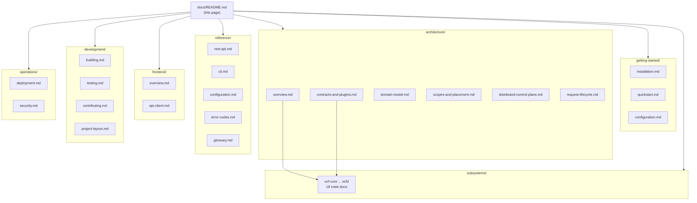
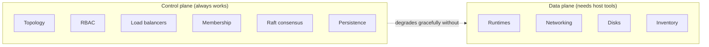

# Open Compute Fabric — Documentation

Welcome to the documentation for **Open Compute Fabric (OCF)** — a monolithic,
contract-first fleet-management and hypervisor control plane written in Rust.

This is the documentation hub. Everything is organized into the sections below;
start with **Getting Started** if you want to run it, **Architecture** if you
want to understand how it fits together, or **Subsystems** if you want the
granular detail on one crate.

> New here? Read [Architecture → Overview](architecture/overview.md) first, then
> [Getting Started → Quickstart](getting-started/quickstart.md).

## Documentation map

## Sections

### 🚀 [Getting Started](getting-started/)
Install the toolchain, build the workspace, and run the daemon + frontend.

| Document | What it covers |
|----------|----------------|
| [Installation](getting-started/installation.md) | Rust/Node toolchain, optional host tools (`docker`, `ip`, `lsblk`, …) |
| [Quickstart](getting-started/quickstart.md) | Build, `ocfd serve`, open the UI |
| [Configuration](getting-started/configuration.md) | CLI flags, environment variables, the data directory |

### 🏛️ [Architecture](architecture/)
How the system is designed. This is the conceptual core.

| Document | What it covers |
|----------|----------------|
| [Overview](architecture/overview.md) | The big picture, crate map, and design principles |
| [Contracts & Plugins](architecture/contracts-and-plugins.md) | The `Provider` + `Registry` plugin system |
| [Domain Model](architecture/domain-model.md) | `Resource`, `Metadata`, `Id`, `Health`, `ResourceSpec` |
| [Scopes & Placement](architecture/scopes-and-placement.md) | The `fleet → region → datacenter → rack → machine` hierarchy |
| [Distributed Control Plane](architecture/distributed-control-plane.md) | Persistence, fabric mesh, membership, and Raft consensus |
| [Request Lifecycle](architecture/request-lifecycle.md) | How an API call flows through the system |

### 🧩 [Subsystems](subsystems/)
Granular, per-crate reference. Each crate is one document.

| Crate | Responsibility |
|-------|----------------|
| [ocf-core](subsystems/ocf-core.md) | Foundational contracts, plugin registry, domain types |
| [ocf-topology](subsystems/ocf-topology.md) | Fleet structure + drill-down |
| [ocf-runtime](subsystems/ocf-runtime.md) | Containers & VMs, migration, autoscaling |
| [ocf-auth](subsystems/ocf-auth.md) | Authentication + host user sync |
| [ocf-authz](subsystems/ocf-authz.md) | RBAC authorization |
| [ocf-kernel](subsystems/ocf-kernel.md) | Host kernel: networking, firewall, services |
| [ocf-inventory](subsystems/ocf-inventory.md) | Hardware inventory + IPMI |
| [ocf-disk](subsystems/ocf-disk.md) | Physical disks, LED, RMA |
| [ocf-monitoring](subsystems/ocf-monitoring.md) | Host + per-runtime metrics |
| [ocf-fabric](subsystems/ocf-fabric.md) | Encrypted host-to-host mesh + membership |
| [ocf-network](subsystems/ocf-network.md) | VPC / subnet / route / ACL overlay |
| [ocf-loadbalancer](subsystems/ocf-loadbalancer.md) | TCP/ALB, TLS (ACME), DDNS |
| [ocf-store](subsystems/ocf-store.md) | Durable key/value state store |
| [ocf-consensus](subsystems/ocf-consensus.md) | Raft-replicated control plane |
| [ocf-health](subsystems/ocf-health.md) | Modular fleet-health checks + fixes |
| [ocf-platform](subsystems/ocf-platform.md) | OS detection + cross-OS package managers |
| [ocf-api](subsystems/ocf-api.md) | REST API + controller wiring |
| [ocfd](subsystems/ocfd.md) | The monolithic daemon binary |

### 📖 [Reference](reference/)
Exhaustive, lookup-oriented material.

| Document | What it covers |
|----------|----------------|
| [REST API](reference/rest-api.md) | Every endpoint, with request/response shapes |
| [CLI](reference/cli.md) | `ocfd` command-line reference |
| [Configuration](reference/configuration.md) | Every flag and environment variable |
| [Error Codes](reference/error-codes.md) | The `Error` enum and its HTTP mapping |
| [Glossary](reference/glossary.md) | Terms used throughout the project |

### 🖥️ [Frontend](frontend/)
The Nuxt 3 + Vite + Vue 3 + Tailwind web interface.

| Document | What it covers |
|----------|----------------|
| [Overview](frontend/overview.md) | Pages, components, layout, styling |
| [API Client](frontend/api-client.md) | `useApi`, response adapters, mock fallback |

### 🛠️ [Development](development/)
For contributors.

| Document | What it covers |
|----------|----------------|
| [Building](development/building.md) | Workspace build, disk caveats, feature flags |
| [Testing](development/testing.md) | Test strategy, `#[ignore]`d host tests |
| [Contributing](development/contributing.md) | Adding a provider, adding a subsystem |
| [Project Layout](development/project-layout.md) | Repository map |

### ⚙️ [Operations](operations/)
Running it for real.

| Document | What it covers |
|----------|----------------|
| [Deployment](operations/deployment.md) | Multi-node clusters, seeds, the data directory |
| [Security](operations/security.md) | Crypto, authentication, secrets, TLS |

## Conventions used in these docs

- **Mermaid diagrams** render natively on GitHub; every architectural diagram in
  these docs is a mermaid code block.
- **Code references** use `crate/src/file.rs` paths so you can jump straight to
  the source.
- **"Real" vs. "honest error"** — every OS/network integration executes the real
  tool (`docker`, `ip`, `lsblk`, `ipmitool`, …). On a host without that tool the
  operation returns a clear error and the rest of the control plane keeps
  running; it never fabricates a result. See
  [Architecture → Overview](architecture/overview.md#real-backends).

## Project status at a glance

The contracts, plugin wiring, crypto, consensus, and persistence are real Rust;
the OS integrations shell out to real tools and degrade gracefully when those
tools are absent. The workspace builds clean and the test suite passes.
