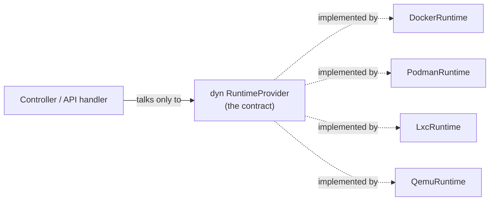
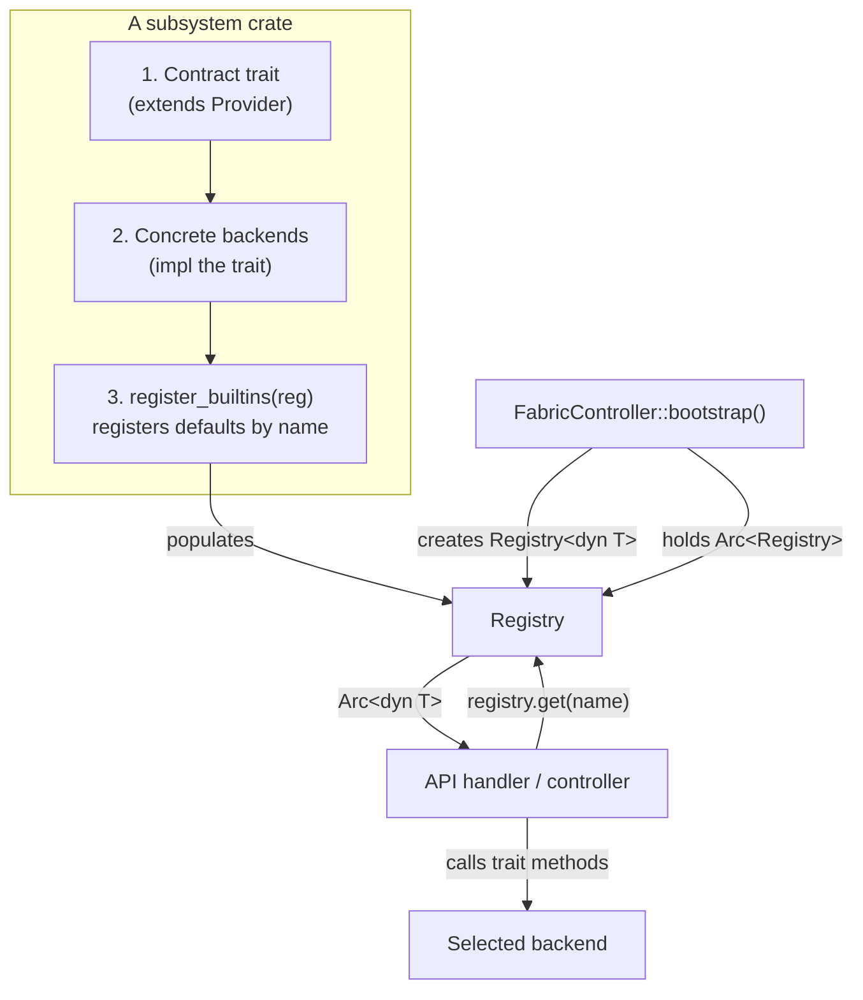
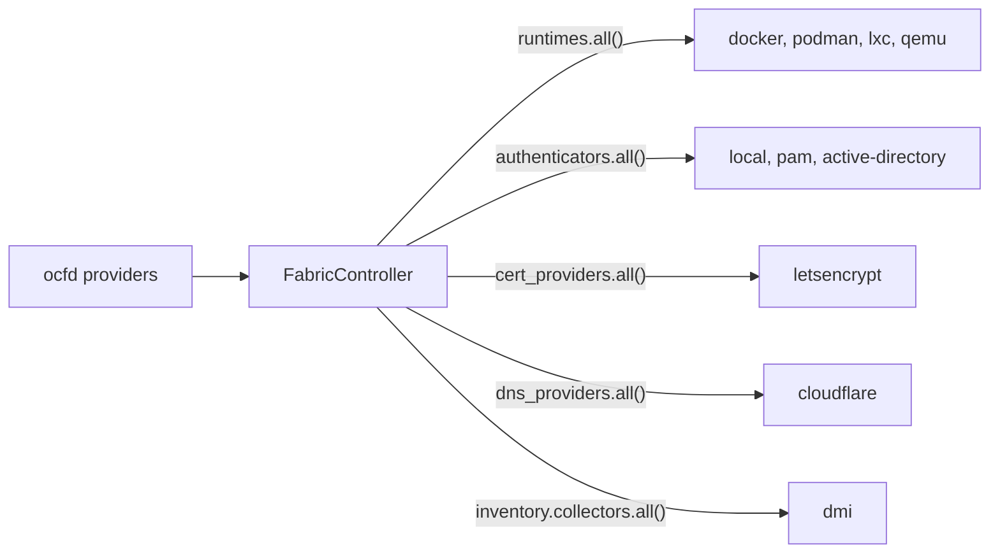

# Contracts & Plugins

The single most important idea in OCF: **every capability is a trait, and every
backend is a plugin registered at runtime.** This page explains the mechanism —
the `Provider` trait and the generic `Registry<dyn T>` — and the conventions
every subsystem follows. All of it lives in
[`ocf-core`](../subsystems/ocf-core.md) (`crates/ocf-core/src/registry.rs`).

## Why contracts

The control plane must never hard-depend on a specific backend. Whether a
container runs under Docker or Podman, whether a user authenticates against PAM
or Active Directory, whether firewalling uses nftables or iptables — none of that
should be visible to the code that orchestrates the fleet.

The answer is a classic one: program against an interface. In Rust, that
interface is a **trait object** (`dyn Trait`), and the indirection that lets us
choose an implementation at runtime is a **registry**.



## The `Provider` supertrait

Every pluggable contract extends one tiny trait:

```rust
pub trait Provider: Send + Sync {
    /// Globally unique identifier within its registry (e.g. "docker").
    fn name(&self) -> &str;

    /// Human-facing description shown in the UI / `ocfd providers`.
    fn description(&self) -> &str { "" }
}
```

`Provider` gives every plugin two things: a **name** (its registry key) and a
**description** (for humans). It also pins the `Send + Sync` bounds that let
providers be shared across async tasks behind an `Arc`.

A subsystem's contract trait simply extends it:

```rust
#[async_trait]
pub trait RuntimeProvider: Provider {
    fn kind(&self) -> RuntimeKind;
    async fn create(&self, workload: &Workload) -> Result<()>;
    async fn start(&self, id: &Id) -> Result<()>;
    // ...
}
```

Because `RuntimeProvider: Provider`, every runtime backend automatically has a
`name()` and `description()`, and can live in a registry of providers.

## The generic `Registry<dyn T>`

The registry is one generic type that works for *any* trait object:

```rust
pub struct Registry<T: ?Sized> {
    providers: HashMap<String, Arc<T>>,
}

impl<T: ?Sized> Registry<T> {
    pub fn register(&mut self, name: impl Into<String>, provider: Arc<T>) -> Result<()>;
    pub fn register_or_replace(&mut self, name: impl Into<String>, provider: Arc<T>);
    pub fn get(&self, name: &str) -> Result<Arc<T>>;
    pub fn contains(&self, name: &str) -> bool;
    pub fn names(&self) -> Vec<String>;
    pub fn all(&self) -> Vec<Arc<T>>;
    pub fn len(&self) -> usize;
    pub fn is_empty(&self) -> bool;
}
```

The `T: ?Sized` bound is the key: it lets `T` be an unsized trait object. So each
subsystem instantiates the same generic with its own contract:

| Subsystem | Registry type |
|-----------|---------------|
| `ocf-runtime` | `Registry<dyn RuntimeProvider>` |
| `ocf-auth` | `Registry<dyn Authenticator>` |
| `ocf-kernel` | `Registry<dyn FirewallBackend>` |
| `ocf-inventory` | `Registry<dyn InventoryCollector>`, `Registry<dyn IpmiController>` |
| `ocf-disk` | `Registry<dyn DiskManager>`, `Registry<dyn LedControl>` |
| `ocf-monitoring` | `Registry<dyn MetricsCollector>` |
| `ocf-fabric` | `Registry<dyn FabricTransport>` |
| `ocf-network` | `Registry<dyn NetworkBackend>` |
| `ocf-loadbalancer` | `Registry<dyn CertificateProvider>`, `Registry<dyn DnsProvider>` |

`register` fails if the name is already taken; `register_or_replace` overwrites
(used to swap in a configured default, e.g. a local authenticator seeded with an
admin account). Providers are stored behind `Arc`, so `get` and `all` hand out
cheap shared clones that async tasks can hold across `.await`.

## The `register_builtins` convention

Every subsystem ships a free function that registers its default backends:

```rust
pub fn register_builtins(reg: &mut Registry<dyn RuntimeProvider>) -> Result<()> {
    reg.register("docker", Arc::new(DockerRuntime::new()))?;
    reg.register("podman", Arc::new(PodmanRuntime::new()))?;
    reg.register("lxc",    Arc::new(LxcRuntime::new()))?;
    reg.register("qemu",   Arc::new(QemuRuntime::new()))?;
    Ok(())
}
```

The [`FabricController`](../subsystems/ocf-api.md) calls each subsystem's
`register_builtins` at bootstrap. A deployment can register additional backends,
or `register_or_replace` the defaults, without touching any caller.

Some crates expose more than one (because they have more than one contract):

| Crate | Registration functions |
|-------|------------------------|
| `ocf-inventory` | `register_builtins(collectors, ipmi)` — both registries in one call |
| `ocf-disk` | `register_builtins(disk_mgr)` + `register_led_builtins(led)` |
| `ocf-loadbalancer` | `register_builtins(certs, dns)` — both registries |

## Anatomy of a pluggable subsystem

Putting it together, every subsystem follows the same shape:



1. **Declare a contract** — a trait that extends `Provider`, with `#[async_trait]`
   if it has async methods.
2. **Implement concrete backends** — each `impl`s the contract and is `Send + Sync`.
3. **Provide `register_builtins`** — registers the defaults into a `Registry`.

The controller owns the registries; handlers resolve a provider by name and call
the contract. The control plane never names a concrete type.

## Discovering plugins at runtime

Because registries are introspectable (`names()`, `all()`, `description()`), the
running system can enumerate its own plugins:

- `GET /api/v1/providers` returns every registered provider, grouped by contract.
- `GET /api/v1/runtimes` lists runtime backends with their `kind` and migration
  support.
- `ocfd providers` prints the whole plugin inventory to the console.



## Design rules every subsystem obeys

These rules (enforced by convention and review) are what keep the plugin model
consistent across all 16 crates:

| Rule | Rationale |
|------|-----------|
| `use ocf_core::prelude::*` | One import surface for `Error`, `Result`, `Id`, `Metadata`, `Scope`, `Registry`, `Provider`, `Resource`, `async_trait`, … |
| Contracts extend `Provider` | Uniform `name`/`description`; storable in a `Registry`. |
| `#[async_trait]` on async trait objects | `dyn`-compatible async methods. |
| Ship `register_builtins` | Uniform wiring at bootstrap. |
| Backends are `Send + Sync` | Shareable across async tasks behind `Arc`. |
| No `unwrap`/`expect`/`panic` outside tests | Errors are values; a backend failure never crashes the node. |
| Cross-platform compile | A missing tool is a runtime `Error`, not a compile error. |

## Cross-references

- [`ocf-core` subsystem doc](../subsystems/ocf-core.md) — the registry source and full API.
- [Domain Model](domain-model.md) — what the providers operate on (`Resource`, `Metadata`).
- [Request Lifecycle](request-lifecycle.md) — how a request resolves a provider and calls it.
- [Development → Contributing](../development/contributing.md) — adding a provider or a subsystem.
