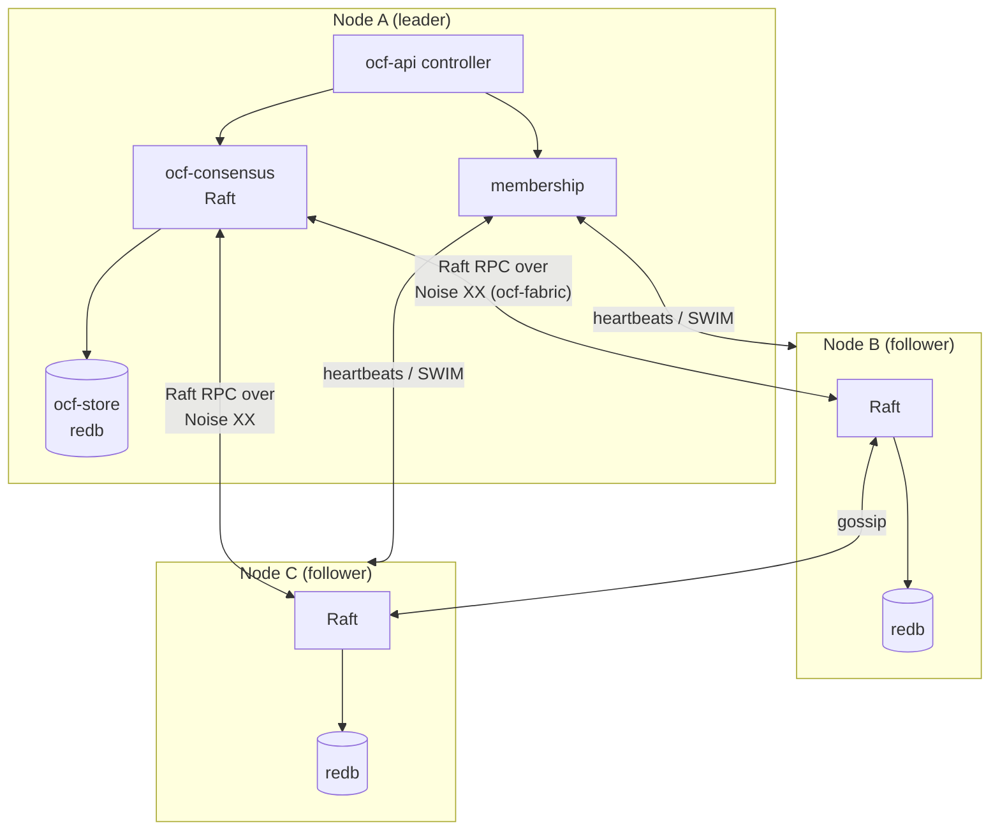
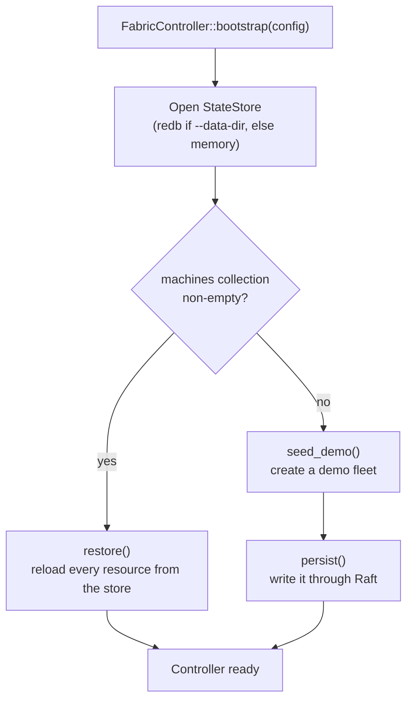
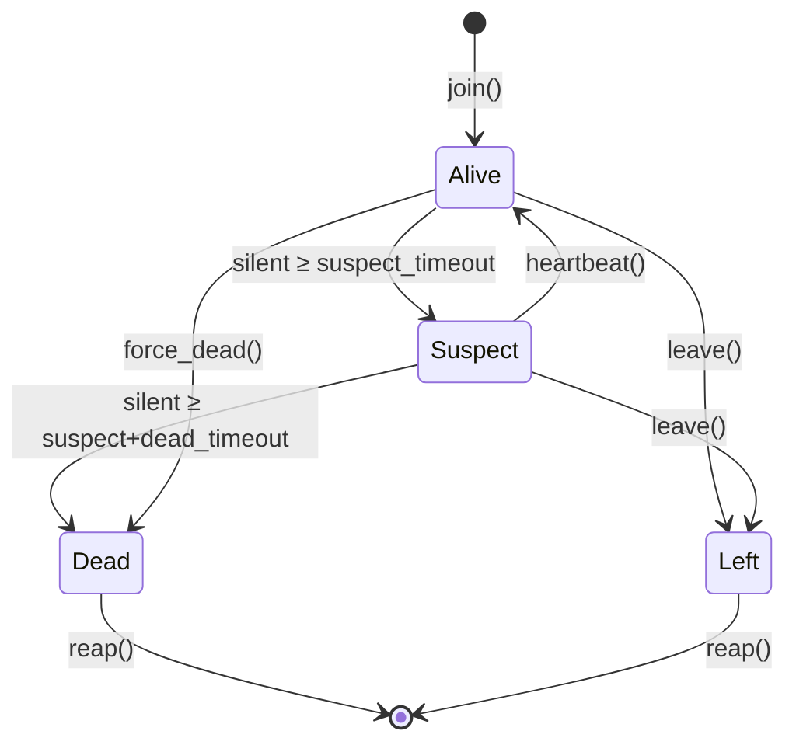
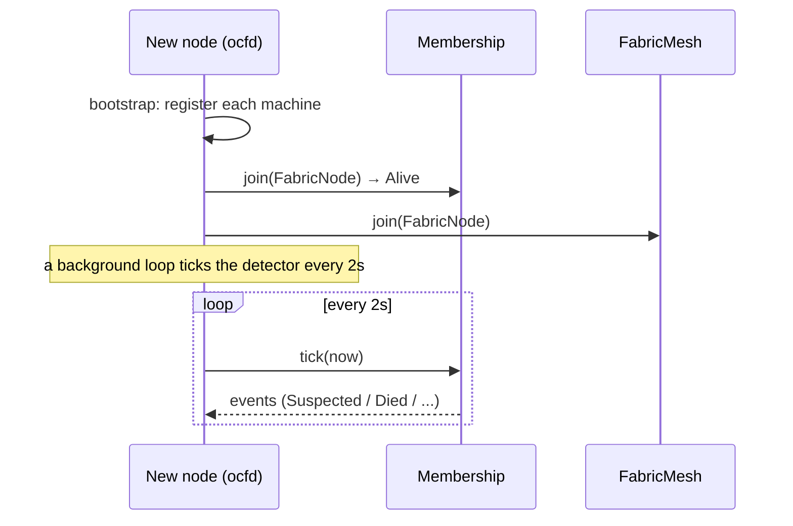
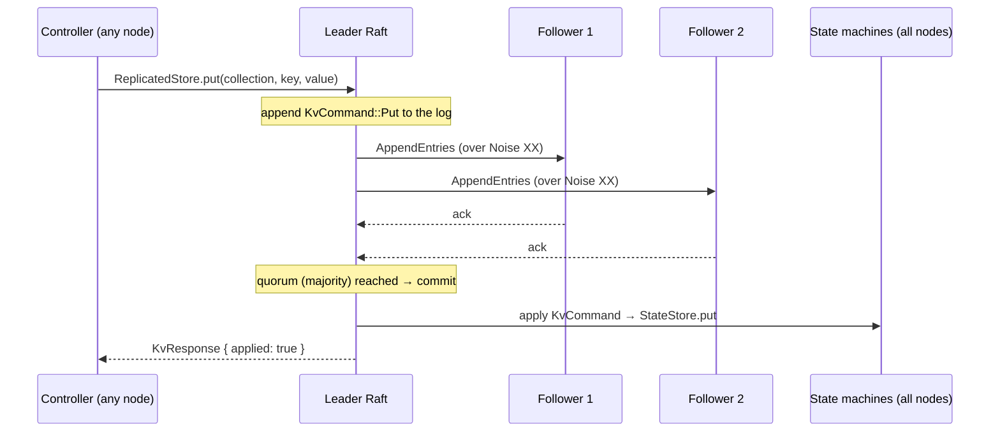
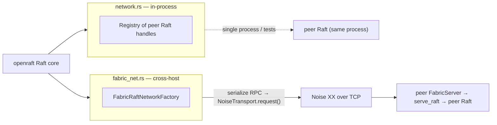
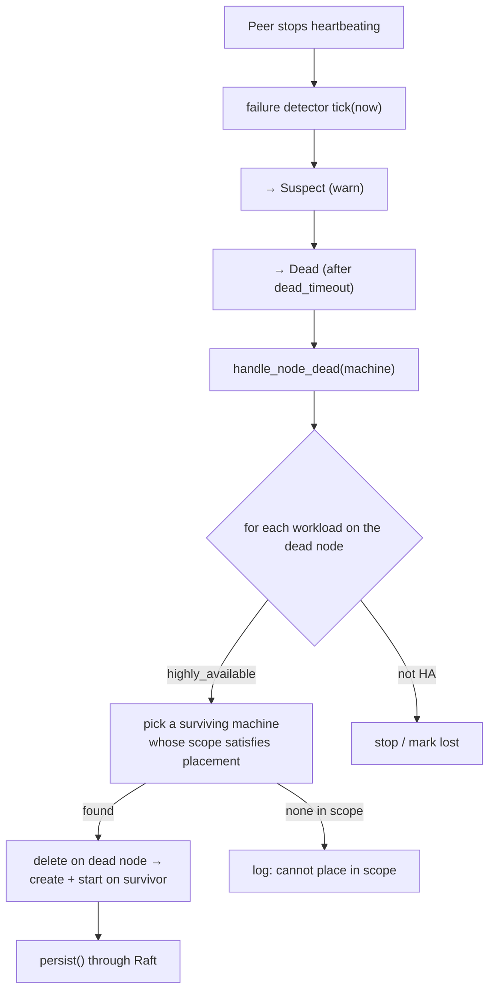
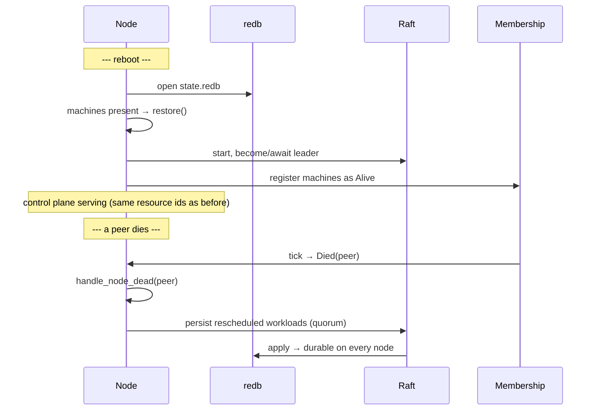

# Distributed Control Plane

This is what turns a pile of subsystems into a *fleet*: durable state, encrypted
connectivity, membership with failure detection, replicated consensus, and
automatic recovery when a node drops out. Four foundation crates collaborate:

| Concern | Crate | One-liner |
|---------|-------|-----------|
| **Persistence** | [`ocf-store`](../subsystems/ocf-store.md) | Crash-safe local key/value store (redb). |
| **Connectivity** | [`ocf-fabric`](../subsystems/ocf-fabric.md) | Encrypted host-to-host mesh (X25519 + Noise XX). |
| **Membership** | [`ocf-fabric::membership`](../subsystems/ocf-fabric.md) | SWIM-style failure detector. |
| **Consensus** | [`ocf-consensus`](../subsystems/ocf-consensus.md) | Raft-replicated control-plane store (openraft). |

And the [`ocf-api` controller](../subsystems/ocf-api.md) ties them together:
state is written through Raft, applied into redb on every node, restored on boot,
and a failure-detector loop reschedules HA workloads when a node dies.



---

## Persistence

There are two halves to "persistent." `ocf-store` provides the first:
**node-local durability** — a single node's state survives its own reboot.

### The `StateStore` contract

```rust
pub trait StateStore: Send + Sync {
    fn put(&self, collection: &str, key: &str, value: &[u8]) -> Result<()>;
    fn get(&self, collection: &str, key: &str) -> Result<Option<Vec<u8>>>;
    fn delete(&self, collection: &str, key: &str) -> Result<()>;
    fn list(&self, collection: &str) -> Result<Vec<(String, Vec<u8>)>>;
}
```

A namespaced key/value store. `collection` acts like a table (`"workloads"`,
`"vpcs"`, `"machines"`, …); a `StateStoreExt` trait layers typed
`put_json`/`get_json`/`list_json` helpers on top. Two backends ship:

| Backend | Durability | Used for |
|---------|-----------|----------|
| `MemoryStateStore` | None (RAM) | Tests, ephemeral runs (`ocfd` with no `--data-dir`). |
| `RedbStateStore` | Crash-safe single file | `ocfd --data-dir <dir>` → `<dir>/state.redb`. |

`RedbStateStore` is verified by a test that writes, drops the database, reopens
the same file, and reads the value back — proving the reboot path.

### Restore-or-seed on boot

The controller decides at bootstrap whether to restore or seed:



Because resource ids are stable (name-derived or persisted UUIDs), a restored
workload keeps the **same id** across reboots — the proof that boot restored
state rather than re-seeding it.

---

## Connectivity — the encrypted mesh

`ocf-fabric` gives every node a cryptographic identity and a real encrypted
channel to its peers. There are no plaintext control-plane links.

### Identity

A node's identity is a real **Curve25519 (X25519)** keypair (`x25519-dalek`).
`KeyPair::generate()` draws from the OS CSPRNG; `KeyPair::from_seed_name(name)`
derives a deterministic identity (for fixtures/tests) whose public key is still a
genuine X25519 point. The public-key fingerprint becomes the node's `NodeId`.

### The Noise XX handshake

Every connection runs the **`Noise_XX_25519_ChaChaPoly_BLAKE2s`** pattern (the
same primitives WireGuard uses) over a tokio TCP stream, via the `snow` crate.
XX is *mutually authenticated*: both sides learn and verify each other's static
public key.

```mermaid
sequenceDiagram
    participant C as NoiseTransport (initiator)
    participant S as FabricServer (responder)
    Note over C,S: Noise_XX_25519_ChaChaPoly_BLAKE2s
    C->>S: msg 1: -> e
    S->>C: msg 2: <- e, ee, s, es
    C->>S: msg 3: -> s, se
    Note over C,S: Both hold a TransportState;<br/>each side authenticated the other's static key
    C->>S: sealed request frame (ChaCha20-Poly1305)
    S->>C: sealed response frame
```

After the three-message handshake both peers hold a `snow::TransportState` and
every subsequent frame is sealed with ChaCha20-Poly1305. The transport exposes a
`request(node, payload) -> reply` RPC primitive (length-prefixed framing) — this
is exactly what carries Raft RPCs (below). `is_encrypted()` returns `true`
because it *is* encrypted, not as a claim.

---

## Membership & failure detection

`ocf-fabric::membership` is a SWIM-style state machine. Every node keeps a view
of every other node's liveness and ages that view as heartbeats arrive or stop.

### The liveness state machine



| State | Meaning | `is_available()` |
|-------|---------|:----------------:|
| `Alive` | Heartbeats current; schedulable & routable. | ✓ |
| `Suspect` | Missed heartbeats past `suspect_timeout`; might be a slow link. | – |
| `Dead` | Silent past `suspect + dead_timeout`, or forced. | – |
| `Left` | Graceful departure. | – |

The detector's core is `tick(now) -> Vec<MembershipEvent>`: a **pure** function
of the current time that advances every member and returns the transitions
(`Joined`, `Recovered`, `Suspected`, `Died`, `Left`). Because it's pure in `now`,
the whole failure detector is deterministically unit-testable without sleeping.

### Joining a fleet



"Available / schedulable" means `Alive` plus current heartbeats. The membership
view is served at `GET /api/v1/fabric/membership`, and a node can be forced dead
(an operator action or hard signal) via `POST /api/v1/fabric/machines/:id/fail`.

---

## Consensus — replicated, quorum-committed state

Node-local durability survives a *reboot*; it does not survive losing the *node*.
`ocf-consensus` provides the second half: a **Raft** cluster (openraft 0.9) whose
committed writes are applied into the `StateStore` on **every** node.

### The replicated write path



The replicated data type is a tiny KV command:

```rust
enum KvCommand {
    Put    { collection: String, key: String, value: Vec<u8> },
    Delete { collection: String, key: String },
}
```

The Raft **state machine** applies each committed command into an
`Arc<dyn StateStore>` — so consensus and node-local durability compose: a quorum
orders and replicates the write, and redb makes it durable on each node.

`ReplicatedStore` is the facade: `put`/`delete` are leader-only (a follower
returns a `Conflict` error naming the current leader so the caller can redirect);
`get` reads the local state machine; `wait_for_leader`, `is_leader`, and
`leader()` expose cluster status.

### Raft over the encrypted fabric

openraft is transport-agnostic. OCF provides two `RaftNetwork` implementations:



| Network | Where | Used for |
|---------|-------|----------|
| `InProcessNetwork` (`network.rs`) | Same process | Single-host clusters, tests. |
| `FabricRaftNetwork` (`fabric_net.rs`) | Across hosts | Real multi-node fleets — each Raft RPC is serialized and sent over the encrypted Noise transport. |

A test (`three_node_cluster_replicates_over_encrypted_fabric`) stands up three
Raft nodes over real Noise/TCP, elects a leader, and confirms a write replicates
to all three — consensus genuinely running over the encrypted mesh.

### How the controller uses it

The `FabricController` embeds a `ReplicatedStore`. Its `persist()` routes **every**
mutation through Raft (`consensus.put(...)`), so control-plane writes are
quorum-committed before they land in redb; `restore()` reads them back on boot.
A single-node deployment is simply a quorum of one — every write is still ordered
through the Raft log.

---

## Dropping out — failure & recovery

When a node dies, the failure detector fires and the controller recovers the
workloads that asked to be recovered.



Recovery rules:

| Workload | On node death |
|----------|---------------|
| `highly_available = true` | Rescheduled onto a surviving machine **within its `placement` scope** ([Scopes & Placement](scopes-and-placement.md)). If no in-scope survivor exists, it's logged, not force-placed. |
| `highly_available = false` | Marked lost with the node. |

A graceful `Left` drains the node from routing/LB pools the same way, without
waiting for a timeout.

### Split-brain safety

Because control-plane writes require a Raft **majority**, a partitioned minority
cannot commit changes — it can't reschedule the same workload onto two nodes at
once. Quorum is the guard against split-brain.

---

## End-to-end: a node reboots, then a node dies



## Cross-references

- [`ocf-store`](../subsystems/ocf-store.md) · [`ocf-fabric`](../subsystems/ocf-fabric.md) · [`ocf-consensus`](../subsystems/ocf-consensus.md) · [`ocf-api`](../subsystems/ocf-api.md)
- [Scopes & Placement](scopes-and-placement.md) — the constraint HA rescheduling respects.
- [Operations → Deployment](../operations/deployment.md) — running a multi-node cluster.
- [Operations → Security](../operations/security.md) — the cryptographic model.
