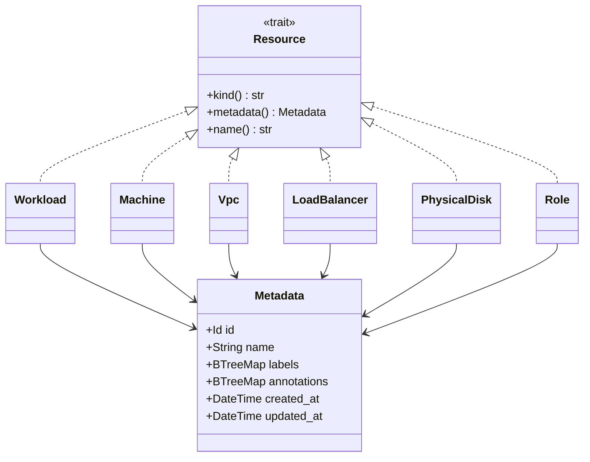
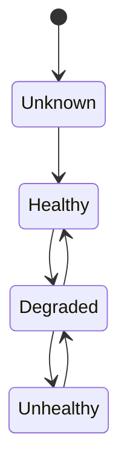
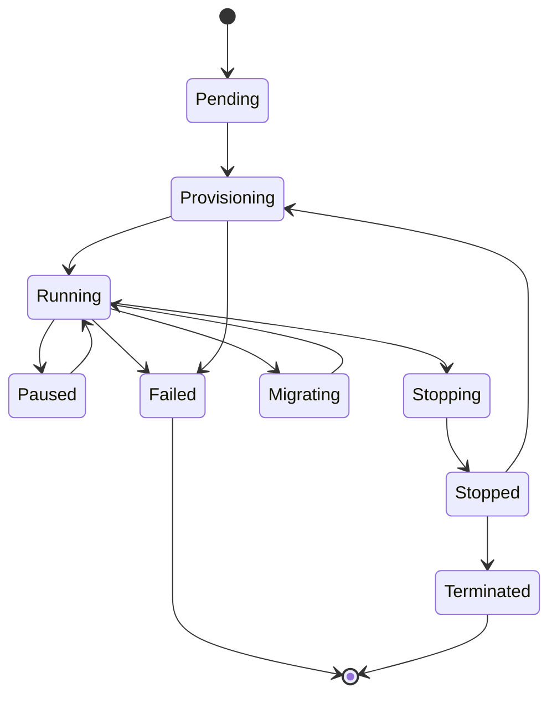
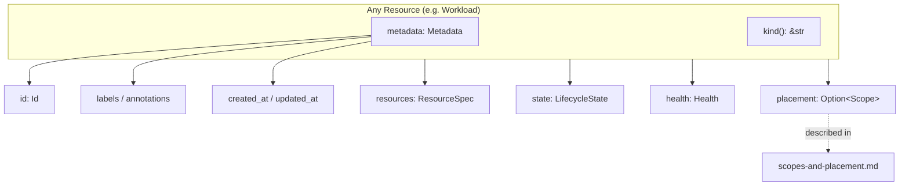

# Domain Model

Every managed object in OCF speaks the same vocabulary. That vocabulary is a
handful of types in [`ocf-core`](../subsystems/ocf-core.md): the `Resource`
contract, the `Metadata` it carries, and the shared value types `Id`, `Health`,
`LifecycleState`, and `ResourceSpec`. Because everything is a `Resource`, generic
machinery — the API serializer, the persistence layer, the topology indexer —
can treat any object uniformly.

## The `Resource` contract

```rust
pub trait Resource: Send + Sync {
    /// A stable, lowercase discriminator, e.g. "workload", "vpc", "disk".
    fn kind(&self) -> &'static str;

    /// The resource's metadata block.
    fn metadata(&self) -> &Metadata;

    /// Convenience accessor for the display name.
    fn name(&self) -> &str { &self.metadata().name }
}
```

`Resource` is the abstract base class of the domain model. A type becomes a
first-class fabric object by implementing it — declaring its `kind` and exposing
its `Metadata`.



Resources that implement `Resource` across the codebase include `Machine`,
`Region`, `Datacenter`, `Rack` (topology), `Workload` and `Autoscaler` (runtime),
`Vpc`, `Subnet`, `FirewallPolicy` (network), `LoadBalancer` (load balancer),
`PhysicalDisk` (disk), `MachineInventory` (inventory), and `Role`, `Group`,
`User` (RBAC).

## `Metadata`

Every resource carries a `Metadata` block — its identity and bookkeeping.

| Field | Type | Purpose |
|-------|------|---------|
| `id` | `Id` | Stable unique identifier (see below). |
| `name` | `String` | Human-meaningful display name. |
| `labels` | `BTreeMap<String, String>` | Selection / grouping (e.g. load-balancer target selectors, autoscaler matching). |
| `annotations` | `BTreeMap<String, String>` | Non-identifying metadata (operator notes, provider hints). |
| `created_at` | `DateTime<Utc>` | Creation timestamp. |
| `updated_at` | `DateTime<Utc>` | Last-modified timestamp; bumped by `touch()`. |

Constructors and helpers:

| Method | Behavior |
|--------|----------|
| `Metadata::new(name)` | Fresh metadata with a random `Id`. |
| `Metadata::named(name)` | Metadata with a stable, name-derived `Id`. |
| `.with_label(k, v)` / `.with_annotation(k, v)` | Builder-style additions. |
| `.matches_labels(selector)` | True if every selector entry is present and equal — the basis of label selection. |
| `.touch()` | Stamp `updated_at = now`. |

**Labels vs. annotations** is the same distinction Kubernetes draws: labels are
for *selecting* sets of resources (and are queryable), annotations are for
*attaching* free-form data that nothing selects on.

## `Id`

```rust
pub struct Id(String);  // serialized transparently as a string
```

An `Id` is an opaque, stable identifier that serializes as a plain string (so it
reads naturally in JSON and URLs). Two construction modes:

| Constructor | Result | Used for |
|-------------|--------|----------|
| `Id::new()` | Random UUID v4 | Most resources (workloads, load balancers, …) |
| `Id::named(name)` | The name itself, as the id | Stable, human-meaningful ids (regions, machines in the demo fleet) |

The choice matters for persistence: a name-derived id is stable across restarts,
so a restored resource keeps the same id rather than getting a fresh random one.
This is exactly how [persistence](distributed-control-plane.md#persistence) proves
*restore* (not reseed) — a workload's random UUID is byte-identical across a
reboot.

## `Health` and `LifecycleState`

Two enums describe how a stateful resource is doing.

**`Health`** — a coarse health signal used by monitoring, the API, and the UI:



| Variant | Meaning |
|---------|---------|
| `Unknown` | Not yet determined (default). |
| `Healthy` | Operating normally. |
| `Degraded` | Working but impaired. |
| `Unhealthy` | Not functioning. |

**`LifecycleState`** — the lifecycle of a provisioned resource (a workload, a
load balancer, …). Not every resource visits every state.



| Variant | `is_active()` | `is_terminal()` |
|---------|:-------------:|:---------------:|
| `Pending`, `Provisioning`, `Paused`, `Stopping`, `Stopped` | – | – |
| `Running`, `Migrating` | ✓ | – |
| `Failed`, `Terminated` | – | ✓ |

`is_active()` answers "is it doing useful work right now?" and `is_terminal()`
answers "has it reached an end state?" — both used by scheduling and the UI.

> **Note on serialization.** These enums serialize as `snake_case` strings
> (`running`, `virtual_machine`). The frontend normalizes them to PascalCase via
> adapters — see [Frontend → API Client](../frontend/api-client.md).

## `ResourceSpec`

The fundamental compute quantities, in backend-friendly units:

```rust
pub struct ResourceSpec {
    pub cpu_millis: u64,    // 1000 = one vCPU
    pub memory_bytes: u64,
    pub disk_bytes: u64,
}
```

| Field | Unit | Convention |
|-------|------|------------|
| `cpu_millis` | millicores | `1000` = 1 vCPU (matches container runtimes). |
| `memory_bytes` | bytes | – |
| `disk_bytes` | bytes | Ephemeral/root disk. |

Helpers support scheduling math:

| Method | Behavior |
|--------|----------|
| `fits_in(available)` | True if `self` ≤ `available` on every dimension — a placement check. |
| `saturating_sub(used)` | Remaining capacity after subtracting usage (never underflows). |

The millicore convention is deliberate: it translates losslessly to
`docker --cpus` (millicores ÷ 1000) and to libvirt vCPU counts, so the runtime
backends don't have to invent a mapping. See
[`ocf-runtime`](../subsystems/ocf-runtime.md).

## How the pieces relate



## Cross-references

- [`ocf-core` subsystem doc](../subsystems/ocf-core.md) — full source and method list.
- [Scopes & Placement](scopes-and-placement.md) — the `Scope` type that resources use for placement.
- [Contracts & Plugins](contracts-and-plugins.md) — the `Provider`/`Registry` system that operates on resources.
- [Reference → Error Codes](../reference/error-codes.md) — the `Error`/`Result` types used throughout.
