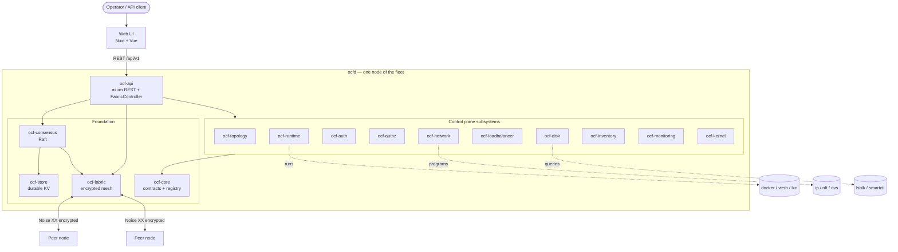
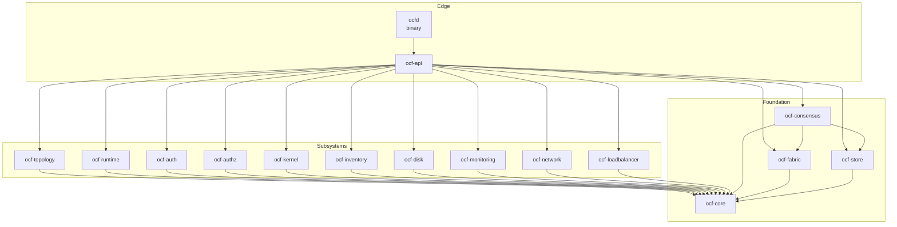
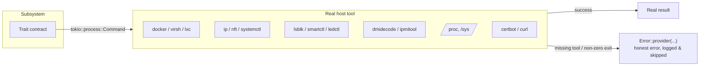

# Architecture Overview

Open Compute Fabric (OCF) is a **monolithic, contract-first fleet-management and
hypervisor control plane** written in Rust. A single binary — `ocfd` — manages a
fleet of machines: it runs containers and virtual machines, models the physical
topology, authenticates and authorizes operators, programs host networking, and
keeps its state replicated and durable across nodes.

This page is the map. Read it first, then follow the links into the deeper
documents.

## Design principles

| Principle | What it means in practice |
|-----------|---------------------------|
| **Contract-first** | Every capability is a Rust trait (a "contract"). The control plane depends only on the trait, never on a concrete backend. |
| **Pluggable** | Concrete backends register by name into a generic [`Registry<dyn T>`](contracts-and-plugins.md). Swapping Docker for Podman, PAM for Active Directory, or nftables for iptables is a registration change, not a code change. |
| **Monolithic** | One binary (`ocfd`) hosts the whole control plane. No microservice sprawl; a node is a single process. |
| **Real backends, honest errors** | Every OS integration executes the real tool. When the tool is absent the operation returns a clear error and the rest of the system keeps running — it never fabricates a result. See [Real backends](#real-backends). |
| **Replicated & durable** | Control-plane writes go through [Raft consensus](distributed-control-plane.md) and land in a crash-safe local store, so state survives both a reboot and the loss of a node. |

## The big picture

## Crate map

The workspace is 16 crates in three tiers: a **foundation**, the **subsystems**
that implement domain capabilities, and the **edge** that wires everything into
a running daemon.

| Tier | Crate | Responsibility | Doc |
|------|-------|----------------|-----|
| Foundation | `ocf-core` | Contracts, plugin registry, domain types (`Resource`, `Scope`, `Error`) | [→](../subsystems/ocf-core.md) |
| Foundation | `ocf-store` | Durable, namespaced key/value store (redb) | [→](../subsystems/ocf-store.md) |
| Foundation | `ocf-fabric` | Encrypted host-to-host mesh + SWIM membership | [→](../subsystems/ocf-fabric.md) |
| Foundation | `ocf-consensus` | Raft-replicated control-plane store (openraft) | [→](../subsystems/ocf-consensus.md) |
| Foundation | `ocf-health` | Modular fleet-health checks + user-pressable fixes | [→](../subsystems/ocf-health.md) |
| Foundation | `ocf-platform` | OS detection + cross-OS package managers | [→](../subsystems/ocf-platform.md) |
| Subsystem | `ocf-topology` | `region → datacenter → rack → machine` model | [→](../subsystems/ocf-topology.md) |
| Subsystem | `ocf-runtime` | Containers & VMs, live migration, autoscaling | [→](../subsystems/ocf-runtime.md) |
| Subsystem | `ocf-auth` | Authentication (PAM/AD/local) + host user sync | [→](../subsystems/ocf-auth.md) |
| Subsystem | `ocf-authz` | RBAC: roles, groups, users, scoped bindings | [→](../subsystems/ocf-authz.md) |
| Subsystem | `ocf-kernel` | Host kernel: IP forwarding, bridges, firewall, services | [→](../subsystems/ocf-kernel.md) |
| Subsystem | `ocf-inventory` | Hardware components + IPMI | [→](../subsystems/ocf-inventory.md) |
| Subsystem | `ocf-disk` | Physical disks, SMART, LED, RMA | [→](../subsystems/ocf-disk.md) |
| Subsystem | `ocf-monitoring` | Host + per-runtime metrics | [→](../subsystems/ocf-monitoring.md) |
| Subsystem | `ocf-network` | VPC / subnet / route / ACL overlay | [→](../subsystems/ocf-network.md) |
| Subsystem | `ocf-loadbalancer` | TCP/ALB, TLS (ACME), dynamic DNS | [→](../subsystems/ocf-loadbalancer.md) |
| Edge | `ocf-api` | axum REST API + `FabricController` wiring | [→](../subsystems/ocf-api.md) |
| Edge | `ocfd` | The monolithic daemon binary | [→](../subsystems/ocfd.md) |

Every subsystem depends on `ocf-core` and nothing else in the workspace (except
the edge, which depends on everything). This keeps the dependency graph a clean
fan-in and is what makes the system pluggable.

## The four foundational ideas

These are covered in depth in their own documents; here is the one-paragraph
version of each.

1. **Contracts & the plugin registry** — A `Provider` trait plus a generic
   `Registry<dyn T>` is the entire plugin system. Each subsystem declares a
   contract trait that extends `Provider`, and concrete backends register into a
   registry by name. → [Contracts & Plugins](contracts-and-plugins.md)

2. **The domain model** — Every managed object is a `Resource`: it carries
   `Metadata` (id, name, labels, timestamps) and reports a `kind`. A small set
   of shared value types (`Id`, `Health`, `LifecycleState`, `ResourceSpec`)
   gives the whole system one vocabulary. → [Domain Model](domain-model.md)

3. **Scopes & placement** — A `Scope` is a path through the topology tree
   (`fleet → region → datacenter → rack → machine`). It is reused for both
   authorization (a grant applies to a scope and everything beneath it) and
   placement (a workload or load balancer restricted to a scope may only run —
   and migrate — within it). → [Scopes & Placement](scopes-and-placement.md)

4. **The distributed control plane** — State is persisted locally (redb),
   replicated across nodes via Raft, and the nodes find and monitor each other
   over an encrypted mesh with SWIM-style failure detection. Losing a node
   triggers HA rescheduling. → [Distributed Control Plane](distributed-control-plane.md)

## Real backends

A defining property of OCF: **there are no simulation stubs**. Every subsystem
executes the real tool for its domain.

| Subsystem | Real tool(s) it drives |
|-----------|------------------------|
| `ocf-runtime` | `docker`, `podman`, `lxc-*`, `virsh` |
| `ocf-kernel` | `/proc/sys`, `ip`, `nft`/`iptables`, `systemctl` |
| `ocf-disk` | `lsblk`, `smartctl`, `ledctl` |
| `ocf-inventory` | `dmidecode`, `ipmitool`, `/proc`, `/sys` |
| `ocf-monitoring` | `/proc/stat`, `meminfo`, `net/dev`, `diskstats`, `docker stats` |
| `ocf-auth` | `pamtester`, `ldapwhoami`, `useradd`/`usermod` |
| `ocf-network` | `ip netns`, `ip link`, `nft`, `ovs-vsctl`, `ovs-ofctl` |
| `ocf-loadbalancer` | `curl` (Cloudflare API), `certbot` (ACME), plus a native `tokio` TCP proxy |
| `ocf-fabric` | Real X25519 + Noise XX (in-process Rust crypto) |
| `ocf-consensus` | openraft (in-process Rust) over the encrypted transport |

Because the backends are real, a node that lacks a tool can't run that
operation — so the control plane **degrades gracefully**: tool-dependent steps
(demo workload seeding, network programming, disk enumeration) are best-effort
and log-and-skip, while topology, RBAC, load balancers, membership, consensus,
and persistence come up regardless. This is what lets `ocfd` boot and serve on a
developer's Windows or macOS box even though `docker`/`virsh`/`ip` aren't there.

## Where to go next

- Want to run it? → [Getting Started](../getting-started/quickstart.md)
- Want the plugin model? → [Contracts & Plugins](contracts-and-plugins.md)
- Want to see a request flow end-to-end? → [Request Lifecycle](request-lifecycle.md)
- Want the distributed-systems detail? → [Distributed Control Plane](distributed-control-plane.md)
- Want one subsystem in depth? → [Subsystems index](../subsystems/)
