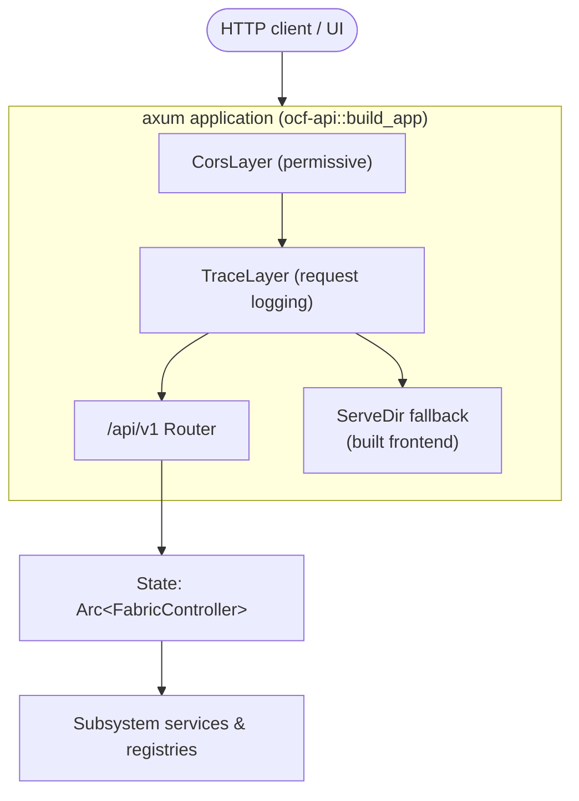
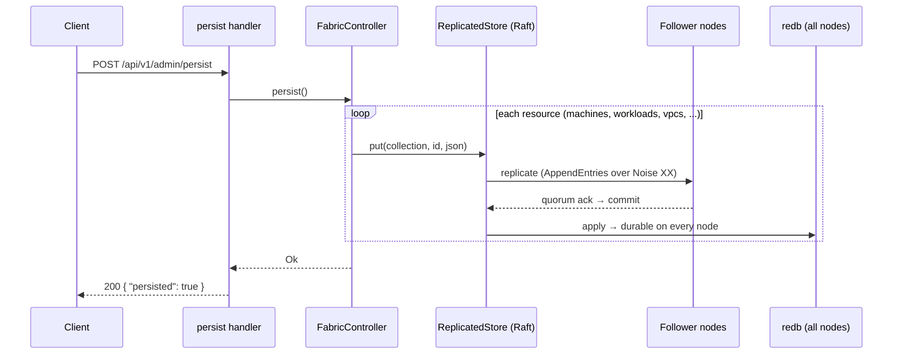
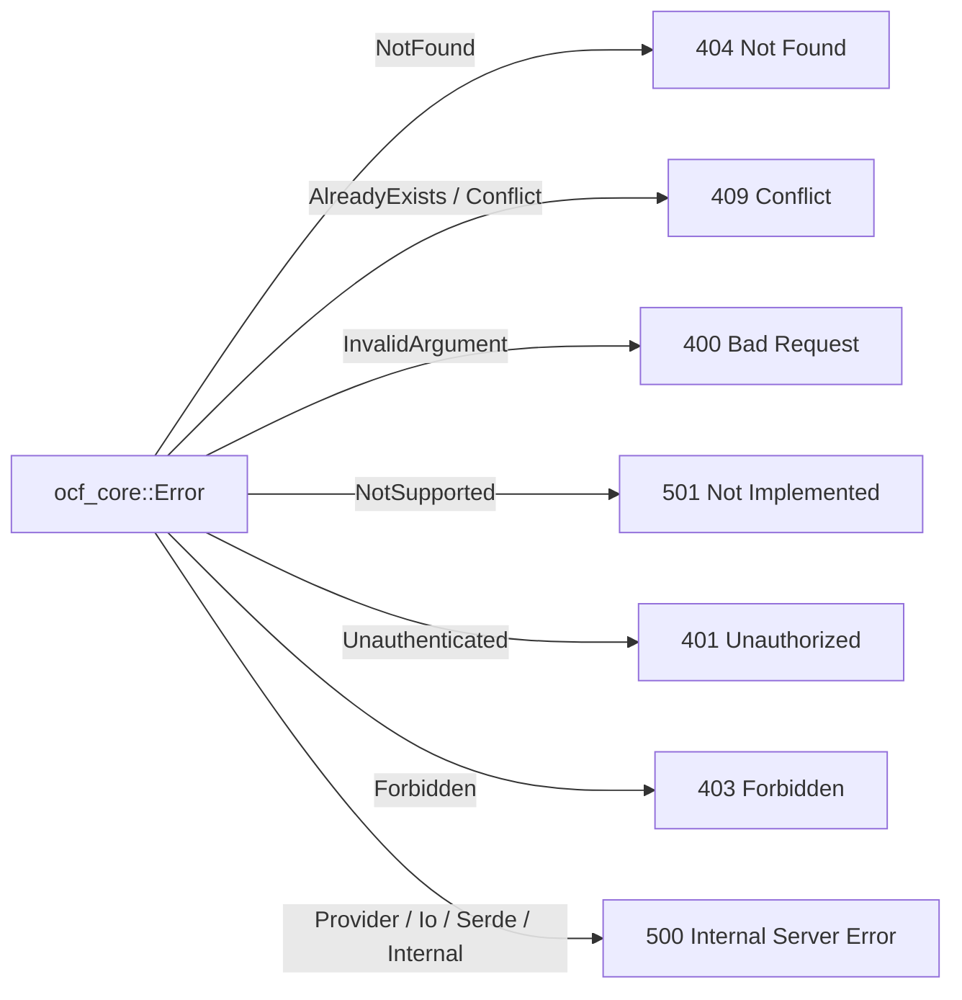
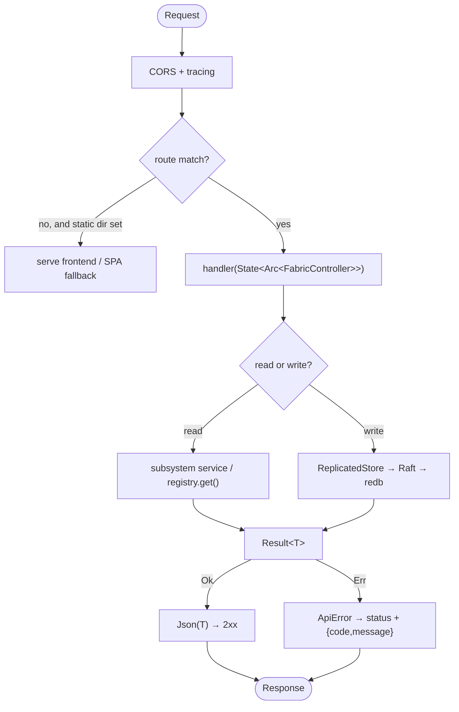

# Request Lifecycle

This page traces what happens between an HTTP request arriving at `ocfd` and a
response leaving it. It ties the pieces from the other architecture documents
together into concrete flows.

## The serving stack

`ocfd` builds one [`FabricController`](../subsystems/ocf-api.md) and hands it to
an axum application. The app is a router plus a few middleware layers and an
optional static-file fallback for the built frontend.



The `FabricController` is shared application state (`Arc<FabricController>`), so
every handler borrows the same controller — the same registries, the same
membership view, the same consensus handle. Construction happens once, at
bootstrap; see [Distributed Control Plane → restore-or-seed](distributed-control-plane.md#restore-or-seed-on-boot).

## A read request, end to end

Take `GET /api/v1/workloads`. It fans out across every runtime backend, collects
their workloads, and serializes the result.

```mermaid
sequenceDiagram
    participant Client
    participant Axum as axum router
    participant H as workloads handler
    participant Ctrl as FabricController
    participant Reg as Registry&lt;dyn RuntimeProvider&gt;
    participant P as Each provider (docker, qemu, ...)
    participant Tool as docker / virsh

    Client->>Axum: GET /api/v1/workloads
    Axum->>H: route → handler(State(ctrl))
    H->>Ctrl: all_workloads()
    Ctrl->>Reg: all()
    Reg-->>Ctrl: [Arc&lt;dyn RuntimeProvider&gt;]
    loop each provider
        Ctrl->>P: list()
        P->>Tool: docker ps -a --filter label=ocf=1
        Tool-->>P: container rows
        P-->>Ctrl: Vec&lt;Workload&gt;
    end
    Ctrl-->>H: Vec&lt;Workload&gt;
    H-->>Axum: Json(workloads)
    Axum-->>Client: 200 OK + JSON
```

The handler never names a concrete runtime — it asks the controller, which asks
the registry, which returns trait objects. Adding a new runtime backend changes
nothing on this path. (If a tool is missing, that provider's `list()` errors and
is skipped; the others still return — graceful degradation in action.)

## A write request that goes through Raft

Now `POST /api/v1/admin/persist`, which snapshots the whole control plane. Every
write is ordered through Raft before it lands in redb.



See [Distributed Control Plane → Consensus](distributed-control-plane.md#consensus--replicated-quorum-committed-state)
for the replication detail.

## A request that triggers recovery

`POST /api/v1/fabric/machines/:id/fail` forces a node dead and runs the
drop-out path synchronously, returning the workloads it rescheduled.

```mermaid
sequenceDiagram
    participant Op as Operator
    participant H as fail handler
    participant Mem as Membership
    participant Ctrl as FabricController
    participant RT as Runtime providers

    Op->>H: POST /fabric/machines/node-3/fail
    H->>Ctrl: fail_machine(node-3)
    Ctrl->>Mem: force_dead(node-3) → Died
    Ctrl->>Ctrl: handle_node_dead(node-3)
    loop HA workloads on node-3
        Ctrl->>RT: delete on node-3; create+start on in-scope survivor
    end
    Ctrl->>Ctrl: persist() through Raft
    Ctrl-->>H: ["db-1 -> node-1"]
    H-->>Op: 200 { "rescheduled": ["db-1 -> node-1"] }
```

## Error handling

When any subsystem returns an `ocf-core` `Error`, the API layer maps it to an
HTTP status via `ApiError` (`crates/ocf-api/src/error.rs`) and a JSON body
`{ code, message }`.



The full mapping table is in [Reference → Error Codes](../reference/error-codes.md).

## The complete picture



## Cross-references

- [`ocf-api`](../subsystems/ocf-api.md) — the controller, router, and every handler.
- [`ocfd`](../subsystems/ocfd.md) — how the server is launched.
- [Contracts & Plugins](contracts-and-plugins.md) — the registry lookups handlers perform.
- [Reference → REST API](../reference/rest-api.md) — every endpoint in detail.
