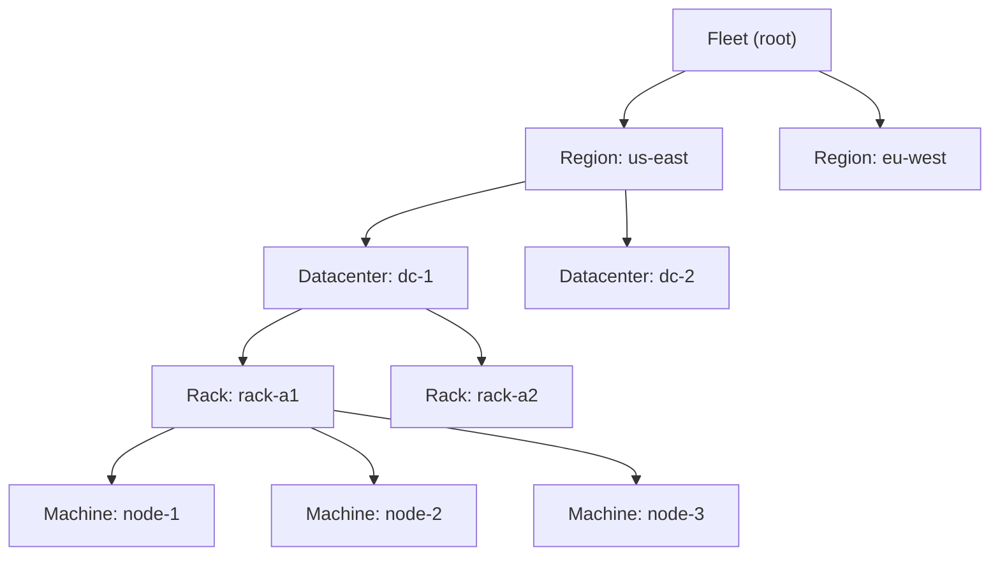
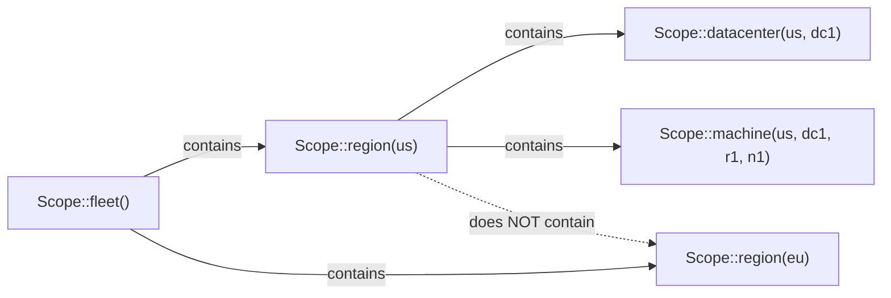
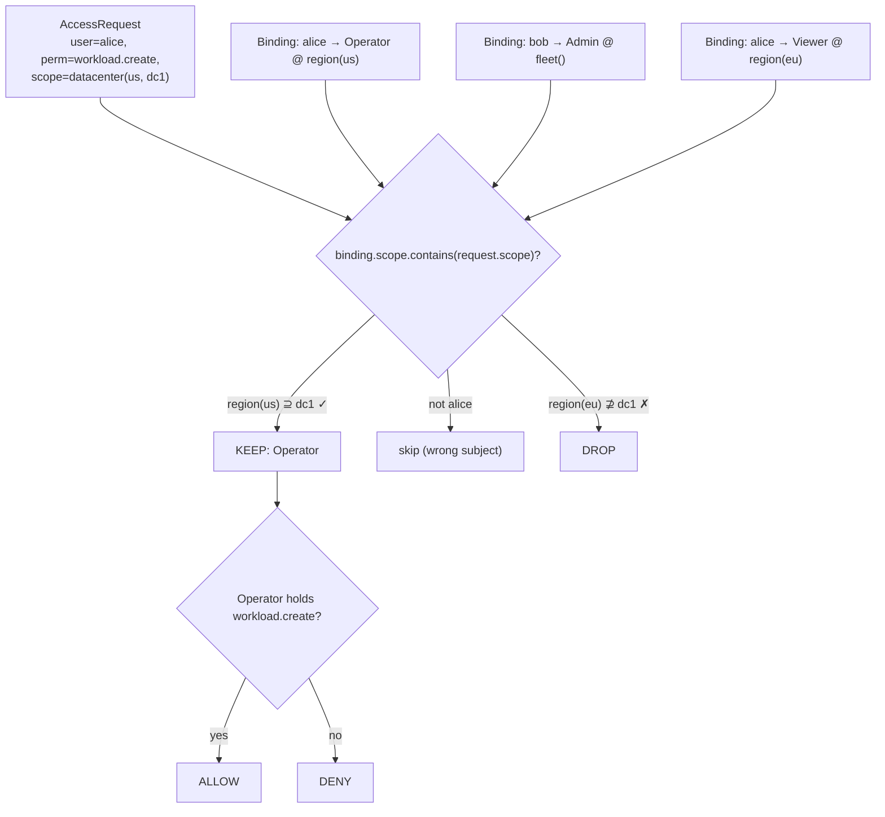
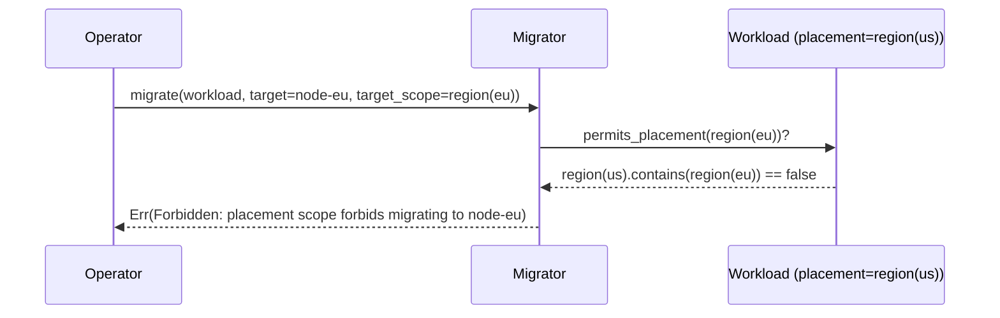
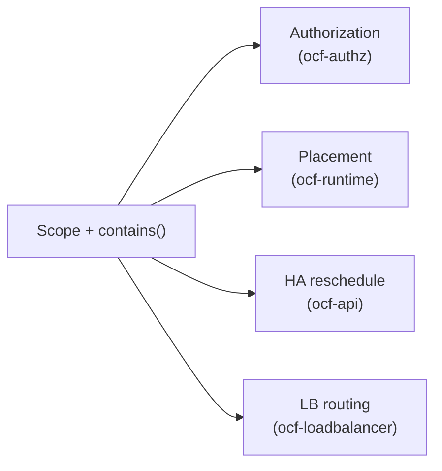

# Scopes & Placement

A **`Scope`** is a path through the fleet topology tree. It is one of the most
reused concepts in OCF because it answers two different questions with the same
mechanism:

- **Authorization** — *where* does this permission apply? A role binding granted
  at a scope covers that node and everything beneath it.
- **Placement** — *where* may this workload (or load balancer) run? A resource
  pinned to a scope may only be placed — and only migrate — within it.

The type lives in `crates/ocf-core/src/scope.rs`. See also
[`ocf-core`](../subsystems/ocf-core.md).

## The topology hierarchy

The fleet is a tree five levels deep:



`ScopeLevel` names a position in that tree, ordered from coarsest to finest:

| Level | Value | Meaning |
|-------|------:|---------|
| `Fleet` | 0 | The entire fleet. |
| `Region` | 1 | A geographic region. |
| `Datacenter` | 2 | A datacenter within a region. |
| `Rack` | 3 | A rack within a datacenter. |
| `Machine` | 4 | A single machine. |

## The `Scope` type

```rust
pub struct Scope {
    pub region:     Option<Id>,
    pub datacenter: Option<Id>,
    pub rack:       Option<Id>,
    pub machine:    Option<Id>,
}
```

A `Scope` is a partial path: each level is either pinned to a specific `Id` or
left `None` ("any / unscoped at this level"). `Scope::default()` — all `None` — is
the whole fleet.

Constructors build progressively more specific scopes:

| Constructor | Scope it denotes |
|-------------|------------------|
| `Scope::fleet()` | The entire fleet. |
| `Scope::region(r)` | Everything in region `r`. |
| `Scope::datacenter(r, dc)` | Everything in datacenter `dc`. |
| `Scope::rack(r, dc, rk)` | Everything in rack `rk`. |
| `Scope::machine(r, dc, rk, m)` | Exactly machine `m`. |

`scope.level()` reports the most specific level set.

## Containment: the one rule that matters

The heart of `Scope` is `contains`:

```rust
/// True if `self` is an ancestor of (or equal to) `other` — every level
/// constrained by `self` matches `other`. A grant at `self` therefore covers `other`.
pub fn contains(&self, other: &Scope) -> bool
```

A scope **contains** another when every level it pins matches the other's. A
`None` level matches anything. So:



| `self` | `other` | `self.contains(other)` |
|--------|---------|:----------------------:|
| `fleet()` | anything | ✓ |
| `region(us)` | `datacenter(us, dc1)` | ✓ |
| `region(us)` | `region(eu)` | ✗ |
| `datacenter(us, dc1)` | `machine(us, dc1, r1, n1)` | ✓ |
| `machine(us, dc1, r1, n1)` | `region(us)` | ✗ (a leaf contains nothing broader) |

This single predicate powers both use cases below.

## Use 1 — Authorization

In [`ocf-authz`](../subsystems/ocf-authz.md), a `RoleBinding` grants a role to a
subject **at a scope**. When an `AccessRequest` arrives (a user wants a
permission at a scope), the engine keeps only the bindings whose scope
**contains** the requested scope, then checks whether any bound role holds the
permission.



A grant at `region(us)` thus automatically covers every datacenter, rack, and
machine in `us` — exactly the Proxmox-style inheritance OCF models.

## Use 2 — Placement & migration

A `Workload` (and a `LoadBalancer`) may carry an optional `placement: Option<Scope>`.

- `None` → the resource may run anywhere in the fleet.
- `Some(scope)` → the resource may only be placed on a machine the scope
  **contains**, and may only migrate to another machine the scope **contains**.

This is enforced in two places:

**Migration** ([`ocf-runtime::Migrator`](../subsystems/ocf-runtime.md)) refuses a
move whose destination scope the workload's placement doesn't permit:



**HA rescheduling** ([`ocf-api::fleet`](../subsystems/ocf-api.md)) — when a node
dies, the controller reschedules that node's highly-available workloads onto a
*surviving, in-scope* machine. It walks the alive machines and picks the first
whose scope the workload's placement contains; if none qualify, it logs that the
workload cannot be placed rather than violating the constraint.

**Load balancers** ([`ocf-loadbalancer`](../subsystems/ocf-loadbalancer.md)) — a
scoped load balancer only routes to backends within its scope (`lb.admits(backend)`
delegates to `scope.contains(backend.scope)`), so a region-pinned LB never sends
traffic to an out-of-region target.

## Why one type for both

Authorization and placement are the same shape of question — "does this grant /
constraint apply *here*?" — so they share one type and one predicate. The payoff
is consistency: an operator reasons about scopes once, and the same
`region(us)` means the same thing whether it bounds a permission or a workload.



## Cross-references

- [`ocf-core` subsystem doc](../subsystems/ocf-core.md) — the `Scope` source.
- [`ocf-topology`](../subsystems/ocf-topology.md) — the tree `Scope` indexes into.
- [`ocf-authz`](../subsystems/ocf-authz.md) — scoped role bindings.
- [`ocf-runtime`](../subsystems/ocf-runtime.md) — placement-constrained migration.
- [Distributed Control Plane](distributed-control-plane.md) — HA rescheduling on node death.
