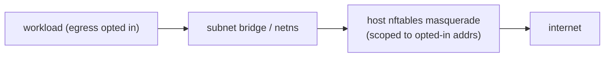
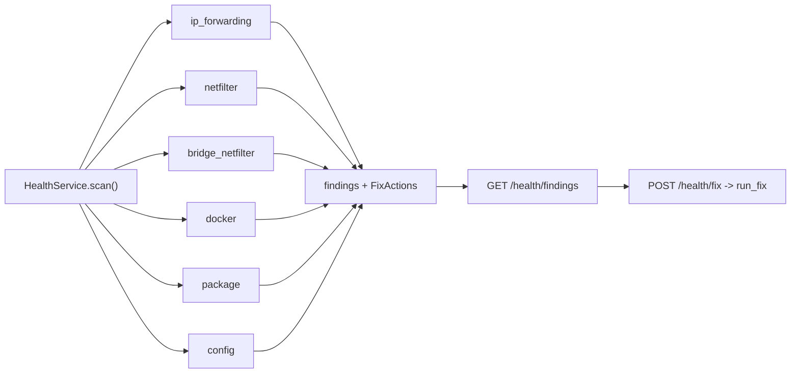
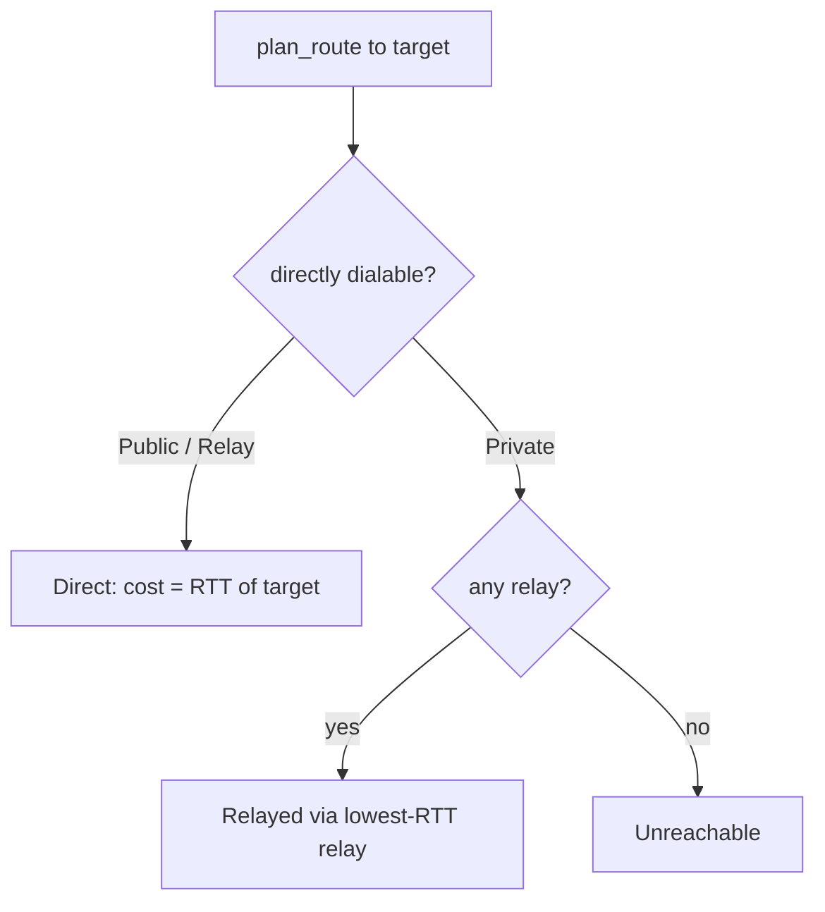
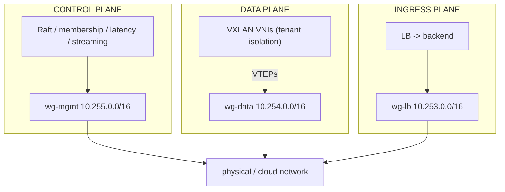

# 2026-06-21 — Data planes, fleet health, and fabric topology intelligence

Three commits landed today, building out the fabric's **data planes** (SDN
egress, IPAM, cross-host overlay, and an encrypted WireGuard underlay split into
three isolated planes), a **fleet health** subsystem with one-click fixes, a
**cross-OS package management** layer, a **bulk streaming transport** with zstd
compression, and **topology intelligence** (capability-based placement, measured
latency, reachability/relays, and weighted path selection).

| Commit | Theme |
|--------|-------|
| `1ed9954` | SDN egress/NAT, IPAM, cross-host VXLAN, fleet health, cross-OS package management |
| `bc8f6b2` | Streaming transport, zstd, WireGuard underlay + container attach, capability placement, latency/reachability/routing |
| `e8ae710` | Three isolated WireGuard planes, control unified over `wg-mgmt`, LB ↔ workload association |

Everything below is **real** (issues actual `ip`/`wg`/`nft`/`docker` commands,
runs genuine Noise/X25519/ChaCha20 crypto, programs real kernel state) and
**degrades gracefully** where a tool or capability is missing. The workspace
builds clean and **251 tests pass**.

---

## At a glance

| # | Feature | Crate(s) | Surfaced as | Detailed docs |
|---|---------|----------|-------------|---------------|
| 1 | Distributed egress / NAT | `ocf-network` | `POST /networks/subnets/:id/egress` | [ocf-network](../subsystems/ocf-network.md#egress-outbound-internet--nat) |
| 2 | IPAM (per-subnet addresses) | `ocf-network` | auto on attach | [ocf-network](../subsystems/ocf-network.md#ipam--per-subnet-address-allocation) |
| 3 | Cross-host VXLAN stitching | `ocf-network`, `ocf-api` | internal | [ocf-network](../subsystems/ocf-network.md#cross-host-vxlan--stitching-the-overlay) |
| 4 | Fleet health + fixes | `ocf-health` (new) | `GET /health/findings`, `POST /health/fix` | [ocf-health](../subsystems/ocf-health.md) |
| 5 | Cross-OS package management | `ocf-platform` (new) | `GET /platform` | [ocf-platform](../subsystems/ocf-platform.md) |
| 6 | Bulk streaming transport | `ocf-fabric` | `send_stream`/`FabricStreamServer` | [ocf-fabric](../subsystems/ocf-fabric.md#bulk-streaming-transfers) |
| 7 | zstd compression | `ocf-fabric`, `ocf-consensus` | streaming + Raft snapshots | [ocf-fabric](../subsystems/ocf-fabric.md#bulk-streaming-transfers) |
| 8 | WireGuard underlay + container attach | `ocf-fabric`, `ocf-network`, `ocf-runtime` | `GET /fabric/wireguard` | [ocf-network](../subsystems/ocf-network.md#wireguard-underlays--three-isolated-encrypted-planes) |
| 9 | Capability-based placement | `ocf-runtime`, `ocf-api` | `GET /workloads/:id/candidates` | [ocf-runtime](../subsystems/ocf-runtime.md#capability-based-placement) |
| 10 | Latency / reachability / routing | `ocf-fabric`, `ocf-api` | `GET /fabric/routes`, `GET /fabric/membership` | [ocf-fabric](../subsystems/ocf-fabric.md#topology-intelligence-latency-reachability--routing) |
| 11 | Three isolated WireGuard planes | `ocf-api`, `ocf-network` | `GET /fabric/wireguard` | [ocf-network](../subsystems/ocf-network.md#wireguard-underlays--three-isolated-encrypted-planes) |
| 12 | LB ↔ workload / autoscaling group | `ocf-api`, `ocf-loadbalancer` | `GET /loadbalancers/:id/backends` | [ocf-loadbalancer](../subsystems/ocf-loadbalancer.md) |

---

## 1. Distributed egress / NAT

**What.** Workloads in an SDN subnet can now opt in to **outbound internet
access**. A subnet has an egress capability and each workload opts in
individually; the load balancer remains the *ingress* path, and egress is the
separate outbound path.

**Why.** Placing a workload in a VPC/subnet shouldn't silently grant or deny
internet — it needs an explicit, auditable control, distinct from ingress.

**How.**

- `EgressMode` (`ocf-network::model`) — `Nat` (the subnet may masquerade
  out) or `Isolated` (no egress). Stored on `Subnet.egress`.
- `NetworkAttachment.egress: bool` (`ocf-runtime`) — the per-workload **opt-in**.
  A workload only reaches the internet when its subnet is `Nat` **and** this flag
  is set.
- **Distributed masquerade**: each host programs an `nftables` masquerade rule
  scoped to the subnet's *opted-in workload addresses* — so a workload's egress
  source IP follows the host it runs on. `apply_egress` / `refresh_subnet_egress`
  on the `NetworkBackend` fan the allow-list out across hosts.

**Surfaced as.** `POST /api/v1/networks/subnets/:id/egress` to set the capability;
`POST /api/v1/workloads/:id/network` carries the per-workload `egress` flag.

**Caveat.** Distributed masquerade means the egress source IP is *not* stable
across migration; a centralized per-VPC NAT gateway remains the alternative if a
stable egress IP is required.

---

## 2. IPAM — per-subnet address allocation

**What.** A subnet now hands out addresses from its CIDR automatically when a
workload attaches, and reclaims them on detach.

**How.** `SubnetAllocator` (`ocf-network/src/ipam.rs`) tracks the in-use set per
subnet and returns the next free host address; `allocate_address` /
`release_address` on the `NetworkController` wrap it. The controller assigns an
address on `attach_workload` and releases it on `detach_workload`; egress
gating is keyed on the assigned address.

See [ocf-network → IPAM](../subsystems/ocf-network.md#ipam--per-subnet-address-allocation).

---

## 3. Cross-host VXLAN stitching

**What.** A VPC's VXLAN overlay is now stitched across every host, so two
workloads on the *same subnet* but *different hosts* share an L2 segment.

**How.** `apply_vpc_peers` / `refresh_vpc_peers` (`NetworkBackend`) program VXLAN
**FDB head-end replication** entries toward each peer's VTEP. The controller's
`program_vxlan_peers` computes the peer VTEP set and fans it out per VPC. (As of
commit `e8ae710` the VTEPs point at peers' `wg-data` WireGuard addresses — see
§11.)

See [ocf-network → Cross-host VXLAN](../subsystems/ocf-network.md#cross-host-vxlan--stitching-the-overlay).

---

## 4. Fleet health system (new crate: `ocf-health`)

**What.** A modular health system where each node surfaces problems
("`ip_forward` not enabled", "netfilter module not loaded", "Docker experimental
features off", configuration issues, missing packages) to the dashboard — **each
finding carries a fix action the operator can trigger**.

**Why.** Operators need the control plane to *tell them* why the host can't do
what it's being asked to (e.g. why egress NAT silently fails), with a one-click
remediation rather than a manual runbook.

**How.**

- `HealthCheck` trait (`check.rs`) — each check inspects the host and returns
  `HealthFinding`s.
- `HealthFinding` (`finding.rs`) — `severity` (`Ok`/`Warning`/`Critical`),
  `category`, a human message, and an optional `FixAction` (a command the
  operator can run via the API).
- `exec.rs` — safe helpers: `read_sys`/`write_sys` (sysctl/procfs), `run`,
  `run_fix`.
- `HealthService` (`service.rs`) runs every registered check and aggregates
  findings.
- Built-in checks (`checks/`): `ip_forwarding`, `netfilter`, `bridge_netfilter`,
  `docker`, `package` (capability/package presence), and `config` (configuration
  issues). `register_builtins` wires them up.

**Surfaced as.** `GET /api/v1/health/findings` (the list with fixes),
`POST /api/v1/health/fix` (apply a finding's fix). Dashboard: `web/pages/health.vue`.

Full detail: [ocf-health](../subsystems/ocf-health.md).

---

## 5. Cross-OS package management (new crate: `ocf-platform`)

**What.** Health findings about missing packages can be remediated across
distributions — the system detects the OS, maps a *capability* (e.g. "nftables",
"smartmontools", "ipmitool") to the right package name per package manager, and
installs it.

**How.**

- `HostOs::detect` (`os.rs`) parses `/etc/os-release` and probes for binaries.
- `Capability` (`capability.rs`) — a fabric capability with a per-package-manager
  package-name map; `builtin_capabilities` covers nftables, iproute2,
  smartmontools, ipmitool, openvswitch.
- `PackageManager` trait + `Apt`/`Dnf`/`Pacman`/`Apk` implementations
  (`managers.rs`, `package.rs`).
- `PlatformService` (`service.rs`) — `active_manager`, `install_capability`,
  `status`.

**Surfaced as.** `GET /api/v1/platform` (OS, active package manager, capability
status). Full detail: [ocf-platform](../subsystems/ocf-platform.md).

---

## 6. Bulk streaming transport

**What.** A streaming path on the encrypted fabric for **multi-MB/GB transfers**
(VM-migration memory images, disk blobs), separate from the request/response RPC.

**Why.** The RPC path is one 64 KB Noise frame per round-trip — RTT-bound and
capped — so it can't move large data. The stream path pipelines records so
throughput is bounded by the cipher and the link, not by round-trips.

**How.**

- `wire::send_stream(reader, compress)` / `recv_stream(writer, compress)` — chunk
  the source into ≤ `STREAM_CHUNK` (64 KB − 64) records, seal each, write them
  **back-to-back without per-record flush or ack**, and terminate with a sealed
  empty record (an *authenticated* end-of-stream, so truncation is detected).
- `NoiseTransport::send_stream(node, reader, compress)` opens a **dedicated**
  encrypted connection so a bulk transfer never blocks control RPC.
- `FabricStreamServer::run(compress, sink)` drains records into a per-peer sink
  (a file, a channel, `tokio::io::sink`).
- `TCP_NODELAY` is set on the RPC transport (it's request/response, so Nagle only
  adds latency).

**Measured** (loopback, release, `crates/ocf-fabric/examples/fabric_bench.rs`):

| Path | Throughput |
|------|-----------|
| Serial 60 KB RPC | ~191 MB/s (collapses toward 0 as real-network RTT grows) |
| Stream, raw, 1 GiB | **~0.55 GB/s** (the ChaCha20-Poly1305 software ceiling) |
| Stream, zstd, 1 GiB sparse | **~2.0 GB/s** effective (≈3.7×) |

Run it: `cargo run -p ocf-fabric --release --example fabric_bench`.

Detail: [ocf-fabric → Bulk streaming](../subsystems/ocf-fabric.md#bulk-streaming-transfers).

---

## 7. zstd compression

**What.** Optional zstd compression in two places where the fabric moves
compressible bytes.

- **Streaming records** — each record is zstd-compressed (level 3) *before* it is
  sealed, so the cipher and the wire carry the compressed bytes. A large win for
  VM-memory images (full of zero/repeated pages). The `compress` flag must match
  on both ends.
- **Raft snapshots** — `build_snapshot` compresses the serialized state
  (`zstd::stream::encode_all`), `install_snapshot` inflates it. Snapshots are
  shipped whole to lagging followers over the fabric, so compressing the (highly
  compressible JSON) state shrinks the catch-up transfer. A test asserts the
  snapshot is a real zstd frame and round-trips through `install`.

`zstd = "0.13"` (C-backed) was added to the workspace. The X25519→WireGuard key
base64 helpers (`crypto.rs`) were added alongside (see §8).

---

## 8. Encrypted container networking — WireGuard underlay + container attach

**What.** The cross-host overlay rides an **encrypted, kernel-datapath WireGuard
underlay**, and a live container can be spliced onto it.

**Why.** VXLAN encapsulates L2 frames in *plain* UDP. To encrypt all cross-host
workload traffic at line rate without a userspace per-packet pump, point the
VXLAN VTEPs at a real kernel WireGuard interface.

**How.**

- A node's **WireGuard identity is its fabric identity**: the X25519 keypair *is*
  a Curve25519 WireGuard key (`PublicKey::to_wireguard_key()` /
  `SecretKey::to_wireguard_key()` base64-encode it).
- `WireguardUnderlay` (`ocf-network/src/wireguard.rs`) programs an interface via
  `ip` + `wg`: `ensure_interface`, `set_peer`, `remove_peer`. The peer set is the
  fabric membership; a peer's `endpoint` is its real underlay address, its
  `allowed-ips` its overlay address.
- **Container last mile**: `attach_workload_veth` makes a veth pair (one end in
  the workload netns, the other on the subnet bridge); `attach_container_to_subnet`
  resolves a *running* container's netns from its host PID
  (`RuntimeProvider::host_pid` → `docker inspect -f '{{.State.Pid}}'`) and splices
  it on. Wired into `attach_workload` (best-effort, Linux + container runtime).
- **Kernel-first, userspace fallback**: `ensure_interface` prefers the in-kernel
  `wireguard` module and, when it's absent (older kernel, locked-down or non-Linux
  host), falls back to a userspace backend on `PATH` — `boringtun` (pure Rust,
  preferred) or `wireguard-go` — driven by the *same* `wg`/`ip` commands. It
  returns the realized `WireguardMode` (`kernel` / `userspace:<bin>`, logged per
  plane); with neither available it gives an honest "install X" error. (A fully
  in-process `boringtun`-over-TUN datapath is the documented next step.)

`GET /api/v1/fabric/wireguard` shows the computed mesh. (Refined into three
planes in §11.) Detail:
[ocf-network → WireGuard underlays](../subsystems/ocf-network.md#wireguard-underlays--three-isolated-encrypted-planes).

---

## 9. Capability-based workload placement

**What.** Workloads can require node capabilities, and placement (initial and HA
reschedule) respects them.

**How.**

- `Workload.node_selector: BTreeMap<String,String>` — required node labels, set
  via `Workload::requires("gpu", "true")`.
- Machines advertise capabilities as `metadata.labels` (the demo labels node-3
  `gpu`/`nvme`, node-1 `nvme`).
- `machine_satisfies(workload, machine)` — placeable iff **all three** hold:
  scope (`placement`), capability (`matches_labels(node_selector)`), and capacity
  (the request fits). Drives `candidate_nodes` / `schedule` and the HA-reschedule
  `pick_target` (a GPU job won't move onto a non-GPU node).

**Surfaced as.** `GET /api/v1/workloads/:id/candidates`. Node *taints* are the
natural complement (a clean extension on the same matching primitive). Detail:
[ocf-runtime → Capability-based placement](../subsystems/ocf-runtime.md#capability-based-placement).

---

## 10. Fabric topology intelligence — latency, reachability, relays, routing

**What.** The mesh gains a real view of itself: measured inter-node latency, node
reachability (public/NAT'd/relay), and weighted path selection.

**How.**

- **Measured latency.** Each node runs a control channel — a ping server plus a
  prober that times a round-trip to every alive peer and records it as
  `MemberState.rtt_ms` (`record_rtt`/`rtt`). `run_latency_services` spawns both.
  `latency_map()` exposes `node_id → RTT` and is the seam that feeds the load
  balancer's `Latency` policy with real numbers (its `Backend.latency_ms` is
  otherwise static).
- **Reachability.** `FabricNode.reachability` — `Public` (dialable), `Private`
  (behind NAT, relay-only), `Relay` (public *and* forwards for others). Derived
  from the `fabric.reachability` machine label.
- **Weighted routing.** `plan_route` (`routing.rs`) returns a `RoutePlan`
  (`Direct` / `Relayed` / `Unreachable`) weighed by measured RTT: direct for
  dialable peers, the **lowest-RTT relay** for a private peer, with a direct path
  preferred unless a relay is strictly cheaper. This is the "fastest path"
  calculation, made meaningful exactly where it matters (NAT'd nodes,
  multi-route choices).
- **Relay datapath.** `NoiseTransport::request_via_relay(relay, target, payload)`
  forwards a request to a private target through a relay running `forward_relayed`
  as its handler. Verified end-to-end on loopback.

**Surfaced as.** `GET /api/v1/fabric/routes` (the plan to each peer);
`GET /api/v1/fabric/membership` now carries `reachability` and `rtt_ms`.

**Relationship to the LB policies.** The latency map (node↔node distance) and the
LB's load-distribution policies (`RoundRobin`/`LeastLoad`/`Latency`/`Geo`, which
distribute *requests* across a service's backends) are different layers that
*compose*: the map feeds the LB's `Latency` policy; `RoundRobin`/`LeastLoad` stay
(correctly) latency-agnostic.

Detail: [ocf-fabric → Topology intelligence](../subsystems/ocf-fabric.md#topology-intelligence-latency-reachability--routing).

**Known limit (documented, not built).** Relaying assumes the relay can reach the
target. A node behind symmetric NAT reachable from *nowhere* inbound needs a
**held reverse tunnel** (the private node keeps an outbound connection to the
relay open) — the next step on this foundation.

---

## 11. Three isolated WireGuard planes + control unified over `wg-mgmt`

**What.** Node-to-node traffic is segmented into **three separate encrypted
WireGuard underlays**, and the control plane is moved onto its own plane.

| Plane | Interface | Subnet | Port | Carries |
|-------|-----------|--------|------|---------|
| Management | `wg-mgmt` | `10.255.0.0/16` | 51820 | Raft, membership, latency probes, streaming |
| Workload | `wg-data` | `10.254.0.0/16` | 51821 | VXLAN overlay (VTEPs point here) |
| Load balancer | `wg-lb` | `10.253.0.0/16` | 51822 | LB → backend ingress |

**Why.** Management, tenant, and ingress traffic should not share an interface or
address space — segmentation by plane, each encrypted, none able to observe the
others.

**How.**

- `WgPlane` (`ocf-api/src/controller.rs`) describes a plane (interface, `/24`
  prefix, port). `program_wireguard` brings up all three and programs peers on
  each via `WireguardUnderlay`. Each machine gets the same host index across
  planes (`10.255.0.N`, `10.254.0.N`, `10.253.0.N`).
- **Control unified on `wg-mgmt`**: `init_membership` sets each peer's dialable
  endpoint to its `wg-mgmt` overlay address (`10.255.0.x:fabric_control_port`), so
  Raft, membership gossip, and the prober all flow over the management plane
  instead of physical addresses. A peer's WireGuard `endpoint` stays its real
  underlay address; its `allowed-ips` is its overlay address *on that plane only*.
- VXLAN VTEPs now resolve to `wg-data` addresses (`peer_vteps`).

**Surfaced as.** `GET /api/v1/fabric/wireguard` now reports all three planes
(interface, purpose, this node's address, port, peers). `fabric_control_port`
defaults to 51900 (distinct from the WireGuard UDP ports).

Detail: [ocf-network → WireGuard underlays](../subsystems/ocf-network.md#wireguard-underlays--three-isolated-encrypted-planes).

---

## 12. Load balancer ↔ workload / autoscaling-group association

**What.** A load balancer's backend set is now resolved **live** from a label
selector, on the `wg-lb` plane.

**Why.** The LB is the internet-facing ingress component; its backends are
workloads. An **autoscaling group is the set of workloads matching a selector**,
and the LB fronts that same selector — so they associate by sharing a label set.
Previously `target_selector` was modeled but never resolved to a live backend set.

**How.**

- `LoadBalancer::fronting("app", "web")` builds the `target_selector` (the same
  label set an autoscaler with the same selector governs).
- `resolve_lb_backends(lb)` (`ocf-api`) resolves it: the scheduled workloads whose
  labels match, each addressed at its **hosting node's `wg-lb` address**, with
  measured RTT stamped (for the `Latency` policy). As the autoscaler adds/removes
  replicas, the backend set follows.
- The pure resolver `lb_backends_for` is unit-tested (selector match + wg-lb
  addressing + skip-unscheduled).

**Surfaced as.** `GET /api/v1/loadbalancers/:id/backends`. The demo `web-https` LB
fronts `app=web`.

---

## API surface added today

| Method | Path | Purpose |
|--------|------|---------|
| `POST` | `/api/v1/networks/subnets/:id/egress` | Set a subnet's outbound (NAT) capability |
| `POST` / `DELETE` | `/api/v1/workloads/:id/network` | Attach/detach a workload to a subnet (IPAM + egress opt-in) |
| `GET` | `/api/v1/workloads/:id/candidates` | Nodes a workload can run on (scope + capability + capacity) |
| `GET` | `/api/v1/health/findings` | Fleet health findings with fix actions |
| `POST` | `/api/v1/health/fix` | Apply a finding's fix |
| `GET` | `/api/v1/platform` | OS, package manager, capability status |
| `GET` | `/api/v1/fabric/membership` | Now carries `reachability` + measured `rtt_ms` |
| `GET` | `/api/v1/fabric/wireguard` | The three computed WireGuard planes |
| `GET` | `/api/v1/fabric/routes` | Planned route to each peer (direct vs relayed, RTT-weighed) |
| `GET` | `/api/v1/loadbalancers/:id/backends` | Live backend set from the LB's `target_selector` |

See the full [REST API reference](../reference/rest-api.md).

---

## New crates & modules

| Path | What |
|------|------|
| `crates/ocf-health/` | Fleet health checks, findings, and fix actions |
| `crates/ocf-platform/` | OS detection + cross-distro package management |
| `crates/ocf-network/src/ipam.rs` | Per-subnet address allocation |
| `crates/ocf-network/src/wireguard.rs` | WireGuard underlay + container veth/netns attach |
| `crates/ocf-fabric/src/routing.rs` | Reachability + weighted path selection (`plan_route`) |
| `crates/ocf-fabric/examples/fabric_bench.rs` | Latency/throughput/streaming benchmark |

---

## Testing

- **251 tests pass**, workspace builds clean (no warnings).
- New focused tests today include: streaming round-trip (5 MB, multi-record) and
  the compressed variant; WireGuard key base64 (RFC 4648 vectors + 44-char WG
  keys); `wg set peer` argv construction; subnet bridge naming; capability
  placement (selector + scope + capacity); RTT record/read and a real
  measure-and-record over a loopback ping server; the five `plan_route` cases
  (direct / via-relay / lowest-RTT-relay / unreachable / prefer-direct); the relay
  datapath (origin → relay → private target → echo back); the Raft snapshot zstd
  round-trip (asserts the zstd magic + installs back); and the LB selector →
  wg-lb backend resolver.
- The encrypted **Raft path is intact** — a 3-node cluster still replicates over
  the encrypted fabric after the streaming/wire refactor.

---

## Known limitations & next steps

- **Held reverse tunnel** for symmetric-NAT nodes reachable from nowhere inbound
  (the relay model handles asymmetric NAT and segment-bridging relays today).
- **Live container attach / LB backends** require a Linux host with a container
  runtime to exercise end-to-end; on a single non-Linux dev host the mechanisms
  run best-effort and the wiring is verified by unit tests and the computed views
  (`/fabric/wireguard`, `/fabric/routes`, `/loadbalancers/:id/backends`).
- **Workload spec persistence** — rich workload fields (`placement`,
  `node_selector`, `highly_available`) live in the spec but the stateless runtime
  reconstruction can't recover them; a durable workload-spec store is the clean
  fix.
