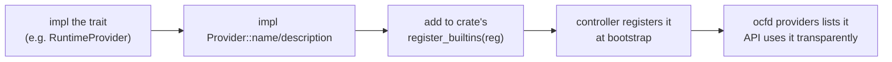

# Contributing

> How to extend OCF the way it's meant to be extended: add a backend to an
> existing contract, or add a whole new subsystem crate.

Everything in OCF is a **contract** (a trait) with **plugin** backends registered
at runtime — see [Architecture → Contracts & Plugins](../architecture/contracts-and-plugins.md).
The two extension shapes below follow from that. First, the rules that apply to
all contributions.

## Contract-first rules

- **Add behind a contract, not into a caller.** New capability = a new `Provider`
  implementation behind an existing trait, or a new trait + `Registry`. Callers
  depend on the trait, never on a concrete backend.
- **Cross-platform & graceful.** Code must compile on Linux, Windows, and macOS.
  An integration that needs a host tool must return a clear error when it's
  absent, never fabricate a result.
- **No `unwrap`/`panic`/`expect` in library paths.** Return `ocf_core::Result`
  with a meaningful `Error`. Honest errors over hidden failures.
- **Use the prelude.** `use ocf_core::prelude::*;` brings in `Metadata`, `Id`,
  `ResourceSpec`, `Health`, `LifecycleState`, `Scope`, `Resource`, `Registry`,
  `Provider`, `Error`/`Result`, `async_trait`, and serde derives.
- **Async traits via `async_trait`.** Provider methods are async; annotate the
  trait and impls with `#[async_trait]`.
- **Test what runs anywhere; `#[ignore]` what needs a host.** See
  [Testing](testing.md).

## (a) Add a provider to an existing contract

Use this when the capability already exists and you're adding another backend —
e.g. a new `RuntimeProvider`, `Authenticator`, `CertificateProvider`, or
`DnsProvider`.



1. **Implement the trait.** In the owning crate (e.g. `ocf-runtime`), add a new
   type and `impl` the contract for it:

   ```rust
   use ocf_core::prelude::*;

   pub struct FirecrackerRuntime { /* … */ }

   #[async_trait]
   impl Provider for FirecrackerRuntime {
       fn name(&self) -> &str { "firecracker" }
       fn description(&self) -> &str { "Firecracker microVM backend" }
   }

   #[async_trait]
   impl RuntimeProvider for FirecrackerRuntime {
       // create / start / stop / delete / list …
   }
   ```

2. **Register it.** Add it to that crate's `register_builtins`:

   ```rust
   pub fn register_builtins(reg: &mut Registry<dyn RuntimeProvider>) -> Result<()> {
       reg.register("docker", Arc::new(DockerRuntime::new()))?;
       // …
       reg.register("firecracker", Arc::new(FirecrackerRuntime::new()))?;
       Ok(())
   }
   ```

   `FabricController::bootstrap` already calls each crate's `register_builtins`, so
   the new backend appears in `ocfd providers` and is usable through the API with
   no caller changes. To override a built-in instead of adding one, use
   `register_or_replace`.

## (b) Add a whole new subsystem crate

Use this when you're introducing a new capability area. The smallest existing
crate, [`ocf-topology`](../subsystems/ocf-topology.md), is the template: a
`Provider` + `Registry` contract, a service that uses it, and an in-memory
backend.

1. **Create the crate** under `crates/ocf-<name>/` and add it to the workspace
   `members` and `[workspace.dependencies]` in the root `Cargo.toml`. Its
   `Cargo.toml` uses workspace inheritance:

   ```toml
   [package]
   name = "ocf-foo"
   version.workspace = true
   edition.workspace = true
   license.workspace = true
   authors.workspace = true
   description = "One-line responsibility."

   [dependencies]
   ocf-core.workspace = true
   serde.workspace = true
   async-trait.workspace = true
   ```

2. **Define the contract.** A trait extending `Provider`, plus a `Registry` for
   its backends and a `register_builtins(reg)` that installs the defaults — the
   same shape every existing subsystem follows.

3. **Add a service + in-memory backend.** A thin service type the controller can
   own, and a shippable in-memory implementation so single-node and tests work
   without external dependencies.

4. **Wire it into the controller.** Add a field to `FabricController`, build it in
   `bootstrap` (call your `register_builtins`), and expose it through `ocf-api`
   routes as needed. If it has listable providers, add a line to `ocfd`'s
   `providers` output.

5. **Document it.** Add `docs/subsystems/ocf-foo.md` following the existing
   subsystem template, and link it from `docs/README.md`.

## Related

- [Architecture → Contracts & Plugins](../architecture/contracts-and-plugins.md) — the plugin model in depth.
- [Project Layout](project-layout.md) — where everything lives and how crates depend on each other.
- [Testing](testing.md) — testing conventions for new code.
