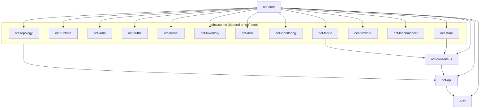

# Project Layout

> An annotated map of the repository, plus how the crates depend on one another.

For build mechanics see [Building](building.md); for how to add to the tree see
[Contributing](contributing.md).

## Repository map

```
open-compute-fabric-rs/
├── Cargo.toml                 # workspace: members + shared dependency versions
├── Cargo.lock
├── README.md                  # project intro
├── LICENSE                    # MIT
├── crates/                    # the Rust workspace (15 libs + the daemon)
│   ├── ocf-core/              # foundational contracts: Resource, Provider+Registry, Scope, …
│   ├── ocf-store/             # durable StateStore (redb) + in-memory backend
│   ├── ocf-consensus/         # openraft-replicated control-plane KV (quorum writes)
│   ├── ocf-topology/          # region → datacenter → rack → machine + drill-down
│   ├── ocf-runtime/           # container/VM runtimes, migration, autoscaling
│   ├── ocf-auth/              # authentication (+ host user sync)
│   ├── ocf-authz/             # RBAC authorization
│   ├── ocf-kernel/            # host kernel: networking, firewall, services
│   ├── ocf-inventory/         # hardware inventory + IPMI
│   ├── ocf-disk/              # physical disks, LED, RMA
│   ├── ocf-monitoring/        # host + per-runtime metrics
│   ├── ocf-fabric/            # encrypted host-to-host mesh (Noise XX) + SWIM membership
│   ├── ocf-network/           # VPC / subnet / route / ACL overlay
│   ├── ocf-loadbalancer/      # TCP/ALB, TLS (ACME), DDNS
│   ├── ocf-api/               # axum REST API + serves the frontend
│   └── ocfd/                  # the monolithic binary (CLI, config, wiring)
├── web/                       # Nuxt 3 + Vite + Vue 3 + Tailwind frontend
│   ├── nuxt.config.ts         # Nuxt config (Tailwind, runtimeConfig, dev proxy)
│   ├── package.json
│   ├── app.vue                # root component
│   ├── layouts/               # sidebar nav + responsive shell
│   ├── components/            # StatCard, HealthBadge, ResourceTable, TreeNode, PageHeader
│   ├── composables/           # useApi (mock fallback), types, mockData, useFormat
│   └── pages/                 # dashboard, topology, workloads, networking, loadbalancers, storage, access
├── docs/                      # this documentation tree
│   ├── README.md              # documentation hub + map
│   ├── getting-started/       # installation, quickstart, configuration
│   ├── architecture/          # overview + the conceptual design docs
│   ├── subsystems/            # one reference doc per crate
│   ├── reference/             # REST API, CLI, configuration, error codes, glossary
│   ├── frontend/              # web UI overview + API client
│   ├── development/           # building, testing, contributing, project layout (this file)
│   └── operations/            # deployment, security
└── test/                      # sample artifacts (e.g. a state.redb data dir)
```

> A typical crate directory is `Cargo.toml` + `src/lib.rs` plus per-concern
> modules (e.g. `provider.rs`, `providers/`, `model.rs`, `store.rs`). Each crate's
> shape is described in its [subsystem doc](../subsystems/).

## Dependency graph

The dependencies form clean layers: `ocf-core` is the base every crate builds on;
the subsystem crates depend on core (and a couple depend on each other);
`ocf-consensus` additionally builds on `ocf-store` + `ocf-fabric`; `ocf-api`
depends on **all** subsystems; and `ocfd` depends only on `ocf-api` + `ocf-core`.



(The `subs --> api` and `core --> ...subs` edges are drawn collapsed to keep the
graph readable; every subsystem crate depends on `ocf-core`, and `ocf-api` depends
on every subsystem crate plus `ocf-consensus`.)

## Where to look first

| You want to… | Start at |
|--------------|----------|
| Understand the design | [Architecture → Overview](../architecture/overview.md) |
| Run it | [Getting Started → Quickstart](../getting-started/quickstart.md) |
| Read one subsystem | [Subsystems](../subsystems/) |
| Extend it | [Contributing](contributing.md) |
| Look up an endpoint/flag | [Reference](../reference/) |
