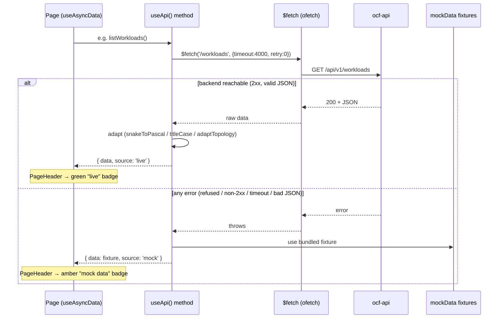

# Frontend — API Client

`web/composables/useApi.ts` is the single typed gateway between the Vue console
and the `ocf-api` REST surface. It guarantees the UI always renders — live data
when the backend answers, bundled fixtures when it doesn't — and it normalizes
the JSON Rust's serde emits into the casing the TypeScript types expect.

> The endpoints behind these methods are documented in
> [Reference → REST API](../reference/rest-api.md) and implemented by
> [Subsystems → ocf-api](../subsystems/ocf-api.md). For pages and components that
> consume this client, see [Frontend → Overview](overview.md).

## `useApi()` — the `getOrMock` pattern

`useApi()` reads the base URL from `runtimeConfig.public.apiBase` (default
`http://localhost:8080/api/v1`) and returns an object of typed methods. Every
method resolves to:

```ts
interface ApiResult<T> {
  data: T
  source: 'live' | 'mock'
}
```

The core helper is `getOrMock<T>(path, fallback)`:

```ts
async function getOrMock<T>(path: string, fallback: T): Promise<ApiResult<T>> {
  try {
    const data = await $fetch<T>(path, { baseURL, timeout: 4000, retry: 0 })
    return { data, source: 'live' }
  } catch (err) {
    // (dev-only console.warn)
    return { data: fallback, source: 'mock' }
  }
}
```

Key properties:

- **Fail-soft on *any* error.** Connection refused, non-2xx status, timeout, or
  unparseable JSON all land in the same `catch` and return the bundled fixture.
  The UI never throws on a dead backend.
- **Fast fallback.** `timeout: 4000` (4s) and `retry: 0` keep a missing backend
  from stalling the page; one attempt, then mock.
- **Isomorphic.** `$fetch` (ofetch) is provided by Nuxt on both server and
  client, so SSR first-paint and client navigation use the same path.
- **The `source` flag drives the UI.** Each page forwards it to `PageHeader`,
  which renders the amber "mock data" / green "live" badge.

## Adapters — why the responses are reshaped

Rust's serde serializes enums **lowercase** (`#[serde(rename_all = ...)]`
defaults) — `running`, `virtual_machine`, `tcp`, `round_robin`, `healthy`. The
TypeScript types in `types.ts` and the comparisons throughout the pages use
**PascalCase / TitleCase** — `'Running'`, `'VirtualMachine'`, `'Tcp'`,
`'RoundRobin'`, `'Healthy'`. Without normalization, `w.state === 'Running'` on
the workloads page would silently never match a live payload, and `HealthBadge`
would fall through to its neutral style.

The adapters bridge that gap. They run **only on the `'live'` path** — mock
fixtures are already authored in the canonical casing, so they pass straight
through.

### Casing helpers

| Helper | Input → output | Used for |
|--------|----------------|----------|
| `titleCase(s)` | `healthy` → `Healthy` | `Health` values (machine/disk/node health) |
| `snakeToPascal(s)` | `virtual_machine` → `VirtualMachine`, `round_robin` → `RoundRobin`, `tcp` → `Tcp` | enum fields on workloads, disks, load balancers |

Both default a missing/empty value to `'Unknown'`.

### Per-resource adapters

| Adapter | Applies to | Transformations |
|---------|-----------|-----------------|
| `adaptWorkload(w)` | each `Workload` | `snakeToPascal` on `kind` and `state`; derives `node_name` from the API's `node` id when not already present |
| `adaptDisk(d)` | each `PhysicalDisk` | `snakeToPascal` on `health` and (if present) `led` |
| `adaptLoadBalancer(lb)` | each `LoadBalancer` | `snakeToPascal` on `kind` and `policy` |
| `adaptTopology(raw)` | topology tree | **structural** — see below |

### `adaptTopology` — the structural adapter

This is the most important adapter. The live API returns
`ocf-topology::TopologyTree`, a nested-array shape:

```jsonc
{ "regions": [
  { "region": {...}, "datacenters": [
    { "datacenter": {...}, "racks": [
      { "rack": {...}, "machines": [ {...}, {...} ] }
    ] }
  ] }
] }
```

The UI, however, renders a **single recursive `TopologyNode` tree** (so
`TreeNode` can recurse generically). `adaptTopology`:

1. Synthesizes a **`Fleet` root** node (the API tree has no fleet object).
2. Walks `regions → datacenters → racks → machines`, emitting a `TopologyNode`
   at each level with the right `level`, `id`, `name`, and `health`.
3. At the machine leaf, builds the `machine` detail object — converting capacity
   (`cpu_millis` → whole `cpu_cores`, `memory_bytes`, `disk_bytes`), mapping
   `fabric_address` → `ip_address`, and pulling the rack name down as a label.
4. Is **defensive throughout** (`?.` and `?? []` everywhere) so a partial or
   malformed payload can't crash SSR.

The decision to adapt is made in `getTopologyTree()`: if the raw response has a
`regions` array it's the live shape and gets adapted; otherwise it's treated as
an already-shaped `TopologyNode` (the mock path).

## Method reference

| Method | HTTP | Endpoint (under `apiBase`) | Returns | Adapter applied |
|--------|------|----------------------------|---------|-----------------|
| `getHealth()` | GET | `/health` | `HealthReport` | — |
| `getTopologyTree()` | GET | `/topology/tree` | `TopologyNode` | `adaptTopology` (live only) |
| `listWorkloads()` | GET | `/workloads` | `Workload[]` | `adaptWorkload` per item (live only) |
| `listVpcs()` | GET | `/networks/vpcs` | `Vpc[]` | — |
| `listSubnets()` | GET | `/networks/subnets` | `Subnet[]` | — |
| `listLoadBalancers()` | GET | `/loadbalancers` | `LoadBalancer[]` | `adaptLoadBalancer` per item (live only) |
| `listDisks()` | GET | `/disks` | `PhysicalDisk[]` | `adaptDisk` per item (live only) |
| `getHostMetrics()` | GET | `/metrics/host` | `ResourceUsage` | — |
| `listUsers()` | GET | `/access/users` | `User[]` | — |
| `listRoles()` | GET | `/access/roles` | `Role[]` | — |
| `migrateWorkload(id, target?)` | POST | `/workloads/{id}/migrate` | `{ accepted: boolean }` | — (mock returns `{ accepted: true }`) |

All paths are relative to `apiBase`, so the full live URL is e.g.
`http://localhost:8080/api/v1/workloads`.

## Supporting modules

### `types.ts`

TypeScript interfaces that **loosely mirror the Rust models** (`ocf-core` and the
subsystem crates) using the JSON shape serde is expected to emit, not the exact
Rust generics. Notable exports:

- **Core:** `Id`, `Metadata`, `Health`, `LifecycleState`, `ScopeLevel`,
  `ResourceSpec`.
- **Domain:** `TopologyNode` + `MachineDetail`, `Workload` (`RuntimeKind`),
  `Vpc`/`Subnet`, `LoadBalancer` (`LbKind`, `RoutingPolicy`, `Listener`),
  `PhysicalDisk` (`DiskHealth`, `LedState`), `ResourceUsage`, `User`/`Role`/`Group`,
  `HealthReport`.

The enum string-literal unions here (`'Running'`, `'VirtualMachine'`, `'Tcp'`,
`'RoundRobin'`, …) are exactly the canonical casing the adapters produce.

### `mockData.ts`

Bundled fixtures (`mockHealth`, `mockTopology`, `mockWorkloads`, `mockVpcs`,
`mockSubnets`, `mockLoadBalancers`, `mockDisks`, `mockHostMetrics`, `mockUsers`,
`mockRoles`) that `useApi()` returns on any error. They are authored in the
**canonical (Pascal/Title) casing** and the already-recursive `TopologyNode`
shape, so they bypass the adapters entirely. This is what makes the UI fully
explorable with zero Rust services running.

### `useFormat.ts`

Shared display helpers returned by `useFormat()`:

| Helper | Example | Notes |
|--------|---------|-------|
| `bytes(n)` | `512 GiB` | binary units (B → PiB), `—` for null |
| `bitsPerSec(n)` | `1.3 Gbps` | decimal units (bps → Tbps) |
| `millicores(n)` | `2 vCPU` / `500m` | ≥1000 → vCPU, else millicores |
| `number(n)` | `12,400` | `toLocaleString('en-US')` |
| `date(s)` | `Jun 10, 2026` | localized date, falls back to raw string on parse failure |

## Request flow



Pages that fan out several calls (Dashboard, Networking, Access) combine the
`source` flags: they show `'live'` only when **every** call succeeded, otherwise
`'mock'`.
