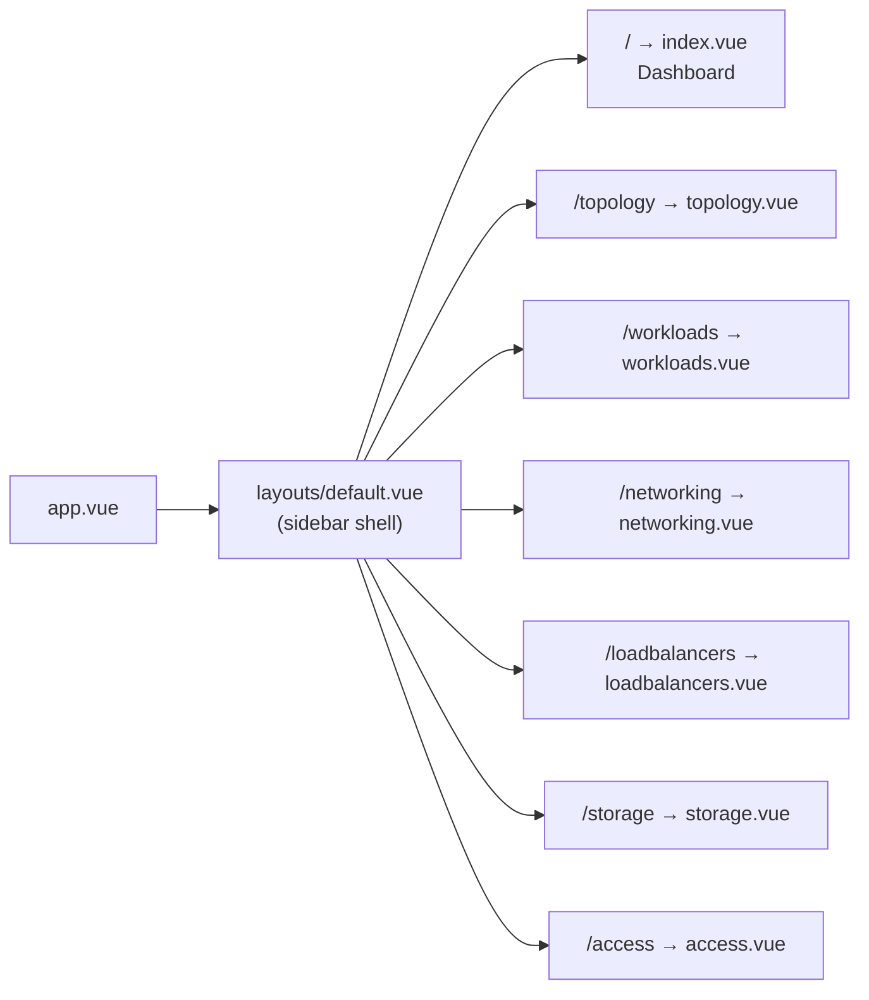
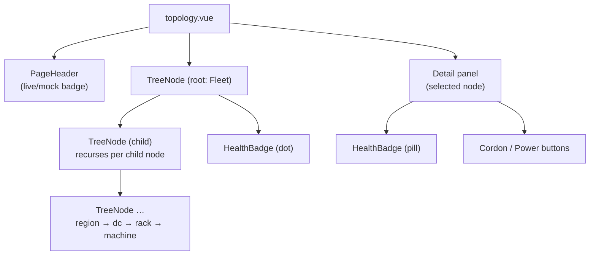

# Frontend — Overview

The OCF web console is a **Nuxt 3 + Vite + Vue 3 + Tailwind CSS** single-page
control plane that renders the fleet against the `ocf-api` REST surface, and
falls back to bundled fixtures so the whole UI works with no backend running.

> See [API Client](api-client.md) for how the frontend talks to the backend, the
> response adapters, and the mock fallback. The endpoints themselves are
> documented in [Reference → REST API](../reference/rest-api.md) and served by
> [Subsystems → ocf-api](../subsystems/ocf-api.md).

## Stack

| Layer | Choice | Notes |
|-------|--------|-------|
| Framework | **Nuxt 3** (`^3.13`) | File-based routing under `web/pages/`, auto-imported composables/components, SSR for first paint |
| Build / dev server | **Vite** | Provided by Nuxt; HMR dev server on `:3000` |
| View layer | **Vue 3** | `<script setup lang="ts">` single-file components throughout |
| Language | **TypeScript** | `typescript.strict: true` in `nuxt.config.ts` |
| Styling | **Tailwind CSS** via `@nuxtjs/tailwindcss` | Dark theme, custom `surface`/`brand` palette |
| Fetch | **ofetch** (`$fetch`) | Wrapped by `useApi()` (see [API Client](api-client.md)) |

The theme is **dark by default**: `nuxt.config.ts` puts `class: 'dark'` on
`<html>`, and `tailwind.config.js` sets `darkMode: 'class'`. The layout is
**responsive** — the sidebar collapses behind a hamburger below the `lg`
breakpoint, tables scroll horizontally, and cards reflow into a single column.

## How to run

```bash
cd web
npm install        # installs Nuxt + Tailwind; postinstall runs `nuxt prepare`
npm run dev        # Vite dev server with HMR on http://localhost:3000
```

With no backend running, every page renders against bundled mock data and shows
an amber **"mock data"** badge. Start `ocfd` (which serves `ocf-api` on `:8080`)
and the badge turns green **"live"**.

| Command | What it does |
|---------|--------------|
| `npm run dev` | Vite dev server (HMR) on `:3000` |
| `npm run build` | Production build into `web/.output/` |
| `npm run preview` | Preview the production build |
| `npm run generate` | Static prerender (SSG) |
| `npm run typecheck` | `vue-tsc` type check |

### Build output & serving

`npm run build` emits to **`web/.output/`**. In production the daemon serves
those static assets directly: `ocfd --static-dir <path-to-.output>` makes the UI
same-origin with the API, so no dev proxy or CORS handling is needed.

### API base URL

The API base URL is exposed through Nuxt `runtimeConfig.public.apiBase`,
defaulting to **`http://localhost:8080/api/v1`**. Override it at runtime —
without rebuilding — via the `NUXT_PUBLIC_API_BASE` environment variable:

```bash
NUXT_PUBLIC_API_BASE=https://fabric.internal/api/v1 npm run dev
```

In development, `nuxt.config.ts` also configures a **dev proxy** that forwards
`/api/**` to `http://localhost:8080/api/**`, so the browser can call same-origin
and avoid CORS while Vite runs on a different port.

## Routes & pages

Routing is file-based: each `web/pages/*.vue` is a route, wrapped by
`layouts/default.vue` (sidebar + responsive shell) through `app.vue`. Every page
loads its data with `useAsyncData(...)` over `useApi()` and surfaces a `source`
of `'live'` or `'mock'` to its `PageHeader`.

| Route | Page file | Sidebar label | Shows | API methods called | Notable interactions |
|-------|-----------|---------------|-------|--------------------|----------------------|
| `/` | `index.vue` | Dashboard | Fleet summary: machine/workload/LB/at-risk-disk stat cards, fleet-health rollup, aggregate host utilization (CPU/mem/disk bars, net + IOPS tiles), and a 5-row workload preview | `getTopologyTree`, `listWorkloads`, `listDisks`, `getHostMetrics`, `listLoadBalancers` (all five in parallel) | Flattens the topology tree to count machines and derive a `Healthy`/`Degraded`/`Unhealthy` fleet rollup; "View all →" link to workloads |
| `/topology` | `topology.vue` | Topology | Drill-down tree (region → datacenter → rack → machine) plus a machine detail panel | `getTopologyTree` | Recursive `TreeNode` drill-down; clicking a node selects it; detail panel shows hardware (vCPU/mem/disk), labels, and `Cordon`/`Power` action buttons; auto-selects the first machine |
| `/workloads` | `workloads.vue` | Workloads | Table of containers and VMs (name + HA badge, kind, image, resources, state, node) | `listWorkloads`, `migrateWorkload` | Search box (name/image/node) + kind filter (All/Container/VM); **Migrate** button per row (enabled only for `Running` workloads) with a toast on completion; calls `refresh()` |
| `/networking` | `networking.vue` | Networking | VPC cards (CIDR, VNI, subnet count) and a subnets table (name, VPC, CIDR, namespace) | `listVpcs`, `listSubnets` (parallel) | Clicking a VPC card filters the subnets table to that VPC; "Clear filter" resets it |
| `/loadbalancers` | `loadbalancers.vue` | Load Balancers | LB cards: L4 TCP / L7 ALB kind, anycast badge, routing policy, listeners (with TLS lock), hostnames, placement, backend count | `listLoadBalancers` | Maps routing-policy enums to friendly labels (`RoundRobin` → "Round-robin", etc.); per-listener TLS indicator |
| `/storage` | `storage.vue` | Storage | Disk summary stat cards (total/warning/failing/RMA'd) and a physical-disk table (device, model, serial, machine, size, health, LED, RMA) | `listDisks` | Animated **LED** state indicator (`Normal`/`Locate`/`Fault`/`Rebuild`); `Locate` and `RMA` action buttons per disk; RMA date column |
| `/access` | `access.vue` | Access | Users/Roles tabs: users table (username, name, email, groups) and role cards (permission chips, superuser badge for `*`) | `listUsers`, `listRoles` (parallel) | Tab toggle between **Users** and **Roles**; flags `*`-permission roles as superuser |

> The action buttons in the Topology (`Cordon`/`Power`), Storage (`Locate`/`RMA`)
> panels are presentational placeholders in this build. The only wired-up
> mutation is the workload **Migrate** button (`migrateWorkload`), which itself
> degrades to a mock "queued" toast when the backend is unreachable.

## Components

All components live in `web/components/` and are auto-imported by Nuxt (no
explicit `import` needed in pages).

| Component | Purpose | Key props |
|-----------|---------|-----------|
| `StatCard` | Summary metric card (label + big value + optional hint + accented icon chip) | `label`, `value`, `hint?`, `accent?` (`brand`/`emerald`/`amber`/`rose`/`sky`/`violet`); icon via `#icon` slot |
| `HealthBadge` | Colored status pill for any `Health` / `LifecycleState` / `DiskHealth` value. **Case-insensitive** (`status.toLowerCase()` keys an internal style map); unknown values render neutral grey | `status` (string), `dot?` (compact leading-dot variant) |
| `ResourceTable` | Generic styled table; `columns` describe each column, rows render through default `cell-<key>` slots so callers can override any cell. Generic over the row type `T` | `columns` (`{ key, label, align?, mono?, class? }[]`), `rows: T[]`, `rowKey?`, `empty?` |
| `TreeNode` | **Recursive** topology row: renders one `TopologyNode` and, when expanded, a `<TreeNode>` per child. Top three levels start expanded. Emits `select` on click | `node: TopologyNode`, `selectedId?`, `depth?`; emits `select` |
| `PageHeader` | Page title + subtitle + the **live/mock data-source badge** (amber "mock data" when the backend is unreachable, green "live" otherwise) | `title`, `subtitle?`, `source?` (`'live' \| 'mock'`); `#actions` slot |

## Layout & styling

`layouts/default.vue` is the app shell:

- A **fixed sidebar** (`<aside>`) holds the brand mark and the seven nav links
  (Dashboard, Topology, Workloads, Networking, Load Balancers, Storage, Access),
  each an inline Heroicons-style SVG. The active link is highlighted via an
  `isActive()` helper that special-cases `/` and otherwise matches by prefix.
- Below the `lg` breakpoint the sidebar slides off-canvas behind a **hamburger**
  in a sticky mobile top bar, with a dimming backdrop; selecting a link closes
  it.
- A footer status block shows a pulsing "contract-first · no quorum" indicator
  and the version string.

Styling comes from Tailwind with a custom palette in `tailwind.config.js`:

- **`surface-*`** (950 → 600): the dark control-plane background scale used for
  page background, cards, table headers, and borders.
- **`brand-*`** (indigo, default `#6366f1`): primary accent for active nav,
  buttons, and the "live" state.
- Shared component classes (e.g. `ocf-card`, `ocf-nav-link`,
  `ocf-nav-link-active`) are defined in `assets/css/tailwind.css`.

### Data-source badge

Every page derives a `source` computed from the `ApiResult.source` of its
call(s). Pages that fan out multiple requests (Dashboard, Networking, Access)
report `'live'` only when **all** calls succeeded, otherwise `'mock'`. The
`PageHeader` renders this as the amber "mock data" / green "live" pill — the
single most visible signal of whether the backend is reachable. See
[API Client → mock fallback](api-client.md) for the mechanism.

## Diagrams

### Sidebar → pages (route structure)



### Component hierarchy — Topology page

The topology page is the clearest example of composition: a recursive
`TreeNode` on the left, a machine detail panel on the right, both built from the
shared `HealthBadge`.


