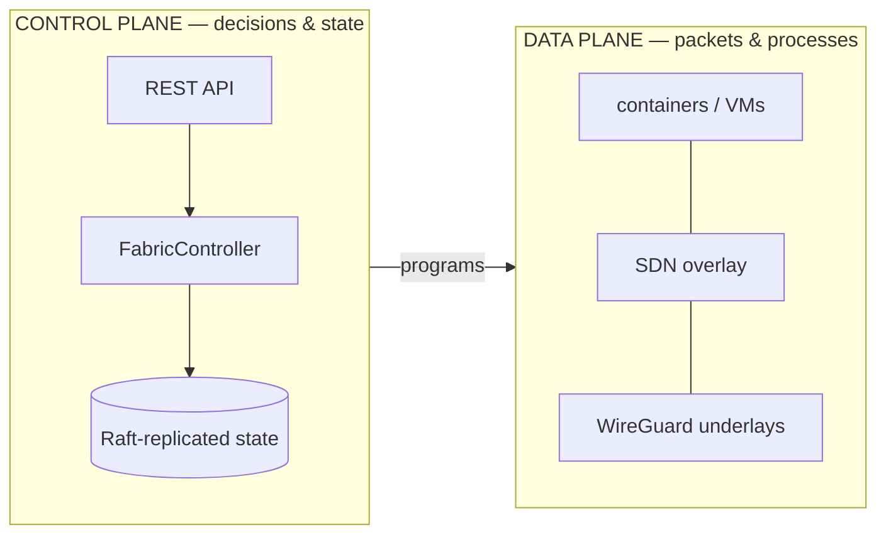
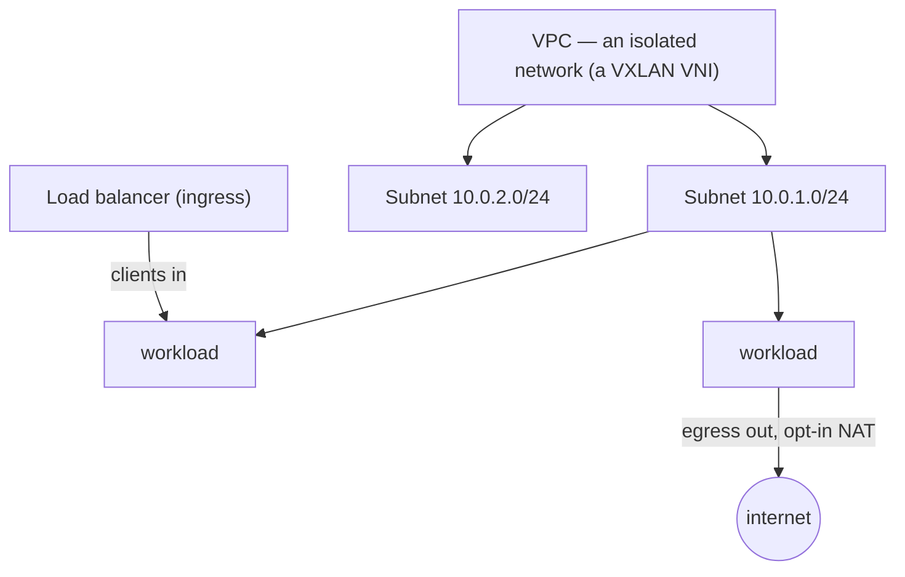
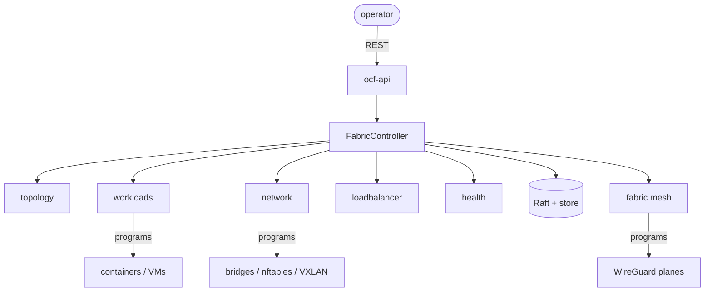

# Core concepts

> The mental model you need before driving the fabric. Approachable on purpose —
> each idea links to the deeper [architecture](../architecture/overview.md) and
> [subsystem](../subsystems/) docs when you want the full story.

Open Compute Fabric (OCF) is **one binary, `ocfd`, that manages a fleet of
machines**: it runs containers and VMs, models the physical topology, programs
host networking, authenticates operators, and keeps its state replicated and
durable. Every machine in the fleet runs the same `ocfd`; together they form one
control plane.

If you remember one thing, remember this split:

The **control plane** decides *what should be true* (this workload runs here,
this subnet exists, this node is dead) and replicates those decisions. The **data
plane** is the real kernel state that makes it so (running containers, bridges,
`nftables` rules, WireGuard interfaces). The control plane *programs* the data
plane; it never pretends — if a host tool is missing, the operation returns an
honest error and the rest keeps running.

---

## The domain model

Everything the fabric manages is a **Resource** with a common shape, so the same
patterns apply whether you're looking at a machine, a workload, or a VPC.

| Concept | What it is |
|---------|-----------|
| **Resource** | Anything with an identity and lifecycle (a machine, workload, VPC, subnet, load balancer). |
| **Metadata** | Every resource has an `id`, a `name`, and free-form `labels` (key/value) used for selection. |
| **Scope** | *Where* in the fleet something is, as a hierarchy: `fleet → region → datacenter → rack → machine`. A scope **contains** the scopes below it. |
| **LifecycleState** | `Pending → Running → …` — where a resource is in its life. |
| **Health** | `Healthy` / `Degraded` / `Unhealthy` — how well it's doing. |

**Labels and selectors** are the connective tissue. A machine labeled `gpu=true`,
a workload that `requires("gpu","true")`, a load balancer that `fronting("app",
"web")`, and an autoscaler watching `app=web` all speak the same language — label
sets matched against selectors. Learn this once and capability placement,
LB-to-workload association, and autoscaling all read the same way.

Deeper: [Architecture → Domain model](../architecture/domain-model.md),
[Scopes & placement](../architecture/scopes-and-placement.md).

---

## Contracts & plugins

Every capability is a Rust **trait** (a "contract"); concrete backends register by
name into a generic registry. The control plane depends only on the trait — so
"Docker vs Podman", "PAM vs Active Directory", "nftables vs iptables" is a
registration choice, not a code change. You'll see this as the `/providers` and
`/runtimes` endpoints listing what's plugged in.

Deeper: [Architecture → Contracts & plugins](../architecture/contracts-and-plugins.md).

---

## The fleet: membership, consensus, persistence

A **node** is one `ocfd` process (usually one machine). Nodes find each other and
track liveness through **membership** (a SWIM-style heartbeat/failure detector):
a peer that goes silent ages `alive → suspect → dead`, and when it dies its
**highly-available** workloads are rescheduled onto a surviving node.

Control-plane *writes* go through **Raft consensus** — a quorum agrees on every
change — and land in a crash-safe local **store**, so state survives both a reboot
and the loss of a node. (Snapshots shipped to a lagging follower are
zstd-compressed.)

Deeper: [Architecture → Distributed control plane](../architecture/distributed-control-plane.md),
[ocf-fabric](../subsystems/ocf-fabric.md), [ocf-consensus](../subsystems/ocf-consensus.md).

---

## The fabric: one identity, three encrypted planes

Nodes talk over an **encrypted mesh**. Each node has a single cryptographic
**identity** (an X25519 keypair); that *same* key is its WireGuard key, so a
node's fabric identity and its network identity are one thing.

Cross-host traffic is segmented into **three isolated WireGuard underlays** — each
its own interface, address space, and port — so management, workload, and ingress
traffic never mix:

| Plane | Interface | Subnet | Carries |
|-------|-----------|--------|---------|
| **Management** | `wg-mgmt` | `10.255.0.0/16` | Control plane: Raft, membership, latency probes, bulk streaming |
| **Workload** | `wg-data` | `10.254.0.0/16` | The tenant VXLAN overlay |
| **Load balancer** | `wg-lb` | `10.253.0.0/16` | LB → backend (ingress) traffic |

Within a plane the mesh is flat (every node can reach every node); **isolation
between tenants lives one layer up**, in the VXLAN VNIs and ACLs (see Networking).

Deeper: [ocf-network → WireGuard underlays](../subsystems/ocf-network.md#wireguard-underlays--three-isolated-encrypted-planes).

---

## Networking: VPCs, subnets, overlay, ingress & egress

The fabric gives tenants a software-defined network:

- A **VPC** is an isolated network — realized as a VXLAN **VNI**. Two VPCs cannot
  see each other even on the same hosts.
- A **Subnet** carves a CIDR within a VPC, realized on each host in a network
  namespace + bridge. **IPAM** hands out addresses automatically when a workload
  attaches.
- The **overlay** (VXLAN) stitches a subnet across hosts, so two workloads on the
  same subnet but different machines share an L2 segment — riding the encrypted
  `wg-data` plane.
- **Ingress** is the **load balancer**: the internet-facing component that accepts
  client connections and distributes them across backends (workloads matching its
  `target_selector`), reaching them over the `wg-lb` plane.
- **Egress** is the opposite direction: a workload opts in to outbound internet,
  and its host masquerades (NAT) it out. Ingress and egress are deliberately
  separate controls.
- **ACLs / firewall policies** segment further within and between subnets.

Deeper: [ocf-network](../subsystems/ocf-network.md),
[ocf-loadbalancer](../subsystems/ocf-loadbalancer.md).

---

## Workloads & placement

A **Workload** is a unit of compute — a container or a VM — described
backend-agnostically. Placement is **constraint-driven**: a workload may declare

- a **scope** (`placement`) — confine it to a region/dc/rack/machine,
- a **capability requirement** (`node_selector`) — only nodes whose labels match
  (e.g. `gpu=true`),
- and **resources** (cpu/memory/disk) that must fit the node's capacity.

A machine is a candidate only when **all three** hold. The same rule governs
**HA reschedule**: when a node dies, a highly-available workload moves only to a
surviving node that still satisfies its constraints. VMs additionally support
**live migration**; container groups support **autoscaling** (scale a label set
up/down on metric thresholds).

Deeper: [ocf-runtime](../subsystems/ocf-runtime.md),
[ocf-runtime → Capability-based placement](../subsystems/ocf-runtime.md#capability-based-placement).

---

## Topology intelligence: latency, reachability, routing

The mesh isn't blind to its own shape:

- **Measured latency** — each node times round-trips to its peers and records the
  RTT, feeding latency-aware routing and the load balancer's `Latency` policy.
- **Reachability** — a node is `public` (dialable), `private` (behind NAT,
  reachable only via a relay), or `relay` (public *and* forwards for others).
- **Weighted routing** — to reach a peer the fabric picks the lowest-cost path:
  direct when possible, otherwise through the **lowest-RTT relay**. This is the
  "fastest path" decision, and it's what lets NAT'd nodes participate.

Deeper: [ocf-fabric → Topology intelligence](../subsystems/ocf-fabric.md#topology-intelligence-latency-reachability--routing).

---

## Health & platform

A modular **health** system lets each node surface problems to the dashboard —
"`ip_forward` not enabled", "netfilter module not loaded", "Docker experimental
off", a missing package — and each finding carries a **fix action** the operator
can trigger. When the fix is "install a package", the **platform** layer detects
the OS and maps the capability to the right package name for that distro's
package manager.

Deeper: [ocf-health](../subsystems/ocf-health.md),
[ocf-platform](../subsystems/ocf-platform.md).

---

## Putting it together

One operator request enters `ocf-api`, the `FabricController` routes it to the
right subsystem, durable changes go through Raft, and the relevant subsystem
programs real kernel state on the affected hosts over the encrypted fabric.

**Next:** put it into practice with the [guided tour](using-the-fabric.md), or go
deep via the [architecture overview](../architecture/overview.md).
