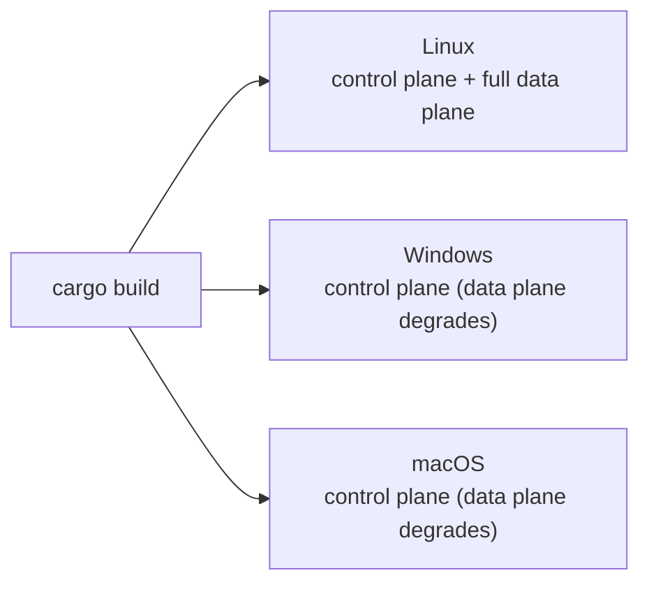

# Installation

> Get the toolchain in place and produce a first build of the workspace.

Open Compute Fabric is a Rust workspace (the control plane + daemon) plus a Nuxt
frontend. You only need the Rust toolchain to build and run the control plane;
Node is only needed if you want to develop or build the web UI. The OS
integration tools listed below are **optional** — they are invoked at runtime by
the corresponding live operations and are not needed to compile or to bring the
control plane up.

## Prerequisites

| Requirement | Version | Needed for |
|-------------|---------|------------|
| **Rust** (with `cargo`) | 1.96+ | Building and running everything (the workspace is on edition 2021) |
| **Node.js** + npm | 22+ | Developing or building the `web/` frontend (optional) |
| **git** | any recent | Cloning the repository |

Install Rust with [rustup](https://rustup.rs/):

```sh
curl --proto '=https' --tlsv1.2 -sSf https://sh.rustup.rs | sh
rustc --version   # should report 1.96 or newer
```

Install Node 22+ from [nodejs.org](https://nodejs.org/) or via your platform's
version manager (`nvm`, `fnm`, `volta`, …).

## Optional host tools (data plane)

OCF's design rule is "**real backends, honest errors**": every OS/network
integration executes the actual tool, and on a host without that tool the
operation returns a clear error while the rest of the control plane keeps
running (see [Architecture → Overview](../architecture/overview.md)). None of
these are required to build OCF or to run the control plane — install only the
ones for the live operations you actually want.

| Subsystem | Host tools it shells out to | Used for |
|-----------|------------------------------|----------|
| [Runtimes](../subsystems/ocf-runtime.md) | `docker` / `podman` / `lxc`, `virsh` (libvirt) | Running container & VM workloads, live migration |
| [Kernel](../subsystems/ocf-kernel.md) | `ip`, `nft` (nftables), `systemctl` | Bridges, IP forwarding, firewall, service reconciliation |
| [Disk](../subsystems/ocf-disk.md) | `lsblk`, `smartctl`, `ledctl` | Disk enumeration, SMART health, LED locate/fault |
| [Inventory](../subsystems/ocf-inventory.md) | `dmidecode`, `ipmitool` | Hardware components, out-of-band power control |
| [Network](../subsystems/ocf-network.md) | `ovs-vsctl`, `ip` | VPC / subnet / route / ACL programming |
| [Load balancer](../subsystems/ocf-loadbalancer.md) | `certbot` (ACME), `curl` (Cloudflare DDNS) | TLS termination/renewal, dynamic DNS |
| [Auth](../subsystems/ocf-auth.md) | `pamtester`, `ldapwhoami`, `useradd` | PAM/AD authentication, host-user sync |

These are Linux-centric. The full data plane is meant to run on Linux; the
control plane itself is cross-platform.

## Cross-platform support



The workspace compiles on Linux, Windows, and macOS. On Linux with the host
tools installed you get the full data plane. On Windows or macOS — or any host
missing a given tool — the workspace still builds and the control plane (topology,
RBAC, load-balancer model, membership, Raft consensus, persistence) comes up
normally; the operations that need an absent tool degrade gracefully with an
honest error rather than fabricating a result.

## Clone and first build

```sh
git clone https://github.com/elycin/open-compute-fabric-rs.git
cd open-compute-fabric-rs
cargo build
```

The first build pulls and compiles all dependencies, so it takes a while; later
builds are incremental. If you hit a "no space left on device" error during the
build, see the disk-space caveat in [Development → Building](../development/building.md).

## Next steps

- [Quickstart](quickstart.md) — run the daemon, hit the API, open the UI.
- [Configuration](configuration.md) — node id, data directory, seeds, bind address.
