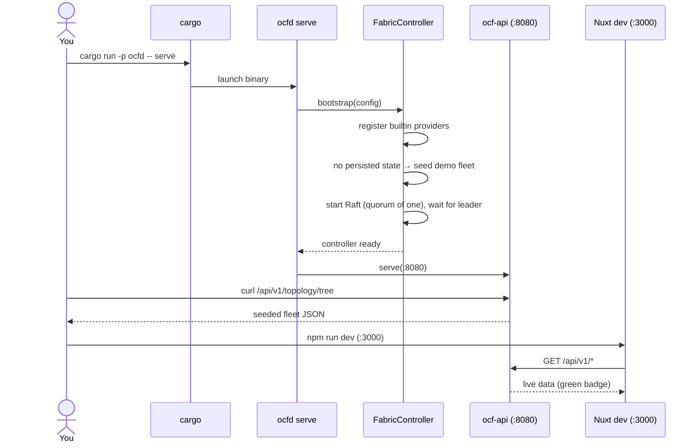

# Quickstart

> From a fresh clone to a running control plane, a few API calls, and the web UI
> in a couple of minutes.

This is the fast path. It assumes you have already installed the toolchain — see
[Installation](installation.md) if not. Everything here runs without any host
tools and without persistence (state lives in memory and is reseeded on restart).

## 1. Build

```sh
cargo build
```

## 2. Run the daemon

```sh
cargo run -p ocfd -- serve
```

This builds one [`FabricController`](../subsystems/ocf-api.md) with every
subsystem's built-in providers registered, seeds a small demo fleet (3 machines,
a couple of workloads, a VPC, two load balancers, and an `admin` RBAC user), and
serves the REST API on **`http://0.0.0.0:8080`**. Because no `--data-dir` was
given, the node runs fully in-memory.

You should see log lines like `building fabric controller`, `no persisted state;
seeding demo fleet`, and `ocf-api listening`.

## 3. Hit a few endpoints

In another terminal:

```sh
# liveness
curl -s http://localhost:8080/api/v1/health

# the seeded fleet as a drill-down tree
curl -s http://localhost:8080/api/v1/topology/tree

# the demo workloads (containers + the HA VM)
curl -s http://localhost:8080/api/v1/workloads
```

For the full surface, see [Reference → REST API](../reference/rest-api.md).

## 4. List the registered plugins

The most direct demonstration that the whole control plane is plugin-driven:

```sh
cargo run -p ocfd -- providers
```

This prints every registered provider per contract — `RuntimeProvider`,
`Authenticator`, `InventoryCollector`, `IpmiController`, `CertificateProvider`,
`DnsProvider`. See [Architecture → Contracts & Plugins](../architecture/contracts-and-plugins.md).

## 5. Run the frontend

```sh
cd web
npm install
npm run dev
```

The Nuxt dev server comes up on **`http://localhost:3000`** and talks to the API
on `:8080`. If the backend is down it **falls back to bundled mock fixtures** and
shows an amber "mock data" badge; with `ocfd serve` running, the badge turns
green "live". See [Frontend → Overview](../frontend/overview.md).

## The flow, end to end



## Next steps

- [Configuration](configuration.md) — persist state, set a node id, join peers.
- [Operations → Deployment](../operations/deployment.md) — run a real multi-node fleet.
