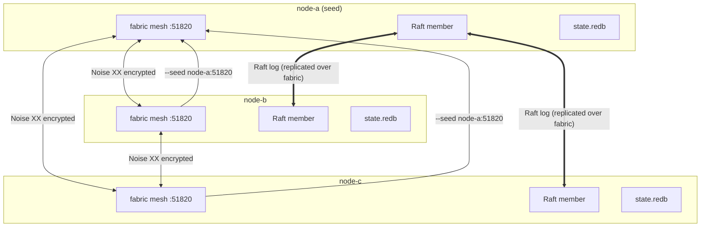

# Deployment

> Running OCF for real: one node or a fleet, where state lives, how the cluster
> forms, and what happens when a node dies.

This page covers operating `ocfd` beyond the in-memory quickstart. For the flags
referenced here, see [Getting Started → Configuration](../getting-started/configuration.md);
for the security model see [Security](security.md).

## Single node vs. multi-node

A **single node** is the simplest deployment and a fully valid one: it forms a
Raft cluster of one (every write still passes through the Raft log before it
lands) and serves the whole API. Give it a data directory so state survives
restarts:

```sh
ocfd --node-id node-a --data-dir /var/lib/ocf serve --bind 0.0.0.0:8080
```

A **multi-node** fleet adds peers that contact one or more seeds to join the
fabric mesh and the replicated control plane:

```sh
# first node (the seed)
ocfd --node-id node-a --data-dir /var/lib/ocf serve

# later nodes point at the seed's mesh endpoint
ocfd --node-id node-b --data-dir /var/lib/ocf --seed node-a:51820 serve
ocfd --node-id node-c --data-dir /var/lib/ocf --seed node-a:51820 serve
```

## The data directory

With `--data-dir DIR`, the node persists to disk under `DIR`:

- **`DIR/state.redb`** — the durable snapshot of control-plane state (machines,
  workloads, networks, load balancers, RBAC), written through
  [`ocf-store`](../subsystems/ocf-store.md)'s redb backend.

On boot, if persisted machines exist the controller **restores** them; otherwise
it seeds the demo fleet and persists it. The node's identity comes from
`--node-id`, which also seeds its Raft node id — keep both `--node-id` and the
data directory stable across restarts so a node rejoins as itself rather than as
a new member.

Without `--data-dir` the node is in-memory: convenient for demos, but every
restart reseeds and nothing survives.

## How a fleet forms



1. **Mesh join.** A new node dials its `--seed` peers on the fabric port
   (`51820`) and establishes encrypted, mutually-authenticated links (X25519 +
   Noise XX — see [Security](security.md) and [`ocf-fabric`](../subsystems/ocf-fabric.md)).
2. **Membership.** Each machine is registered into the SWIM-style membership
   detector. Heartbeats keep peers `Alive`; silence past the configured timeouts
   ages a peer `Alive → Suspect → Dead`. See [`ocf-fabric`](../subsystems/ocf-fabric.md).
3. **Replication.** The control plane is a Raft cluster: writes are committed by a
   **quorum** and applied into each node's `store`; the **leader** orders the log.
   See [`ocf-consensus`](../subsystems/ocf-consensus.md).

## Raft replication of the control plane

Control-plane writes do not go straight to disk. They are proposed to the Raft
log, committed once a quorum of nodes has the entry, and only then applied into
each node's local `store` (reads come from `store`). This gives a single
consistent view of the fleet and prevents split-brain: with a partition, only the
side holding a quorum can commit. A 3-node cluster tolerates one node down; a
5-node cluster tolerates two.

## High availability on node death

When the failure detector declares a node **dead**, the controller runs drop-out
handling for that node's workloads:

- **Highly-available** workloads (`highly_available = true`) are rescheduled onto
  a **surviving, in-scope** node. Placement is honored: a workload with a
  placement [`Scope`](../architecture/scopes-and-placement.md) only lands where
  that scope contains the candidate machine. If no surviving node satisfies the
  scope, the move is logged as an error rather than violating placement.
- **Non-HA** workloads are stopped — they are lost with the node.

In a multi-node fleet, peers heartbeat each other over the encrypted transport,
so a real outage triggers this automatically. In the single-process demo
deployment the seeded machines have no live agents, so failures are injected for
testing via `POST /api/v1/fabric/machines/:id/fail`. See
[`crates/ocf-api/src/fleet.rs`](../subsystems/ocf-api.md) and
[Architecture → Distributed Control Plane](../architecture/distributed-control-plane.md).

## Serving the frontend in production

Build the static assets and point `ocfd` at them so the UI is served same-origin
with the API:

```sh
cd web && npm install && npm run build   # emits web/.output/public
cd ..
ocfd --data-dir /var/lib/ocf serve --static-dir web/.output/public
```

`ocf-api` then serves the built SPA (with an `index.html` fallback) alongside the
REST API — no separate Node server and no CORS proxy in production. See
[Frontend → Overview](../frontend/overview.md).

## Next steps

- [Security](security.md) — crypto, auth, RBAC, secrets, TLS.
- [Development → Building](../development/building.md) — build specifics and caveats.
