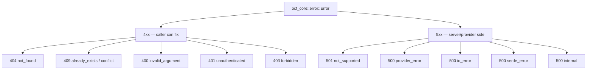

# Error Codes Reference

Every subsystem maps its failures onto one canonical error type,
[`ocf_core::error::Error`](../subsystems/ocf-core.md), so the API layer can
translate any error into a consistent HTTP response without knowing which
subsystem produced it. This page is the lookup table: each variant, its stable
machine-readable `code()`, the HTTP status the API returns, and what it means.

## Error response body

When a handler fails, the API returns the failing status and a JSON body with
exactly two fields:

```json
{
  "code": "not_found",
  "message": "workload a9b8c7d6-5e4f-3021-9182-7a6b5c4d3e2f"
}
```

| Field | Type | Description |
|-------|------|-------------|
| `code` | string | The stable, machine-readable code from `Error::code()`. Safe to match on programmatically — it does not change with the message. |
| `message` | string | The human-readable `Display` of the error (e.g. `"not found: <what>"`). For diagnostics; do not parse it. |

> `code` is the contract; `message` is for humans. Branch on `code`.

## Variant → code → HTTP status

| `Error` variant | `code()` | HTTP status | Meaning |
|-----------------|----------|-------------|---------|
| `NotFound(String)` | `not_found` | `404 Not Found` | The requested resource does not exist (e.g. an unknown workload or machine id). |
| `AlreadyExists(String)` | `already_exists` | `409 Conflict` | Creating a resource that already exists (name/id collision). |
| `Conflict(String)` | `conflict` | `409 Conflict` | The request conflicts with current state (e.g. a concurrent-modification or state-machine conflict). |
| `InvalidArgument(String)` | `invalid_argument` | `400 Bad Request` | A malformed or semantically invalid argument (e.g. an empty DNS zone, a certificate with no domains). |
| `NotSupported(String)` | `not_supported` | `501 Not Implemented` | The operation is not supported by the selected backend/provider (e.g. migrating a workload on a runtime that cannot migrate). |
| `Unauthenticated(String)` | `unauthenticated` | `401 Unauthorized` | The caller's identity could not be established. |
| `Forbidden(String)` | `forbidden` | `403 Forbidden` | The caller is authenticated but not authorized at the requested [scope](../architecture/scopes-and-placement.md) (RBAC denial). |
| `Provider { provider, message }` | `provider_error` | `500 Internal Server Error` | A failure originating inside a named pluggable provider (e.g. `certbot`/`curl` missing or returning an error). The `provider` name is included in the message. |
| `Io(String)` | `io_error` | `500 Internal Server Error` | An underlying I/O failure (filesystem, socket). Produced via `From<std::io::Error>`. |
| `Serde(String)` | `serde_error` | `500 Internal Server Error` | A (de)serialization failure. Produced via `From<serde_json::Error>`. |
| `Internal(String)` | `internal` | `500 Internal Server Error` | A catch-all internal invariant failure that does not fit a more specific variant. |

## Status grouping at a glance



## Notes

- **Where the mapping lives.** The variant → HTTP-status mapping is implemented
  once in [`ocf-api`](../subsystems/ocf-api.md)'s `ApiError::into_response`; the
  variant → `code()` mapping lives on the `Error` type in
  [`ocf-core`](../subsystems/ocf-core.md). The two are independent: several
  variants share the `500` status but each keeps a distinct `code`.
- **Constructors.** Subsystems build these through helper constructors —
  `Error::not_found`, `Error::already_exists`, `Error::invalid`,
  `Error::unsupported`, `Error::forbidden`, `Error::internal`, and
  `Error::provider(provider, message)` — so the right variant (and therefore the
  right code/status) is chosen at the source of the failure.
- **Provider errors.** `Error::Provider` carries the offending provider's name
  (e.g. `cloudflare`, `acme`), and its `Display` reads
  `provider \`<name>\` failed: <message>`. Sensitive material (API tokens) is
  never included in the message.
- **`409` ambiguity.** Both `AlreadyExists` and `Conflict` return `409`; use the
  `code` (`already_exists` vs `conflict`) to tell them apart.

## See also

- [REST API reference](rest-api.md) — which endpoints can return which errors
- [ocf-core](../subsystems/ocf-core.md) — the `Error` type and its constructors
- [ocf-api](../subsystems/ocf-api.md) — the `ApiError` → HTTP translation
- [Request Lifecycle](../architecture/request-lifecycle.md) — where errors are produced and translated
