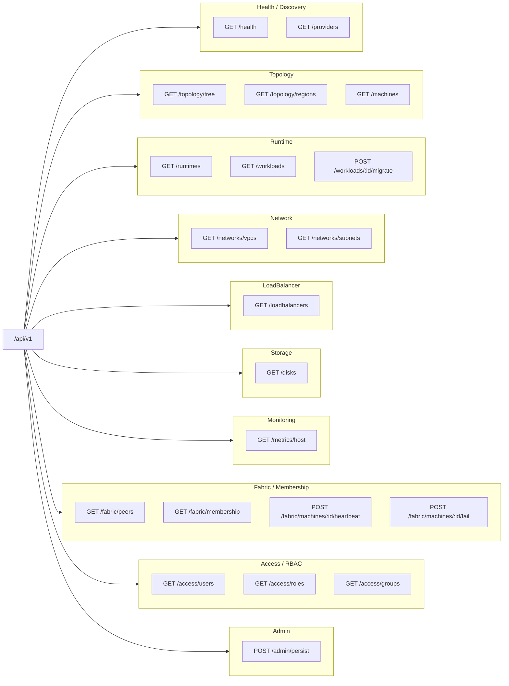

# REST API Reference

The complete HTTP surface of Open Compute Fabric. Every route lives under the
base path `/api/v1` and is served by [`ocf-api`](../subsystems/ocf-api.md); each
handler is a thin adapter that borrows one subsystem off the
[`FabricController`](../subsystems/ocf-api.md) and serializes the result.

- **Base URL:** `/api/v1` (the daemon binds `0.0.0.0:8080` by default — see the
  [CLI reference](cli.md))
- **Content type:** all responses are `application/json`
- **Serialization:** responses are the domain resources serialized as-is. Enums
  serialize as `snake_case` strings (`"running"`, `"virtual_machine"`, `"tcp"`),
  and ids/keys serialize transparently as strings.
- **Errors:** any handler that can fail returns the standard error body
  `{ "code": "...", "message": "..." }`; the codes and their HTTP statuses are
  catalogued in the [Error Codes reference](error-codes.md).

> Most routes are read-only `GET`s; the handful of mutations are `POST`s and
> take **no request body** — the action is fully described by the method, path,
> and path parameter.

## Endpoint summary

| Method | Path | Area | Description |
|--------|------|------|-------------|
| `GET` | `/api/v1/health` | Health/Discovery | Liveness probe + version + subsystem list |
| `GET` | `/api/v1/providers` | Health/Discovery | Every registered plugin provider, grouped by contract |
| `GET` | `/api/v1/runtimes` | Runtime | Registered runtime backends and their capabilities |
| `GET` | `/api/v1/topology/tree` | Topology | The full `region → datacenter → rack → machine` tree |
| `GET` | `/api/v1/topology/regions` | Topology | Flat list of regions |
| `GET` | `/api/v1/machines` | Topology | Every machine across the fleet |
| `GET` | `/api/v1/workloads` | Runtime | Every workload across every runtime backend |
| `POST` | `/api/v1/workloads/:id/migrate` | Runtime | Request live migration of a workload |
| `POST` | `/api/v1/workloads/:id/network` | Runtime | Attach a workload to a subnet (allocates an IP via IPAM) |
| `DELETE` | `/api/v1/workloads/:id/network` | Runtime | Detach a workload from its subnet (releases its IP) |
| `GET` | `/api/v1/workloads/:id/candidates` | Runtime | Nodes a workload can run on (scope + capability + capacity) |
| `GET` | `/api/v1/networks/vpcs` | Network | Every VPC |
| `GET` | `/api/v1/networks/subnets` | Network | Every subnet across every VPC |
| `POST` | `/api/v1/networks/subnets/:id/egress` | Network | Set a subnet's outbound-internet (NAT) capability |
| `GET` | `/api/v1/loadbalancers` | LoadBalancer | Every load balancer |
| `GET` | `/api/v1/loadbalancers/:id/backends` | LoadBalancer | Live backend set resolved from the LB's `target_selector` (on the wg-lb plane) |
| `GET` | `/api/v1/disks` | Storage | Every physical disk across the fleet |
| `GET` | `/api/v1/metrics/host` | Monitoring | Aggregate host resource usage |
| `GET` | `/api/v1/fabric/peers` | Fabric/Membership | Mesh peer records |
| `GET` | `/api/v1/fabric/membership` | Fabric/Membership | Membership table (liveness per node) |
| `GET` | `/api/v1/fabric/wireguard` | Fabric/Membership | Computed WireGuard underlay mesh (VXLAN rides it) |
| `GET` | `/api/v1/fabric/routes` | Fabric/Membership | Planned route to each peer (direct vs relayed, RTT-weighed) |
| `POST` | `/api/v1/fabric/machines/:id/heartbeat` | Fabric/Membership | Keep a node alive |
| `POST` | `/api/v1/fabric/machines/:id/fail` | Fabric/Membership | Force a node dead, reschedule its HA workloads |
| `GET` | `/api/v1/access/users` | Access/RBAC | Every RBAC user |
| `GET` | `/api/v1/access/roles` | Access/RBAC | Every RBAC role |
| `GET` | `/api/v1/access/groups` | Access/RBAC | Every RBAC group |
| `POST` | `/api/v1/admin/persist` | Admin | Snapshot current state to the durable store |
| `GET` | `/api/v1/health/findings` | Health | Fleet-health findings for this node (problems + fixes) |
| `POST` | `/api/v1/health/fix` | Health | Apply a finding's fix action |
| `GET` | `/api/v1/platform` | Health | Host OS, package manager, and per-capability readiness |
| `GET` | `/api/v1/platform/updates` | Health | Pending OS package updates (+ security count) |
| `POST` | `/api/v1/platform/updates/apply` | Health | Apply pending updates (`{security_only}`) |
| `GET` | `/api/v1/platform/vulnerabilities` | Health | Installed packages matching the OSV database |

## Endpoints by subsystem



---

## Health / Discovery

### `GET /api/v1/health`

Liveness probe. Returns a static `ok`, the daemon's crate version, and the list
of wired subsystems. Always succeeds (never returns an error body).

**Response**

```json
{
  "status": "ok",
  "version": "0.1.0",
  "subsystems": [
    "topology",
    "runtime",
    "auth",
    "authz",
    "kernel",
    "inventory",
    "disk",
    "monitoring",
    "fabric",
    "network",
    "loadbalancer"
  ]
}
```

### `GET /api/v1/providers`

Every pluggable provider registered across the control plane, grouped by the
contract it implements. This is the most direct demonstration that the whole
fabric is plugin-driven (see [Contracts & Plugins](../architecture/contracts-and-plugins.md)).
The groups are, in order: `RuntimeProvider`, `Authenticator`,
`InventoryCollector`, `IpmiController`, `CertificateProvider`, `DnsProvider`.

**Response**

```json
[
  {
    "contract": "RuntimeProvider",
    "providers": [
      { "name": "docker", "description": "Docker/OCI container runtime (drives the docker CLI)" },
      { "name": "qemu", "description": "QEMU/KVM virtual machine runtime (drives virsh/libvirt)" }
    ]
  },
  {
    "contract": "Authenticator",
    "providers": [
      { "name": "local", "description": "In-memory username/password authenticator" }
    ]
  },
  {
    "contract": "InventoryCollector",
    "providers": [
      { "name": "sysfs", "description": "Linux sysfs/DMI hardware inventory collector" }
    ]
  },
  {
    "contract": "IpmiController",
    "providers": [
      { "name": "ipmitool", "description": "BMC controller (drives the ipmitool CLI)" }
    ]
  },
  {
    "contract": "CertificateProvider",
    "providers": [
      { "name": "letsencrypt", "description": "ACME / Let's Encrypt certificate provider (drives certbot)" }
    ]
  },
  {
    "contract": "DnsProvider",
    "providers": [
      { "name": "cloudflare", "description": "Cloudflare authoritative DNS provider (Cloudflare v4 API over HTTPS)" }
    ]
  }
]
```

> The `name`/`description` strings come from each provider's own
> `Provider::name()` / `Provider::description()`. The provider lists above are
> illustrative of the built-ins; the exact set reflects whatever is registered.

---

## Topology

See [ocf-topology](../subsystems/ocf-topology.md) for the resource model.

### `GET /api/v1/topology/tree`

The full fleet as a nested tree, the shape the frontend drill-down view
consumes:
`{ regions: [ { region, datacenters: [ { datacenter, racks: [ { rack, machines } ] } ] } ] }`.

**Response**

```json
{
  "regions": [
    {
      "region": {
        "metadata": {
          "id": "us-east",
          "name": "us-east",
          "labels": {},
          "annotations": {},
          "created_at": "2026-06-20T12:00:00Z",
          "updated_at": "2026-06-20T12:00:00Z"
        },
        "locality": "us-east"
      },
      "datacenters": [
        {
          "datacenter": {
            "metadata": {
              "id": "dc-1",
              "name": "dc-1",
              "labels": {},
              "annotations": {},
              "created_at": "2026-06-20T12:00:00Z",
              "updated_at": "2026-06-20T12:00:00Z"
            },
            "region_id": "us-east",
            "address": ""
          },
          "racks": [
            {
              "rack": {
                "metadata": {
                  "id": "rack-a1",
                  "name": "rack-a1",
                  "labels": {},
                  "annotations": {},
                  "created_at": "2026-06-20T12:00:00Z",
                  "updated_at": "2026-06-20T12:00:00Z"
                },
                "region_id": "us-east",
                "datacenter_id": "dc-1",
                "units": 42
              },
              "machines": [
                {
                  "metadata": {
                    "id": "node-1",
                    "name": "node-1",
                    "labels": {},
                    "annotations": {},
                    "created_at": "2026-06-20T12:00:00Z",
                    "updated_at": "2026-06-20T12:00:00Z"
                  },
                  "region_id": "us-east",
                  "datacenter_id": "dc-1",
                  "rack_id": "rack-a1",
                  "rack_position": 1,
                  "fabric_address": "10.0.0.1",
                  "capacity": {
                    "cpu_millis": 32000,
                    "memory_bytes": 137438953472,
                    "disk_bytes": 2199023255552
                  },
                  "state": "running",
                  "health": "healthy"
                }
              ]
            }
          ]
        }
      ]
    }
  ]
}
```

### `GET /api/v1/topology/regions`

A flat list of every [`Region`](../subsystems/ocf-topology.md). Same `region`
object as nested inside the tree.

**Response**

```json
[
  {
    "metadata": {
      "id": "us-east",
      "name": "us-east",
      "labels": {},
      "annotations": {},
      "created_at": "2026-06-20T12:00:00Z",
      "updated_at": "2026-06-20T12:00:00Z"
    },
    "locality": "us-east"
  }
]
```

### `GET /api/v1/machines`

Every [`Machine`](../subsystems/ocf-topology.md) in the fleet, flattened across
all racks. `capacity` is a [`ResourceSpec`](../architecture/domain-model.md)
(`cpu_millis`, `memory_bytes`, `disk_bytes`); `state` is a `snake_case`
`LifecycleState`; `health` is a `snake_case` `Health`.

**Response**

```json
[
  {
    "metadata": {
      "id": "node-1",
      "name": "node-1",
      "labels": {},
      "annotations": {},
      "created_at": "2026-06-20T12:00:00Z",
      "updated_at": "2026-06-20T12:00:00Z"
    },
    "region_id": "us-east",
    "datacenter_id": "dc-1",
    "rack_id": "rack-a1",
    "rack_position": 1,
    "fabric_address": "10.0.0.1",
    "capacity": {
      "cpu_millis": 32000,
      "memory_bytes": 137438953472,
      "disk_bytes": 2199023255552
    },
    "state": "running",
    "health": "healthy"
  }
]
```

---

## Runtime

See [ocf-runtime](../subsystems/ocf-runtime.md).

### `GET /api/v1/runtimes`

The registered runtime backends and their capabilities. `kind` is `"container"`
or `"virtual_machine"`; `supports_migration` reflects whether the backend can
live-migrate a workload.

**Response**

```json
[
  {
    "name": "docker",
    "description": "Docker/OCI container runtime (drives the docker CLI)",
    "kind": "container",
    "supports_migration": false
  },
  {
    "name": "qemu",
    "description": "QEMU/KVM virtual machine runtime (drives virsh/libvirt)",
    "kind": "virtual_machine",
    "supports_migration": true
  }
]
```

### `GET /api/v1/workloads`

Every [`Workload`](../subsystems/ocf-runtime.md) collected across every runtime
backend. `kind` is `"container"` or `"virtual_machine"`; `state` is a
`snake_case` `LifecycleState`; `node` is the placed machine's id (or `null`);
`placement` is an optional [`Scope`](../architecture/scopes-and-placement.md)
(omitted fields mean "any" at that level).

**Response**

```json
[
  {
    "metadata": {
      "id": "f0b1c2d3-4e5f-6071-8293-a4b5c6d7e8f9",
      "name": "web-1",
      "labels": { "app": "web" },
      "annotations": {},
      "created_at": "2026-06-20T12:00:00Z",
      "updated_at": "2026-06-20T12:00:00Z"
    },
    "kind": "container",
    "image": "nginx:1.27",
    "resources": {
      "cpu_millis": 500,
      "memory_bytes": 268435456,
      "disk_bytes": 0
    },
    "state": "running",
    "node": "node-1",
    "highly_available": false,
    "placement": null,
    "env": {}
  },
  {
    "metadata": {
      "id": "a9b8c7d6-5e4f-3021-9182-7a6b5c4d3e2f",
      "name": "db-1",
      "labels": {},
      "annotations": {},
      "created_at": "2026-06-20T12:00:00Z",
      "updated_at": "2026-06-20T12:00:00Z"
    },
    "kind": "virtual_machine",
    "image": "debian-12.qcow2",
    "resources": {
      "cpu_millis": 4000,
      "memory_bytes": 8589934592,
      "disk_bytes": 68719476736
    },
    "state": "running",
    "node": "node-3",
    "highly_available": true,
    "placement": null,
    "env": {}
  }
]
```

### `POST /api/v1/workloads/:id/migrate`

Request live migration of a workload.

| Path param | Description |
|------------|-------------|
| `id` | The workload id (its `metadata.id`). |

Finds the backend currently holding the workload; if that backend is
migration-capable the migration is acknowledged (the move itself is driven by
the runtime's `Migrator`). Returns **`404 Not Found`** if no backend holds the
workload.

**Response (migratable backend)**

```json
{
  "accepted": true,
  "workload": "a9b8c7d6-5e4f-3021-9182-7a6b5c4d3e2f",
  "backend": "qemu",
  "migratable": true,
  "message": "migration of a9b8c7d6-5e4f-3021-9182-7a6b5c4d3e2f scheduled"
}
```

**Response (non-migratable backend)**

```json
{
  "accepted": false,
  "workload": "f0b1c2d3-4e5f-6071-8293-a4b5c6d7e8f9",
  "backend": "docker",
  "migratable": false,
  "message": "backend `docker` cannot migrate this workload"
}
```

### `POST /api/v1/workloads/:id/network`

Attach a workload to an SDN subnet. The controller **allocates an address from
the subnet via IPAM** (skipping `.0`/`.1`/broadcast), records the binding, and —
if `egress` is `true` and the subnet is `Nat` — adds the address to the subnet's
egress allow-list. The binding is persisted (the runtime providers are
stateless). See [ocf-network → IPAM](../subsystems/ocf-network.md#ipam--per-subnet-address-allocation).

**Request body**

```json
{ "subnet_id": "web", "egress": true }
```

`egress` defaults to `false` (internal-only). An unknown `subnet_id` → `404`.

**Response** — the resulting [`NetworkAttachment`](../subsystems/ocf-runtime.md):

```json
{ "subnet_id": "web", "egress": true, "address": "10.0.1.2" }
```

### `DELETE /api/v1/workloads/:id/network`

Detach a workload: release its allocated address back to the subnet pool and
re-program the egress allow-list. Idempotent (no-op if not attached).

**Response**

```json
{ "detached": true }
```

---

## Network

See [ocf-network](../subsystems/ocf-network.md).

### `GET /api/v1/networks/vpcs`

Every [`Vpc`](../subsystems/ocf-network.md). `cidr` is the address space; `vni`
is the VXLAN Network Identifier isolating the overlay.

**Response**

```json
[
  {
    "metadata": {
      "id": "tenant-a",
      "name": "tenant-a",
      "labels": {},
      "annotations": {},
      "created_at": "2026-06-20T12:00:00Z",
      "updated_at": "2026-06-20T12:00:00Z"
    },
    "cidr": "10.0.0.0/16",
    "vni": 1001
  }
]
```

### `GET /api/v1/networks/subnets`

Every [`Subnet`](../subsystems/ocf-network.md) across every VPC, flattened.
`vpc_id` links back to the owning VPC; `netns` names the Linux network namespace
hosting the subnet's dataplane.

**Response**

```json
[
  {
    "metadata": {
      "id": "web",
      "name": "web",
      "labels": {},
      "annotations": {},
      "created_at": "2026-06-20T12:00:00Z",
      "updated_at": "2026-06-20T12:00:00Z"
    },
    "vpc_id": "tenant-a",
    "cidr": "10.0.1.0/24",
    "netns": "ns-web",
    "egress": "nat"
  },
  {
    "metadata": {
      "id": "db",
      "name": "db",
      "labels": {},
      "annotations": {},
      "created_at": "2026-06-20T12:00:00Z",
      "updated_at": "2026-06-20T12:00:00Z"
    },
    "vpc_id": "tenant-a",
    "cidr": "10.0.2.0/24",
    "netns": "ns-db",
    "egress": "isolated"
  }
]
```

`egress` is the subnet's outbound-internet capability: `"isolated"` (internal
only, the default) or `"nat"` (public — source-NAT to the internet). See
[ocf-network → Egress](../subsystems/ocf-network.md#egress-outbound-internet--nat).

### `POST /api/v1/networks/subnets/:id/egress`

Set a subnet's outbound-internet capability. When set to `nat` the host dataplane
is (re)programmed with IP forwarding + a masquerade of the subnet CIDR out the
default uplink, gated to the workloads that opted in; `isolated` tears it down.
The capability is recorded even if a host can't program its dataplane right now.
Inbound connections are unaffected — those are the load balancer's job.

**Request body**

```json
{ "mode": "nat" }
```

`mode` is `"nat"` or `"isolated"` (case-insensitive). Any other value → `400`.

**Response** — the updated [`Subnet`](../subsystems/ocf-network.md):

```json
{
  "metadata": { "id": "web", "name": "web", "labels": {}, "annotations": {},
    "created_at": "2026-06-20T12:00:00Z", "updated_at": "2026-06-21T09:30:00Z" },
  "vpc_id": "tenant-a",
  "cidr": "10.0.1.0/24",
  "netns": "ns-web",
  "egress": "nat"
}
```

---

## LoadBalancer

See [ocf-loadbalancer](../subsystems/ocf-loadbalancer.md).

### `GET /api/v1/loadbalancers`

Every [`LoadBalancer`](../subsystems/ocf-loadbalancer.md). `kind` is `"tcp"`
(layer-4) or `"application"` (layer-7); `policy` is one of `"round_robin"`,
`"least_load"`, `"latency"`, `"geo"`; each `listener` has a `port` and a `tls`
flag; `placement` is an optional [`Scope`](../architecture/scopes-and-placement.md).

**Response**

```json
[
  {
    "metadata": {
      "id": "web-https",
      "name": "web-https",
      "labels": {},
      "annotations": {},
      "created_at": "2026-06-20T12:00:00Z",
      "updated_at": "2026-06-20T12:00:00Z"
    },
    "kind": "application",
    "listeners": [ { "port": 443, "tls": true } ],
    "target_selector": { "app": "web" },
    "policy": "latency",
    "placement": null,
    "anycast": false,
    "hostnames": [ "app.example.com" ]
  },
  {
    "metadata": {
      "id": "db-tcp",
      "name": "db-tcp",
      "labels": {},
      "annotations": {},
      "created_at": "2026-06-20T12:00:00Z",
      "updated_at": "2026-06-20T12:00:00Z"
    },
    "kind": "tcp",
    "listeners": [ { "port": 5432, "tls": false } ],
    "target_selector": {},
    "policy": "least_load",
    "placement": null,
    "anycast": false,
    "hostnames": []
  }
]
```

The `target_selector` is the label set this LB fronts — the same set an autoscaler
governs, so an LB and its autoscaling group are associated by sharing it.

### `GET /api/v1/loadbalancers/:id/backends`

The LB's **live backend set**, resolved from its `target_selector`: the scheduled
workloads whose labels match, each addressed at its hosting node's **wg-lb** plane
address, with measured RTT stamped (for the `Latency` policy). The set follows the
autoscaling group as it scales.

**Response**

```json
[
  { "workload_id": "web-1", "address": "10.253.0.3:0",
    "scope": { "level": "machine", "id": "node-3" },
    "load": 0.0, "latency_ms": 0.42, "geo": null }
]
```

---

## Storage

See [ocf-disk](../subsystems/ocf-disk.md).

### `GET /api/v1/disks`

Every [`PhysicalDisk`](../subsystems/ocf-disk.md) across every machine. A machine
whose disks cannot be enumerated (no `lsblk`, not reachable) is skipped rather
than failing the whole sweep. `health` is a `snake_case` `DiskHealth`
(`"ok"`, `"warning"`, `"failing"`, `"unknown"`); `rma_date`, `enclosure`, and
`slot` are omitted when unset.

**Response**

```json
[
  {
    "metadata": {
      "id": "S/N-A00000",
      "name": "S/N-A00000",
      "labels": {},
      "annotations": {},
      "created_at": "2026-06-20T12:00:00Z",
      "updated_at": "2026-06-20T12:00:00Z"
    },
    "machine_id": "node-1",
    "dev_path": "/dev/sda",
    "serial": "S/N-A00000",
    "wwn": null,
    "model": "OCF-NVMe-3840",
    "vendor": "OpenCompute",
    "size_bytes": 3840000000000,
    "health": "ok",
    "first_seen": "2026-06-20T12:00:00Z",
    "enclosure": "enc-0",
    "slot": 0
  },
  {
    "metadata": {
      "id": "S/N-C10021",
      "name": "S/N-C10021",
      "labels": {},
      "annotations": {},
      "created_at": "2026-06-20T12:00:00Z",
      "updated_at": "2026-06-20T12:00:00Z"
    },
    "machine_id": "node-3",
    "dev_path": "/dev/sdb",
    "serial": "S/N-C10021",
    "wwn": null,
    "model": "OCF-NVMe-3840",
    "vendor": "OpenCompute",
    "size_bytes": 3840000000000,
    "health": "warning",
    "first_seen": "2026-06-20T12:00:00Z",
    "enclosure": "enc-0",
    "slot": 5
  }
]
```

---

## Monitoring

See [ocf-monitoring](../subsystems/ocf-monitoring.md).

### `GET /api/v1/metrics/host`

The aggregate host [`ResourceUsage`](../subsystems/ocf-monitoring.md) across the
fleet. `cpu_pct` is a 0..=100 percentage; memory/disk fields are byte counts;
network rates are bits-per-second; IOPS are operations-per-second.

**Response**

```json
{
  "cpu_pct": 37.5,
  "memory_used": 51539607552,
  "memory_total": 137438953472,
  "disk_used": 1099511627776,
  "disk_total": 2199023255552,
  "net_rx_bps": 1048576,
  "net_tx_bps": 524288,
  "read_iops": 1200,
  "write_iops": 800
}
```

---

## Fabric / Membership

See [ocf-fabric](../subsystems/ocf-fabric.md) and the
[Distributed Control Plane](../architecture/distributed-control-plane.md)
architecture doc.

### `GET /api/v1/fabric/peers`

The mesh's [`FabricNode`](../subsystems/ocf-fabric.md) records — what a peer
needs to reach another node. `node_id` is the mesh-level handle; `public_key` is
the node's X25519 public key, serialized as a byte array; `endpoints` are the
dialable mesh addresses; `last_seen` is an RFC 3339 timestamp.

**Response**

```json
[
  {
    "node_id": "node-1",
    "machine_id": "node-1",
    "public_key": [ 2, 122, 41, 7, 88, 201, 17, 64, 9, 233, 12, 5, 240, 199, 1, 88, 44, 9, 211, 7, 99, 130, 5, 6, 200, 41, 9, 33, 71, 8, 91, 12 ],
    "endpoints": [ "10.0.0.1:51820" ],
    "last_seen": "2026-06-20T12:00:00Z"
  }
]
```

### `GET /api/v1/fabric/membership`

The membership table: one row per fleet member. `liveness` is a `snake_case`
[`Liveness`](../subsystems/ocf-fabric.md) (`"alive"`, `"suspect"`, `"dead"`,
`"left"`); `reachability` is `"public"`/`"private"`/`"relay"`; `rtt_ms` is the
last **measured** round-trip latency to the peer (`null` until probed);
`last_heartbeat` is an RFC 3339 timestamp.

**Response**

```json
[
  {
    "node_id": "node-1",
    "machine_id": "node-1",
    "liveness": "alive",
    "reachability": "relay",
    "rtt_ms": 0.42,
    "last_heartbeat": "2026-06-20T12:00:00+00:00"
  },
  {
    "node_id": "node-2",
    "machine_id": "node-2",
    "liveness": "alive",
    "reachability": "private",
    "rtt_ms": null,
    "last_heartbeat": "2026-06-20T11:59:48+00:00"
  }
]
```

### `GET /api/v1/fabric/routes`

The route from this node to every peer, computed over the fabric
[`RouteGraph`](../subsystems/ocf-fabric.md#topology-intelligence-latency-reachability--routing)
(shortest path weighed by gossiped RTTs). `route` is `"direct"`, `"relayed"`
(reached through the next-hop relay `via`, with the full `hops` path), or
`"unreachable"`. Shown here from a `private` node toward another `private` node,
which bounces through the relay:

```json
[
  { "target": "node-1", "machine_id": "node-1", "reachability": "relay",
    "route": "direct", "via": null, "hops": [] },
  { "target": "node-3", "machine_id": "node-3", "reachability": "private",
    "route": "relayed", "via": "node-1", "hops": ["node-1", "node-3"] }
]
```

### `GET /api/v1/workloads/:id/candidates`

The machines a workload can be (re)scheduled onto, given its `node_selector`
(required node capabilities), placement scope, and capacity.

**Response**

```json
{
  "workload": "gpu-job",
  "node_selector": { "gpu": "true" },
  "candidates": [ { "id": "…", "name": "node-3" } ]
}
```

### `GET /api/v1/fabric/wireguard`

The computed **WireGuard underlay planes**: this node and its peers on each of
the three isolated planes — `wg-mgmt` (control), `wg-data` (workload VXLAN), and
`wg-lb` (load balancer). Each peer entry carries its WireGuard public key (base64
Curve25519, derived from the node's fabric identity), its overlay address on that
plane, and its real underlay `endpoint`. Tenant isolation stays in the VXLAN
VNIs / ACLs over `wg-data` (see
[ocf-network → WireGuard underlays](../subsystems/ocf-network.md#wireguard-underlays--three-isolated-encrypted-planes)).

**Response**

Each peer also reports its `reachability` and the **reachability-aware** WireGuard
config: `endpoint` is `null` when it is roam-learned (a NAT'd peer that
reverse-connects), and `keepalive` is non-zero when *this* node holds a mapping
open (see [ocf-network → Reachability-aware peering](../subsystems/ocf-network.md#reachability-aware-peering--reverse-connect-for-natd-nodes)).

Shown from `node-2` (private): the relay `node-1` is pinned with keepalive 25
(node-2 dials out and holds its NAT mapping), while the other private node
`node-3` has `endpoint: null` (it reverse-connects / is reached via the relay).

```json
{
  "node": "node-2",
  "reachability": "private",
  "public_key": "nOjMzMr58+b6g8QE9Qj82w4IaoEmW5QAGI8CiRUHbF0=",
  "planes": [
    {
      "iface": "wg-mgmt", "purpose": "control",
      "node_ip": "10.255.0.2", "port": 51820,
      "peers": [
        { "name": "node-1", "wg_ip": "10.255.0.1", "reachability": "relay",
          "endpoint": "10.0.0.1:51820", "keepalive": 25,
          "public_key": "0SqA+ka2sZVRFmhvkj0Zb9sPAg3k5G6YKkdKeV1UAjE=" },
        { "name": "node-3", "wg_ip": "10.255.0.3", "reachability": "private",
          "endpoint": null, "keepalive": 0,
          "public_key": "ZsHkQzWYN26TVHPLM/VM3Dgo+AUPwI5l6fbi68VXNHg=" }
      ]
    },
    { "iface": "wg-data", "purpose": "workload", "node_ip": "10.254.0.2", "port": 51821, "peers": [] },
    { "iface": "wg-lb", "purpose": "load-balancer", "node_ip": "10.253.0.2", "port": 51822, "peers": [] }
  ]
}
```

### `POST /api/v1/fabric/machines/:id/heartbeat`

Record a heartbeat for the member backing a machine, reviving a suspected node.

| Path param | Description |
|------------|-------------|
| `id` | The machine id whose backing member should be heartbeated. |

`revived` is `true` if the heartbeat brought a previously-suspected member back
to `alive`, `false` otherwise (including an unknown machine).

**Response**

```json
{ "revived": true }
```

### `POST /api/v1/fabric/machines/:id/fail`

Force a node dead and run drop-out handling — reschedules its highly-available
workloads onto surviving in-scope nodes and stops the rest.

| Path param | Description |
|------------|-------------|
| `id` | The machine id to force dead. |

Returns the human-readable list of rescheduled workloads (`"<workload> -> <target>"`).
Returns **`404 Not Found`** if no member backs the machine.

**Response**

```json
{ "rescheduled": [ "db-1 -> node-2" ] }
```

---

## Access / RBAC

See [ocf-authz](../subsystems/ocf-authz.md).

### `GET /api/v1/access/users`

Every RBAC [`User`](../subsystems/ocf-authz.md). `groups` lists the names of the
groups the user statically belongs to.

**Response**

```json
[
  {
    "metadata": {
      "id": "admin",
      "name": "admin",
      "labels": {},
      "annotations": {},
      "created_at": "2026-06-20T12:00:00Z",
      "updated_at": "2026-06-20T12:00:00Z"
    },
    "username": "admin",
    "groups": [ "admins" ]
  }
]
```

### `GET /api/v1/access/roles`

Every RBAC [`Role`](../subsystems/ocf-authz.md). `permissions` is a set of
permission tokens; the seeded `Administrator` role holds the wildcard `"*"`.

**Response**

```json
[
  {
    "metadata": {
      "id": "Administrator",
      "name": "Administrator",
      "labels": {},
      "annotations": {},
      "created_at": "2026-06-20T12:00:00Z",
      "updated_at": "2026-06-20T12:00:00Z"
    },
    "permissions": [ "*" ]
  },
  {
    "metadata": {
      "id": "Auditor",
      "name": "Auditor",
      "labels": {},
      "annotations": {},
      "created_at": "2026-06-20T12:00:00Z",
      "updated_at": "2026-06-20T12:00:00Z"
    },
    "permissions": [ "audit.read", "lb.read", "sys.read", "vpc.read", "workload.read" ]
  }
]
```

### `GET /api/v1/access/groups`

Every RBAC [`Group`](../subsystems/ocf-authz.md). `members` lists member
usernames.

**Response**

```json
[
  {
    "metadata": {
      "id": "admins",
      "name": "admins",
      "labels": {},
      "annotations": {},
      "created_at": "2026-06-20T12:00:00Z",
      "updated_at": "2026-06-20T12:00:00Z"
    },
    "members": [ "admin" ]
  }
]
```

---

## Admin

### `POST /api/v1/admin/persist`

Snapshot the current in-memory state to the durable store
(`data_dir/state.redb` when a [data directory](configuration.md) is configured;
a no-op write-through to the in-memory store otherwise).

**Response**

```json
{ "persisted": true }
```

---

## Health (fleet checks)

The modular fleet-health system. See [`ocf-health`](../subsystems/ocf-health.md).
**Distinct from `GET /api/v1/health`** (the liveness probe under Health/Discovery).

### `GET /api/v1/health/findings`

Run every registered [health check](../subsystems/ocf-health.md#built-in-checks)
against this node and return the findings (problems), worst severity first. Each
finding carries the [`FixAction`](../subsystems/ocf-health.md#fixaction)s the user
can press. An empty array means all checks pass (or can't be assessed on this
host). `category` is `kernel`/`network`/`runtime`/`storage`/`other`; `severity`
is `info`/`warning`/`critical`.

**Response**

```json
[
  {
    "id": "ip-forwarding:node-local:disabled",
    "check": "ip-forwarding",
    "category": "kernel",
    "machine_id": "node-local",
    "severity": "warning",
    "title": "IP forwarding not enabled on kernel",
    "detail": "net.ipv4.ip_forward is 0. The node cannot route between subnets …",
    "fixes": [
      {
        "id": "enable-ipv4-forwarding",
        "label": "Enable IP forwarding",
        "description": "Writes 1 to /proc/sys/net/ipv4/ip_forward on this node.",
        "requires_root": true
      }
    ],
    "detected_at": "2026-06-21T18:45:28Z"
  }
]
```

### `POST /api/v1/health/fix`

Apply a finding's fix. The fix is routed to the check that advertised it and run
on this node.

**Request body**

```json
{ "check": "ip-forwarding", "fix": "enable-ipv4-forwarding" }
```

**Response**

```json
{ "applied": true, "outcome": "IPv4 forwarding enabled (net.ipv4.ip_forward = 1)." }
```

An unknown `check` or `fix` → `404`; a fix command that fails (no root, tool
absent, not Linux) → `500` with the real error message.

### `GET /api/v1/platform`

The detected host OS, the package manager selected for it, and per-capability
readiness (which required tools are present, and the package that would install
each missing one). See [`ocf-platform`](../subsystems/ocf-platform.md).

**Response** (a Linux host with apt)

```json
{
  "os": { "os": "linux", "distro": "ubuntu", "id_like": ["debian"], "pretty": "Ubuntu 24.04 LTS" },
  "active_manager": "apt",
  "capabilities": [
    { "name": "nftables", "binary": "nft", "present": true, "package": "nftables" },
    { "name": "iproute2", "binary": "ip", "present": true, "package": "iproute2" },
    { "name": "openvswitch", "binary": "ovs-vsctl", "present": false, "package": "openvswitch-switch" }
  ]
}
```

### `GET /api/v1/platform/updates`

Pending OS package updates, with how many are **security** updates. `manager` is
`null` on a host with no supported package manager (then `total`/`security` are 0).

```json
{
  "manager": "apt",
  "total": 12,
  "security": 3,
  "updates": [
    { "name": "openssl", "current_version": "3.0.2-0ubuntu1.10",
      "available_version": "3.0.2-0ubuntu1.15", "security": true }
  ]
}
```

### `POST /api/v1/platform/updates/apply`

Apply pending updates. Body `{ "security_only": true }` installs only security
updates (apt/dnf); `false` (or omitted) applies all. Needs root on the host.

```json
{ "applied": "Applied 3 security update(s) via apt-get." }
```

`409`/`500` with a clear message when there's no package manager or the command
fails (no root, etc.).

### `GET /api/v1/platform/vulnerabilities`

Installed packages that match a known vulnerability in the **OSV** database
([osv.dev](https://osv.dev)). Empty when there's no package manager, the distro
isn't tracked by OSV, or nothing installed is known-vulnerable.

```json
[
  { "name": "openssl", "version": "3.0.2-0ubuntu1.10",
    "vuln_ids": ["CVE-2022-0778", "OSV-2022-189"] }
]
```

On a host with no supported package manager (e.g. Windows), `active_manager` is
omitted and each capability's `package` is omitted; missing tools are reported
but not offered as installable.

---

## See also

- [CLI reference](cli.md) — how to start the daemon that serves this API
- [Configuration reference](configuration.md) — bind address, data directory, env vars
- [Error Codes reference](error-codes.md) — the `code`/HTTP-status mapping for failures
- [Request Lifecycle](../architecture/request-lifecycle.md) — how a call flows through the system
- [Frontend → API Client](../frontend/api-client.md) — how the UI consumes these endpoints
