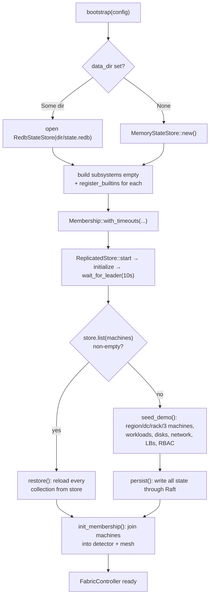
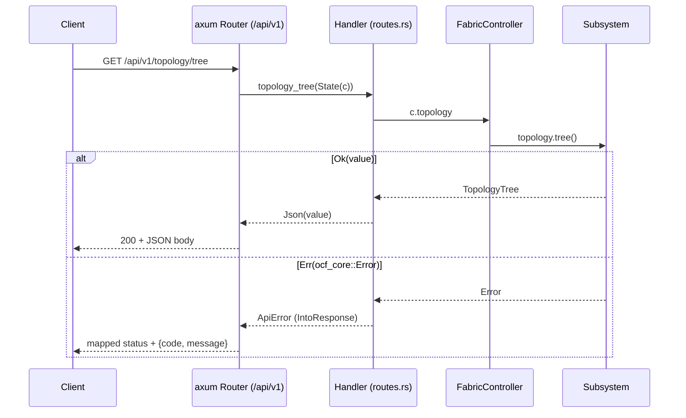
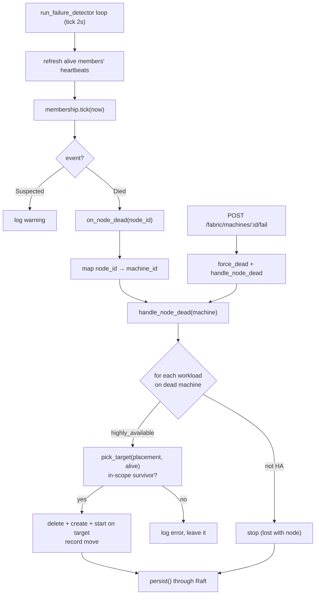

# ocf-api

> The HTTP control surface of the fabric: the `FabricController` that owns every subsystem in one struct, the bootstrap that restores-or-seeds it, the Raft-routed persistence, the membership/failure-detector loop, and the axum REST router.

| | |
|---|---|
| **Source** | `crates/ocf-api/src/` (`lib.rs`, `config.rs`, `controller.rs`, `dto.rs`, `error.rs`, `routes.rs`, `fleet.rs`, `persist.rs`) |
| **Depends on** | [`ocf-core`](ocf-core.md) (prelude: `Error`/`Result`, `Id`, `Metadata`, `ResourceSpec`, `Registry`/`Provider`, `Scope`, `LifecycleState`, `Health`), **every** subsystem crate ([`ocf-topology`](ocf-topology.md), [`ocf-runtime`](ocf-runtime.md), [`ocf-auth`](ocf-auth.md), [`ocf-authz`](ocf-authz.md), [`ocf-kernel`](ocf-kernel.md), [`ocf-inventory`](ocf-inventory.md), [`ocf-disk`](ocf-disk.md), [`ocf-monitoring`](ocf-monitoring.md), [`ocf-fabric`](ocf-fabric.md), [`ocf-network`](ocf-network.md), [`ocf-loadbalancer`](ocf-loadbalancer.md), [`ocf-store`](ocf-store.md), [`ocf-consensus`](ocf-consensus.md)), `axum`, `tower-http`, `tokio`, `serde`/`serde_json`, `chrono`, `tracing` |
| **Used by** | [`ocfd`](ocfd.md) — the only consumer; it builds one [`FabricController`](#the-fabriccontroller) and hands it to [`serve`](#librs-build_app--serve) |

## Overview

`ocf-api` is where the fabric stops being a pile of independent, pluggable
contracts and becomes one running control plane. It contributes three things:

1. **[`FabricController`](#the-fabriccontroller)** (`controller.rs`) — the single
   object that owns every subsystem service (or its plugin
   [`Registry`](ocf-core.md#registry)) behind one struct. The whole rest of the
   application borrows subsystems off this one value.
2. **The REST surface** (`routes.rs`, `dto.rs`, `error.rs`) — an
   [`axum`](https://docs.rs/axum) `Router` of thin handlers, each of which
   borrows one subsystem, calls one method, and serializes the result. Errors are
   the canonical [`ocf_core::Error`](ocf-core.md#error) mapped to HTTP status
   codes.
3. **The cluster behaviors** (`fleet.rs`, `persist.rs`) — membership, the
   failure-detector loop, HA rescheduling on node death, and snapshot
   persistence routed **through Raft** before it lands in the durable store.

The crate root (`lib.rs`) wires those together into an application: [`build_app`](#librs-build_app--serve)
assembles the router, request tracing, permissive CORS, and an optional static
frontend; [`serve`](#librs-build_app--serve) binds a socket, spawns the failure
detector, and runs the server.

A defining property: the controller comes up **even on a host without `docker`,
`virsh`, `ip`, or `lsblk`**. Dataplane steps during seed and restore are
best-effort — they log and continue rather than aborting boot — so the control
plane (topology, RBAC, load balancers, membership, consensus, persistence) is
always available. See [Graceful degradation](#graceful-degradation).

## Module map

| Module | File | Responsibility |
|--------|------|----------------|
| crate root | `lib.rs` | `build_app(controller, static_dir) -> Router` (API + tracing + CORS + optional SPA static dir); `serve(addr, controller, static_dir)` (bind, spawn failure detector, run); re-exports `ControllerConfig`, `FabricController`, `ApiError`/`ApiResult` |
| `config` | `config.rs` | [`ControllerConfig`](#controllerconfig-configrs) — node identity, data dir, seeds, membership timeouts |
| `controller` | `controller.rs` | [`FabricController`](#the-fabriccontroller) struct + [`bootstrap`](#bootstrap-restore-or-seed); built-in provider registration; the `seed_*` demo helpers; `all_workloads()`/`all_disks()`; `raft_node_id` FNV hash; `InventoryController`; `node_for_machine` |
| `dto` | `dto.rs` | Non-resource response shapes: [`HealthResponse`](#dto-shapes), `ProviderInfo`/`ProviderGroup`, `RuntimeInfo` |
| `error` | `error.rs` | [`ApiError`](#error-mapping) wrapper + `IntoResponse`: `ocf_core::Error` → HTTP status + JSON `{code, message}` |
| `routes` | `routes.rs` | [`api_router`](#rest-endpoints) — the `/api/v1` axum `Router` and every handler |
| `fleet` | `fleet.rs` | [Membership + failure detector + HA reschedule](#membership-failure-detector--ha-reschedule); `init_membership`, `run_failure_detector`, `handle_node_dead`, `fail_machine`/`heartbeat_machine`, `MemberView`, `pick_target` |
| `persist` | `persist.rs` | [Raft-routed `persist()` / `restore()`](#raft-routed-persistence-persistrs); `persist_put` proposes each write through `consensus` |

## `ControllerConfig` (`config.rs`)

How a node brings itself up. The `ocfd` binary fills the first three fields from
its CLI/env; the timeouts default.

```rust
pub struct ControllerConfig {
    pub node_id: String,            // stable identity in the fleet
    pub data_dir: Option<PathBuf>,  // None = in-memory; Some(dir) = dir/state.redb
    pub seeds: Vec<String>,         // peers to contact when joining the mesh (host:port)
    pub suspect_timeout_secs: i64,  // heartbeat silence before a peer is SUSPECTED
    pub dead_timeout_secs: i64,     // extra silence after suspicion before DEAD
}
```

| Field | Default | Meaning |
|-------|---------|---------|
| `node_id` | `"node-local"` | This node's stable name. Hashed (FNV-1a) into a non-zero Raft node id. |
| `data_dir` | `None` | `None` runs fully in-memory (state lost on restart). `Some(dir)` persists to `dir/state.redb` and reloads on boot. |
| `seeds` | `[]` | Seed peers (`host:port`) to contact when joining the mesh. |
| `suspect_timeout_secs` | `5` | Seconds of heartbeat silence before a peer is suspected (clamped to ≥ 1 at use). |
| `dead_timeout_secs` | `5` | Additional seconds after suspicion before a peer is declared dead (clamped to ≥ 1). |

## The `FabricController`

One struct owns every subsystem. Each handler in [`routes.rs`](#rest-endpoints)
holds an `Arc<FabricController>` as axum `State` and reaches the subsystem it
needs as a field.

### Fields → subsystem owned

| Field | Type | Subsystem it owns |
|-------|------|-------------------|
| `config` | `ControllerConfig` | The bring-up config this node booted with |
| `node_id` | `String` | This node's identity (copied from `config.node_id`) |
| `store` | `Arc<dyn StateStore>` | Durable key/value state ([`ocf-store`](ocf-store.md)): `RedbStateStore` if `data_dir` is set, else `MemoryStateStore`. **Reads** come from here. |
| `consensus` | `Arc<ReplicatedStore>` | Raft-replicated control plane ([`ocf-consensus`](ocf-consensus.md)). **Writes** go through here (committed by quorum) then apply into `store`. |
| `membership` | `Arc<Membership>` | The failure-detector / liveness table ([`ocf-fabric`](ocf-fabric.md)), built with the configured suspect/dead timeouts |
| `topology` | `TopologyService` | Fleet structure `region → datacenter → rack → machine` ([`ocf-topology`](ocf-topology.md)) |
| `runtimes` | `Registry<dyn RuntimeProvider>` | Container/VM backends, e.g. `docker`/`qemu` ([`ocf-runtime`](ocf-runtime.md)) |
| `authenticators` | `Registry<dyn Authenticator>` | Auth backends, incl. a built-in `local` (`admin`/`admin`) ([`ocf-auth`](ocf-auth.md)) |
| `host_user_sync` | `Arc<LinuxUserSync>` | Reflect fabric users into host OS users ([`ocf-auth`](ocf-auth.md)) |
| `rbac` | `Arc<RbacEngine>` | Authorization: users, roles, groups, bindings ([`ocf-authz`](ocf-authz.md)) |
| `kernel` | `KernelManager` | Host kernel: networking, firewall, services ([`ocf-kernel`](ocf-kernel.md)) |
| `inventory` | `InventoryService` | Hardware inventory facade ([`ocf-inventory`](ocf-inventory.md)) |
| `inventory_controllers` | `InventoryController` | Grouped `collectors` + `ipmi` registries (see [`InventoryController`](#the-inventorycontroller-grouping)) |
| `disks` | `DiskService` | Physical disks, LED control ([`ocf-disk`](ocf-disk.md)) |
| `disk_mgr` | `Arc<SysfsDiskManager>` (`pub(crate)`) | The sysfs disk backend; restore re-seeds disks into it directly |
| `monitoring` | `MonitoringService` | Host + per-runtime metrics ([`ocf-monitoring`](ocf-monitoring.md)) |
| `fabric` | `FabricMesh` | Encrypted host-to-host mesh + peer table ([`ocf-fabric`](ocf-fabric.md)) |
| `network` | `NetworkController` | VPC/subnet/route/ACL overlay ([`ocf-network`](ocf-network.md)) |
| `loadbalancers` | `LoadBalancerController` | TCP/ALB load balancers ([`ocf-loadbalancer`](ocf-loadbalancer.md)) |
| `cert_providers` | `Registry<dyn CertificateProvider>` | TLS/ACME certificate backends ([`ocf-loadbalancer`](ocf-loadbalancer.md)) |
| `dns_providers` | `Registry<dyn DnsProvider>` | DDNS backends ([`ocf-loadbalancer`](ocf-loadbalancer.md)) |

> The split between `store` and `consensus` is the heart of the write path: a
> read is a direct lookup in `store`; a write is `consensus.put(...)`, which
> orders the change through the Raft log, commits it by quorum, and the
> state-machine applies it into `store`. A single-node deployment is a quorum of
> one — every write is still ordered through Raft before it lands.

### The `InventoryController` grouping

The two inventory registries are bundled into one struct so the controller
carries a single field:

```rust
pub struct InventoryController {
    pub collectors: Registry<dyn ocf_inventory::InventoryCollector>,
    pub ipmi: Registry<dyn ocf_inventory::IpmiController>,
}
```

### `bootstrap`: restore-or-seed

`FabricController::bootstrap(config) -> Result<FabricController>` is the whole
bring-up. It runs in three phases:

1. **Build every subsystem empty, then register its built-in providers.**
   - Open the durable store: `RedbStateStore::open(dir/state.redb)` when
     `data_dir` is set (creating the dir), else `MemoryStateStore::new()`.
   - For each subsystem, construct the service and call its
     `register_builtins(...)`:
     `ocf_runtime` (→ `docker`, `qemu`), `ocf_auth` (+ an explicit `local`
     `LocalAuthenticator::with_admin("admin","admin")`), `ocf_inventory`
     (collectors + ipmi), `ocf_disk` LED (`ledctl`), `ocf_monitoring`,
     `ocf_fabric` transports (selects `noise`), `ocf_network`,
     `ocf_loadbalancer` (cert + dns). RBAC and kernel use `with_defaults()`.
   - Build `Membership::with_timeouts(NodeId(node_id), suspect, dead)` (timeouts
     clamped to ≥ 1s).
   - Start consensus: `ReplicatedStore::start(raft_id, vec![raft_id], store)`,
     `initialize([raft_id])`, then `wait_for_leader(10s)`. `raft_id` is
     `raft_node_id(node_id)` — an FNV-1a hash OR-ed with `1` so it is never zero.
2. **Restore or seed** (the decision point). The controller checks
   `store.list("machines")`:
   - **Non-empty** → there is a prior snapshot, so call
     [`restore()`](#raft-routed-persistence-persistrs) (reload every resource
     kind from `store` into the live subsystems, preserving ids).
   - **Empty** → first boot, so call `seed_demo()` (a `us-east` region, `dc-1`,
     `rack-a1`, three running machines `node-1..3`, two containers + one HA VM,
     two disks per machine, a tenant VPC with two subnets, two load balancers,
     and an `admins`/`admin` RBAC setup) and then [`persist()`](#raft-routed-persistence-persistrs)
     it through Raft.
3. **Init membership/mesh** — `init_membership()` registers every topology
   machine into the membership detector and the mesh as an alive peer.

```rust
pub async fn bootstrap(config: ControllerConfig) -> Result<Self>;
```

> `seed_demo()` is itself partly best-effort: `seed_workloads` uses
> [`spawn_workload`](#graceful-degradation) (logs and skips if `docker`/`qemu`
> backing tools are missing) and `seed_network` is wrapped so a node without the
> SDN dataplane still boots with an empty network.

### Convenience reads

| Method | Returns | Notes |
|--------|---------|-------|
| `all_workloads()` | `Vec<Workload>` | Concatenates `list()` across every registered runtime backend; a backend that errors contributes nothing |
| `all_disks()` | `Result<Vec<PhysicalDisk>>` | Sweeps every machine's disks; a machine that cannot be enumerated (no `lsblk`/unreachable) is logged and **skipped**, not fatal |

## Raft-routed persistence (`persist.rs`)

Persistence is **node-local durability routed through Raft**. A single node's
reboot preserves its view of the fleet; surviving the loss of the node itself is
the Raft layer's job.

- **`persist_put(collection, key, &value)`** — the one write primitive. It
  serializes the value to JSON and calls `self.consensus.put(collection, key,
  bytes)`. Every write therefore goes through the Raft log, is committed by a
  quorum, and the state-machine applies it into this (and every) node's `store`.

  ```rust
  async fn persist_put<T: Serialize>(&self, collection: &str, key: &str, value: &T) -> Result<()>
  ```

- **`persist()`** — snapshots the entire control-plane state, walking
  `topology.tree()` (regions → datacenters → racks → machines), then all
  workloads, VPCs + subnets, load balancers, RBAC (users/roles/groups/bindings),
  and disks — one `persist_put` per resource. Keys: resources by
  `metadata.id`; RBAC users by `username`, roles/groups by `metadata.name`,
  bindings by `id`; disks by `serial`.
- **`restore()`** — the inverse, reading from `store` (not consensus) via
  `list_json::<T>(collection)` and re-applying into the live subsystems so ids
  are preserved across a reboot. Workloads are re-placed onto `docker`
  (containers) / `qemu` (VMs) via [`spawn_workload`](#graceful-degradation);
  VPC/subnet re-programming is wrapped to tolerate a node without `ip`/`ovs`;
  disks are re-seeded straight into `disk_mgr`.

| Collection | Keyed by | Restored into |
|------------|----------|---------------|
| `regions`, `datacenters`, `racks`, `machines` | `metadata.id` | `topology.store().put_*` |
| `workloads` | `metadata.id` | `runtimes` (`docker`/`qemu`) via `spawn_workload` |
| `vpcs`, `subnets` | `metadata.id` | `network.create_vpc`/`create_subnet` (tolerant) |
| `loadbalancers` | `metadata.id` | `loadbalancers.create` |
| `rbac_users` | `username` | `rbac.put_user` |
| `rbac_roles`, `rbac_groups` | `metadata.name` | `rbac.put_role`/`put_group` |
| `rbac_bindings` | binding `id` | `rbac.add_binding` |
| `disks` | `serial` | `disk_mgr.seed` |

`POST /api/v1/admin/persist` calls `persist()` on demand.

## Membership, failure detector & HA reschedule

`fleet.rs` is the live answer to "join, stay available, and react when a node
drops out". On boot every machine is registered into the
[`Membership`](ocf-fabric.md) detector and the mesh; a background task ticks the
detector, and a node that goes silent ages **Alive → Suspect → Dead**. On death,
the controller reschedules that node's **highly-available** workloads onto a
surviving node *within their placement scope* and stops the rest.

| Item | Signature | What it does |
|------|-----------|--------------|
| `init_membership` | `async fn init_membership(&self) -> Result<()>` | Registers every topology machine into `membership` and `fabric` as an alive peer (called at the end of `bootstrap`) |
| `heartbeat_machine` | `fn heartbeat_machine(&self, machine_id: &Id) -> bool` | Records a heartbeat for the member backing a machine; returns whether a suspected node was revived |
| `fail_machine` | `async fn fail_machine(&self, machine_id: &Id) -> Result<Vec<String>>` | Operator-forced death: `force_dead`, then `handle_node_dead`, then best-effort `persist`. Returns the rescheduled-workload descriptions |
| `handle_node_dead` | `async fn handle_node_dead(&self, dead_machine: &Id) -> Result<Vec<String>>` | The reschedule core (below) |
| `run_failure_detector` | `async fn run_failure_detector(self: Arc<Self>)` | The forever loop, spawned by `serve` |
| `on_node_dead` | `async fn on_node_dead(&self, node_id: &NodeId)` | Maps a dead node id back to its machine and runs `handle_node_dead` + persist |
| `membership_view` | `fn membership_view(&self) -> Vec<MemberView>` | Snapshots the membership table for `GET /fabric/membership` |

**`handle_node_dead`** walks every runtime's workloads and, for those on the dead
machine:

- **HA workload** → `pick_target(placement, alive, machines)` finds a surviving,
  in-scope machine; the workload is re-placed by `delete` + `create` + `start` on
  the target (modeling the live migration the [`Migrator`](ocf-runtime.md)
  performs). Recorded as `"<name> -> <target>"`. If no in-scope survivor exists,
  it logs an error and leaves it.
- **non-HA workload** → simply `stop`ped; it is lost with the node.

**`pick_target`** enforces the placement promise: a workload with no `placement`
may land on any alive node; a scoped workload may only land where its placement
[`Scope`](ocf-core.md#scope) `contains` the candidate machine's scope.

**`run_failure_detector`** ticks every 2s. In this single-process deployment the
seeded machines have no live remote agents, so the loop **refreshes every
currently-alive member's heartbeat** itself (keeping them Alive) and reacts to
`tick()` events — `Suspected` logs a warning, `Died` calls `on_node_dead`. In a
real multi-node fleet, each peer's `ocfd` would heartbeat over the encrypted
transport instead, and failures arise from genuine silence; here, failures are
injected through `POST /fabric/machines/:id/fail`.

**`MemberView`** (the API shape):

```rust
#[derive(Serialize)]
pub struct MemberView {
    pub node_id: String,
    pub machine_id: Option<String>,
    pub liveness: Liveness,        // Alive | Suspect | Dead
    pub last_heartbeat: String,    // RFC 3339
}
```

## REST endpoints

All routes are mounted under `/api/v1`. Domain resources serialize as-is (they
all derive `Serialize`); a handful of cross-cutting views use the
[DTOs](#dto-shapes). `:id` path params are parsed into an [`Id`](ocf-core.md#id).
See [Reference → REST API](../reference/rest-api.md) for full request/response
shapes.

| Method | Path (`/api/v1/…`) | Handler | Returns |
|--------|--------------------|---------|---------|
| `GET` | `/health` | `health` | [`HealthResponse`](#dto-shapes) — `{status:"ok", version, subsystems:[...]}` (infallible) |
| `GET` | `/providers` | `providers` | `Vec<ProviderGroup>` — every registry's providers grouped by contract (`RuntimeProvider`, `Authenticator`, `InventoryCollector`, `IpmiController`, `CertificateProvider`, `DnsProvider`) |
| `GET` | `/topology/tree` | `topology_tree` | `TopologyTree` — the full nested drill-down |
| `GET` | `/topology/regions` | `regions` | `Vec<Region>` |
| `GET` | `/machines` | `machines` | `Vec<Machine>` — every machine in the fleet |
| `GET` | `/runtimes` | `runtimes` | `Vec<RuntimeInfo>` — each runtime backend's `name`/`description`/`kind`/`supports_migration` |
| `GET` | `/workloads` | `workloads` | `Vec<Workload>` — across all runtime backends |
| `POST` | `/workloads/:id/migrate` | `migrate_workload` | `{accepted, workload, backend, migratable, message}` — finds the backend holding the workload; `404` if no backend has it |
| `GET` | `/networks/vpcs` | `vpcs` | `Vec<Vpc>` |
| `GET` | `/networks/subnets` | `subnets` | `Vec<Subnet>` — flattened across every VPC |
| `GET` | `/loadbalancers` | `loadbalancers` | `Vec<LoadBalancer>` |
| `GET` | `/disks` | `disks` | `Vec<PhysicalDisk>` — swept across machines (unreachable machines skipped) |
| `GET` | `/metrics/host` | `host_metrics` | `ResourceUsage` — aggregated host usage |
| `GET` | `/fabric/peers` | `fabric_peers` | `Vec<FabricNode>` — the mesh peer table |
| `GET` | `/fabric/membership` | `membership` | `Vec<MemberView>` — the liveness table |
| `POST` | `/fabric/machines/:id/heartbeat` | `heartbeat_machine` | `{revived: bool}` — heartbeat a node, reviving it if suspected |
| `POST` | `/fabric/machines/:id/fail` | `fail_machine` | `{rescheduled: [...]}` — force the node dead and run HA reschedule; `404` if no member backs the machine |
| `POST` | `/admin/persist` | `persist_state` | `{persisted: true}` — snapshot all state through Raft into the store |
| `GET` | `/access/users` | `users` | `Vec<User>` |
| `GET` | `/access/roles` | `roles` | `Vec<Role>` |
| `GET` | `/access/groups` | `groups` | `Vec<Group>` |

> Several handlers are **infallible** (return `Json<T>`, not `ApiResult<T>`):
> `health`, `providers`, `runtimes`, `workloads`, `fabric_peers`, `membership`,
> `heartbeat_machine`, `users`, `roles`, `groups`. The rest return
> `ApiResult<Json<T>>` and surface errors via the [error mapping](#error-mapping).

### DTO shapes

Defined in `dto.rs` (all `#[derive(Serialize)]`):

| Type | Used by | Fields |
|------|---------|--------|
| `HealthResponse` | `GET /health` | `status: &'static str`, `version: &'static str` (from `CARGO_PKG_VERSION`), `subsystems: Vec<&'static str>` |
| `ProviderGroup` | `GET /providers` | `contract: &'static str`, `providers: Vec<ProviderInfo>` |
| `ProviderInfo` | `GET /providers` | `name: String`, `description: String` |
| `RuntimeInfo` | `GET /runtimes` | `name: String`, `description: String`, `kind: &'static str` (`"container"`/`"virtual_machine"`), `supports_migration: bool` |

## Error mapping

`error.rs` wraps `ocf_core::Error` in `ApiError(pub Error)` (so it can implement
`IntoResponse` without orphan-rule trouble; `From<Error>` makes `?` work in
handlers). The response body is JSON `{ "code": <stable code>, "message":
<display string> }`. The `code` is `Error::code()`; the status is:

| `ocf_core::Error` variant | `code()` | HTTP status |
|---------------------------|----------|-------------|
| `NotFound(_)` | `not_found` | `404 Not Found` |
| `AlreadyExists(_)` | `already_exists` | `409 Conflict` |
| `Conflict(_)` | `conflict` | `409 Conflict` |
| `InvalidArgument(_)` | `invalid_argument` | `400 Bad Request` |
| `NotSupported(_)` | `not_supported` | `501 Not Implemented` |
| `Unauthenticated(_)` | `unauthenticated` | `401 Unauthorized` |
| `Forbidden(_)` | `forbidden` | `403 Forbidden` |
| `Provider { .. }` | `provider_error` | `500 Internal Server Error` |
| `Io(_)` | `io_error` | `500 Internal Server Error` |
| `Serde(_)` | `serde_error` | `500 Internal Server Error` |
| `Internal(_)` | `internal` | `500 Internal Server Error` |

`ApiResult<T> = std::result::Result<T, ApiError>` is the alias every fallible
handler returns. See [Reference → Error Codes](../reference/error-codes.md).

## `lib.rs`: `build_app` / `serve`

```rust
pub fn build_app(controller: Arc<FabricController>, static_dir: Option<PathBuf>) -> Router;
pub async fn serve(addr: SocketAddr, controller: Arc<FabricController>, static_dir: Option<PathBuf>) -> Result<()>;
```

- **`build_app`** starts from `routes::api_router(controller)`; if `static_dir`
  is `Some` and is a directory, it appends a `ServeDir` with a `ServeFile`
  fallback to `index.html` (SPA routing); a missing static dir logs a warning and
  serves API-only. It then layers `TraceLayer::new_for_http()` (request tracing)
  and `CorsLayer::permissive()` (so the Nuxt dev server can call cross-origin).
- **`serve`** spawns `controller.clone().run_failure_detector()` **before**
  serving, builds the app, binds a `TcpListener` on `addr`, and runs
  `axum::serve` until the process stops.

## Diagrams

### `FabricController` owns every subsystem

```mermaid
flowchart TD
    subgraph FC["FabricController (one struct)"]
        cfg["config / node_id"]
        store["store: Arc&lt;dyn StateStore&gt;"]
        cons["consensus: Arc&lt;ReplicatedStore&gt;"]
        mem["membership: Arc&lt;Membership&gt;"]
        topo["topology: TopologyService"]
        rt["runtimes: Registry&lt;RuntimeProvider&gt;"]
        auth["authenticators + host_user_sync"]
        rbac["rbac: Arc&lt;RbacEngine&gt;"]
        kern["kernel: KernelManager"]
        inv["inventory + inventory_controllers"]
        disk["disks + disk_mgr"]
        monit["monitoring: MonitoringService"]
        fab["fabric: FabricMesh"]
        net["network: NetworkController"]
        lb["loadbalancers + cert/dns registries"]
    end

    store -. "reads" .-> Redb["ocf-store (redb / memory)"]
    cons -. "writes (quorum)" .-> Redb
    mem --> Fabric["ocf-fabric"]
    fab --> Fabric
    topo --> Topo["ocf-topology"]
    rt --> Runtime["ocf-runtime"]
    auth --> Auth["ocf-auth"]
    rbac --> Authz["ocf-authz"]
    kern --> Kernel["ocf-kernel"]
    inv --> Inventory["ocf-inventory"]
    disk --> Disk["ocf-disk"]
    monit --> Monitoring["ocf-monitoring"]
    net --> Network["ocf-network"]
    lb --> Loadbalancer["ocf-loadbalancer"]
```



### `bootstrap()` restore-or-seed



### An HTTP request: router → handler → subsystem → response



### Node death → failure detector → HA reschedule



## Graceful degradation

The controller is designed so a node **without** `docker`, `virsh`, `ip`, or
`lsblk` still boots and serves the full control plane. The dataplane operations
are best-effort:

- **`spawn_workload(provider, wl)`** (`controller.rs`, used by both `seed_demo`
  and `restore`) — calls `create` then `start`; if the backing runtime is
  unavailable it logs `"could not create/start workload (backing runtime
  unavailable?)"` and returns rather than aborting.
- **`seed_network`** is wrapped in `bootstrap`: a failure logs `"network demo
  seed skipped (dataplane unavailable)"` and boot continues with an empty
  network.
- **`restore`'s VPC/subnet loop** wraps `create_vpc`/`create_subnet` so a node
  without `ip`/`ovs` logs `"… restore: dataplane programming failed"` and keeps
  going.
- **`all_disks`** skips (with a warning) any machine whose disks cannot be
  enumerated instead of failing the sweep, and `all_workloads` ignores a backend
  that errors on `list()`.

The control-plane subsystems (topology, RBAC, load balancers, membership,
consensus, persistence) never depend on host tools, so they are always live.
This mirrors the project-wide [real-backends / honest-error](../README.md#conventions-used-in-these-docs)
contract: real tools when present, a clear log/skip when absent, never a
fabricated result.

## Cross-references

- [Reference → REST API](../reference/rest-api.md) — every endpoint with full request/response shapes
- [Reference → CLI](../reference/cli.md) — `ocfd` flags/env that produce the `ControllerConfig`
- [Reference → Error Codes](../reference/error-codes.md) — the `Error` enum and its HTTP mapping
- [Architecture → Request Lifecycle](../architecture/request-lifecycle.md) — how an API call flows end to end
- [Architecture → Distributed Control Plane](../architecture/distributed-control-plane.md) — persistence, fabric mesh, membership, and Raft
- [ocfd](ocfd.md) — the binary that builds and serves this controller
- [ocf-core](ocf-core.md) — the `Error`, `Registry`/`Provider`, `Scope`, and prelude this crate is built on
- [ocf-consensus](ocf-consensus.md) / [ocf-store](ocf-store.md) — the Raft write path and durable read store behind `persist`/`restore`
- [ocf-fabric](ocf-fabric.md) — the `Membership` detector and mesh `fleet.rs` drives
