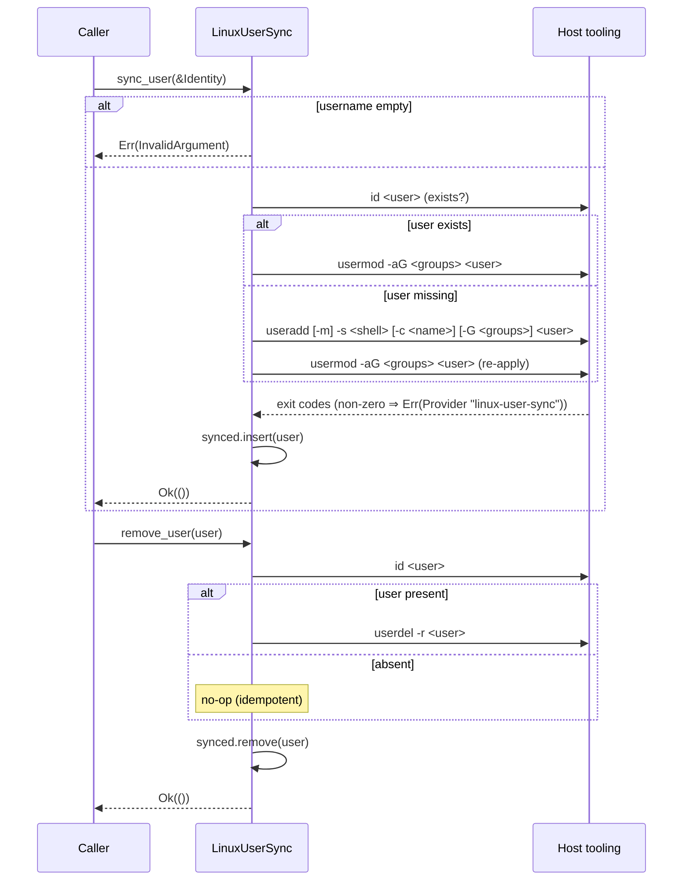

# ocf-auth

> Authentication and host-account synchronization: *who is this principal?* and *does a matching local OS account exist?*

`crate: ocf-auth` · `depends on: ocf-core` · `consumed by: ocf-authz (via Identity.groups), ocf-api`

## Overview

`ocf-auth` answers exactly two questions and nothing else:

1. **Authentication** — turn presented [`Credentials`](#credentials) into a
   verified [`Identity`](#identity). This is pluggable: an
   [`Authenticator`](#authenticator-trait) is a [`Provider`] registered by name
   in a `Registry<dyn Authenticator>`. Three backends ship: `local` (a real
   in-memory password check), `pam` (host PAM via `pamtester`), and
   `active-directory` (LDAP bind via `ldapwhoami`).
2. **Host user sync** — project an [`Identity`] onto a real local Unix account.
   [`HostUserSync`](#hostusersync-trait) is the contract; [`LinuxUserSync`](#linuxusersync)
   drives the real `useradd`/`usermod`/`userdel` binaries.

The crate deliberately knows nothing about what a principal is *allowed* to do —
that is [`ocf-authz`](ocf-authz.md)'s job — but the `Identity.groups` it produces
is exactly the input the RBAC engine consumes for group resolution.

Every directory-integrated backend and the host sync **shell out to the real
host tooling**. Where a binary is installed they verify/mutate for real; where it
is absent the operation returns [`Error::Provider`](#error-behavior) tagged with
the command name. Because the integrations are runtime `Command` invocations, the
crate *compiles* on Windows and Linux alike — the binaries are simply not present
off-host, which surfaces as a provider error rather than a build failure.

## Module map

| Module | File | Responsibility |
|--------|------|----------------|
| `identity` | `crates/ocf-auth/src/identity.rs` | [`Identity`] (auth output) and [`Credentials`] (auth input) |
| `authenticator` | `crates/ocf-auth/src/authenticator.rs` | The [`Authenticator`] trait + [`register_builtins`] |
| `providers` | `crates/ocf-auth/src/providers/mod.rs` | Re-exports the three concrete authenticators |
| `providers::local` | `crates/ocf-auth/src/providers/local.rs` | [`LocalAuthenticator`] — in-memory, constant-time compare |
| `providers::pam` | `crates/ocf-auth/src/providers/pam.rs` | [`PamAuthenticator`] — host PAM via `pamtester` |
| `providers::ad` | `crates/ocf-auth/src/providers/ad.rs` | [`ActiveDirectoryAuthenticator`] — LDAP bind via `ldapwhoami` |
| `hostsync` | `crates/ocf-auth/src/hostsync.rs` | [`HostUserSync`] trait + [`LinuxUserSync`] |
| `exec` | `crates/ocf-auth/src/exec.rs` | [`run_with_stdin`] helper + `parse_id_groups` |

## Domain types

### Identity

`crates/ocf-auth/src/identity.rs`

The **output** of authentication: the single vocabulary every backend maps its
native account onto, so the rest of the fabric speaks one language regardless of
which directory the user came from.

```rust
#[derive(Debug, Clone, PartialEq, Eq, Serialize, Deserialize)]
pub struct Identity {
    pub username: String,
    #[serde(default)] pub display_name: String,
    #[serde(default)] pub email: String,
    #[serde(default)] pub groups: Vec<String>,
    #[serde(default)] pub attributes: BTreeMap<String, String>,
}
```

| Field | Type | Meaning |
|-------|------|---------|
| `username` | `String` | The principal name. |
| `display_name` | `String` | Human-facing name (e.g. PAM `gecos`). |
| `email` | `String` | Optional email claim. |
| `groups` | `Vec<String>` | Directory-level group membership — **feeds straight into RBAC group resolution** in `ocf-authz`. |
| `attributes` | `BTreeMap<String, String>` | Extra backend-specific claims (e.g. an AD `distinguishedName`) the core model does not standardize. |

| Method | Signature | Notes |
|--------|-----------|-------|
| `new` | `fn new(username: impl Into<String>) -> Self` | Bare identity, no groups/attributes. |
| `with_display_name` | `fn with_display_name(self, …) -> Self` | Builder. |
| `with_email` | `fn with_email(self, …) -> Self` | Builder. |
| `with_group` | `fn with_group(self, …) -> Self` | Builder; pushes one group. |
| `with_attribute` | `fn with_attribute(self, k, v) -> Self` | Builder; inserts one attribute. |

### Credentials

`crates/ocf-auth/src/identity.rs`

The **input** to authentication — what a principal presents to prove identity.

```rust
#[derive(Debug, Clone, PartialEq, Eq, Serialize, Deserialize)]
#[serde(rename_all = "snake_case", tag = "kind")]
pub enum Credentials {
    Password { username: String, password: String },
    Token(String),
}
```

| Variant | Carries | Used by |
|---------|---------|---------|
| `Password { username, password }` | Username/password pair (interactive or basic-auth login). | All three shipped authenticators. |
| `Token(String)` | An opaque bearer token (session token, API key). | **None of the shipped backends** — each rejects it with [`Error::unsupported`]. |

| Method | Signature | Notes |
|--------|-----------|-------|
| `password` | `fn password(username, password) -> Self` | Construct password creds. |
| `token` | `fn token(token) -> Self` | Construct token creds. |
| `username` | `fn username(&self) -> Option<&str>` | In-band principal name; `Token` is opaque → `None`. |

## Contracts

### Authenticator trait

`crates/ocf-auth/src/authenticator.rs`

```rust
#[async_trait]
pub trait Authenticator: Provider {
    async fn authenticate(&self, credentials: &Credentials) -> Result<Identity>;
}
```

A pluggable backend that turns [`Credentials`] into a verified [`Identity`].
Backends are swappable plugins registered in a `Registry<dyn Authenticator>`, so
the controller authenticates against a named backend (`"local"`, `"pam"`,
`"active-directory"`) without depending on which directory is in use.

- A backend that does not understand the presented credential variant returns
  [`Error::unsupported`] (`NotSupported`).
- A credential mismatch returns [`Error::Unauthenticated`].

[`register_builtins`] seeds the three shipped backends:

```rust
pub fn register_builtins(reg: &mut Registry<dyn Authenticator>) -> Result<()> {
    reg.register("local", Arc::new(LocalAuthenticator::new()))?;
    reg.register("pam", Arc::new(PamAuthenticator::new()))?;            // service "ocf"
    reg.register("active-directory",
        Arc::new(ActiveDirectoryAuthenticator::new("EXAMPLE.COM")))?;
    Ok(())
}
```

### HostUserSync trait

`crates/ocf-auth/src/hostsync.rs`

```rust
#[async_trait]
pub trait HostUserSync: Send + Sync {
    async fn sync_user(&self, identity: &Identity) -> Result<()>;
    async fn remove_user(&self, username: &str) -> Result<()>;
}
```

A **host-mutating** contract: reconcile a fabric [`Identity`] with a real local
OS account. Some workloads (SSH access, file ownership, sudo policy) need an
actual Unix user on the host, not just a fabric-level principal.

| Method | Idempotency |
|--------|-------------|
| `sync_user` | Ensures an account exists for `identity`; re-running reconciles groups. |
| `remove_user` | Removes the account named `username`; removing an absent user succeeds. |

## Providers (concrete backends)

### LocalAuthenticator

`crates/ocf-auth/src/providers/local.rs` · `Provider::name() == "local"`

The default `"local"` directory and the controller's fallback before any
enterprise directory is configured. Unlike the directory-integrated backends it
performs a **real check** against an in-memory `HashMap<String, Account>` (each
`Account` = stored `password` + `Identity` to mint). Accounts live only in
memory, so it is intended for bootstrap / break-glass and tests, not a user
database of record.

The secret is verified with a **constant-time comparison** (`constant_time_eq`)
so verification time does not depend on the secret's length or content:

```rust
fn constant_time_eq(a: &[u8], b: &[u8]) -> bool {
    if a.len() != b.len() { return false; }
    let mut diff = 0u8;
    for (x, y) in a.iter().zip(b.iter()) { diff |= x ^ y; }
    diff == 0
}
```

| Method | Purpose |
|--------|---------|
| `new()` | Empty authenticator. |
| `with_admin(username, password)` | Seed a single admin account (identity has `display_name = "Administrator"`, group `administrators`). |
| `add_user(username, password)` | Insert/overwrite with a default identity (username only, no groups). |
| `set_account(username, password, identity)` | Insert/overwrite with an explicit identity (e.g. to attach RBAC groups). |
| `remove_user(username) -> bool` | Remove; `true` if present. |
| `len()` / `is_empty()` | Account count. |

Behavior of `authenticate`:
- `Token(_)` → `Error::unsupported` ("local authenticator only accepts password credentials").
- Unknown user → `Error::Unauthenticated("unknown user `…`")`.
- Wrong password → `Error::Unauthenticated("invalid password for `…`")`.
- Match → clone of the stored `Identity`.

### PamAuthenticator

`crates/ocf-auth/src/providers/pam.rs` · `Provider::name() == "pam"`

Drives the host PAM stack through the **`pamtester`** binary, which opens a real
PAM transaction against a configured service (default `"ocf"`, i.e.
`/etc/pam.d/ocf`) and runs its auth phase. This lets the fabric reuse the host's
existing login policy (Unix shadow, `pam_sss`, MFA modules, …) without linking
`libpam`, so the crate still builds where `libpam` is absent.

**Exact command and password handling:**

```text
pamtester <service> <username> authenticate
```

The password is written to the child's **stdin** (pamtester reads it through
PAM's conversation function) — it is **never** placed on the command line. A zero
exit means the credential was accepted; any non-zero exit is an authentication
failure. `pamtester`'s stderr is progress chatter and is intentionally ignored.

On success, groups are read back **best-effort** via:

```text
id -nG <username>
```

parsed by `parse_id_groups` (whitespace-split). Group resolution is advisory: if
`id` is missing or the user has no nss entry, a valid group-less identity is
returned rather than failing an otherwise-successful authentication.

| Method | Purpose |
|--------|---------|
| `new()` | Uses the default `"ocf"` service. |
| `with_service(service)` | Bind to an explicit PAM service name. |
| `service() -> &str` | The configured service. |

### ActiveDirectoryAuthenticator

`crates/ocf-auth/src/providers/ad.rs` · `Provider::name() == "active-directory"`

Performs a real LDAP **simple bind** using the OpenLDAP `ldapwhoami` client: a
successful bind with the user's `username@DOMAIN` UPN and password proves the
credential. Shelling out to the CLI (rather than linking an LDAP C library) keeps
the crate buildable where no LDAP client is present.

**Exact bind command and password handling:**

```text
ldapwhoami -x -H <uri> -D <bind-upn> -w <password>
```

- `-x` selects simple bind; `-H <uri>` is the target server; `-D <bind-upn>` is
  the bind principal; `-w <password>` supplies the password.
- The password is passed as the **`-w` argument** (no stdin is piped for the
  bind), because the OpenLDAP CLI requires it. A documented hardening step is to
  switch to `-y <file>` reading from a private fd; the simple-bind shape is
  unchanged. **See [Security notes](#security-notes) — the `-w` value is visible
  in `ps`/`/proc`.**
- Non-zero exit → `Error::Unauthenticated("ldap bind failed for `…`: <stderr>")`.

**URI selection** (`ldap_uri`): the first configured server, else a default
derived from the domain — `ldap://<lower-cased-domain>` — letting DNS resolve a
domain controller.

**Bind UPN** (`bind_upn`): `username@DOMAIN`, unless the caller already passed a
UPN (`@`) or a DN (`=`), in which case it is used verbatim.

On success, `memberOf` groups are read back **best-effort**, binding as the
just-authenticated user:

```text
ldapsearch -x -LLL -H <uri> -D <bind-upn> -w <password> -b <base-dn> "(sAMAccountName=<user>)" memberOf
```

- The base DN is derived from the domain by `domain_to_base_dn`
  (`EXAMPLE.COM` → `DC=EXAMPLE,DC=COM`).
- `parse_member_of` keeps the leaf `CN=<name>` of each `memberOf:` line as the
  group identity (matching how AD groups surface to RBAC), falling back to the
  full DN when no `CN=` component is present.
- Any failure yields an empty group list rather than failing authentication.

| Method | Purpose |
|--------|---------|
| `new(domain)` | AD authenticator, no explicit servers (URI defaults to `ldap://<domain>`). |
| `with_servers(domain, servers)` | Explicit DC URL list (`ldap://` / `ldaps://`), tried in order. |
| `domain() -> &str` / `servers() -> &[String]` | Accessors. |

### LinuxUserSync

`crates/ocf-auth/src/hostsync.rs` · the [`HostUserSync`] impl

Targets Linux user accounts via `useradd`/`usermod`/`userdel`, probing existence
with `id <user>`. A short in-memory `BTreeSet<String>` of usernames reflected
onto the host is kept as an observable cache alongside the real operations.

| Field | Default | Effect |
|-------|---------|--------|
| `shell` | `/bin/bash` | Passed to `useradd -s`. |
| `create_home` | `true` | Adds `useradd -m`. |
| `synced` | `{}` | Observable cache of reflected usernames. |

**Exact commands** (`username` = `identity.username`):

| Phase | Command |
|-------|---------|
| Existence probe | `id <username>` (exit 0 ⇒ user resolves) |
| Create (missing) | `useradd [-m] -s <shell> [-c <display_name>] [-G g1,g2] <username>` |
| Reconcile groups | `usermod -aG <g1,g2> <username>` |
| Remove (present) | `userdel -r <username>` |
| Read current groups | `id -nG <username>` (via `current_groups`) |

`sync_user` flow: reject empty username (`Error::invalid`); if the user exists,
reconcile supplementary groups with `usermod -aG`; otherwise create with
`useradd` (argv built by `useradd_args`, mirroring the `useradd_command` string
form) then re-apply `usermod -aG` for robustness; finally insert into `synced`.
`remove_user`: idempotent — if the user is absent it returns `Ok` without
invoking `userdel`. A non-zero exit from any account command →
`Error::provider("linux-user-sync", "<cmd> exited <code>: <stderr>")`.

| Method | Purpose |
|--------|---------|
| `new()` / `default()` | `/bin/bash`, create home. |
| `with_shell(shell)` / `with_create_home(bool)` | Builders. |
| `is_synced(username) -> bool` / `synced_users() -> Vec<String>` | Inspect the cache. |
| `useradd_command(&id) -> String` | Shell-style preview of the `useradd` invocation. |
| `useradd_args(&id) -> Vec<String>` | Pure argv builder (executed form; unit-tested). |

### exec helper

`crates/ocf-auth/src/exec.rs`

`run_with_stdin(cmd, args, stdin) -> Result<(i32, String, String)>` runs
`cmd args…`, optionally writing `stdin` verbatim to the child then closing the
pipe (EOF) — which is how `pamtester` reads the password through its conversation
function. It returns `(exit_code, stdout, stderr)`; a non-zero exit is **not** an
error (an authentication probe's non-zero exit means *credential rejected*, a
normal outcome the caller maps onto `Unauthenticated`). Only a genuine spawn
failure (binary not installed / not on this host) surfaces as
[`Error::Provider`] tagged with `cmd`. `parse_id_groups(output)` splits the
single whitespace-joined line of `id -nG` into a `Vec<String>`.

## Diagrams

### `authenticate()` — local / PAM / AD

```mermaid
sequenceDiagram
    participant Caller as ocf-api controller
    participant Reg as Registry<dyn Authenticator>
    participant Auth as Authenticator
    participant Host as Host tooling

    Caller->>Reg: get("local" | "pam" | "active-directory")
    Reg-->>Caller: Arc<dyn Authenticator>
    Caller->>Auth: authenticate(&Credentials)

    alt Credentials::Token(_)
        Auth-->>Caller: Err(NotSupported)
    else local
        Auth->>Auth: lookup user; constant_time_eq(password)
        Auth-->>Caller: Ok(Identity) | Err(Unauthenticated)
    else pam
        Auth->>Host: pamtester <service> <user> authenticate (password on stdin)
        Host-->>Auth: exit code
        alt exit != 0
            Auth-->>Caller: Err(Unauthenticated)
        else exit == 0
            Auth->>Host: id -nG <user>  (best-effort groups)
            Host-->>Auth: group line
            Auth-->>Caller: Ok(Identity{ groups })
        end
    else active-directory
        Auth->>Host: ldapwhoami -x -H <uri> -D <upn> -w <password>
        Host-->>Auth: exit code
        alt exit != 0
            Auth-->>Caller: Err(Unauthenticated)
        else exit == 0
            Auth->>Host: ldapsearch … (sAMAccountName=<user>) memberOf
            Host-->>Auth: LDIF memberOf lines
            Auth-->>Caller: Ok(Identity{ groups = leaf CNs })
        end
    end

    Note over Auth,Host: spawn failure (binary absent) → Err(Provider{cmd})
```

### Host-user-sync flow



## Public API surface

| Item | Kind | Path |
|------|------|------|
| `Authenticator` | trait (`: Provider`) | `authenticator::Authenticator` |
| `register_builtins` | fn | `authenticator::register_builtins` |
| `Identity` | struct | `identity::Identity` |
| `Credentials` | enum | `identity::Credentials` |
| `LocalAuthenticator` | struct | `providers::LocalAuthenticator` |
| `PamAuthenticator` | struct | `providers::PamAuthenticator` |
| `ActiveDirectoryAuthenticator` | struct | `providers::ActiveDirectoryAuthenticator` |
| `HostUserSync` | trait | `hostsync::HostUserSync` |
| `LinuxUserSync` | struct | `hostsync::LinuxUserSync` |
| `exec::run_with_stdin` | fn | `exec::run_with_stdin` |
| `exec::parse_id_groups` | fn | `exec::parse_id_groups` |
| `hostsync::current_groups` | async fn | `hostsync::current_groups` |

## Error behavior

| Condition | Error | Where |
|-----------|-------|-------|
| Token presented to a password-only backend | `NotSupported` (`Error::unsupported`) | all three authenticators |
| Unknown user / wrong password (local) | `Unauthenticated` | `LocalAuthenticator::authenticate` |
| PAM non-zero exit (credential rejected) | `Unauthenticated` | `PamAuthenticator::authenticate` |
| LDAP bind non-zero exit | `Unauthenticated` | `ActiveDirectoryAuthenticator::authenticate` |
| Binary cannot be spawned (not installed / off-host) | `Provider { provider: <cmd>, … }` | `exec::run_with_stdin` |
| Account command non-zero exit | `Provider { provider: "linux-user-sync", … }` | `LinuxUserSync` |
| Empty username on sync/remove | `InvalidArgument` (`Error::invalid`) | `LinuxUserSync` |

The split is deliberate: a tool *running* and rejecting a credential is
`Unauthenticated` (a normal auth outcome); a tool *not being there* is `Provider`
(an environment problem). Group resolution failures are swallowed (empty groups),
never escalated.

## Security notes

- **Constant-time local compare.** `LocalAuthenticator` uses `constant_time_eq`
  (full-length XOR accumulation) so password verification time does not leak the
  secret's length or content via timing.
- **Passwords on stdin where possible.** `pamtester` receives the password on the
  child's **stdin**, never as an argv element — keeping it out of `ps`/`/proc`.
  The `exec` helper's module doc makes this an explicit invariant.
- **LDAP `-w` is visible in `ps`.** `ActiveDirectoryAuthenticator` passes the
  bind password via `ldapwhoami -w <password>` / `ldapsearch -w <password>` as
  the OpenLDAP CLI requires, so the password **is** visible in the host process
  list while the command runs. This is called out in the source as a known
  trade-off, with `-y <file>` (private fd) noted as the hardening path.
- **Passwords are never logged.** `tracing` calls log the service, user, URI and
  bind DN — never the password. stdout/stderr captured from auth probes are not
  surfaced verbatim on the success path.

## Testing

Unit tests (run on any platform — no host tooling required):

- `local.rs` — correct password authenticates; wrong password and unknown user →
  `Unauthenticated`; tokens → `NotSupported`.
- `pam.rs` — defaults to the `ocf` service; tokens → `NotSupported`.
- `ad.rs` — UPN construction, pass-through of existing UPN/DN, default URI from
  domain, explicit server wins, `domain_to_base_dn`, `parse_member_of` (leaf CN
  and full-DN fallback), tokens → `NotSupported`.
- `hostsync.rs` — empty username rejected on sync/remove; `useradd_command` /
  `useradd_args` shape; home omitted when disabled.
- `exec.rs` — `parse_id_groups` whitespace handling.

Host-dependent tests are marked `#[ignore]` and must be run with
`cargo test -- --ignored` on a suitable host:

- `pam.rs::real_pam_rejects_bad_password` — needs `pamtester` + a configured PAM
  service.
- `ad.rs::real_bind_rejects_bad_password` — needs `ldapwhoami` + a reachable
  LDAP/AD server.
- `hostsync.rs::real_sync_then_remove` — needs root and
  `useradd`/`usermod`/`userdel`/`id` on a Linux host.

## Cross-references

- [ocf-authz](ocf-authz.md) — consumes `Identity.groups` for RBAC group
  resolution; `ocf-auth` answers *who*, `ocf-authz` answers *may they*.
- [ocf-core](ocf-core.md) — [`Provider`]/`Registry`, the `Error`/`Result` types,
  and `Metadata`.
- [Architecture → Overview → Real backends](../architecture/overview.md#real-backends)
  — the "real tool or honest error" principle these backends follow.
- [Operations → Security](../operations/security.md) — fabric-wide
  authentication and secrets posture.

[`Provider`]: ocf-core.md
[`Error::Provider`]: #error-behavior
[`Error::unsupported`]: #error-behavior
[`Error::Unauthenticated`]: #error-behavior
[`Error::invalid`]: #error-behavior
[`Identity`]: #identity
[`Credentials`]: #credentials
[`Authenticator`]: #authenticator-trait
[`HostUserSync`]: #hostusersync-trait
[`LocalAuthenticator`]: #localauthenticator
[`PamAuthenticator`]: #pamauthenticator
[`ActiveDirectoryAuthenticator`]: #activedirectoryauthenticator
[`LinuxUserSync`]: #linuxusersync
[`register_builtins`]: #authenticator-trait
[`run_with_stdin`]: #exec-helper
