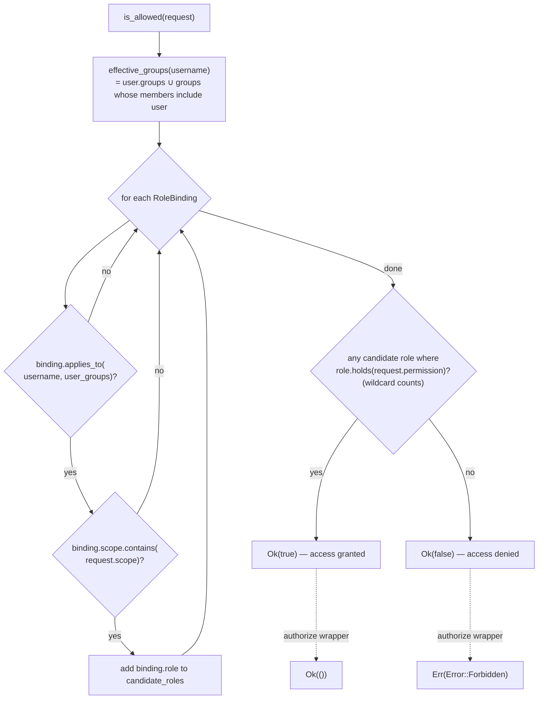
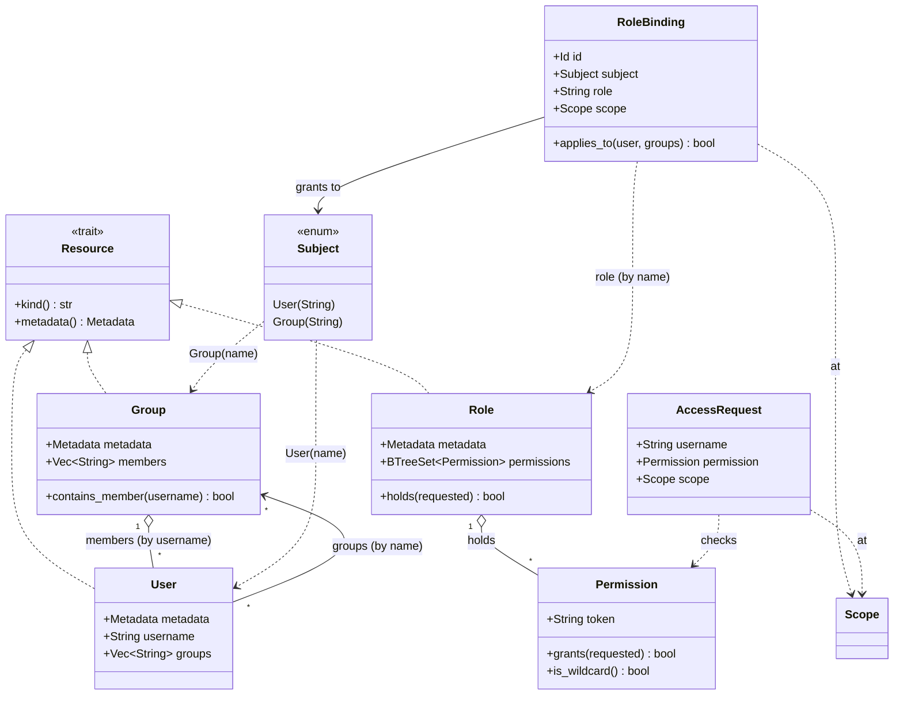

# ocf-authz

> Scope-aware, Proxmox-style RBAC: *may this user perform this permission at this scope?*

`crate: ocf-authz` · `depends on: ocf-core` · `consumes: Identity.groups from ocf-auth` · `consumed by: ocf-api`

## Overview

`ocf-authz` is a small, scope-aware role-based access control model. It answers a
single question — *may `username` do `permission` at `scope`?* — and nothing
about *who* the user is (that is [`ocf-auth`](ocf-auth.md)'s job). The group names
produced by authentication flow straight into this engine's group resolution.

The model has four moving parts:

- **[`Permission`](#permission)** — the verbs a decision is made against, with a
  wildcard (`"*"`) that grants everything.
- **[`Role`](#role) / [`Group`](#group) / [`User`](#user)** — the resources
  (each implements [`Resource`]). A `Role` bundles permissions; a `Group` and a
  `User` name membership.
- **[`RoleBinding`](#rolebinding)** — grants a role (by name) to a
  [`Subject`](#subject) (a user or a group) at a [`Scope`].
- **[`Authorizer`](#authorizer-trait) / [`RbacEngine`](#rbacengine)** — the
  contract and its in-memory implementation.

The governing rule: **a grant at a scope covers everything beneath it.** The
engine keeps only the bindings whose `scope.contains(request.scope)`, then allows
the request if any bound role holds the permission (or the wildcard).
[`RbacEngine::with_defaults`](#with_defaults-seed) seeds the conventional
`Administrator` (wildcard) and `Auditor` (read-only) roles, mirroring the
`register_builtins` pattern used by the pluggable subsystems.

## Module map

| Module | File | Responsibility |
|--------|------|----------------|
| `permission` | `crates/ocf-authz/src/permission.rs` | [`Permission`] newtype, the verb constants, `read_only_permissions()` |
| `model` | `crates/ocf-authz/src/model.rs` | [`Role`], [`Group`], [`User`], [`Subject`], [`RoleBinding`], [`AccessRequest`] |
| `engine` | `crates/ocf-authz/src/engine.rs` | [`Authorizer`] trait + [`RbacEngine`] + role-name constants |
| `lib` | `crates/ocf-authz/src/lib.rs` | Re-exports the public surface |

## Domain types

### Permission

`crates/ocf-authz/src/permission.rs`

A single authorization verb, a stable string token compared by value. The
wildcard `"*"` is special-cased to match any requested permission.

```rust
#[derive(Debug, Clone, PartialEq, Eq, Hash, PartialOrd, Ord, Serialize, Deserialize)]
#[serde(transparent)]
pub struct Permission(pub String);
```

| Constant | Token | Meaning |
|----------|-------|---------|
| `WILDCARD` | `"*"` | Grants every permission (makes `Administrator` all-powerful). |
| `WORKLOAD_CREATE` | `"workload.create"` | Create a workload (container or VM). |
| `WORKLOAD_READ` | `"workload.read"` | Read / list workloads. |
| `WORKLOAD_MANAGE` | `"workload.manage"` | Start/stop/migrate/mutate a workload. |
| `WORKLOAD_DELETE` | `"workload.delete"` | Delete a workload. |
| `VPC_READ` | `"vpc.read"` | Read VPC / subnet / route / ACL state. |
| `VPC_MANAGE` | `"vpc.manage"` | Manage the VPC overlay. |
| `LB_READ` | `"lb.read"` | Read load-balancer state. |
| `LB_MANAGE` | `"lb.manage"` | Manage LBs, listeners, certificates, DNS records. |
| `SYS_READ` | `"sys.read"` | Read host / kernel / inventory / disk state. |
| `SYS_MODIFY` | `"sys.modify"` | Modify host-level config (kernel, firewall, services, disks). |
| `AUDIT_READ` | `"audit.read"` | Read audit logs and monitoring data. |

| Method | Signature | Notes |
|--------|-----------|-------|
| `new` | `fn new(token: impl Into<String>) -> Self` | From any string-like token. |
| `wildcard` | `fn wildcard() -> Self` | The `"*"` permission. |
| `as_str` | `fn as_str(&self) -> &str` | Raw backing token. |
| `is_wildcard` | `fn is_wildcard(&self) -> bool` | True iff token is `"*"`. |
| `grants` | `fn grants(&self, requested: &Permission) -> bool` | **Core check:** `is_wildcard() || self == requested`. |

`From<&str>`, `From<String>`, and `Display` are implemented.
`read_only_permissions()` returns `[WORKLOAD_READ, VPC_READ, LB_READ, SYS_READ,
AUDIT_READ]` and seeds the `Auditor` role.

### Role

`crates/ocf-authz/src/model.rs` · `impl Resource (kind = "role")`

A named bundle of permissions, referenced from a [`RoleBinding`] by its metadata
name.

```rust
#[derive(Debug, Clone, Serialize, Deserialize)]
pub struct Role {
    pub metadata: Metadata,
    pub permissions: BTreeSet<Permission>,
}
```

| Method | Notes |
|--------|-------|
| `new(name)` | Role with no permissions. |
| `with_permissions(name, perms)` | Role seeded with permissions. |
| `grant(self, permission) -> Self` | Builder; insert one permission. |
| `holds(&self, requested) -> bool` | True if any held permission `grants(requested)` (covers the wildcard). |

### Group

`crates/ocf-authz/src/model.rs` · `impl Resource (kind = "group")`

A named collection of users, membership stored as **usernames** (not [`Id`]s) so
groups can reference identities living in an external directory.

```rust
#[derive(Debug, Clone, Serialize, Deserialize)]
pub struct Group {
    pub metadata: Metadata,
    pub members: Vec<String>,   // usernames
}
```

| Method | Notes |
|--------|-------|
| `new(name)` | Empty group. |
| `with_member(self, username) -> Self` | Builder; add a member. |
| `contains_member(&self, username) -> bool` | Membership test. |

### User

`crates/ocf-authz/src/model.rs` · `impl Resource (kind = "user")`

A principal that can be granted roles. `groups` lists the groups this user is
**statically** a member of; the engine *additionally* resolves dynamic membership
from each `Group.members` list, so either side may declare the relationship.

```rust
#[derive(Debug, Clone, Serialize, Deserialize)]
pub struct User {
    pub metadata: Metadata,
    pub username: String,
    pub groups: Vec<String>,    // group names
}
```

| Method | Notes |
|--------|-------|
| `new(username)` | User with no groups. |
| `with_group(self, group) -> Self` | Builder; add a group name. |

### Subject

`crates/ocf-authz/src/model.rs`

The principal a [`RoleBinding`] grants a role to.

```rust
#[derive(Debug, Clone, PartialEq, Eq, Serialize, Deserialize)]
#[serde(rename_all = "snake_case")]
pub enum Subject {
    User(String),    // a single user, by username
    Group(String),   // every member of a group, by group name
}
```

Constructors: `Subject::user(username)`, `Subject::group(group)`.

### RoleBinding

`crates/ocf-authz/src/model.rs`

Grants a [`Role`] (by name) to a [`Subject`] at a [`Scope`]. The binding applies
at `scope` **and everything beneath it** — a binding scoped to a region
authorizes actions on every datacenter, rack and machine in that region (decided
by [`Scope::contains`]).

```rust
#[derive(Debug, Clone, Serialize, Deserialize)]
pub struct RoleBinding {
    pub id: Id,
    pub subject: Subject,
    pub role: String,   // name of the bound role
    pub scope: Scope,
}
```

| Method | Notes |
|--------|-------|
| `new(subject, role, scope)` | Create a binding with a fresh `Id`. |
| `applies_to(&self, username, user_groups) -> bool` | `User(u) ⇒ u == username`; `Group(g) ⇒ user_groups.contains(g)`. |

### AccessRequest

`crates/ocf-authz/src/model.rs`

The question put to an [`Authorizer`]: may `username` perform `permission` at
`scope`?

```rust
#[derive(Debug, Clone, Serialize, Deserialize)]
pub struct AccessRequest {
    pub username: String,
    pub permission: Permission,
    pub scope: Scope,
}
```

Constructor: `AccessRequest::new(username, permission, scope)`.

## Contract & Engine

### Authorizer trait

`crates/ocf-authz/src/engine.rs`

```rust
#[async_trait]
pub trait Authorizer: Send + Sync {
    async fn is_allowed(&self, request: &AccessRequest) -> Result<bool>;

    async fn authorize(&self, request: &AccessRequest) -> Result<()> {
        if self.is_allowed(request).await? {
            Ok(())
        } else {
            Err(Error::forbidden(format!(
                "{} may not {} at {:?}",
                request.username, request.permission, request.scope
            )))
        }
    }
}
```

Async and object-safe so the API layer holds an `Arc<dyn Authorizer>` and can swap
the in-memory [`RbacEngine`] for an external policy backend without touching
callers. `is_allowed` returns the boolean decision; `authorize` is the
convenience wrapper that turns a denial into [`Error::Forbidden`].

### RbacEngine

`crates/ocf-authz/src/engine.rs`

In-memory RBAC engine: four thread-safe stores plus the evaluation logic. All
access goes through `RwLock`, so the engine is `Send + Sync` and cheap to share
behind an `Arc`.

```rust
#[derive(Default)]
pub struct RbacEngine {
    roles:    RwLock<HashMap<String, Role>>,        // keyed by role name
    groups:   RwLock<HashMap<String, Group>>,       // keyed by group name
    users:    RwLock<HashMap<String, User>>,        // keyed by username
    bindings: RwLock<HashMap<Id, RoleBinding>>,     // keyed by binding Id
}
```

| Store | Key | Mutators | Readers |
|-------|-----|----------|---------|
| `roles` | role name | `put_role` | `get_role` (→ `NotFound`), `list_roles` |
| `groups` | group name | `put_group` | `get_group` (→ `NotFound`), `list_groups` |
| `users` | username | `put_user` | `get_user` (→ `NotFound`), `list_users` |
| `bindings` | `Id` | `add_binding` (→ `Id`), `remove_binding` (→ `NotFound`) | `list_bindings` |

`put_*` insert-or-replace; `get_*` clone out or return `Error::not_found`.

#### `with_defaults` seed

`RbacEngine::with_defaults()` is the RBAC analogue of the `register_builtins`
helpers elsewhere — it gives a fresh controller a sane starting policy by seeding
two roles (no bindings, no users):

| Seeded role (const) | Name | Permissions |
|---------------------|------|-------------|
| `ADMINISTRATOR_ROLE` | `"Administrator"` | `[Permission::wildcard()]` — grants everything |
| `AUDITOR_ROLE` | `"Auditor"` | `read_only_permissions()` = the five `*.read` verbs |

```rust
pub fn with_defaults() -> Self {
    let engine = Self::new();
    engine.put_role(Role::with_permissions(ADMINISTRATOR_ROLE, [Permission::wildcard()]));
    engine.put_role(Role::with_permissions(AUDITOR_ROLE, read_only_permissions()));
    engine // …plus a tracing::info! announcing the seed
}
```

#### Decision algorithm — `is_allowed`

`RbacEngine::is_allowed` evaluates a request in three steps, snapshotting each
store under its lock so no lock is held across an `await`:

1. **Resolve effective groups** (`effective_groups`) — the **union** of the
   `User.groups` declared on the user record and every group whose `members` list
   names the user. Authoritative from either side.
2. **Collect candidate roles** — from `bindings`, keep those where
   `binding.applies_to(username, user_groups)` **and**
   `binding.scope.contains(request.scope)` (the binding's scope must be an
   ancestor of, or equal to, the requested scope). Map to role names.
3. **Decide** — allow iff some candidate role exists in `roles` and that role
   `holds(request.permission)` (which the wildcard satisfies). Result is logged
   at `debug` as granted/denied and returned as `Ok(bool)`.

An unknown user with no covering bindings is simply denied (`Ok(false)`).

## Diagrams

### `is_allowed()` decision algorithm



### Model relationships



## Public API surface

| Item | Kind | Path |
|------|------|------|
| `Permission` | struct (newtype) | `permission::Permission` |
| `read_only_permissions` | fn | `permission::read_only_permissions` |
| `Role`, `Group`, `User` | structs (`Resource`) | `model::{Role, Group, User}` |
| `Subject` | enum | `model::Subject` |
| `RoleBinding` | struct | `model::RoleBinding` |
| `AccessRequest` | struct | `model::AccessRequest` |
| `Authorizer` | trait | `engine::Authorizer` |
| `RbacEngine` | struct | `engine::RbacEngine` |
| `ADMINISTRATOR_ROLE`, `AUDITOR_ROLE` | `&str` consts | `engine::*` |

## Error behavior

| Condition | Error | Where |
|-----------|-------|-------|
| Request denied (via `authorize`) | `Forbidden` (`Error::forbidden`), code `"forbidden"` | `Authorizer::authorize` |
| Request denied (via `is_allowed`) | `Ok(false)` — **not** an error | `RbacEngine::is_allowed` |
| Unknown role/group/user lookup | `NotFound` (`Error::not_found`) | `get_role` / `get_group` / `get_user` |
| Removing an absent binding | `NotFound` | `remove_binding` |

The decision call (`is_allowed`) never errors on a denial — it returns the
boolean. Only the `authorize` convenience wrapper converts a `false` into a
`Forbidden` error. Store lookups for missing entities return `NotFound`.

## Security notes

- **Deny by default.** A user with no covering binding (including an entirely
  unknown user) is denied — `is_allowed` returns `false` rather than erroring or
  defaulting open.
- **Scope is a hard boundary.** A binding only contributes if
  `binding.scope.contains(request.scope)`; authority granted at `region us` does
  **not** reach `region eu`. The wildcard permission widens *what* but never
  *where* — scope still bounds it.
- **Group membership is symmetric and unioned.** Because effective groups are the
  union of both declarations, neither the user record nor the group record can be
  edited in isolation to silently drop an authorization; both sides are honored.
- **Locks are not held across `await`.** Each store is snapshotted under its lock
  and released before evaluation continues, avoiding lock-across-await hazards in
  the async path.

## Testing

Unit tests (`cargo test -p ocf-authz`, all platform-independent):

- `permission.rs` — wildcard grants everything; exact match required otherwise;
  the read-only set is all `*.read`.
- `model.rs` — `Role::holds` via wildcard and via exact only;
  `RoleBinding::applies_to` for user and group subjects.
- `engine.rs` — `Administrator` can act fleet-wide; `Auditor` is read-only;
  binding scope bounds authority (`region us` allows `dc1`, denies `region eu`);
  group membership grants access from either declaration side; an unknown user is
  denied; `authorize` maps a denial to a `forbidden`-coded error.

## Cross-references

- [Architecture → Scopes & Placement](../architecture/scopes-and-placement.md) —
  the `fleet → region → datacenter → rack → machine` hierarchy and
  `Scope::contains` semantics this engine relies on.
- [ocf-auth](ocf-auth.md) — produces the `Identity.groups` consumed here for
  group resolution; `ocf-auth` answers *who*, `ocf-authz` answers *may they*.
- [ocf-core](ocf-core.md) — [`Resource`]/`Metadata`/`Id`, [`Scope`], and the
  `Error`/`Result` types.
- [Reference → Error Codes](../reference/error-codes.md) — the `forbidden` /
  `not_found` codes and their HTTP mapping.

[`Resource`]: ocf-core.md
[`Scope`]: ../architecture/scopes-and-placement.md
[`Scope::contains`]: ../architecture/scopes-and-placement.md
[`Id`]: ocf-core.md
[`Error::Forbidden`]: #error-behavior
[`Permission`]: #permission
[`Role`]: #role
[`Group`]: #group
[`User`]: #user
[`Subject`]: #subject
[`RoleBinding`]: #rolebinding
[`AccessRequest`]: #accessrequest
[`Authorizer`]: #authorizer-trait
[`RbacEngine`]: #rbacengine
