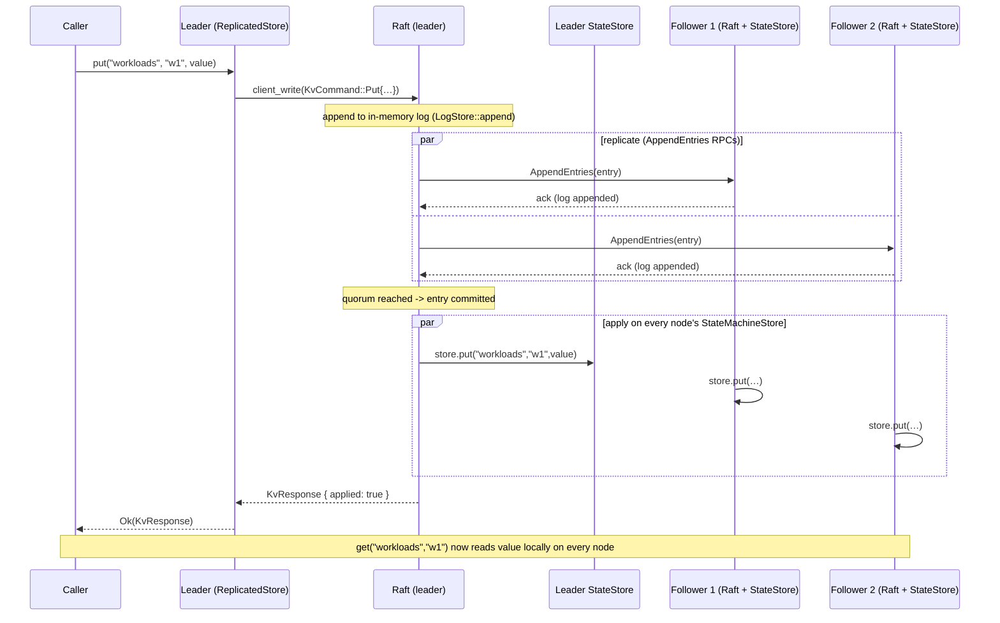
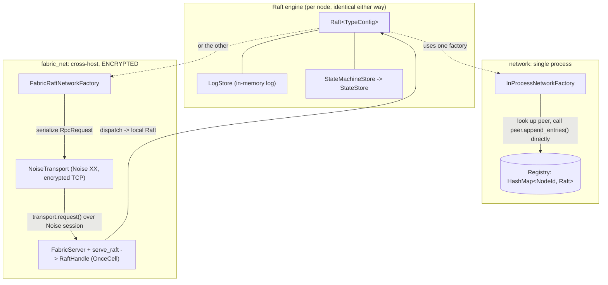

# ocf-consensus

> Raft-replicated control-plane state, built on openraft 0.9 — writes go through the Raft log, a quorum commits them, and every node applies them into its local `ocf-store` `StateStore`.

| | |
|---|---|
| **Source** | `crates/ocf-consensus/src/` (`lib.rs`, `types.rs`, `storage.rs`, `network.rs`, `fabric_net.rs`, `store.rs`) |
| **Depends on** | [`ocf-core`](ocf-core.md) (prelude: `Error`/`Result`, serde), [`ocf-store`](ocf-store.md) (`StateStore`), [`ocf-fabric`](ocf-fabric.md) (`NoiseTransport`, `FabricServer`, `FabricNode`, `KeyPair`), `openraft` 0.9 (features `serde` + `storage-v2`), `tokio`, `serde_json` |
| **Used by** | `ocfd` (a node's replicated control-plane store), any subsystem that needs its state to survive losing a node |

## Overview

Node-local durability ([`ocf-store`](ocf-store.md)) is *one* half of fleet
persistence; `ocf-consensus` is the other half — it **replicates writes across
nodes** so the control plane survives losing any single node. It is a thin,
auditable layer over [openraft] 0.9.

A [`ReplicatedStore`](#replicatedstore) is a handle to one Raft node:

- **Writes** (`put`/`delete`) are proposed as [`KvCommand`](#kvcommand)s through
  the Raft log. Once a **quorum** commits a command, every node's state machine
  applies it into its local [`StateStore`](ocf-store.md#statestore).
- **Reads** (`get`) are served directly from the local store — eventually
  consistent on followers, linearizable-after-commit on the leader.
- **Writes are leader-only.** A `put`/`delete` on a follower returns an error
  naming the current leader so the caller can redirect.

The replicated command is a deliberately thin mirror of the `StateStore` write
surface (`put`/`delete`), so applying a committed entry is a *direct* translation
into a store call — there is no hidden business logic in the state machine, which
keeps replication auditable.

Two transports ship behind the same Raft engine:

- [`network`](#in-process-network-network) — an **in-process** router for a
  single-process cluster (single-host deployments and tests).
- [`fabric_net`](#cross-host-network-fabric_net) — the **real cross-host**
  transport, carrying every Raft RPC over [`ocf-fabric`](ocf-fabric.md)'s
  encrypted Noise session.

[openraft]: https://docs.rs/openraft/0.9

## Module map

| Module | File | Responsibility |
|--------|------|----------------|
| crate root | `lib.rs` | Re-exports `ReplicatedStore`, `KvCommand`, `KvResponse`, `TypeConfig`; crate-level docs + runnable example |
| `types` | `types.rs` | `KvCommand` (the replicated mutation), `KvResponse` (apply ack), and the `TypeConfig` declared via `openraft::declare_raft_types!` |
| `storage` | `storage.rs` | In-memory `LogStore` (`RaftLogStorage`) + `StateMachineStore` (`RaftStateMachine`) applying committed commands into a `StateStore`; snapshot build/install |
| `network` | `network.rs` | `Registry` of peer `Raft` handles + `InProcessNetworkFactory`/`InProcessNetwork` (single-process RPC routing) |
| `fabric_net` | `fabric_net.rs` | `FabricRaftNetworkFactory`/`FabricRaftNetwork` (RPCs over the encrypted transport) + `serve_raft`/`RaftHandle` for the receiving side |
| `store` | `store.rs` | `ReplicatedStore` — the ergonomic facade over one Raft node |

## Domain types / Contracts

### `KvCommand`

The control-plane mutation replicated through the Raft log. A thin mirror of the
`StateStore` write surface. `#[derive(Debug, Clone, PartialEq, Eq, Serialize, Deserialize)]`.

```rust
pub enum KvCommand {
    Put { collection: String, key: String, value: Vec<u8> },
    Delete { collection: String, key: String },
}
```

| Variant | Applied as | Notes |
|---------|-----------|-------|
| `Put { collection, key, value }` | `store.put(collection, key, value)` | Overwrites any previous value |
| `Delete { collection, key }` | `store.delete(collection, key)` | Deleting an absent key is not an error |

### `KvResponse`

The acknowledgement returned to the proposer once a `KvCommand` has been
committed and applied to the local state machine.
`#[derive(Debug, Clone, Default, PartialEq, Eq, Serialize, Deserialize)]`.

| Field | Type | Meaning |
|-------|------|---------|
| `applied` | `bool` | `true` once the command is applied. A committed command is always applied, so this is the committed/ack signal callers wait on. (Blank/membership log entries ack with `false`.) |

### `TypeConfig`

The openraft type configuration, declared with `openraft::declare_raft_types!`:

```rust
openraft::declare_raft_types!(
    pub TypeConfig:
        D = KvCommand,                       // the proposed mutation
        R = KvResponse,                      // the apply acknowledgement
        NodeId = u64,
        Node = openraft::BasicNode,          // carries a routable address
        Entry = openraft::Entry<TypeConfig>,
        SnapshotData = Cursor<Vec<u8>>,      // in-memory snapshot bytes
);
```

`BasicNode` carries a routable address (its `.addr`). It is unused by the
in-process network but required by the cluster-membership types — and the
[`fabric_net`](#cross-host-network-fabric_net) transport uses `node.addr` to dial
the peer.

### Storage traits (`storage.rs`)

The crate implements openraft 0.9's split storage traits (feature `storage-v2`),
modelled on openraft's `raft-kv-memstore` example:

- **`LogStore` : `RaftLogStorage<TypeConfig>`** — the replicated log (vote,
  committed marker, entries). The log lives **in memory** (a `BTreeMap<u64,
  Entry>`); persisting the *log itself* is out of scope for this cluster.
  `append` reports IO-complete immediately (`callback.log_io_completed(Ok(()))`)
  because an in-memory insert is durable the instant it returns.
- **`StateMachineStore` : `RaftStateMachine<TypeConfig>`** — `apply` walks each
  committed entry, translating a `Normal(KvCommand)` payload into a `put`/`delete`
  on the supplied `Arc<dyn StateStore>`. `Blank` and `Membership` entries advance
  bookkeeping and ack with `applied: false`.

`new_storage(store: Arc<dyn StateStore>) -> (LogStore, StateMachineStore)` builds
the pair; both share the same in-memory log/vote/snapshot `Inner`, while only the
state machine holds the durable `StateStore` it applies into.

> **Locking note.** The crate's dependency budget is the openraft set only, so it
> cannot use the fabric's usual `parking_lot`. A tiny `parking_lot_shim::Mutex`
> wraps `std::sync::Mutex` and recovers from poisoning (`unwrap_or_else(|p|
> p.into_inner())`) so a panicked holder can never poison-panic non-test code.
> The critical sections are short and never hold across an `.await`.

**Snapshots** capture the full state-machine store. `build_snapshot` enumerates
every collection the SM has written (tracked in `sm_collections`, since the store
only supports per-collection `list`), serializes a `SnapshotPayload`
(`last_applied`, `last_membership`, and `collection -> (key -> value)`) to JSON,
**zstd-compresses it**, and retains it. `install_snapshot` inflates and loads the
payload, so a lagging or freshly-joined node is caught up in one shot. The
snapshot is shipped whole to that node over the encrypted fabric, so compressing
the (highly compressible JSON) state shrinks the catch-up transfer; a test
asserts the snapshot is a real zstd frame and round-trips through `install`.

## Replication detail — how a write flows

A `put`/`delete` on a [`ReplicatedStore`](#replicatedstore) is a single Raft
`client_write`, which:

1. **Proposes** the `KvCommand` to the local Raft. If this node is **not** the
   leader, `client_write` fails; `ReplicatedStore::write` checks `self.leader()`
   and, when a different leader is known, returns
   `Error::Conflict("not leader; current leader is node {leader}: …")` so the
   caller can redirect. (See [Error behavior](#error-behavior).)
2. **Appends** the command to the leader's in-memory log (`LogStore::append`).
3. **Replicates** the entry to followers via the network factory
   (`AppendEntries` RPCs) — in-process or over the encrypted fabric.
4. **Commits** once a **quorum** of nodes has acknowledged the append.
5. **Applies** the committed entry on *every* node: each `StateMachineStore::apply`
   translates the `KvCommand` into `store.put`/`store.delete` on that node's local
   `StateStore`. The leader's apply produces the `KvResponse { applied: true }`
   returned to the original `client_write` caller.

After step 5 the value is readable from any node's local store via `get`
(immediately on the leader, eventually on followers as they apply).

### `ReplicatedStore`

The public facade over one Raft node. `#[derive(Clone)]`; holds `node_id`, the
`Raft<TypeConfig>` handle, the `Registry`, and the `Arc<dyn StateStore>`.

```rust
pub async fn start(node_id: u64, peers: Vec<u64>, store: Arc<dyn StateStore>) -> Result<Self>;
pub async fn start_in(node_id: u64, peers: Vec<u64>, store: Arc<dyn StateStore>, registry: Registry) -> Result<Self>;
pub async fn initialize(&self, members: Vec<u64>) -> Result<()>;     // idempotent
pub async fn put(&self, collection: &str, key: &str, value: Vec<u8>) -> Result<KvResponse>;
pub async fn delete(&self, collection: &str, key: &str) -> Result<KvResponse>;
pub fn get(&self, collection: &str, key: &str) -> Result<Option<Vec<u8>>>;  // local read
pub fn is_leader(&self) -> bool;
pub fn leader(&self) -> Option<u64>;
pub async fn wait_for_leader(&self, timeout: Duration) -> Result<u64>;
pub async fn shutdown(&self);
pub fn node_id(&self) -> u64;
pub fn registry(&self) -> Registry;
pub fn state_store(&self) -> Arc<dyn StateStore>;
```

- **`start`** creates a *fresh per-node registry* (single node); **`start_in`**
  joins a *shared* `Registry`, so several nodes built against the same registry
  form one cluster. Exactly one node then calls **`initialize`** to form the
  cluster. The Raft `Config` uses `cluster_name: "ocf-consensus"` with snappy
  election timing (heartbeat 100ms, election 300–600ms) for fast in-process
  formation.
- **`initialize(members)`** is **idempotent**: an already-formed cluster reports
  openraft's `InitializeError::NotAllowed`, which `is_already_initialized` maps to
  `Ok(())`.

## Transports

### In-process network (`network`)

For a single-process cluster, RPCs are routed directly to peer `Raft` instances:

- **`Registry`** — a shared, process-wide `Arc<Mutex<HashMap<NodeId, Raft>>>`.
  Cloning a `Registry` shares the same map, so every node and network client see
  the same cluster. Nodes `insert` their handle on start and `remove` on shutdown.
- **`InProcessNetworkFactory`** hands out per-target `InProcessNetwork` clients.
  Each client looks the target up in the registry and **calls its receiving-side
  `Raft` handler directly** (`peer.append_entries(rpc).await`, etc.). A target
  absent from the registry (e.g. shut down) yields a transport-style
  `RPCError::Network` carrying `PeerGone`, which openraft treats as unreachable.

### Cross-host network (`fabric_net`)

The **real** cross-host counterpart. Each RPC is serialized, sent to the target's
fabric endpoint over a Noise session, and the typed result is deserialized on
return — so a real multi-node cluster forms over **authenticated, encrypted TCP**.

- **Wire envelopes** — `RpcRequest::{Append, Vote, Snapshot}` and
  `RpcResponse::{Append, Vote, Snapshot, NotReady}`. The response carries the
  peer's *typed* `Result` serialized verbatim, so the caller reconstructs the
  exact success value or `RaftError` and maps it as if the call had been local.
- **`FabricRaftNetworkFactory`** holds a shared `Arc<NoiseTransport>` (the node's
  identity) and builds `FabricRaftNetwork` clients, each carrying the peer's
  `target` id and `node.addr`. `exchange` does
  `transport.request(&peer_node, &bytes).await`; transport/codec failures become a
  retryable `NetworkError` (`net_err`).
- **`serve_raft(server, cell)`** is the receiving side: `FabricServer::run`
  handles the Noise handshake, then `dispatch` decodes each frame and calls the
  local `Raft` published in a **`RaftHandle`** (`Arc<OnceCell<Raft>>`). The cell
  bridges an ordering problem — the server needs the handle to dispatch, but the
  handle is built *after* the network. RPCs arriving before the handle is
  published (or an undecodable frame) answer `NotReady`, which the caller maps to
  a retryable network error that openraft retries.

The peer's static key is learned during the Noise XX handshake, so a
`FabricRaftNetwork` only needs the endpoint address to dial — `peer_node()`
constructs a `FabricNode` with an empty public key.

## Diagrams

### A `put()` going through Raft



### In-process vs. encrypted-fabric transport



## Public API surface

| Item | Signature | What it gives you |
|------|-----------|-------------------|
| `ReplicatedStore::start` | `async fn(u64, Vec<u64>, Arc<dyn StateStore>) -> Result<Self>` | A single node with a fresh registry |
| `ReplicatedStore::start_in` | `async fn(u64, Vec<u64>, Arc<dyn StateStore>, Registry) -> Result<Self>` | A node joined to a shared in-process cluster |
| `ReplicatedStore::initialize` | `async fn(&self, Vec<u64>) -> Result<()>` | Idempotently form the cluster (call on one node) |
| `ReplicatedStore::put` / `delete` | `async fn … -> Result<KvResponse>` | Leader-only replicated writes |
| `ReplicatedStore::get` | `fn(&str, &str) -> Result<Option<Vec<u8>>>` | Local read from this node's state-machine store |
| `ReplicatedStore::is_leader` / `leader` | `fn(&self) -> bool` / `Option<u64>` | Leadership status |
| `ReplicatedStore::wait_for_leader` | `async fn(&self, Duration) -> Result<u64>` | Block until a leader is elected |
| `ReplicatedStore::shutdown` | `async fn(&self)` | Stop the Raft task and deregister |
| `ReplicatedStore::state_store` | `fn(&self) -> Arc<dyn StateStore>` | The underlying store (read-only inspection / tests) |
| `KvCommand`, `KvResponse`, `TypeConfig` | types | The replicated command/ack and the openraft config |
| `network::Registry` | `new()` / `insert` / `remove` / `Clone` | The shared in-process node registry |
| `network::InProcessNetworkFactory` | `new(Registry)` | In-process `RaftNetworkFactory` |
| `fabric_net::FabricRaftNetworkFactory` | `new(Arc<NoiseTransport>)` | Encrypted cross-host `RaftNetworkFactory` |
| `fabric_net::serve_raft` | `async fn(FabricServer, RaftHandle)` | Serve inbound RPCs over the fabric to a local `Raft` |
| `fabric_net::RaftHandle` | `Arc<OnceCell<Raft<TypeConfig>>>` | The cell the server dispatches into once the handle is published |
| `storage::new_storage` | `fn(Arc<dyn StateStore>) -> (LogStore, StateMachineStore)` | Build the log + state-machine pair for `Raft::new` |

## Error behavior

Writes return [`ocf_core::Result`](ocf-core.md#error). The signature behavior is
the **follower-write redirect**:

- **Write on a follower** — `client_write` fails; if a *different* leader is known
  (`self.leader()` returns `Some(other)`), `write` returns
  `Error::Conflict(format!("not leader; current leader is node {leader}: {e}"))`
  (code `conflict`). The caller reads the leader id from the message and retries
  there. If no other leader is known, the failure surfaces as
  `Error::internal("raft client_write failed: …")`.
- **Startup / config** — an invalid Raft config or a failed `Raft::new` is
  `Error::internal(…)`.
- **`initialize`** — already-initialized is *not* an error (idempotent `Ok(())`);
  any other initialize failure is `Error::internal("failed to initialize raft
  cluster: …")`.
- **`wait_for_leader`** — a timeout is `Error::internal("timed out waiting for
  leader: …")`.
- **Transport RPC errors** are internal to openraft: an absent in-process peer
  yields `PeerGone` (`RPCError::Network`); a fabric transport/codec failure or a
  `NotReady` peer yields a retryable `NetworkError`. openraft retries these; they
  do not surface directly to `put`/`delete` callers unless they prevent commit.
- **State-machine apply** — a `StateStore` write failure during `apply` becomes a
  `StorageIOError::write_state_machine` (an openraft `StorageError`), which is a
  storage fault, not an application error.

## Testing

- **`network` / in-process** — a 3-node in-process cluster (`Registry` shared via
  `start_in`) forms a cluster, elects a leader, writes on the leader, and asserts
  the value replicates to **all three** nodes' state machines. This is the
  baseline replication test for the single-process transport.
- **`fabric_net` — `three_node_cluster_replicates_over_encrypted_fabric`** — the
  real cross-host path: each node binds a real `FabricServer` on an ephemeral
  `127.0.0.1:0` with its own `KeyPair`, runs `serve_raft`, and builds its `Raft`
  with a `FabricRaftNetworkFactory` over a `NoiseTransport`. Node 1 initializes
  the cluster; the test waits up to 15s for a leader to be elected **over the
  encrypted transport**, writes `KvCommand::Put { "workloads"/"db-1" }` on the
  leader, and asserts the committed value lands in all three nodes'
  `MemoryStateStore`s (polling up to 5s per node) — proving real replication over
  authenticated, encrypted TCP.
- The crate-level doctest in `lib.rs` (`no_run`) shows the minimal
  `start_in` → `initialize` → `put` → `get` round-trip.

## Cross-references

- [Architecture → Distributed Control Plane](../architecture/distributed-control-plane.md) — persistence, the fabric mesh, membership, and Raft consensus as a whole
- [ocf-store](ocf-store.md) — the `StateStore` the state machine applies committed `KvCommand`s into (the seam between node-local and replicated durability)
- [ocf-fabric](ocf-fabric.md) — the encrypted Noise transport (`NoiseTransport`, `FabricServer`) that `fabric_net` carries Raft RPCs over
- [ocf-core](ocf-core.md) — `Error`/`Result` (notably `Error::Conflict` and `Error::Internal`)
- [Operations → Deployment](../operations/deployment.md) — multi-node clusters, seeds, the data directory
- [Operations → Security](../operations/security.md) — the crypto behind the cross-host transport
