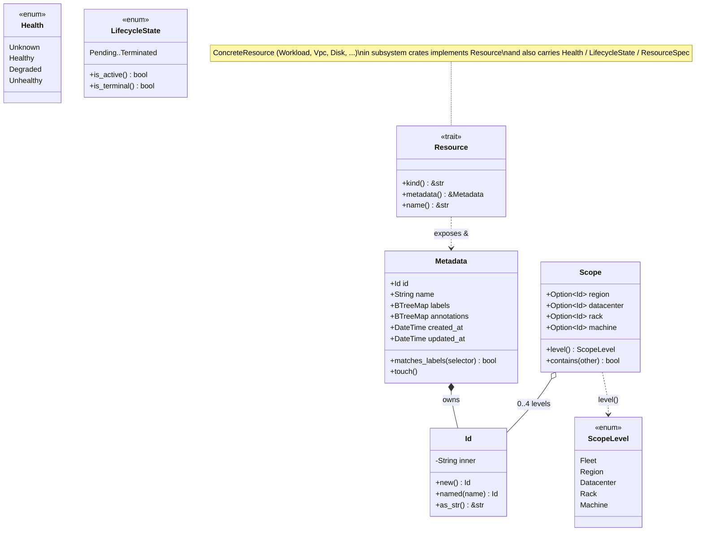

# ocf-core

> The foundational crate: the shared contracts and domain types every other crate is built on.

| | |
|---|---|
| **Source** | [`crates/ocf-core/src/`](../../crates/ocf-core/src) |
| **Depended on by** | *Every other crate in the workspace* — `ocf-topology`, `ocf-runtime`, `ocf-auth`, `ocf-authz`, `ocf-kernel`, `ocf-inventory`, `ocf-disk`, `ocf-monitoring`, `ocf-fabric`, `ocf-network`, `ocf-loadbalancer`, `ocf-store`, `ocf-consensus`, `ocf-api`, and the `ocfd` binary. |
| **Depends on** | Only third-party crates (`thiserror`, `serde`, `serde_json`, `uuid`, `chrono`, `async-trait`). It has **no** internal dependencies — it is the root of the dependency graph. |

## Overview

`ocf-core` is the bottom of the fabric. It contains no business logic and no OS integration; it is a vocabulary. Every subsystem imports it, and no subsystem imports another subsystem's implementation. That single rule — *depend on `ocf-core`, never on a sibling* — is what makes the fabric pluggable, and `ocf-core` is the crate that defines the contracts that rule is expressed in.

The crate is organized around **three pillars**, called out in the crate-level doc comment of [`lib.rs`](../../crates/ocf-core/src/lib.rs):

1. **Resource** — [`resource::Resource`](../../crates/ocf-core/src/resource.rs) is the abstract base every managed object implements. A `Resource` guarantees it carries a [`Metadata`](../../crates/ocf-core/src/metadata.rs) block (id, name, labels, annotations, timestamps) and reports a stable `kind()` discriminator. Because every workload, VPC, disk, and load balancer is a `Resource`, generic machinery (the API serializer, audit logging, the topology indexer) can treat any object uniformly without knowing its concrete type.

2. **Provider + Registry** — [`registry::Provider`](../../crates/ocf-core/src/registry.rs) is the minimal supertrait every pluggable contract extends, and [`registry::Registry<T>`](../../crates/ocf-core/src/registry.rs) is a single generic container that stores named providers of *any* trait object `dyn T`. A subsystem declares its own provider contract (e.g. `dyn RuntimeProvider`, `dyn Authenticator`) and stands up a `Registry<dyn ThatContract>`. Concrete backends register themselves at startup, so the controller never names a specific implementation. This is the mechanism behind "contract-first / pluggable."

3. **Scope** — [`scope::Scope`](../../crates/ocf-core/src/scope.rs) names a position in the `fleet → region → datacenter → rack → machine` topology tree. The same type is reused for two unrelated concerns: **authorization** (a role binding granted at a scope covers that node and everything beneath it) and **placement** (a load balancer or HA workload may be pinned to a scope, which also bounds where it may migrate). Sharing one coordinate type keeps RBAC and the scheduler speaking the same language.

Two more cross-cutting vocabularies round out the crate: [`error`](../../crates/ocf-core/src/error.rs) (the one `Error`/`Result` every subsystem maps its failures onto, so the API layer can translate any error to a transport code without knowing its origin) and the small value types [`health`](../../crates/ocf-core/src/health.rs) (`Health`, `LifecycleState`) and [`quantity`](../../crates/ocf-core/src/quantity.rs) (`ResourceSpec`) that the scheduler, quotas, and monitoring share.

## Module map

| Module | Defines | Purpose |
|--------|---------|---------|
| [`error`](../../crates/ocf-core/src/error.rs) | `Error`, `Result<T>` | The single error enum and result alias used workspace-wide, with stable transport codes. |
| [`id`](../../crates/ocf-core/src/id.rs) | `Id` | Opaque, stable, string-backed resource identifier. |
| [`metadata`](../../crates/ocf-core/src/metadata.rs) | `Metadata` | Common bookkeeping (id, name, labels, annotations, timestamps) on every resource. |
| [`resource`](../../crates/ocf-core/src/resource.rs) | `Resource` (trait) | The abstract base contract every managed object implements. |
| [`registry`](../../crates/ocf-core/src/registry.rs) | `Provider` (trait), `Registry<T>` | The generic plugin system — named providers of any trait object. |
| [`scope`](../../crates/ocf-core/src/scope.rs) | `Scope`, `ScopeLevel` | Hierarchical placement / authorization coordinate. |
| [`health`](../../crates/ocf-core/src/health.rs) | `Health`, `LifecycleState` | Coarse health signal + generic provisioned-resource lifecycle. |
| [`quantity`](../../crates/ocf-core/src/quantity.rs) | `ResourceSpec` | CPU/memory/disk request-or-limit used by scheduling, quotas, metrics. |
| [`lib`](../../crates/ocf-core/src/lib.rs) | `prelude`, `async_trait` re-export | Crate root: module declarations and the glob-import surface. |

## Domain types

### `Error` and `Result`

[`error.rs`](../../crates/ocf-core/src/error.rs) defines the one error type the whole workspace shares. Subsystems map their failures onto these variants so the API layer can translate any error into a consistent transport representation (an HTTP status code, a machine-readable code string) without knowing which subsystem produced it.

```rust
pub type Result<T> = std::result::Result<T, Error>;

#[derive(Debug, Error)]
pub enum Error { /* variants below */ }
```

| Variant | `Display` format | Constructor | Notes |
|---------|------------------|-------------|-------|
| `NotFound(String)` | `not found: {0}` | `Error::not_found(what)` | |
| `AlreadyExists(String)` | `already exists: {0}` | `Error::already_exists(what)` | Returned by `Registry::register` on a name clash. |
| `InvalidArgument(String)` | `invalid argument: {0}` | `Error::invalid(what)` | |
| `NotSupported(String)` | `operation not supported: {0}` | `Error::unsupported(what)` | |
| `Unauthenticated(String)` | `unauthenticated: {0}` | *(none; construct directly)* | |
| `Forbidden(String)` | `forbidden: {0}` | `Error::forbidden(what)` | |
| `Conflict(String)` | `conflict: {0}` | *(none; construct directly)* | |
| `Provider { provider, message }` | `provider `{provider}` failed: {message}` | `Error::provider(provider, message)` | A failure that originated inside a named pluggable provider. |
| `Io(String)` | `i/o error: {0}` | *(via `From<std::io::Error>`)* | |
| `Serde(String)` | `serialization error: {0}` | *(via `From<serde_json::Error>`)* | |
| `Internal(String)` | `internal error: {0}` | `Error::internal(what)` | |

Key methods and conversions:

```rust
// Ergonomic constructors (each takes impl Into<String>):
pub fn not_found(what: impl Into<String>) -> Self
pub fn already_exists(what: impl Into<String>) -> Self
pub fn invalid(what: impl Into<String>) -> Self
pub fn unsupported(what: impl Into<String>) -> Self
pub fn forbidden(what: impl Into<String>) -> Self
pub fn internal(what: impl Into<String>) -> Self
pub fn provider(provider: impl Into<String>, message: impl Into<String>) -> Self

// A stable, machine-readable code for transport layers:
pub fn code(&self) -> &'static str

// Automatic conversions used pervasively with the `?` operator:
impl From<std::io::Error> for Error   // -> Error::Io
impl From<serde_json::Error> for Error // -> Error::Serde
```

The full variant → `code()` mapping is tabulated under [Error behavior](#error-behavior). Note there are no dedicated constructors for `Unauthenticated` or `Conflict` — those variants are constructed directly.

### `Id`

[`id.rs`](../../crates/ocf-core/src/id.rs) — an opaque, stable identifier for a fabric resource. It wraps a single `String` and uses `#[serde(transparent)]`, so it serializes as a bare string and reads naturally in JSON payloads and URLs.

```rust
#[derive(Debug, Clone, PartialEq, Eq, Hash, PartialOrd, Ord, Serialize, Deserialize)]
#[serde(transparent)]
pub struct Id(String);
```

| Method / impl | Signature | Behavior |
|---------------|-----------|----------|
| `new` | `pub fn new() -> Self` | Fresh random id, a `Uuid::new_v4()` string. |
| `named` | `pub fn named(name: impl Into<String>) -> Self` | Id derived from a stable, human-meaningful name (the name *is* the id). |
| `as_str` | `pub fn as_str(&self) -> &str` | Borrow the underlying string. |
| `into_string` | `pub fn into_string(self) -> String` | Consume into the owned string. |
| `Default` | `fn default() -> Self` | Delegates to `Id::new()` (random). |
| `Display` | — | Writes the inner string. |
| `From<String>`, `From<&str>`, `AsRef<str>` | — | Cheap construction and borrowing from string-like values. |

The two construction modes matter downstream: random ids (`new`) suit dynamically created resources, while name-derived ids (`named`) give deterministic, idempotent ids for things like well-known topology nodes. `Scope`'s constructors accept `impl Into<Id>`, so `Scope::region("us")` produces a named region id transparently.

### `Metadata`

[`metadata.rs`](../../crates/ocf-core/src/metadata.rs) — the common bookkeeping block carried by every resource via the `Resource` trait.

```rust
#[derive(Debug, Clone, Serialize, Deserialize)]
pub struct Metadata {
    pub id: Id,
    pub name: String,
    #[serde(default)] pub labels: BTreeMap<String, String>,
    #[serde(default)] pub annotations: BTreeMap<String, String>,
    pub created_at: DateTime<Utc>,
    pub updated_at: DateTime<Utc>,
}
```

| Field | Type | Purpose |
|-------|------|---------|
| `id` | `Id` | The resource's stable identifier. |
| `name` | `String` | Human-facing display name. |
| `labels` | `BTreeMap<String, String>` | Identifying key/values for **selection / grouping** — load-balancer target selectors, autoscaler matching. |
| `annotations` | `BTreeMap<String, String>` | Non-identifying metadata — operator notes, provider hints. |
| `created_at` | `DateTime<Utc>` | Creation timestamp. |
| `updated_at` | `DateTime<Utc>` | Last-modified timestamp; advanced by `touch()`. |

Both maps are `#[serde(default)]`, so they may be omitted from incoming JSON. `BTreeMap` (not `HashMap`) gives a deterministic, sorted serialization order.

| Method | Signature | Behavior |
|--------|-----------|----------|
| `new` | `pub fn new(name: impl Into<String>) -> Self` | Random `Id`, empty maps, `created_at == updated_at == now`. |
| `named` | `pub fn named(name: impl Into<String>) -> Self` | Same, but `id = Id::named(name)` (deterministic id from the name). |
| `with_label` | `pub fn with_label(mut self, key: impl Into<String>, value: impl Into<String>) -> Self` | Builder-style label insert; returns `self`. |
| `with_annotation` | `pub fn with_annotation(mut self, key: impl Into<String>, value: impl Into<String>) -> Self` | Builder-style annotation insert; returns `self`. |
| `matches_labels` | `pub fn matches_labels(&self, selector: &BTreeMap<String, String>) -> bool` | True if **every** selector entry is present and equal in `self.labels` (subset match). Powers selector-based features like LB target matching. |
| `touch` | `pub fn touch(&mut self)` | Stamp `updated_at` with `Utc::now()`. |

### `Health` & `LifecycleState`

[`health.rs`](../../crates/ocf-core/src/health.rs) holds the health/lifecycle vocabulary shared by all stateful resources. Both enums are `Copy` and serialize `snake_case`.

**`Health`** — a coarse health signal used by monitoring, the API, and the frontend.

| Variant | Meaning |
|---------|---------|
| `Unknown` | No signal yet (the `Default`). |
| `Healthy` | Operating normally. |
| `Degraded` | Functioning but impaired. |
| `Unhealthy` | Not functioning. |

`impl Default for Health` returns `Health::Unknown`.

**`LifecycleState`** — the generic lifecycle of a provisioned resource (a workload, a load balancer, a network, …). Not every resource visits every state.

| Variant | `is_active()` | `is_terminal()` |
|---------|:---:|:---:|
| `Pending` | | |
| `Provisioning` | | |
| `Running` | ✅ | |
| `Paused` | | |
| `Stopping` | | |
| `Stopped` | | |
| `Migrating` | ✅ | |
| `Failed` | | ✅ |
| `Terminated` | | ✅ |

```rust
// Whether the resource is doing useful work right now:
pub fn is_active(&self) -> bool   // Running | Migrating
// Whether the resource has reached a terminal state:
pub fn is_terminal(&self) -> bool // Terminated | Failed
```

### `ResourceSpec`

[`quantity.rs`](../../crates/ocf-core/src/quantity.rs) — a request or limit for the fundamental compute resources, used by scheduling, quotas, and metrics. CPU is in **millicores** (1000 = one vCPU) and memory/disk in **bytes**, mirroring container-runtime conventions so translation to a backend is lossless. The struct is `Copy` and `Default` (all-zero).

```rust
#[derive(Debug, Clone, Copy, Default, PartialEq, Eq, Serialize, Deserialize)]
pub struct ResourceSpec {
    #[serde(default)] pub cpu_millis: u64,    // 1000 = 1 vCPU
    #[serde(default)] pub memory_bytes: u64,
    #[serde(default)] pub disk_bytes: u64,
}
```

| Method | Signature | Behavior |
|--------|-----------|----------|
| `new` | `pub fn new(cpu_millis: u64, memory_bytes: u64, disk_bytes: u64) -> Self` | Construct from the three dimensions. |
| `fits_in` | `pub fn fits_in(&self, available: &ResourceSpec) -> bool` | True iff `self <= available` on **every** dimension. The core scheduler admission check. |
| `saturating_sub` | `pub fn saturating_sub(&self, used: &ResourceSpec) -> ResourceSpec` | Per-dimension saturating subtraction (never underflows below zero) — computes remaining capacity. |

### `Scope` & `ScopeLevel`

[`scope.rs`](../../crates/ocf-core/src/scope.rs) — a path from the fleet root down to (at most) a single machine. A field being `None` means "any / unscoped at this level"; `Scope::default()` (all `None`) is the whole fleet.

```rust
#[derive(Debug, Clone, Default, PartialEq, Eq, Serialize, Deserialize)]
pub struct Scope {
    #[serde(skip_serializing_if = "Option::is_none", default)] pub region: Option<Id>,
    #[serde(skip_serializing_if = "Option::is_none", default)] pub datacenter: Option<Id>,
    #[serde(skip_serializing_if = "Option::is_none", default)] pub rack: Option<Id>,
    #[serde(skip_serializing_if = "Option::is_none", default)] pub machine: Option<Id>,
}
```

Each level skips serialization when `None`, so a fleet-wide scope serializes as `{}` and a region scope as just `{"region": "..."}`.

**`ScopeLevel`** — the granularity of a `Scope`. It is `Copy` and, crucially, `PartialOrd + Ord` via explicit integer discriminants, so levels compare and sort (`Fleet < Region < … < Machine`).

| Variant | Discriminant |
|---------|:---:|
| `Fleet` | 0 |
| `Region` | 1 |
| `Datacenter` | 2 |
| `Rack` | 3 |
| `Machine` | 4 |

| Method | Signature | Behavior |
|--------|-----------|----------|
| `fleet` | `pub fn fleet() -> Self` | The entire fleet (all `None`). |
| `region` | `pub fn region(region: impl Into<Id>) -> Self` | Scope to one region. |
| `datacenter` | `pub fn datacenter(region, datacenter) -> Self` | Scope to a datacenter (region + dc set). |
| `rack` | `pub fn rack(region, datacenter, rack) -> Self` | Scope to a rack. |
| `machine` | `pub fn machine(region, datacenter, rack, machine) -> Self` | Scope to a single machine (all four set). |
| `level` | `pub fn level(&self) -> ScopeLevel` | The most specific level set (checks machine → rack → dc → region, else fleet). |
| `contains` | `pub fn contains(&self, other: &Scope) -> bool` | True if `self` is an ancestor of (or equal to) `other`: every level `self` constrains matches `other`. A grant at `self` therefore covers `other`. |

`contains` is the workhorse for both pillars that reuse `Scope`: in authz a binding at `self` applies to any `other` it contains; in placement a workload pinned to `self` may live on / migrate within any `other` it contains. The constructors all take `impl Into<Id>`, so `Scope::datacenter("us", "dc1")` works with string literals.

## The plugin system

Pluggability is realized with exactly two pieces, both in [`registry.rs`](../../crates/ocf-core/src/registry.rs).

### The `Provider` supertrait

Every pluggable contract in the fabric extends `Provider`. It is deliberately minimal — a unique name and an optional description:

```rust
pub trait Provider: Send + Sync {
    /// Globally unique identifier within its registry (e.g. "docker").
    fn name(&self) -> &str;

    /// Human-facing description shown in the UI / --list-providers.
    fn description(&self) -> &str { "" }
}
```

A subsystem's contract trait is declared as `trait RuntimeProvider: Provider { … }` (etc.), so any concrete backend automatically advertises a `name()` and `description()`. `Send + Sync` is required because providers are shared across async tasks.

### The generic `Registry<T>`

`Registry<T>` is a thread-safe, name-keyed map of providers of a **single** trait-object type `T`. `T: ?Sized` is what lets it hold unsized trait objects like `dyn RuntimeProvider`; providers are stored behind `Arc<T>` so they clone cheaply and share across tasks.

```rust
pub struct Registry<T: ?Sized> {
    providers: HashMap<String, Arc<T>>,
}
```

There is **one** registry type, instantiated **once per contract**: a subsystem builds a `Registry<dyn RuntimeProvider>`, another builds a `Registry<dyn Authenticator>`, and so on. The core crate never names any concrete provider.

| Method | Signature | Behavior |
|--------|-----------|----------|
| `new` | `pub fn new() -> Self` | Empty registry (also `Default`). |
| `register` | `pub fn register(&mut self, name: impl Into<String>, provider: Arc<T>) -> Result<()>` | Insert under `name`; returns `Err(Error::AlreadyExists(...))` if the name is taken. |
| `register_or_replace` | `pub fn register_or_replace(&mut self, name: impl Into<String>, provider: Arc<T>)` | Insert, silently overwriting any existing provider of that name. Cannot fail. |
| `get` | `pub fn get(&self, name: &str) -> Result<Arc<T>>` | Look up by name; returns `Err(Error::NotFound(...))` if absent. Returns a cloned `Arc`. |
| `contains` | `pub fn contains(&self, name: &str) -> bool` | Membership test. |
| `names` | `pub fn names(&self) -> Vec<String>` | All registered names, unordered. |
| `all` | `pub fn all(&self) -> Vec<Arc<T>>` | All registered providers. |
| `len` / `is_empty` | `pub fn len(&self) -> usize` / `pub fn is_empty(&self) -> bool` | Count helpers. |

**`register` vs. `register_or_replace`.** Use `register` at startup to catch duplicate-name bugs (two backends claiming `"docker"`); use `register_or_replace` for tests or for deliberately overriding a built-in.

### The `register_builtins` convention

Every subsystem follows the same pattern: it exposes a free function (conventionally `register_builtins`) that populates a registry with the implementations it ships, leaving the registry open for callers to add more.

```rust
// Illustrative shape used by each subsystem:
pub fn register_builtins(reg: &mut Registry<dyn RuntimeProvider>) {
    reg.register_or_replace("docker", Arc::new(DockerProvider::new()));
    reg.register_or_replace("vm",     Arc::new(VmProvider::new()));
}
```

At daemon startup `ocfd` / `ocf-api` constructs each registry, calls the subsystem's `register_builtins`, and may then layer additional providers on top. Because the controller only ever asks the registry for a provider *by name*, swapping a backend is a registration change, not a code change. See [Architecture → Contracts & Plugins](../architecture/contracts-and-plugins.md) for the end-to-end wiring.

## The Resource contract

[`resource.rs`](../../crates/ocf-core/src/resource.rs) defines the abstract base of the domain model. Every concrete resource — a workload, a VPC, a disk, a load balancer — implements `Resource`:

```rust
pub trait Resource: Send + Sync {
    /// A stable, lowercase discriminator, e.g. "workload", "vpc", "disk".
    fn kind(&self) -> &'static str;

    /// The resource's metadata block.
    fn metadata(&self) -> &Metadata;

    /// Convenience accessor for the resource's display name.
    fn name(&self) -> &str { &self.metadata().name }
}
```

| Method | Required? | Purpose |
|--------|:---:|---------|
| `kind()` | yes | A stable, lowercase type discriminator used by serializers, audit logs, and the topology indexer to tag *what* a resource is. |
| `metadata()` | yes | Returns the shared `&Metadata` block, giving uniform access to id, name, labels, annotations, and timestamps. |
| `name()` | no (default) | Shortcut for `metadata().name`; defaultable, rarely overridden. |

`Resource` is the abstract base because it is the smallest contract that lets *generic machinery* operate on *any* resource: the API serializer can emit any resource's metadata + kind, audit logging can record "kind X named Y was modified," and the topology indexer can index every object — none of them needing the concrete type. `Send + Sync` ensures resources can move across async tasks. The trait is intentionally minimal; richer per-resource behavior lives in subsystem-specific traits that the concrete type also implements.

## The prelude

`use ocf_core::prelude::*;` is the standard first line of every subsystem module. It re-exports the entire foundational vocabulary plus `serde`'s derive traits and the `async_trait` attribute, so a subsystem rarely needs to name `ocf_core::...` paths or take its own `serde` / `async-trait` dependency.

```rust
pub mod prelude {
    pub use crate::async_trait;                          // #[async_trait] for async provider traits
    pub use crate::error::{Error, Result};
    pub use crate::health::{Health, LifecycleState};
    pub use crate::id::Id;
    pub use crate::metadata::Metadata;
    pub use crate::quantity::ResourceSpec;
    pub use crate::registry::{Provider, Registry};
    pub use crate::resource::Resource;
    pub use crate::scope::{Scope, ScopeLevel};
    pub use serde::{Deserialize, Serialize};
}
```

| Brought into scope | From |
|--------------------|------|
| `async_trait` (attribute) | re-exported in `lib.rs` (originally `async_trait::async_trait`) |
| `Error`, `Result` | `error` |
| `Health`, `LifecycleState` | `health` |
| `Id` | `id` |
| `Metadata` | `metadata` |
| `ResourceSpec` | `quantity` |
| `Provider`, `Registry` | `registry` |
| `Resource` | `resource` |
| `Scope`, `ScopeLevel` | `scope` |
| `Deserialize`, `Serialize` | `serde` |

Re-exporting `async_trait` means subsystems can write `#[ocf_core::async_trait]` (or just `#[async_trait]` after the glob import) on their async provider traits without declaring their own dependency on the `async-trait` crate — keeping the dependency surface centralized in `ocf-core`.

## Diagrams

### How `Resource`, `Metadata`, `Id`, and `Scope` relate



### How a subsystem declares a `Provider` contract and registers concrete impls

```mermaid
flowchart TD
    subgraph core["ocf-core (registry.rs)"]
        P["trait Provider: Send + Sync\n  name() / description()"]
        R["struct Registry&lt;T: ?Sized&gt;\n  register / register_or_replace / get"]
    end

    subgraph sub["a subsystem crate, e.g. ocf-runtime"]
        C["trait RuntimeProvider: Provider\n  + subsystem-specific async methods"]
        I1["struct DockerProvider"]
        I2["struct VmProvider"]
        RB["fn register_builtins(reg)"]
    end

    subgraph wire["startup wiring (ocf-api / ocfd)"]
        NEW["let mut reg = Registry::&lt;dyn RuntimeProvider&gt;::new()"]
        CALL["register_builtins(&mut reg)"]
        USE["reg.get(name)? -&gt; Arc&lt;dyn RuntimeProvider&gt;"]
    end

    P -- "extended by" --> C
    C -. "implemented by" .-> I1
    C -. "implemented by" .-> I2
    R -- "parameterized as Registry&lt;dyn RuntimeProvider&gt;" --> NEW
    NEW --> CALL
    RB -- "register_or_replace(\"docker\", Arc::new(DockerProvider))" --> CALL
    I1 --> RB
    I2 --> RB
    CALL --> USE
```

## Error behavior

Every `Error` variant maps to a stable, machine-readable string via [`Error::code()`](../../crates/ocf-core/src/error.rs). Transport layers (the REST API) use these codes to drive a consistent response shape and HTTP status. The mapping is the contract; the `Display` text is human-facing detail.

| Variant | `code()` | Typical meaning |
|---------|----------|-----------------|
| `NotFound(_)` | `not_found` | Resource or provider name does not exist. |
| `AlreadyExists(_)` | `already_exists` | Name clash, e.g. `Registry::register` of a duplicate. |
| `InvalidArgument(_)` | `invalid_argument` | Caller-supplied value is malformed. |
| `NotSupported(_)` | `not_supported` | Operation not implemented for this backend/host. |
| `Unauthenticated(_)` | `unauthenticated` | Identity could not be established. |
| `Forbidden(_)` | `forbidden` | Authenticated but not authorized (RBAC denial). |
| `Conflict(_)` | `conflict` | State precondition failed / concurrent modification. |
| `Provider { .. }` | `provider_error` | A named pluggable provider failed internally. |
| `Io(_)` | `io_error` | Underlying I/O failure (from `std::io::Error`). |
| `Serde(_)` | `serde_error` | (De)serialization failure (from `serde_json::Error`). |
| `Internal(_)` | `internal` | Unexpected internal invariant violation. |

For the full HTTP-status mapping these codes feed into, see [Reference → Error Codes](../reference/error-codes.md).

## Testing

`ocf-core` keeps its tests inline (`#[cfg(test)]`) and focused on the logic that has real branching — the rest of the crate is plain data. The only `mod tests` is in [`scope.rs`](../../crates/ocf-core/src/scope.rs), exercising the `contains` / `level` semantics:

| Test | Asserts |
|------|---------|
| `fleet_contains_everything` | `Scope::fleet().contains(&Scope::datacenter("us", "dc1"))` is true, and `Scope::fleet().level() == ScopeLevel::Fleet`. |
| `region_does_not_contain_other_region` | A `us` region does **not** contain an `eu` region, but **does** contain `us/dc1` — i.e. `contains` is a true ancestor check, not equality. |

The pure value types (`Id`, `Metadata`, `ResourceSpec`, `Health`, `LifecycleState`) are primarily covered indirectly through the subsystem crates that consume them; their derived `serde` round-trips and trivial accessors carry little branching to unit-test in isolation.

## Cross-references

| Document | Why |
|----------|-----|
| [Architecture → Contracts & Plugins](../architecture/contracts-and-plugins.md) | The end-to-end story of `Provider` + `Registry` and how subsystems wire providers at startup. |
| [Architecture → Domain Model](../architecture/domain-model.md) | `Resource`, `Metadata`, `Id`, `Health`, `ResourceSpec` viewed as the system's data model. |
| [Architecture → Scopes & Placement](../architecture/scopes-and-placement.md) | How `Scope` / `ScopeLevel` drive authorization and placement. |
| [Reference → Error Codes](../reference/error-codes.md) | The `Error` enum's `code()` strings and their HTTP mapping. |
| [Subsystem → ocf-runtime](ocf-runtime.md) | A canonical `Provider`/`Registry` consumer (container & VM backends). |
| [Subsystem → ocf-auth](ocf-auth.md) | Another provider contract (`Authenticator`) built on the same registry. |
| [Subsystem → ocf-authz](ocf-authz.md) | The primary consumer of `Scope` / `Scope::contains` for RBAC. |
| [Subsystem → ocf-topology](ocf-topology.md) | Builds the `fleet → region → datacenter → rack → machine` tree that `Scope` indexes. |
