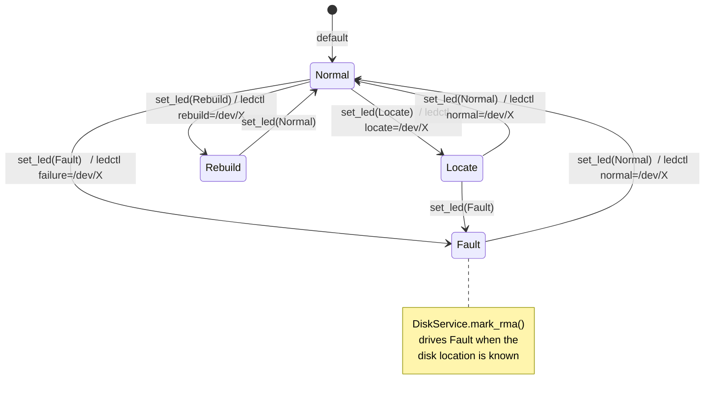

# ocf-disk

> Physical-disk inventory, SMART health, drive-bay LED control, and RMA tracking for the fabric.

*Crate: `crates/ocf-disk` · Depends on: `ocf-core` · Backends shell out to: `lsblk`, `smartctl`, `ledctl`*

## Overview

`ocf-disk` manages the physical drives behind a machine. The model is a
[`PhysicalDisk`] [`Resource`] carrying a SMART-derived [`DiskHealth`] and an
enclosure [`LedState`]. Two pluggable contracts drive the hardware:

- [`DiskManager`] enumerates disks and reads SMART. The default backend
  [`SysfsDiskManager`] shells out to `lsblk` (enumeration) and `smartctl`
  (health).
- [`LedControl`] drives the drive-bay locator/fault LED. The default backend
  [`LedctlControl`] shells out to `ledctl` (from `ledmon`).

RMA (return-to-vendor) is **bookkeeping**, not an OS action — the vendor-return
process happens off-host — so it is kept in memory keyed by serial.

Above the backends, [`DiskService`] owns the *historical* view of a drive: keyed
by serial, it tracks `first_seen` (so a re-slotted drive keeps its original
sighting) and `rma_date`, and merges that history onto every disk it lists. When
a disk is marked for RMA, the service lights its fault LED if the drive's
location is known.

A disk is identified for the lifetime of the fleet by its **`serial`** — it keeps
its serial as it moves between slots and machines, so `first_seen` and `rma_date`
are tracked against the serial, not the slot.

Both contracts extend [`Provider`], so backends are named and swappable through a
[`Registry`]. Every OS integration runs the real tool and degrades gracefully: a
missing/failed `lsblk` returns the bookkeeping view, and failures surface as an
honest [`Error::Provider`] rather than a fabricated result.

## Module map

| Module | File | Responsibility |
|--------|------|----------------|
| `lib` | `src/lib.rs` | Crate root, re-exports, `register_builtins` (managers) + `register_led_builtins` (LED) |
| `model` | `src/model.rs` | Domain model: [`DiskHealth`], [`LedState`], [`PhysicalDisk`] |
| `manager` | `src/manager.rs` | [`DiskManager`] contract + [`SysfsDiskManager`] (`lsblk`/`smartctl`) and its parsers |
| `led` | `src/led.rs` | [`LedControl`] contract + [`LedctlControl`] (`ledctl`) |
| `service` | `src/service.rs` | [`DiskService`] + [`DiskRecord`] — first-seen / RMA / last-machine bookkeeping |

## Domain types

### `DiskHealth` (enum)

Coarse SMART-derived health, mirroring `smartctl`/`smartmontools`.
`serde(rename_all = "snake_case")`. `Default == Unknown`.

| Variant | Meaning |
|---------|---------|
| `Ok` | healthy |
| `Warning` | pre-fail attributes trending bad (reallocated/pending sectors, high temp) |
| `Failing` | tripped the SMART overall-health assessment (also set by `mark_rma`) |
| `Unknown` | cannot be queried (no SMART support, unsupported HBA, …) |

`is_actionable()` → `true` for `Warning | Failing`.

### `LedState` (enum)

Drive-bay locator LED state, mapping onto the SES/enclosure states `ledctl`
drives. `serde(rename_all = "snake_case")`. `Default == Normal`.

| Variant | Meaning | `ledctl` IBPI verb |
|---------|---------|--------------------|
| `Normal` | off | `normal` |
| `Locate` | "find this drive" blink | `locate` |
| `Fault` | solid fault | `failure` |
| `Rebuild` | array rebuild in progress | `rebuild` |

### `PhysicalDisk` (struct, `impl Resource`)

A physical disk attached to a machine. `impl Resource` → `kind() == "disk"`,
metadata named after the serial.

| Field | Type | Notes |
|-------|------|-------|
| `metadata` | `Metadata` | named after `serial` |
| `machine_id` | `Id` | the machine the disk is currently attached to |
| `dev_path` | `String` | OS device path, e.g. `/dev/sda`, `/dev/nvme0n1`; best-effort (a disk behind a RAID HBA may have none) |
| `serial` | `String` | **stable fleet-wide identity** |
| `wwn` | `Option<String>` | SAS/SATA World Wide Name, when reported |
| `model` | `String` | |
| `vendor` | `String` | |
| `size_bytes` | `u64` | |
| `health` | `DiskHealth` | |
| `first_seen` | `DateTime<Utc>` | when the fabric first observed this serial; stamped to `now` by `new`, overwritten by the service |
| `rma_date` | `Option<DateTime<Utc>>` | set once marked for RMA; `skip_serializing_if = "Option::is_none"` |
| `enclosure` | `Option<String>` | SES enclosure id, when known; `skip_serializing_if` |
| `slot` | `Option<u32>` | physical slot within the enclosure, when known; `skip_serializing_if` |

Constructors/helpers: `PhysicalDisk::new(machine_id, serial)` (stamps
`first_seen = Utc::now()`, all else empty/`None`/`Unknown`); `is_rma()` →
`rma_date.is_some()`.

### `DiskRecord` (struct)

The durable, fleet-wide facts [`DiskService`] keeps about a serial, independent
of where the drive is currently slotted or whether it is reachable now.

| Field | Type | Notes |
|-------|------|-------|
| `serial` | `String` | key |
| `first_seen` | `DateTime<Utc>` | first time the fabric ever saw this serial |
| `rma_date` | `Option<DateTime<Utc>>` | `skip_serializing_if` |
| `last_machine` | `Option<Id>` | machine the disk was most recently observed on — used to re-find it and address its LED; `None` until first `list`; `skip_serializing_if` |

## Contracts

Both traits extend [`Provider`].

```rust
#[async_trait]
pub trait DiskManager: Provider {
    async fn list(&self, machine_id: &Id) -> Result<Vec<PhysicalDisk>>;
    async fn smart(&self, serial: &str) -> Result<DiskHealth>;
    async fn mark_rma(&self, serial: &str) -> Result<()>;
}

#[async_trait]
pub trait LedControl: Provider {
    async fn set_led(&self, disk: &PhysicalDisk, state: LedState) -> Result<()>;
}
```

## Concrete backends

### `SysfsDiskManager` (`name = "sysfs"`)

Backed by `lsblk` / `smartctl`, with an in-memory `disks: HashMap<String,
PhysicalDisk>` (keyed by serial) holding RMA overlays on a real host and seeded
disks in tests. `seed(disk)` inserts a known disk so the rest of the fabric has
something concrete to drive without real hardware.

| Method | Exact command | Notes |
|--------|---------------|-------|
| `list(machine_id)` | `lsblk -dn -P -b -o NAME,SERIAL,WWN,MODEL,VENDOR,SIZE` | `-d` whole disks only, `-n` no header, `-P` key=value pairs, `-b` size in bytes |
| `smart(serial)` | `smartctl -H /dev/<dev>` | dev path resolved from serial first |
| `mark_rma(serial)` | *(no command)* | pure in-memory bookkeeping |

**`list` reconciliation.** Starts from any seeded/bookkeeping records for
`machine_id`, then runs `lsblk` and adds live disks not already tracked (a seeded
record wins over the raw snapshot via `entry(...).or_insert`). A failed/missing
`lsblk` is **non-fatal** — it logs a `warn` and returns the bookkeeping view
only. Finally it overlays RMA verdicts by serial: any record with an `rma_date`
forces `rma_date` + `health = Failing` onto the matching live disk.

**`lsblk -P` parsing (`parse_lsblk_pairs` / `parse_pairs`).** `lsblk -P` emits one
space-separated `KEY="value"` record per line, e.g.
`NAME="sda" SERIAL="S1" WWN="0x5" MODEL="ST1000 NM0033" VENDOR="ATA" SIZE="1024"`.
Values are double-quoted and **may contain spaces** (common in `MODEL`), so
`parse_pairs` scans character-by-character rather than splitting on whitespace.
Mapping: `NAME` → `dev_path = /dev/<NAME>` (a line without `NAME` is skipped),
`SERIAL` → `serial`, empty `WWN` → `None`, `SIZE` parsed as `u64` (default `0`).

**SMART parsing (`parse_smart_health`).** `smartctl -H` prints an overall-health
line. Classification is case-insensitive on that line:

| `smartctl -H` line contains | → `DiskHealth` |
|-----------------------------|----------------|
| `overall-health` / `smart health status` **and** `passed` or `: ok` | `Ok` |
| `overall-health` / `smart health status` **and** `failed` | `Failing` |
| neither matched (e.g. `unable to detect device type`) | `Unknown` |

(SATA prints `SMART overall-health self-assessment test result: PASSED`/`FAILED!`;
SAS prints `SMART Health Status: OK` — both are handled.)

**Dev-path resolution (`resolve_dev_path`).** Prefers a bookkeeping/seeded
record's `dev_path`; otherwise re-runs the same `lsblk` enumeration and finds the
serial. `Error::NotFound` if the serial has no resolvable device node.

**`mark_rma`.** Materializes the serial's record on demand (creates one with
`Id::named("")` if the disk was only ever discovered live), then sets `rma_date =
Utc::now()` and `health = Failing` (idempotent — does nothing if already RMA'd)
and touches metadata.

### `LedctlControl` (`name = "ledctl"`)

Issues `ledctl <verb>=/dev/<dev>` where the verb is the IBPI pattern for the
requested [`LedState`] (`ibpi`): `Normal → normal`, `Locate → locate`,
`Fault → failure`, `Rebuild → rebuild`. Example invocations:

```
ledctl locate=/dev/sda
ledctl failure=/dev/sda
```

`ledctl` addresses the drive by its **host device node**, so `set_led` returns
`Error::InvalidArgument` when `disk.dev_path` is empty (a drive behind an opaque
RAID HBA has no node). On success, stdout is discarded.

## Service layer

[`DiskService`] orchestrates a `DiskManager` and a `LedControl` over an in-memory
`records: HashMap<String, DiskRecord>` (keyed by serial). The backend reports the
*current* view; the service owns the *historical* view and merges the two.

| Method | Behavior |
|--------|----------|
| `new(manager, led)` | build over the two backends |
| `manager()` / `led()` | accessors for the wrapped backends |
| `list(machine_id)` | `manager.list`, then for each disk: ensure a `DiskRecord` (creating one from the disk's `first_seen`), keep the **earliest** `first_seen`, set `last_machine`, and project the record's `first_seen`/`rma_date` back onto the returned disk |
| `smart(serial)` | delegate to `manager.smart` |
| `mark_rma(serial)` | record `rma_date` in the store (idempotent), call `manager.mark_rma`, then **light the fault LED** if location is known |
| `set_led(serial, state)` | `find` the live disk and drive its LED; `Error::NotFound` if the serial was never listed (location unknown) |
| `record(serial)` / `records()` | read the persistent bookkeeping record(s) |
| `find(serial)` *(private)* | re-list the disk's `last_machine` and find the serial; `Ok(None)` if location unknown or no longer present |

**LED-on-RMA.** `mark_rma` is the one place the service drives hardware as a side
effect: after recording the RMA date and telling the backend, it calls
`find(serial)` and — only if the disk's location is known — drives `LedState::Fault`
so a technician can physically locate the failed drive. A disk that has never been
listed (unknown location) is **not** an error for `mark_rma`; the LED step is
simply skipped.

## Diagrams

### `LedState` transitions (via `ledctl` IBPI verbs)



### `DiskService.list()` overlay + `mark_rma()` lighting the fault LED

```mermaid
sequenceDiagram
    participant C as Caller
    participant S as DiskService
    participant M as DiskManager (sysfs)
    participant R as records (by serial)
    participant L as LedControl (ledctl)

    Note over C,L: list(machine_id) — overlay bookkeeping
    C->>S: list(machine_id)
    S->>M: list(machine_id)
    M->>M: lsblk -dn -P -b -o NAME,SERIAL,WWN,MODEL,VENDOR,SIZE
    M-->>S: Vec<PhysicalDisk>
    loop each disk
        S->>R: entry(serial) or_insert(first_seen)
        R-->>S: DiskRecord
        S->>S: keep earliest first_seen; set last_machine
        S->>S: project first_seen + rma_date onto disk
    end
    S-->>C: Vec<PhysicalDisk> (with canonical history)

    Note over C,L: mark_rma(serial) — record + light fault LED
    C->>S: mark_rma(serial)
    S->>R: set rma_date (idempotent)
    S->>M: mark_rma(serial)
    S->>S: find(serial) via record.last_machine
    alt location known
        S->>L: set_led(disk, Fault)
        L->>L: ledctl failure=/dev/<dev>
    else never listed
        Note over S: skip LED (not an error)
    end
    S-->>C: Ok(())
```

## Public API surface

| Symbol | Kind | Summary |
|--------|------|---------|
| `register_builtins(reg)` | fn | register the `sysfs` disk manager |
| `register_led_builtins(reg)` | fn | register the `ledctl` LED backend |
| `DiskManager` | trait | `list` / `smart` / `mark_rma` |
| `SysfsDiskManager` | struct | `lsblk` + `smartctl` backend; `seed(disk)` test helper |
| `LedControl` | trait | `set_led(disk, state)` |
| `LedctlControl` | struct | `ledctl` backend |
| `DiskHealth` / `LedState` / `PhysicalDisk` | enum / enum / struct | domain model |
| `DiskService` | struct | history-merging orchestrator over both backends |
| `DiskRecord` | struct | durable per-serial bookkeeping |

## Error behavior

- **`manager::run` / `led::run`** map any failure to `Error::Provider`: a
  missing/unspawnable binary → `failed to spawn \`<cmd>\`: …`; a non-zero exit →
  `` `<cmd>` exited with <status>: <stderr>``. The manager tags the provider
  `"sysfs"`, the LED backend tags `"ledctl"`.
- **`SysfsDiskManager::list`** never fails on a missing `lsblk` — it logs `warn`
  and returns the bookkeeping view. `smart`/`resolve_dev_path` propagate the
  provider error and return `Error::NotFound` for an unresolvable serial.
- **`LedctlControl::set_led`** returns `Error::InvalidArgument` (code
  `invalid_argument`) when the disk has no `dev_path`.
- **`DiskService::set_led`** returns `Error::NotFound` when the serial has never
  been listed (its location is unknown). `mark_rma` skips the LED — not an error —
  when location is unknown.

## Testing

- **Pure parser tests with fixtures** (no host required): `parse_lsblk_pairs` /
  `parse_pairs` (spaces in `MODEL`, multiple lines + blank-line skipping, empty
  `WWN` → `None`, byte-size parsing, line without `NAME` skipped),
  `parse_smart_health` (SATA `PASSED`/`FAILED!`, SAS `Health Status: OK`,
  unparseable → `Unknown`), `ibpi` (every `LedState` maps to its verb).
- **In-memory backend tests**: `seed` + `list` returns the seeded disk without
  `lsblk`; `mark_rma` materializes an unseen serial and flags it `Failing`.
- **Service tests** (`lib.rs`) use a test-only `RecordingLed` that records the
  last `(serial, state)` instead of shelling out: `first_seen` is preserved
  across re-listings and recorded against the serial; `mark_rma` records the date
  **and drives `LedState::Fault` for the right serial**; `set_led` on a
  never-listed serial is `NotFound`. `LedctlControl::set_led` with an empty
  `dev_path` yields `invalid_argument`.
- **`#[ignore]`d real-hardware tests**: `real_lsblk_enumerates` (needs real
  `lsblk`), `real_smart_reads_health` (needs `smartctl` + a real device),
  `real_set_led` (needs `ledctl` + an enclosure).

## Cross-references

- [`ocf-core`](ocf-core.md) — [`Resource`], [`Provider`], [`Registry`], [`Id`], [`Metadata`], [`Error`].
- [`ocf-inventory`](ocf-inventory.md) — sibling hardware crate; shares the shell-out + first-seen-ledger pattern, and also reports disks (via `/sys/block`) as part of full-machine inventory.
- [`ocf-monitoring`](ocf-monitoring.md) — surfaces disk health alongside other host metrics.
- [`ocf-topology`](ocf-topology.md) — owns the machine records `machine_id` refers to.
- Architecture → [Contracts & Plugins](../architecture/contracts-and-plugins.md), [Overview → Real backends](../architecture/overview.md#real-backends).

[`DiskManager`]: ../../crates/ocf-disk/src/manager.rs
[`SysfsDiskManager`]: ../../crates/ocf-disk/src/manager.rs
[`LedControl`]: ../../crates/ocf-disk/src/led.rs
[`LedctlControl`]: ../../crates/ocf-disk/src/led.rs
[`DiskHealth`]: ../../crates/ocf-disk/src/model.rs
[`LedState`]: ../../crates/ocf-disk/src/model.rs
[`PhysicalDisk`]: ../../crates/ocf-disk/src/model.rs
[`DiskService`]: ../../crates/ocf-disk/src/service.rs
[`DiskRecord`]: ../../crates/ocf-disk/src/service.rs
[`Provider`]: ../../crates/ocf-core/src/registry.rs
[`Registry`]: ../../crates/ocf-core/src/registry.rs
[`Resource`]: ../../crates/ocf-core/src/resource.rs
[`Id`]: ../../crates/ocf-core/src/id.rs
[`Metadata`]: ../../crates/ocf-core/src/metadata.rs
[`Error::Provider`]: ../../crates/ocf-core/src/error.rs
