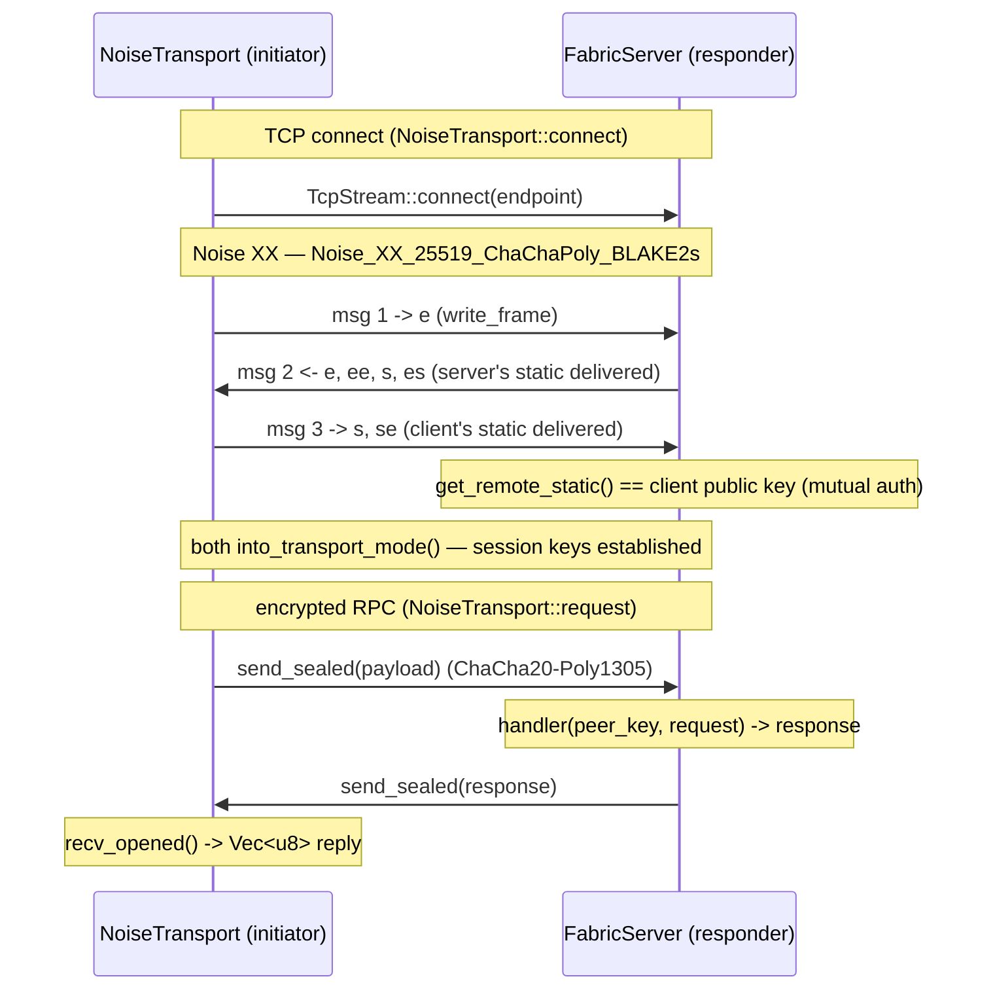
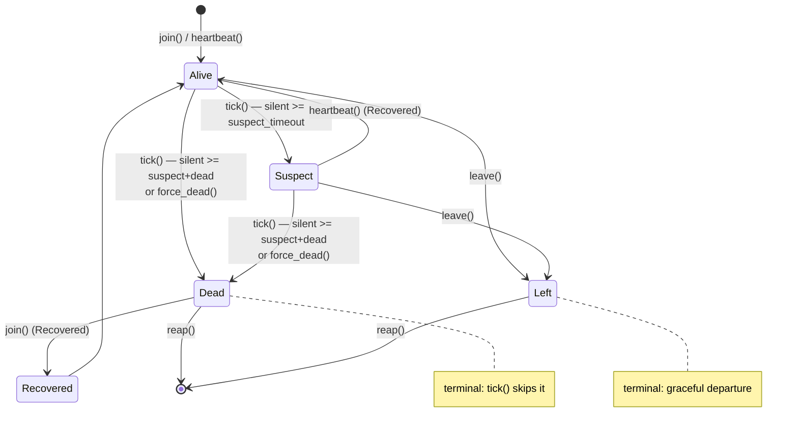

# ocf-fabric

> The encrypted host-to-host mesh: real X25519 identities, a real Noise XX handshake (X25519 + ChaCha20-Poly1305) over TCP, and a SWIM-style membership/failure detector.

| | |
|---|---|
| **Source** | `crates/ocf-fabric/src/` (`lib.rs`, `crypto.rs`, `node.rs`, `wire.rs`, `transport.rs`, `server.rs`, `mesh.rs`, `membership.rs`) |
| **Depends on** | [`ocf-core`](ocf-core.md) (prelude: `Provider`, `Registry`, `Id`, `Error`/`Result`, `Serialize`/`Deserialize`), `x25519-dalek`, `snow` (Noise), `rand`, `tokio` (TCP, `sync`), `async-trait`, `parking_lot`, `chrono` |
| **Used by** | [`ocf-consensus`](ocf-consensus.md) (the Raft RPC layer rides `NoiseTransport::request`), the controller (mesh membership + broadcast), and [`ocf-topology`](ocf-topology.md)'s `Machine.fabric_address` (the endpoint a node is dialed on) |

## Overview

`ocf-fabric` is the secure plumbing nodes use to reach each other. Everything
load-bearing here is **real**: key generation, the mutually-authenticated
handshake, frame sealing, and the membership state machine.

A node has an **identity** ([`crypto`](#identity-and-keys)): a real X25519
[`KeyPair`](#keypair) whose public-key fingerprint becomes its
[`NodeId`](#nodeid). A membership record ([`FabricNode`](#fabricnode)) carries
that identity plus dialable endpoints and a liveness timestamp.

Bytes move over a pluggable [`FabricTransport`](#fabrictransport). The built-in
[`NoiseTransport`](#noisetransport) is a real Noise XX transport —
`Noise_XX_25519_ChaChaPoly_BLAKE2s`, the same primitives WireGuard uses — over
tokio TCP, and [`FabricServer`](#fabricserver) is the matching listener.
[`NoiseTransport::request`](#the-rpc-primitive) is the one-request/one-response
RPC primitive the Raft network layer is built on. The
[`FabricMesh`](#fabricmesh) holds in-memory membership and fans broadcasts out
across the transport, while [`Membership`](#membership) runs the SWIM-style
heartbeat/failure detector.

What is still simplified (and the seams for finishing it are present): peer
discovery is seed-driven, gossip dissemination is basic, and a fuller SWIM would
add indirect probes and incarnation-number refutation. The `FabricTransport`
trait is the seam a production WireGuard data plane would slot into. See
[Architecture → Distributed Control Plane](../architecture/distributed-control-plane.md).

## Module map

| Module | File | Responsibility |
|--------|------|----------------|
| crate root | `lib.rs` | Re-exports: `fingerprint`, `KeyPair`, `NodeId`, `PublicKey`, `SecretKey`, `Liveness`, `Membership`, `MembershipEvent`, `FabricMesh`, `FabricNode`, `FabricServer`, `register_builtins`, `FabricTransport`, `NoiseTransport` |
| `crypto` | `crypto.rs` | `NodeId`, `PublicKey`/`SecretKey`/`KeyPair` (real X25519), `fingerprint`, deterministic `from_seed_name` |
| `node` | `node.rs` | `FabricNode` — a peer's membership record (identity + endpoints + `last_seen`) |
| `wire` | `wire.rs` | Length-prefixed framing + the Noise XX handshake (client/server) + seal/open helpers |
| `transport` | `transport.rs` | `FabricTransport` trait + `NoiseTransport` (real handshake over TCP, session cache, `request()` RPC) |
| `server` | `server.rs` | `FabricServer` — the listener; responder handshake + decrypt → handler → seal reply loop |
| `mesh` | `mesh.rs` | `FabricMesh` — in-memory membership map + `broadcast`/`send_to` fan-out |
| `membership` | `membership.rs` | `Membership` SWIM-style failure detector; `Liveness`, `MemberState`, `MembershipEvent`, the pure `tick(now)` |

## Identity and keys

Keys are **real Curve25519 (X25519)** keypairs (via `x25519-dalek`) — the same
static keys the Noise transport uses for its handshake, so a node's mesh identity
and its transport identity are one and the same. Keys are stored as raw bytes
with a hex view for display/serialization.

### `NodeId`

A stable mesh-level handle a peer is addressed by, typically derived from the
public-key fingerprint. `#[serde(transparent)]` newtype over `String`.
`#[derive(Debug, Clone, PartialEq, Eq, Hash, PartialOrd, Ord, Serialize, Deserialize)]`.
Distinct from [`ocf_core::id::Id`](ocf-core.md#id) (the fleet-resource id).

```rust
pub fn new(id: impl Into<String>) -> NodeId;
pub fn as_str(&self) -> &str;
// + From<String>, From<&str>, Display
```

### `PublicKey` / `SecretKey`

| Type | Notes |
|------|-------|
| `PublicKey(pub Vec<u8>)` | Raw bytes; `from_bytes`, `as_bytes`, `to_hex` (lowercase), `Display` = hex. `#[derive(... Hash, Serialize, Deserialize)]` |
| `SecretKey(pub Vec<u8>)` | Raw bytes; `from_bytes`, `as_bytes`. **Hand-rolled `Debug` prints `SecretKey("<redacted>")`** so secret bytes never leak to logs. `Serialize`/`Deserialize` so the controller can persist a node's identity — keep it out of any cross-node wire format |

### `KeyPair`

```rust
pub struct KeyPair { pub public: PublicKey, pub secret: SecretKey }

pub fn new(public: PublicKey, secret: SecretKey) -> KeyPair;
pub fn generate() -> KeyPair;                       // OS CSPRNG (rand::rngs::OsRng)
pub fn from_seed_name(name: &str) -> KeyPair;       // deterministic, for tests/fixtures
pub fn from_private_bytes(private: [u8; 32]) -> KeyPair;
pub fn node_id(&self) -> NodeId;                    // NodeId(fingerprint(&public))
```

- **`generate()`** is the production path: a `StaticSecret` from the OS CSPRNG,
  with the public key derived by real X25519 base-point multiplication.
- **`from_seed_name(name)`** mints a *deterministic* identity from a name (handy
  for fixtures/tests): the private scalar is a name-seeded 32-byte expansion
  (eight FNV-1a passes → 16-byte seed, expanded to 32 by concatenating the
  byte-reversed copy), and the public key is its real X25519 base-point product —
  so the result is a genuine Curve25519 key the Noise transport accepts. This
  expansion is **never** on the production path, so it need not be a cryptographic
  KDF.

### `fingerprint`

```rust
pub fn fingerprint(public: &PublicKey) -> String   // first min(8, len) bytes, lowercase hex
```

A short, stable fingerprint of a public key — the basis for `NodeId`.

### `FabricNode`

The mesh's view of a participating node — the membership record a peer needs to
reach another node. `#[derive(Debug, Clone, Serialize, Deserialize)]`.

| Field | Type | Notes |
|-------|------|-------|
| `node_id` | `NodeId` | Mesh-level handle |
| `machine_id` | `Option<Id>` | The fleet machine this node runs on, if known |
| `public_key` | `PublicKey` | The node's static identity key |
| `endpoints` | `Vec<String>` | Dialable mesh endpoints, e.g. `"10.0.0.4:51820"` |
| `last_seen` | `DateTime<Utc>` | Liveness timestamp |

```rust
pub fn new(node_id: NodeId, public_key: PublicKey, endpoints: Vec<String>) -> FabricNode;
pub fn from_keypair(keypair: &KeyPair, endpoints: Vec<String>) -> FabricNode;  // node_id from fingerprint
pub fn with_machine(self, machine_id: Id) -> FabricNode;  // builder
pub fn touch(&mut self);                                  // last_seen = now
pub fn primary_endpoint(&self) -> Option<&str>;           // endpoints.first() — what a transport dials
```

## Contracts

### `FabricTransport`

The pluggable contract for moving bytes between mesh nodes. Extends
[`Provider`](ocf-core.md#provider) so backends register by name in a
`Registry<dyn FabricTransport>` and the mesh never depends on a concrete
transport.

```rust
#[async_trait]
pub trait FabricTransport: Provider {
    async fn connect(&self, node: &FabricNode) -> Result<()>;
    async fn send(&self, node: &FabricNode, payload: &[u8]) -> Result<()>;
    fn is_encrypted(&self) -> bool { true }
}
```

| Method | Purpose |
|--------|---------|
| `connect(node)` | Establish (or reuse) an encrypted session to `node` |
| `send(node, payload)` | Send a frame, handshaking first if needed |
| `is_encrypted()` | Whether traffic is confidential on the wire (default `true`) |

### `NoiseTransport`

The real Noise transport: TCP + the Noise XX handshake. Each instance carries
this node's static [`KeyPair`](#keypair) (its mesh identity) and caches **one
authenticated, encrypted session per peer** in `Mutex<HashMap<NodeId, Arc<Mutex<Conn>>>>`.
`Provider::name() == "noise"`; `is_encrypted()` is the truth, not a claim.

```rust
pub fn new() -> NoiseTransport;                       // fresh KeyPair::generate()
pub fn with_keypair(keypair: KeyPair) -> NoiseTransport;
pub fn public_key(&self) -> &PublicKey;
pub async fn request(&self, node: &FabricNode, payload: &[u8]) -> Result<Vec<u8>>;
```

- **`connect`** resolves `node.primary_endpoint()`, returns early if a session is
  cached, else `TcpStream::connect`s, runs `wire::client_handshake` (as
  initiator) with this node's secret, and caches the `Conn { stream, transport }`.
- **`send`** is `request(..).map(|_| ())` — every exchange is request/response
  (the server always replies); a one-way send discards the reply.

#### The RPC primitive

```rust
pub async fn request(&self, node: &FabricNode, payload: &[u8]) -> Result<Vec<u8>>
```

`connect`s (or reuses the cached session), then over that one session:
`wire::send_sealed(payload)` out, `wire::recv_opened()` back — one sealed request
frame, one sealed response frame. This is what [`ocf-consensus`](ocf-consensus.md)'s
Raft network layer is built on.

### `FabricServer`

The matching inbound listener. Pairing a `FabricServer` (inbound) with a
`NoiseTransport` (outbound) gives a node a real, mutually-authenticated,
encrypted presence on the mesh.

```rust
pub async fn bind(addr: impl ToSocketAddrs, keypair: KeyPair) -> Result<FabricServer>;
pub fn local_addr(&self) -> SocketAddr;   // resolves an ephemeral ":0"
pub async fn run<F, Fut>(self, handler: F) -> Result<()>
where
    F: Fn(PublicKey, Vec<u8>) -> Fut + Send + Sync + 'static,
    Fut: Future<Output = Vec<u8>> + Send + 'static;
```

`run` loops `accept()`; per connection it `tokio::spawn`s `serve_conn`, which
runs `wire::server_handshake` as **responder** (learning the peer's
authenticated static public key), then loops: `recv_opened` → `handler(peer_key,
request)` → `send_sealed(response)`. The `handler` receives each decrypted frame
as `(peer_public_key, payload)` and returns the bytes to seal back; a one-way
caller ignores the (often empty) reply. Any read error (including a clean close)
ends that connection. `handler` is shared across all connections (`Arc`); spawn
`run` on a task.

### `FabricMesh`

The single-node controller's in-memory mesh view: who the peers are and how to
reach them. Membership lives in `RwLock<HashMap<NodeId, FabricNode>>`; broadcasts
drive the configured `Arc<dyn FabricTransport>`.

```rust
pub fn new(transport: Arc<dyn FabricTransport>) -> FabricMesh;
pub fn transport(&self) -> &Arc<dyn FabricTransport>;
pub fn join(&self, node: FabricNode) -> Result<()>;   // upsert by NodeId
pub fn leave(&self, node_id: &NodeId) -> Result<()>;  // idempotent
pub fn peers(&self) -> Vec<FabricNode>;
pub fn peer(&self, node_id: &NodeId) -> Result<FabricNode>;   // NotFound if absent
pub fn len(&self) -> usize;
pub fn is_empty(&self) -> bool;
pub async fn send_to(&self, node_id: &NodeId, payload: &[u8]) -> Result<()>;
pub async fn broadcast(&self, payload: &[u8]) -> Result<usize>;  // count delivered
```

`join` re-inserting the same `NodeId` replaces the prior record (how a peer
updates endpoints/liveness). `broadcast` returns the number delivered; a failure
to reach **one** peer aborts the broadcast and surfaces the error, so callers
decide on retry/quorum. (A production deployment would gossip membership rather
than hold a single-node map.)

### Membership and failure detection

#### `Liveness`

`#[derive(Debug, Clone, Copy, PartialEq, Eq, Serialize, Deserialize)]`,
`#[serde(rename_all = "snake_case")]`.

| Variant | Meaning |
|---------|---------|
| `Alive` | Heartbeats arriving; schedulable / routable |
| `Suspect` | Silent past `suspect_timeout` — a *soft* failure (maybe a slow link) |
| `Dead` | Silent past `suspect_timeout + dead_timeout`, or force-killed — terminal |
| `Left` | Graceful departure — terminal |

```rust
pub fn is_available(&self) -> bool;   // only Alive
pub fn is_terminal(&self) -> bool;    // Dead | Left
```

#### `MemberState`

The local view of one fleet member. `#[derive(Debug, Clone, Serialize, Deserialize)]`.

| Field | Type | Notes |
|-------|------|-------|
| `node` | `FabricNode` | The member's record |
| `liveness` | `Liveness` | Current state |
| `last_heartbeat` | `DateTime<Utc>` | Last time it was heard from |
| `incarnation` | `u64` | SWIM incarnation number — bumped to refute a suspicion; carried for the refutation path |

#### `MembershipEvent`

The transitions the detector emits, which the controller turns into action (evict
from load-balancer pools, reschedule HA workloads, ...).
`#[serde(rename_all = "snake_case", tag = "event", content = "node")]`.

`Joined(NodeId)`, `Recovered(NodeId)`, `Suspected(NodeId)`, `Died(NodeId)`,
`Left(NodeId)`.

#### `Membership`

A node's membership table and failure detector over
`RwLock<HashMap<NodeId, MemberState>>`.

```rust
pub fn new(local: NodeId) -> Membership;   // suspect after 5s, dead 5s after that
pub fn with_timeouts(local: NodeId, suspect_timeout: Duration, dead_timeout: Duration) -> Membership;
pub fn local(&self) -> &NodeId;

pub fn join(&self, node: FabricNode) -> MembershipEvent;          // Joined | Recovered
pub fn heartbeat(&self, id: &NodeId) -> Option<MembershipEvent>;  // Recovered if revived
pub fn heartbeat_at(&self, id: &NodeId, now: DateTime<Utc>) -> Option<MembershipEvent>;
pub fn force_dead(&self, id: &NodeId) -> Option<MembershipEvent>; // Died, bypassing suspicion
pub fn leave(&self, id: &NodeId) -> Result<MembershipEvent>;      // Left (NotFound if unknown)
pub fn tick(&self, now: DateTime<Utc>) -> Vec<MembershipEvent>;   // the pure failure detector
pub fn reap(&self) -> Vec<NodeId>;                                // remove terminal members
pub fn liveness(&self, id: &NodeId) -> Option<Liveness>;
pub fn members(&self) -> Vec<MemberState>;
pub fn alive(&self) -> Vec<FabricNode>;                           // schedulable / routable set
pub fn member_for_machine(&self, machine_id: &Id) -> Option<MemberState>;
```

`tick(now)` is the deterministic heart of the detector and is **pure in `now`**,
so the whole failure detector is unit-testable without sleeping. It advances
every non-terminal member: silent `≥ suspect_timeout + dead_timeout` → `Dead`;
else silent `≥ suspect_timeout` while `Alive` → `Suspect`. A `heartbeat`
arriving for a `Suspect` revives it to `Alive` (emitting `Recovered`); a
heartbeat for a `Left` member is ignored.

## Implementation detail

### Frame format

Every message — handshake messages and post-handshake sealed payloads alike — is
one length-prefixed frame: a `u16` big-endian length followed by that many bytes
(`write_frame`/`read_frame`). A frame body may not exceed `MAX_NOISE_MSG = 65535`
bytes (the Noise per-message cap); `write_frame` rejects anything larger with
`Error::invalid`.

```
+----------------+--------------------------------+
| len: u16 (BE)  |  body: [u8; len]  (<= 65535)   |
+----------------+--------------------------------+
```

### The Noise XX handshake

The mesh speaks **`Noise_XX_25519_ChaChaPoly_BLAKE2s`** (the constant
`wire::NOISE_PARAMS`) via `snow`: X25519 key agreement, ChaCha20-Poly1305 AEAD,
BLAKE2s hashing. XX is *mutually authenticated* — both sides learn each other's
static public key, which is what lets the server authenticate the client. The
three messages, in `snow`'s token notation, are:

```
-> e
<- e, ee, s, es
-> s, se
```

- **`client_handshake`** (initiator): `build_initiator`, then write msg 1, read
  msg 2, write msg 3, `into_transport_mode`.
- **`server_handshake`** (responder): `build_responder`, then read msg 1, write
  msg 2, read msg 3, `get_remote_static()` (the peer's authenticated key),
  `into_transport_mode`. Returns `(TransportState, remote_static_bytes)`.

After the handshake both peers hold a `snow::TransportState` and every subsequent
frame is sealed: `send_sealed` (`transport.write_message`) and `recv_opened`
(`transport.read_message`).

## Diagrams

### Noise XX handshake + encrypted RPC (centerpiece)

A `NoiseTransport` client dials a `FabricServer`, completes the three-message XX
handshake, and then runs one sealed request/response exchange. The server learns
the client's authenticated static key during the handshake.



### Membership lifecycle (centerpiece)

A member's state machine, driven by `tick(now)` (timeouts), `heartbeat`,
`join`/`leave`, and `force_dead`. `Dead` and `Left` are terminal; `reap` removes
them from the table.



> `join()` on a `Dead`/`Suspect` member emits `Recovered` and returns it to
> `Alive` (the transient "Recovered" node above is the `MembershipEvent`, not a
> persisted `Liveness`); `join()` on a brand-new or already-`Alive` member emits
> `Joined`. `heartbeat()` for a `Left` member is ignored.

## Public API surface

| Item | Signature | What it gives you |
|------|-----------|-------------------|
| `KeyPair::generate` | `fn() -> KeyPair` | A fresh X25519 identity (OS CSPRNG) |
| `KeyPair::from_seed_name` | `fn(&str) -> KeyPair` | A deterministic test/fixture identity |
| `KeyPair::node_id` | `fn(&self) -> NodeId` | The fingerprint-derived mesh id |
| `fingerprint` | `fn(&PublicKey) -> String` | Short hex fingerprint of a key |
| `FabricNode::from_keypair` | `fn(&KeyPair, Vec<String>) -> FabricNode` | A membership record from an identity + endpoints |
| `FabricTransport` | trait (above) | The transport contract to implement (e.g. WireGuard) |
| `NoiseTransport::new` / `with_keypair` | `fn() -> Self` / `fn(KeyPair) -> Self` | The real Noise transport |
| `NoiseTransport::request` | `async fn(&self, &FabricNode, &[u8]) -> Result<Vec<u8>>` | One sealed request → one sealed reply (the RPC primitive) |
| `register_builtins` | `fn(&mut Registry<dyn FabricTransport>) -> Result<()>` | Register `"noise"` |
| `FabricServer::bind` | `async fn(addr, KeyPair) -> Result<FabricServer>` | Bind the inbound listener |
| `FabricServer::run` | `async fn(self, handler) -> Result<()>` | Serve forever; decrypt → handler → seal reply |
| `FabricMesh::new` | `fn(Arc<dyn FabricTransport>) -> FabricMesh` | An empty mesh over a transport |
| `FabricMesh::broadcast` | `async fn(&self, &[u8]) -> Result<usize>` | Fan a payload to every peer |
| `Membership::new` / `with_timeouts` | `fn(NodeId) -> Self` / `fn(NodeId, Duration, Duration) -> Self` | The failure detector |
| `Membership::tick` | `fn(&self, DateTime<Utc>) -> Vec<MembershipEvent>` | Advance the detector to `now` (pure) |
| `Membership::alive` | `fn(&self) -> Vec<FabricNode>` | The schedulable / routable set |

## Error behavior

Every fallible operation returns [`ocf_core::Result`](ocf-core.md#error).

- **Noise/transport failures** are reported as `Error::Provider { provider:
  "noise", .. }` (code `provider_error`): handshake read/write, frame I/O, sealing
  parameters, `bind`/`accept`/`local_addr`, and a failed `dial` (`connect`).
  `write_frame` rejects an over-`65535`-byte body with `Error::invalid`
  (`invalid_argument`).
- **`NoiseTransport::connect`** also returns `Error::invalid` when `node` has no
  endpoint; `request` returns `Error::internal` if a just-inserted session has
  vanished from the cache.
- **`FabricMesh`** — `peer`/`send_to` return `Error::not_found` for an unknown
  `NodeId`; `join`/`leave` are infallible (`Ok`); `broadcast` propagates the
  first peer's transport error and aborts.
- **`Membership::leave`** returns `Error::not_found` for an unknown member; every
  other method is infallible (`tick`/`reap`/`force_dead`/`heartbeat`/`join`
  return values, not `Result`).

| Variant | Code | When |
|---------|------|------|
| `Provider { provider: "noise", .. }` | `provider_error` | handshake, framing, dial, bind/accept, seal/open failures |
| `InvalidArgument` | `invalid_argument` | over-size frame; node with no endpoint |
| `NotFound` | `not_found` | unknown mesh peer / unknown member on `leave` |
| `Internal` | `internal` | a cached Noise session vanished mid-`request` |

## Testing

The fabric is tested with **real sockets and real crypto** end-to-end, plus pure
state-machine tests for the detector.

- **`server` (real encrypted, mutual auth)** —
  `real_encrypted_roundtrip_and_mutual_auth`: a `FabricServer` on an ephemeral
  port and a `NoiseTransport` client run a genuine handshake; the test asserts the
  payload (`b"hello mesh"`) decrypts end-to-end **and** that the server's
  `peer_key` equals the client's real static public key (mutual authentication).
  `encrypted_request_response_rpc`: an echo-uppercase RPC server; `request(b"raft-rpc")`
  returns `b"RAFT-RPC"` over the sealed session.
- **`transport`** — `register_builtins_registers_noise`;
  `connect_to_unreachable_endpoint_errors` (dialing `127.0.0.1:1` errors rather
  than hangs).
- **`crypto`** — `generate_yields_32_byte_keys`, `seeded_keypair_is_deterministic`
  (same name → same key/`NodeId`), `hex_roundtrips_known_value`,
  `secret_debug_is_redacted`.
- **`node`** — `from_keypair_derives_node_id`.
- **`mesh`** — `join_leave_membership`, `rejoin_replaces_record`,
  `broadcast_reaches_all_peers` (via a `CountingTransport` test double),
  `send_to_unknown_peer_errors`.
- **`membership` (state machine, no sleeping)** — `alive_then_suspect_then_dead`
  drives `tick` across `+3s` (nothing), `+6s` (`Suspected`), `+11s` (`Died`),
  then `reap`; `heartbeat_revives_a_suspect` (`Suspect` → `Recovered`/`Alive`);
  `graceful_leave_is_terminal` (`Left`, then `tick` is inert). All use
  `with_timeouts(.., 5s, 5s)` and explicit timestamps, so they are fully
  deterministic.

## Cross-references

- [Architecture → Distributed Control Plane](../architecture/distributed-control-plane.md) — how the mesh, membership, and Raft consensus fit together
- [ocf-consensus](ocf-consensus.md) — the Raft RPC layer built on `NoiseTransport::request`
- [ocf-topology](ocf-topology.md) — `Machine.fabric_address`, the endpoint a `FabricNode` is dialed on
- [ocf-core](ocf-core.md) — `Provider`/`Registry` (pluggable transports), `Id`, `Error`/`Result`
- [Operations → Security](../operations/security.md) — the crypto (X25519, ChaCha20-Poly1305, Noise XX) and identity persistence
- [Reference → Error Codes](../reference/error-codes.md) — the `Error` → HTTP mapping
