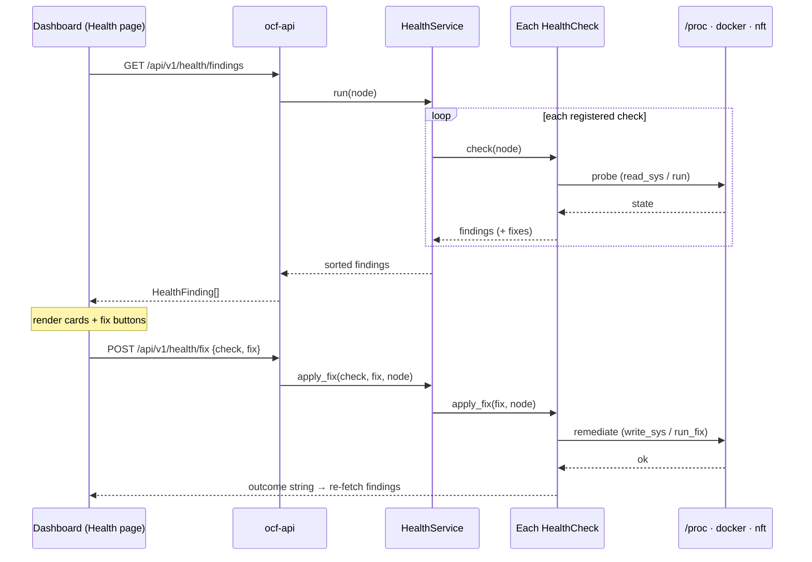

# ocf-health

> A modular fleet-health system: pluggable per-node checks that signal problems
> (kernel/runtime/network) and carry user-pressable fix actions.

- **Crate**: `ocf-health` · **Source**: `crates/ocf-health/src/` · **Depends on**: `ocf-core`
- **Used by**: [`ocf-api`](ocf-api.md) (the `FabricController` owns a `HealthService`)

## Overview

Each node runs a set of [`HealthCheck`](#the-healthcheck-contract)s. A check
inspects the **local host** and emits zero or more [`HealthFinding`](#healthfinding)s
covering three kinds of problem:

- **Missing capabilities** — *"IP forwarding not enabled on kernel"*, *"Netfilter
  (nf_tables) not enabled"*, *"Docker experimental features not enabled"*.
- **Missing packages** — *"nftables is not installed"* (cross-OS, via [`ocf-platform`](ocf-platform.md)).
- **Configuration issues** — *"Connection-tracking table is small"*, *"Swap is
  enabled"*, *"No time synchronization service active"*, *"docker.service not
  enabled at boot"*.

Every finding carries one or more [`FixAction`](#fixaction)s the operator can
press in the dashboard, and the **same check that detected the problem remediates
it** (`apply_fix`), so detection and repair live together.

Modularity comes from the fabric's usual plugin pattern: a check extends
[`Provider`](../architecture/contracts-and-plugins.md) and registers by name into
a `Registry<dyn HealthCheck>`. **Adding a new warning is adding a new
`HealthCheck`** — nothing else changes. The probes are real (read `/proc`/`/sys`,
run host tools) and the fixes are real (write sysctls, `modprobe`, `systemctl`).
A check that cannot assess the host (not Linux, tool absent) reports *nothing*
rather than guessing, so the dashboard only ever shows genuine findings.

## Module map

| Module | Defines |
|--------|---------|
| `finding` | [`Severity`](#severity), [`HealthCategory`](#healthcategory), [`FixAction`](#fixaction), [`HealthFinding`](#healthfinding) |
| `check` | the [`HealthCheck`](#the-healthcheck-contract) contract |
| `checks` | the built-in checks (one module per warning) |
| `exec` | shared probe helpers (`read_sys`, `write_sys`, `run`, `run_fix`) |
| `service` | [`HealthService`](#healthservice) — runs checks, routes fixes |

## Value types

### `Severity`
serde `snake_case`, ordered: `info` < `warning` < `critical`. Sorting findings by
descending severity puts the worst first.

### `HealthCategory`
`kernel` · `network` · `runtime` · `storage` · `other` — drives grouping/icons.

### `FixAction`
A remediation rendered as a button.

| Field | Type | Meaning |
|-------|------|---------|
| `id` | `String` | Stable id within the owning check, e.g. `"enable-ipv4-forwarding"` |
| `label` | `String` | Button text, e.g. `"Enable IP forwarding"` |
| `description` | `String` | What pressing it does (tooltip/confirm) |
| `requires_root` | `bool` | Whether it needs root on the target node |

### `HealthFinding`

| Field | Type | Meaning |
|-------|------|---------|
| `id` | `String` | `"{check}:{machine}:{kind}"` — stable across runs |
| `check` | `String` | The check (provider name) that produced it |
| `category` | `HealthCategory` | Subsystem this relates to |
| `machine_id` | `Id` | The node the finding is about |
| `severity` | `Severity` | `info`/`warning`/`critical` |
| `title` | `String` | Short title, e.g. `"IP forwarding not enabled on kernel"` |
| `detail` | `String` | Longer explanation + impact |
| `fixes` | `Vec<FixAction>` | Remediations to press (empty = nothing auto-fixable) |
| `detected_at` | `DateTime<Utc>` | When the probe ran |

## The `HealthCheck` contract

```rust
#[async_trait]
pub trait HealthCheck: Provider {
    fn category(&self) -> HealthCategory;
    async fn check(&self, machine_id: &Id) -> Result<Vec<HealthFinding>>;
    async fn apply_fix(&self, fix_id: &str, machine_id: &Id) -> Result<String> { /* default: not-found */ }
}
```

`check` returns findings (empty == healthy / not-assessable). `apply_fix` executes
a fix the check advertised and returns a human-readable outcome; the default
refuses unknown fix ids.

## Built-in checks

| Check (`name()`) | Category | Probe | Fix |
|------------------|----------|-------|-----|
| `ip-forwarding` | kernel | read `/proc/sys/net/ipv4/ip_forward` ≠ `1` | `enable-ipv4-forwarding` → write `1` |
| `netfilter` | kernel | `/proc/modules` lacks `nf_tables` | `load-nf-tables` → `modprobe nf_tables` |
| `bridge-netfilter` | network | `/proc/sys/net/bridge/bridge-nf-call-iptables` ≠ `1` (or absent) | `enable-bridge-nf` → `modprobe br_netfilter` + set `1` |
| `docker-experimental` | runtime | `docker info --format '{{.ExperimentalBuild}}'` ≠ `true` | `enable-docker-experimental` → merge `experimental:true` into `/etc/docker/daemon.json`, `systemctl restart docker` |
| `packages` | other | each required tool's binary missing from `PATH` | `install-<cap>` → install via the host's package manager ([`ocf-platform`](ocf-platform.md)) |

Each lives in its own `checks/<name>.rs` — that file is the whole warning:
detection probe, finding text, fix action, and remediation.

The `packages` check is the bridge to **cross-OS package management**: it asks
[`ocf-platform`](ocf-platform.md) which tools are missing and offers an *"Install
&lt;tool&gt;"* fix that runs the right command for the detected distro
(`apt-get`/`dnf`/`pacman`/`apk`). On a host with no supported package manager it
stays silent (nothing it can install). This is what handles *"missing packages
across operating systems"*.

## Configuration checks (declarative)

Beyond capability checks, the system covers **configuration issues** — a host
that has the tools but is set up wrong. The key is that these are *declarative*:
two reusable check types mean adding a config warning is a one-line registration,
not a new file.

| Type | Detects | Fix |
|------|---------|-----|
| `SysctlCheck::equals(path, value)` | a `/proc/sys` flag ≠ expected | `set` → write the value |
| `SysctlCheck::at_least(path, min)` | a numeric sysctl below a minimum | `set` → raise to the minimum |
| `ServiceCheck::new(unit, want_enabled)` | an **installed** systemd unit that isn't active (or not enabled at boot) — silent if the unit isn't installed | `enable-now` → `systemctl enable --now <unit>` |
| `SwapCheck` | swap enabled (`/proc/swaps`) | `disable` → `swapoff -a` |
| `TimeSyncCheck` | no chrony/timesyncd/ntp active (clock skew breaks Raft & TLS) | `enable-timesyncd` → enable `systemd-timesyncd` |

The default configuration set registered by `register_builtins`:

| Check (`name()`) | Category | Rule |
|------------------|----------|------|
| `ipv6-forwarding` | network | `net.ipv6.conf.all.forwarding` = `1` |
| `conntrack-max` | network | `nf_conntrack_max` ≥ 262144 |
| `inotify-instances` | kernel | `fs.inotify.max_user_instances` ≥ 512 |
| `swap-disabled` | kernel | swap off |
| `time-sync` | other | a time-sync service active |
| `service-docker` | runtime | `docker.service` active + enabled (if installed) |

Adding another, e.g. a strict-reverse-path-filtering fix, is one line:

```rust
reg.register("rp-filter", Arc::new(SysctlCheck::equals(
    "rp-filter", "/proc/sys/net/ipv4/conf/all/rp_filter", "2",
    HealthCategory::Network, "Strict reverse-path filtering breaks overlay routing", "…")));
```

It then appears on the dashboard with an "Apply recommended value" button, no
other change. Like every check, a config check that can't probe the host (not
Linux, sysctl absent, no systemctl) reports nothing.

## `HealthService`

The façade the controller/API use.

| Method | Behavior |
|--------|----------|
| `with_builtins()` | Build with the four checks registered |
| `run(machine_id) -> Vec<HealthFinding>` | Run every check; a failing check is logged and skipped; result sorted worst-first |
| `summary(machine_id) -> BTreeMap<severity, count>` | Severity histogram for a badge |
| `worst_severity(machine_id) -> Option<Severity>` | Coarse node rollup |
| `apply_fix(check, fix_id, machine_id) -> Result<String>` | Route a fix to its check |
| `checks() -> &Registry<dyn HealthCheck>` | Introspection (powers `/providers`) |

## How it flows



## Adding a new warning


The control plane, API, and frontend need no changes — the finding and its fix
button appear because the check is in the registry.

## REST surface

| Method | Path | Returns |
|--------|------|---------|
| `GET` | `/api/v1/health/findings` | `HealthFinding[]` for this node |
| `POST` | `/api/v1/health/fix` | apply `{ check, fix }`, returns `{ applied, outcome }` |

Full detail: [Reference → REST API](../reference/rest-api.md#health-fleet-checks).
(Note: distinct from `GET /api/v1/health`, the liveness probe.)

## Error behavior

| Situation | Result |
|-----------|--------|
| Check can't probe (not Linux, tool absent) | No finding (silent) |
| `apply_fix` with unknown check | `404` (`not_found`) |
| `apply_fix` with unknown fix id | `404` |
| Fix command fails (no `/proc`, no root, tool missing) | `500` (`provider_error`) with the real message |

## Testing

Pure detection/merge logic is unit-tested with fixtures: `nf_tables_loaded`
(parse `/proc/modules`), `bridge_nf_needs_fix`, `merge_experimental` (daemon.json
read-modify-write preserving keys), `register_builtins`, and that the service
sweep completes and routes unknown fixes to errors without panicking. The probes
themselves run for real on a Linux host.

## Cross-references

- [Contracts & Plugins](../architecture/contracts-and-plugins.md) — the `Provider`/`Registry` pattern checks use.
- [`ocf-kernel`](ocf-kernel.md) — the canonical owner of the kernel knobs some fixes touch.
- [`ocf-api`](ocf-api.md) — wiring + the REST endpoints.
- [Frontend → Overview](../frontend/overview.md) — the Health page.
