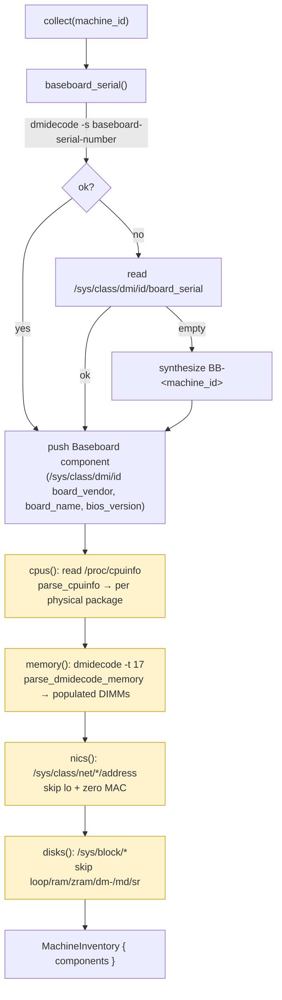
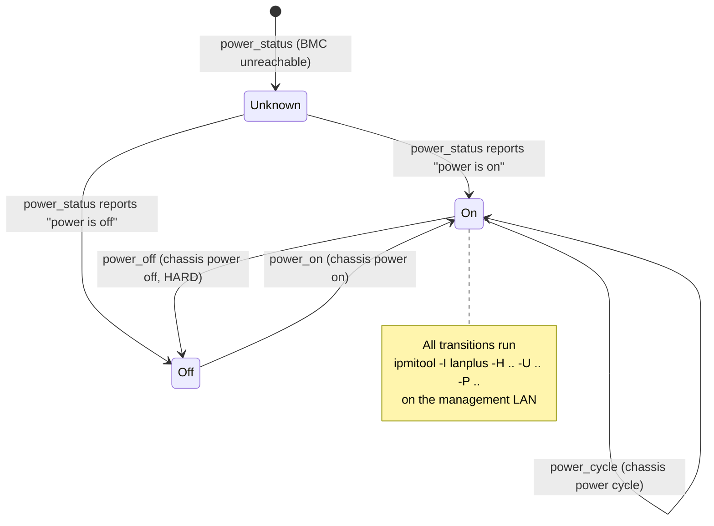

# ocf-inventory

> Hardware inventory discovery and out-of-band machine control (IPMI) for the fabric.

*Crate: `crates/ocf-inventory` · Depends on: `ocf-core` · Backends shell out to: `dmidecode`, `ipmitool` · Also reads: `/proc`, `/sys`*

## Overview

`ocf-inventory` answers two questions about the metal:

1. **What is in this machine?** — [`InventoryCollector`] discovers a machine's
   hardware (CPUs, DIMMs, NICs, disks, baseboard) as a list of
   [`HardwareComponent`]s and returns a [`MachineInventory`]. The built-in
   [`DmiInventoryCollector`] parses SMBIOS/DMI (`dmidecode`) plus Linux
   `procfs`/`sysfs`.
2. **How do I power and read it without the host OS?** — [`IpmiController`]
   drives a machine's Baseboard Management Controller (BMC) over IPMI to
   query/set chassis power and read [`Sensor`]s. The built-in [`LanplusIpmi`]
   shells out to `ipmitool -I lanplus`.

Above both backends, [`InventoryService`] keeps the latest inventory per machine
and a fleet-wide **`first_seen` ledger** keyed by component serial, so a
newly-installed part stands out and every part has an accurate age across
re-scans.

Both contracts extend [`Provider`], so backends are named and swappable through
a [`Registry`]. Every OS integration runs the *real* tool and degrades
gracefully — a missing `dmidecode`/`ipmitool` or unreadable sysfs path yields an
empty result or an honest [`Error::Provider`] rather than a fabricated reading.

> **Network requirement for IPMI.** A BMC is reachable only over the out-of-band
> management LAN it sits on — there is no routing or overlay involved. The caller
> (the host running the fabric) must already be on the **same physical management
> network** as the target BMC. The fabric does not — and cannot — tunnel IPMI for
> you. See [`ipmi.rs`](../../crates/ocf-inventory/src/ipmi.rs) module docs.

## Module map

| Module | File | Responsibility |
|--------|------|----------------|
| `lib` | `src/lib.rs` | Crate root, re-exports, combined `register_builtins(collectors, controllers)` |
| `component` | `src/component.rs` | Domain model: [`ComponentKind`], [`HardwareComponent`], [`MachineInventory`] |
| `collector` | `src/collector.rs` | [`InventoryCollector`] contract + [`DmiInventoryCollector`] (dmidecode + `/proc` + `/sys`) and its parsers |
| `ipmi` | `src/ipmi.rs` | [`IpmiController`] contract + [`LanplusIpmi`] (`ipmitool`), [`IpmiTarget`], [`PowerState`], [`Sensor`] |
| `service` | `src/service.rs` | [`InventoryService`] — in-memory store + `first_seen` ledger |
| `exec` | `src/exec.rs` | `run(cmd, args)` helper that shells out and maps failures to [`Error::Provider`] |

## Domain types

### `ComponentKind` (enum)

The category of a discovered component. `serde(rename_all = "snake_case")`.

| Variant | Source |
|---------|--------|
| `Cpu` | `/proc/cpuinfo` |
| `MemoryModule` | `dmidecode -t 17` |
| `Nic` | `/sys/class/net` |
| `Disk` | `/sys/block` |
| `Psu` | (modeled; not collected by the DMI backend) |
| `Baseboard` | `dmidecode -s baseboard-serial-number` / `/sys/class/dmi/id` |
| `Gpu` | (modeled; not collected by the DMI backend) |
| `Other` | escape hatch for recognized-but-unnamed parts (TPM, BMC, fans, …) |

### `HardwareComponent` (struct)

A single discovered piece of hardware. `serial` is the natural key the
[`InventoryService`] uses for `first_seen` tracking.

| Field | Type | Notes |
|-------|------|-------|
| `kind` | `ComponentKind` | category |
| `vendor` | `String` | `"unknown"` when the source omits it |
| `model` | `String` | model/part name |
| `serial` | `String` | natural key for the `first_seen` ledger |
| `first_seen` | `DateTime<Utc>` | when this exact part (by serial) was first observed fleet-wide; stamped to `now` by `new`, overwritten by the service |
| `attributes` | `BTreeMap<String, String>` | free-form collector facts (`threads`, `cores`, `clock_mhz`, `size`, `speed`, `media`, `mac`, …); `#[serde(default)]` |

Constructors: `HardwareComponent::new(kind, vendor, model, serial)` (stamps
`first_seen = Utc::now()`); `.with_attribute(key, value)` (builder).

### `MachineInventory` (struct, `impl Resource`)

The full hardware inventory of a single machine.

| Field | Type | Notes |
|-------|------|-------|
| `metadata` | `Metadata` | named `inventory-<baseboard_serial>` |
| `machine_id` | `Id` | ties back to an `ocf-topology` machine |
| `baseboard_serial` | `String` | stable hardware identity of the chassis (survives a re-created machine record) |
| `components` | `Vec<HardwareComponent>` | `#[serde(default)]` |

`impl Resource`: `kind() == "machine_inventory"`. Helpers:
`components_of(kind) -> impl Iterator`, `component_count() -> usize`.

### IPMI value types

| Type | Shape | Notes |
|------|-------|-------|
| `IpmiTarget` | `{ address, username, password, channel: u8 }` | BMC connection params; `IpmiTarget::new(addr, user, pass)` defaults `channel = 1` |
| `PowerState` (enum) | `On` · `Off` · `Unknown` | `Unknown` = BMC unreachable / unrecognized response |
| `Sensor` | `{ name, value: f64, unit, health: Health }` | one SDR reading; `health` is BMC-reported within-threshold status |

## Contracts

Both traits extend [`Provider`] (`name()` + `description()`).

```rust
#[async_trait]
pub trait InventoryCollector: Provider {
    async fn collect(&self, machine_id: &Id) -> Result<MachineInventory>;
}

#[async_trait]
pub trait IpmiController: Provider {
    async fn power_status(&self, target: &IpmiTarget) -> Result<PowerState>;
    async fn power_on(&self, target: &IpmiTarget) -> Result<()>;
    async fn power_off(&self, target: &IpmiTarget) -> Result<()>;   // hard off
    async fn power_cycle(&self, target: &IpmiTarget) -> Result<()>;
    async fn sensors(&self, target: &IpmiTarget) -> Result<Vec<Sensor>>;
}
```

## Concrete backends

### `DmiInventoryCollector` (`name = "dmi"`)

`collect(machine_id)` runs five independent collection steps; **each degrades
independently** (a missing tool / unreadable path yields zero components of that
kind, never a failed scan), except the baseboard identity, which is always
synthesized so the inventory is never empty.

| Step | Exact command / path | Parsing |
|------|----------------------|---------|
| Baseboard serial | `dmidecode -s baseboard-serial-number`, then fallback read of `/sys/class/dmi/id/board_serial`, then synth `BB-<machine_id>` | trim via `clean_dmi_value` |
| Baseboard identity | `/sys/class/dmi/id/board_vendor`, `/sys/class/dmi/id/board_name`, `/sys/class/dmi/id/bios_version` | `read_dmi_id`; vendor/name default `"unknown"`; `bios_version` added as attribute when present |
| CPUs | read `/proc/cpuinfo` | `parse_cpuinfo` — one component per **physical package** |
| Memory DIMMs | `dmidecode -t 17` (Type 17 = Memory Device) | `parse_dmidecode_memory` — populated slots only |
| NICs | read `/sys/class/net/*/address` (and `.../speed`) | `collect_nics` — skip `lo` and all-zero MACs |
| Disks | scan `/sys/block/*` (`device/serial`, `device/vendor`, `device/model`, `size`, `queue/rotational`) | `collect_disks` — skip pseudo devices |

**`clean_dmi_value`** trims and treats firmware placeholders as "no value":
`To Be Filled By O.E.M.`, `Not Specified`, `Default string`, `None`, `N/A`,
`0x00000000`, `00000000` (case-insensitive).

**CPU parsing (`parse_cpuinfo`).** Linux lists one block per *logical*
processor. Blocks are grouped by `physical id`; `threads` = logical processors
per package, `cores` from `cpu cores`, `clock_mhz` from `cpu MHz` (rounded down
to a whole number), identity from `model name`/`vendor_id`. Serial is synthesized
as `CPU<physical id>`. A kernel that omits `physical id` (single-socket / some
VMs / ARM) folds everything into package `0`.

**Memory parsing (`parse_dmidecode_memory`).** dmidecode prints a `Handle …`
line followed by an indented `Key: Value` block per device, separated by blank
lines. Only `Memory Device` blocks are kept; slots with `Size: No Module
Installed` (or `0`) are skipped. Keys read: `Size`, `Manufacturer`, `Part
Number`, `Serial Number`, `Locator`, `Speed`, `Type`. Serial falls back to
`DIMM-<locator>`, then `DIMM-unknown`. Attributes: `size`, `locator`, `speed`,
`type`.

**NIC parsing (`collect_nics`).** MAC (the serial) read from
`<iface>/address`; `lo` and `00:00:00:00:00:00` skipped. Link speed in Mbps read
from `<iface>/speed` and added as `speed_mbps` only when `> 0` (the kernel
reports `-1` on down links). Attributes: `interface`, `mac`, `speed_mbps`.

**Disk parsing (`collect_disks`).** Pseudo devices are skipped by name prefix:
`loop`, `ram`, `zram`, `dm-`, `md`, `sr`. Serial preference:
`device/serial` → `serial` → device name. `size_bytes` computed from the `size`
node (512-byte sectors × 512). `media` is `ssd` when `queue/rotational == 0`,
else `rotational`. Attributes: `device`, `size_bytes`, `media`.

### `LanplusIpmi` (`name = "lanplus"`)

IPMI 2.0 over the `lanplus` interface (RMCP+ on UDP/623). Every call builds
`ipmitool` with the shared base args plus a verb:

```
ipmitool -I lanplus -H <address> -U <username> -P <password> <verb...>
```

| Method | Verb appended | Output handling |
|--------|---------------|-----------------|
| `power_status` | `chassis power status` | `parse_power_status` → `On` / `Off` / `Unknown` |
| `power_on` | `chassis power on` | discard stdout |
| `power_off` | `chassis power off` | **hard** power-off (use `soft` for ACPI graceful — not wired) |
| `power_cycle` | `chassis power cycle` | discard stdout |
| `sensors` | `sdr` | `parse_sdr` → `Vec<Sensor>` |

> The `channel` field of `IpmiTarget` is part of the model but is **not**
> appended by `base_args()` in the current `lanplus` backend.

**Power parsing (`parse_power_status`).** Case-insensitive substring match:
`"power is on"` → `On`, `"power is off"` → `Off`, otherwise `Unknown` (tolerant
of surrounding noise / error text).

**Sensor parsing (`parse_sdr`).** `ipmitool sdr` emits one **pipe-delimited**
row per sensor: `name | "<value> <unit>" | status`. Each line is split on `|`
and trimmed; rows with fewer than three fields, an empty name, or a non-numeric
reading (`no reading`, `disabled`, `0x00`, …) are skipped. The reading field is
split into a leading `f64` value and a trailing unit string. The status token
maps to [`Health`]:

| SDR token | Health | Meaning |
|-----------|--------|---------|
| `ok` | `Healthy` | within thresholds |
| `nc` (or `*nc` suffix, e.g. `unc`, `lnc`) | `Degraded` | non-critical breach |
| `cr` / `nr` (or `*cr`/`*nr` suffix, e.g. `lcr`, `lnr`) | `Unhealthy` | critical / non-recoverable |
| `ns`, empty, unrecognized | `Unknown` | no state |

## Service layer

[`InventoryService`] holds two in-memory maps behind `RwLock`:

- `inventories: HashMap<Id, MachineInventory>` — latest inventory per machine.
- `first_seen: HashMap<String, DateTime<Utc>>` — the fleet-wide **ledger** of
  when each component serial was first observed.

The ledger is the point of the service. A collector stamps a fresh `first_seen`
on every component each scan, but a part that has been seen before must keep its
*original* timestamp. On `record(inventory)`, for each component the service
takes the ledger entry for its serial (inserting `min(component.first_seen,
now)` the first time a serial appears) and **rewrites** the component's
`first_seen` to that remembered value. This makes a newly-installed part stand
out and gives every part an accurate age.

| Method | Behavior |
|--------|----------|
| `record(inventory) -> MachineInventory` | reconcile every component's `first_seen` against the ledger, store, return the reconciled inventory |
| `collect_and_record(collector, machine_id) -> Result<MachineInventory>` | `collector.collect(...)` then `record(...)` |
| `get(machine_id) -> Result<MachineInventory>` | latest recorded inventory; `Error::NotFound` if none |
| `list() -> Vec<MachineInventory>` | every recorded inventory |
| `first_seen(serial) -> Option<DateTime<Utc>>` | ledger lookup |

## Diagrams

### `DmiInventoryCollector::collect()` — gathering components



Each shaded step degrades to **zero components of that kind** if its tool/path is
unavailable; only the baseboard identity is guaranteed.

### IPMI chassis power state



## Public API surface

| Symbol | Kind | Summary |
|--------|------|---------|
| `register_builtins(collectors, controllers)` | fn | register `dmi` + `lanplus` into both registries |
| `collector::register_builtins(reg)` | fn | register `dmi` collector only |
| `ipmi::register_builtins(reg)` | fn | register `lanplus` controller only |
| `InventoryCollector` | trait | `collect(machine_id)` |
| `DmiInventoryCollector` | struct | DMI/procfs/sysfs collector |
| `IpmiController` | trait | `power_status` / `power_on` / `power_off` / `power_cycle` / `sensors` |
| `LanplusIpmi` | struct | `ipmitool -I lanplus` controller |
| `IpmiTarget` | struct | BMC connection params |
| `PowerState` / `Sensor` | enum / struct | power + sensor value types |
| `ComponentKind` / `HardwareComponent` / `MachineInventory` | enum / struct / struct | domain model |
| `InventoryService` | struct | inventory store + `first_seen` ledger |
| `parse_cpuinfo` / `parse_dmidecode_memory` | fn (pub in `collector`) | exposed parsers (fixture-tested) |
| `parse_power_status` / `parse_sdr` | fn (pub in `ipmi`) | exposed parsers (fixture-tested) |

## Error behavior

- **`exec::run`** maps any tool failure to `Error::Provider { provider: <cmd>, … }`:
  a missing/unspawnable binary becomes `failed to spawn \`<cmd>\`: …`; a non-zero
  exit becomes `` `<cmd> <args>` exited <code>: <stderr|stdout>``. So a host
  without `dmidecode`/`ipmitool` produces a clear, tagged error rather than a panic.
- **Collector**: `collect` never fails on a missing per-source tool — it logs at
  `debug` and contributes zero components for that source; the only guaranteed
  output is the baseboard identity. `collect` returns `Ok` even off-Linux.
- **IPMI**: all methods propagate the `ipmitool` provider error on failure;
  `power_status` is lenient and returns `PowerState::Unknown` for unrecognized
  output rather than erroring.
- **Service**: `get` returns `Error::NotFound` for an unknown machine id.

## Testing

- **Pure parser tests with fixtures** (no host required): `parse_cpuinfo`
  (multi-socket grouping, `physical id`-less fold into package 0, MHz rounding),
  `parse_dmidecode_memory` (populated-only, locator-serial fallback),
  `clean_dmi_value` (placeholder rejection), `parse_power_status`, `parse_sdr`
  (temps/voltages/fans, skipping `no reading`/hex), `status_to_health`,
  `split_reading`, `base_args`.
- **Fake-sysfs temp-dir tests**: `collect_nics` and `collect_disks` build a
  throwaway `/sys/class/net` / `/sys/block` tree under `std::env::temp_dir()` and
  assert MAC/serial/size extraction and pseudo-device skipping, then clean up.
- **Host-independent invariants** (`lib.rs`): `collect` always reports exactly
  one `Baseboard` whose serial equals `baseboard_serial`; the service preserves
  `first_seen` across re-scans; `register_builtins` registers `dmi` + `lanplus`.
- **`#[ignore]`d real-hardware tests**: `collect_on_real_host` (Linux +
  `dmidecode`/sysfs), `power_status_on_real_bmc` (needs `ipmitool`, a reachable
  BMC, and `OCF_TEST_BMC_ADDR`/`_USER`/`_PASS` env vars).

## Cross-references

- [`ocf-core`](ocf-core.md) — [`Resource`], [`Provider`], [`Registry`], [`Health`], [`Id`], [`Error`].
- [`ocf-disk`](ocf-disk.md) — sibling hardware crate; same shell-out + first-seen-ledger pattern, for physical disks/SMART/LED/RMA.
- [`ocf-topology`](ocf-topology.md) — owns the machine records `machine_id` refers to.
- [`ocf-monitoring`](ocf-monitoring.md) — consumes BMC sensor health.
- Architecture → [Contracts & Plugins](../architecture/contracts-and-plugins.md), [Overview → Real backends](../architecture/overview.md#real-backends).

[`InventoryCollector`]: ../../crates/ocf-inventory/src/collector.rs
[`DmiInventoryCollector`]: ../../crates/ocf-inventory/src/collector.rs
[`IpmiController`]: ../../crates/ocf-inventory/src/ipmi.rs
[`LanplusIpmi`]: ../../crates/ocf-inventory/src/ipmi.rs
[`IpmiTarget`]: ../../crates/ocf-inventory/src/ipmi.rs
[`PowerState`]: ../../crates/ocf-inventory/src/ipmi.rs
[`Sensor`]: ../../crates/ocf-inventory/src/ipmi.rs
[`HardwareComponent`]: ../../crates/ocf-inventory/src/component.rs
[`MachineInventory`]: ../../crates/ocf-inventory/src/component.rs
[`ComponentKind`]: ../../crates/ocf-inventory/src/component.rs
[`InventoryService`]: ../../crates/ocf-inventory/src/service.rs
[`Provider`]: ../../crates/ocf-core/src/registry.rs
[`Registry`]: ../../crates/ocf-core/src/registry.rs
[`Resource`]: ../../crates/ocf-core/src/resource.rs
[`Health`]: ../../crates/ocf-core/src/health.rs
[`Id`]: ../../crates/ocf-core/src/id.rs
[`Error::Provider`]: ../../crates/ocf-core/src/error.rs
