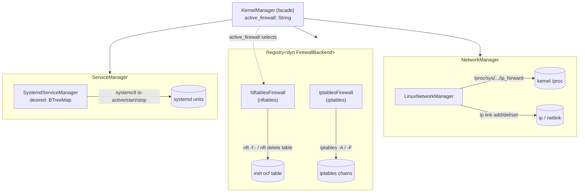

# ocf-kernel

> Host-kernel control plane: the low-level knobs the fabric turns on each
> machine — IPv4 forwarding & software bridges, host packet filtering, and host
> daemon supervision.

**Crate:** `crates/ocf-kernel` · **Depends on:** `ocf-core` · **Source:**
`lib.rs`, `network.rs`, `firewall.rs`, `service.rs`, `exec.rs`

## Overview

`ocf-kernel` bundles the three host-level subsystems the rest of the fabric
builds on, each expressed as a pluggable contract with a real Linux backend:

| Contract | Default backend | What it programs |
|----------|-----------------|------------------|
| [`NetworkManager`](#networkmanager) | `LinuxNetworkManager` | IPv4 forwarding (`/proc/sys`) + software bridges (`ip link`) |
| [`FirewallBackend`](#firewallbackend) | `NftablesFirewall` / `IptablesFirewall` | Host packet filter (`nft` / `iptables`) |
| [`ServiceManager`](#servicemanager) | `SystemdServiceManager` | Host daemon supervision + drift reconciliation (`systemctl`) |

Every OS-touching operation shells out to the real host tooling
(`ip` / `nft` / `iptables` / `systemctl`) or writes the relevant `/proc` knob.
The crate still *compiles* on any platform — `std::process` / `std::fs` are
cross-platform — but the commands only succeed on a Linux host that has the
tools installed. A missing binary or `/proc` path surfaces as a runtime
[`Error::Provider`](#error-behavior), never a panic. This is the project-wide
"real backend, honest error" rule (see [docs/README.md](../README.md)).

[`KernelManager`](#kernelmanager-facade) is the facade the controller wires up:
it owns one `NetworkManager`, a `Registry<dyn FirewallBackend>` (so the active
firewall is selectable at runtime), and one `ServiceManager`.

## Module map

| Module | File | Responsibility |
|--------|------|----------------|
| `lib` | `lib.rs` | `KernelManager` facade + re-exports |
| `network` | `network.rs` | `NetworkManager` contract + `LinuxNetworkManager` |
| `firewall` | `firewall.rs` | `FirewallBackend` contract, `FirewallRule`/`FirewallAction`, `NftablesFirewall`, `IptablesFirewall`, `register_builtins` |
| `service` | `service.rs` | `ServiceManager` contract, `ServiceState`/`ReconcileReport`, `SystemdServiceManager` |
| `exec` | `exec.rs` | `pub(crate)` helper `run(cmd, args)` — spawns host tooling, maps failure to `Error::Provider` |

## Contracts

All three contracts are `async_trait`s. `FirewallBackend` additionally extends
`ocf_core::Provider` so backends are registerable by name.

### `NetworkManager`

```rust
#[async_trait]
pub trait NetworkManager: Send + Sync {
    async fn set_ip_forwarding(&self, enabled: bool) -> Result<()>;
    async fn ensure_bridge(&self, name: &str) -> Result<()>;   // idempotent
    async fn delete_bridge(&self, name: &str) -> Result<()>;   // NotFound if absent
    async fn list_bridges(&self) -> Result<Vec<String>>;
}
```

### `FirewallBackend`

```rust
#[async_trait]
pub trait FirewallBackend: Provider {
    async fn apply(&self, rules: &[FirewallRule]) -> Result<()>; // declarative replace
    async fn flush(&self) -> Result<()>;                         // remove this backend's rules
    async fn rules(&self) -> Result<Vec<FirewallRule>>;          // last-applied, in order
}
```

Both backends keep an in-memory `RwLock<Vec<FirewallRule>>` (`applied`) copy of
the rules they last applied **purely** to answer `rules()`. The kernel holds the
authoritative state.

### `ServiceManager`

```rust
#[async_trait]
pub trait ServiceManager: Send + Sync {
    async fn status(&self, name: &str) -> Result<ServiceState>;
    async fn ensure(&self, name: &str, desired: ServiceState) -> Result<()>; // idempotent
    async fn reconcile(&self) -> Result<Vec<ReconcileReport>>;
}
```

## Concrete backends — exact commands & paths

### `LinuxNetworkManager` (`network.rs`)

Stateless; every query reads live kernel state, so it can be shared freely
across async tasks. `/proc` paths are constants:

- `IPV4_FORWARD = /proc/sys/net/ipv4/ip_forward`
- `IPV6_FORWARD = /proc/sys/net/ipv6/conf/all/forwarding`

| Method | Exact host action |
|--------|-------------------|
| `set_ip_forwarding(true/false)` | `std::fs::write("/proc/sys/net/ipv4/ip_forward", "1"\|"0")` (hard requirement); then best-effort `std::fs::write("/proc/sys/net/ipv6/conf/all/forwarding", …)` — a write failure here is logged at `debug` and **not** propagated (kernel may lack IPv6) |
| `ensure_bridge(name)` | `ip link add name <name> type bridge` then `ip link set <name> up` |
| `delete_bridge(name)` | `ip link del <name>` |
| `list_bridges()` | `ip -o link show type bridge`, parsed by `parse_bridge_names` |
| `ip_forwarding_enabled()` (inherent, not on trait) | reads `/proc/sys/net/ipv4/ip_forward`, true iff trimmed content is `"1"`; any read error → `false` |

**Idempotency / error mapping:**

- `ensure_bridge` — a re-create fails with `File exists`; the lowercased error
  is checked for `"exists"` / `"file exists"` and treated as **success** (no-op).
  An empty `name` is rejected up front with `Error::invalid`.
- `delete_bridge` — `cannot find` / `does not exist` in the error is remapped to
  `Error::not_found("bridge <name>")`; other failures propagate. Empty name →
  `Error::invalid`.
- `parse_bridge_names` — each `ip -o` line looks like
  `7: br-ocf: <BROADCAST,...> mtu 1500 ...`; the parser takes the 2nd
  colon-separated field, trims it, drops empties, and strips any `@parent`
  suffix (so `vlan10@eth0` → `vlan10`).

### `NftablesFirewall` (`firewall.rs`, `NAME = "nftables"`)

Owns a dedicated `inet ocf` table (`NFT_TABLE = "ocf"`) so a flush only touches
the fabric's rules, never the host's other tables.

| Method | Exact host action |
|--------|-------------------|
| `apply(rules)` | renders the full document with `build_nft_ruleset`, then feeds it to `nft -f -` on stdin via `nft_load`; on success caches `rules` in `applied` |
| `flush()` | `nft delete table inet ocf`, then clears `applied` |
| `rules()` | clone of the in-memory `applied` vec |

`build_nft_ruleset` emits the **atomic-replace idiom** so apply is fully
declarative:

```
add table inet ocf
delete table inet ocf
add table inet ocf
add chain inet ocf <hook> { type filter hook <hook> priority 0; policy accept; }   # one per referenced hook, deduped
add rule inet ocf <hook> <match…> <verdict>                                          # one per rule
```

- **Chain mapping** (`nft_hook_for`): `forward`→`forward`, `output`→`output`,
  anything else (default) → `input`.
- **Verdict** (`FirewallAction`): `Allow`→`accept`, `Deny`→`drop`.
- **Match assembly** from the rule's optional fields, in order: `ip saddr <src>`,
  `ip daddr <dst>`, then proto/port — `<proto> dport <n>` when `proto` is set,
  or `tcp dport <n>` (proto defaulted to tcp) when a `dport` is given without a
  proto.
- `nft_load` spawns `nft -f -`, writes the ruleset to the child's stdin, drops
  the handle to signal EOF, and waits; a non-zero exit becomes
  `Error::provider("nft", <stderr>)`.

### `IptablesFirewall` (`firewall.rs`, `NAME = "iptables"`)

Legacy backend; flushes the referenced chains, then re-adds each rule.

| Method | Exact host action |
|--------|-------------------|
| `apply(rules)` | for each distinct chain (uppercased): `iptables -F <CHAIN>`; then for each rule `iptables <args from iptables_args_for>`; caches `applied` |
| `flush()` | if `applied` is empty: `iptables -F`; otherwise `iptables -F <CHAIN>` for each distinct chain it last applied; clears `applied` |
| `rules()` | clone of `applied` |

`iptables_args_for(rule)` builds the arg vector after the leading `iptables`,
e.g. `["-A", "INPUT", "-p", "tcp", "-s", "192.168.0.0/16", "--dport", "8080", "-j", "ACCEPT"]`:

- `-A <CHAIN>` (chain uppercased),
- `-p <proto>` if proto set, else `-p tcp` when a `dport` is present (a port
  match requires a protocol),
- `-s <src_cidr>`, `-d <dst_cidr>`, `--dport <n>` as the optional fields allow,
- `-j ACCEPT` (Allow) or `-j DROP` (Deny).

> Unlike `nftables`, this backend's flush is **chain-scoped**, not table-scoped:
> it only `-F`s chains it knows about (or a bare `-F` if it never applied).

### `SystemdServiceManager` (`service.rs`)

Holds only the fabric's *intent*: `desired: RwLock<BTreeMap<String, ServiceState>>`
(`unit name -> desired state`). Live state is always read back from systemd.

| Method | Exact host action |
|--------|-------------------|
| `status(name)` | `live_state` → `systemctl is-active <name>`; **stdout is parsed regardless of exit status** (`is-active` deliberately exits non-zero for inactive/failed/missing units while still printing the state). Only a spawn failure is a hard error. |
| `ensure(name, desired)` | maps `desired` to a verb via `systemctl_verb`; `systemctl start <name>` (Running) or `systemctl stop <name>` (Stopped); records intent in `desired`. `Failed`/`Unknown` desired states have no verb → `Error::invalid`. |
| `reconcile()` | snapshots intent (no lock held across awaits); for each managed unit reads `live_state`, and if the desired state is actionable *and* differs, runs `systemctl start\|stop <name>`; returns one `ReconcileReport` per managed unit |

Helpers:

- `parse_active_state(raw)` — accepts both the bare word and the
  `ActiveState=active` form (splits on the last `=`). Mapping: `active`→`Running`,
  `inactive`/`deactivating`→`Stopped`, `failed`→`Failed`, everything else
  (incl. `activating`, `unknown`, missing unit) → `Unknown`.
- `systemctl_verb(desired)` — `Running`→`Some("start")`, `Stopped`→`Some("stop")`,
  `Failed`/`Unknown`→`None`.

### Shared exec helper (`exec.rs`)

`pub(crate) async fn run(cmd: &str, args: &[&str]) -> Result<String>` is the
single choke point for `ip` / `nft delete` / `iptables` / `systemctl start|stop`.
It runs `tokio::process::Command`, returns captured stdout on success, and on a
non-zero exit builds `Error::provider(cmd, "`<cmd> <args>` exited <code>: <msg>")`
where `<msg>` is the trimmed stderr (falling back to stdout). A spawn failure
(binary absent, non-Linux) likewise becomes a provider error tagged with `cmd`.

> Note: the firewall module's `nft_load` and the service module's `is-active`
> call build `Command` directly (they need stdin piping / exit-status-tolerant
> parsing respectively) rather than going through `run`.

## `KernelManager` facade

```rust
pub struct KernelManager {
    network: Arc<dyn NetworkManager>,
    firewalls: Registry<dyn FirewallBackend>,
    services: Arc<dyn ServiceManager>,
    active_firewall: String,   // name of the firewall backend apply_firewall uses
}
```

- `new(network, firewalls, services, active_firewall)` — explicit wiring.
- `with_defaults()` — `LinuxNetworkManager`, both built-in firewalls registered
  (`register_builtins`), `SystemdServiceManager`, with `active_firewall =
  NftablesFirewall::NAME` (`"nftables"`).
- `set_active_firewall(name)` — errors `Error::not_found("firewall backend
  `<name>`")` if the registry doesn't contain it.
- `firewall()` — resolves the active backend from the registry.
- `apply_firewall(rules)` — `self.firewall()?.apply(rules).await`.

## Diagram — `KernelManager` bundling the three contracts



## Public API surface

| Item | Kind | Notes |
|------|------|-------|
| `KernelManager` | struct | facade; `new`, `with_defaults`, `network`, `firewalls`, `services`, `active_firewall`, `set_active_firewall`, `firewall`, `apply_firewall` |
| `NetworkManager` | trait | re-exported from `network` |
| `LinuxNetworkManager` | struct | `new`, `ip_forwarding_enabled` (inherent), `Default` |
| `FirewallBackend` | trait | extends `Provider`; re-exported from `firewall` |
| `FirewallRule` | struct | `id, chain, action, proto?, src_cidr?, dst_cidr?, dport?`; builder: `new`, `with_proto/with_src/with_dst/with_dport` |
| `FirewallAction` | enum | `Allow` \| `Deny` (serde `snake_case`) |
| `NftablesFirewall` | struct | `NAME = "nftables"`, `new`, `Default`, `Provider`, `FirewallBackend` |
| `IptablesFirewall` | struct | `NAME = "iptables"`, `new`, `Default`, `Provider`, `FirewallBackend` |
| `register_builtins(&mut Registry<dyn FirewallBackend>)` | fn | registers `nftables` + `iptables` |
| `ServiceManager` | trait | re-exported from `service` |
| `ServiceState` | enum | `Running \| Stopped \| Failed \| Unknown` (serde `snake_case`) |
| `ReconcileReport` | struct | `service, desired, previous, changed` |
| `SystemdServiceManager` | struct | `new`, `Default`, `ServiceManager` |
| `exec::run` | fn | `pub(crate)` — not part of the public surface |

## Error behavior

All errors are `ocf_core::Error` (`Result<T> = Result<T, Error>`):

- **Provider failures** (`Error::Provider { provider, message }`) — any host
  command that exits non-zero or can't be spawned; `provider` is the binary name
  (`ip`, `nft`, `iptables`, `systemctl`). Spawn failure on a non-Linux box or
  with the binary absent lands here too — honest error, no panic.
- **`Error::InvalidArgument`** — empty bridge name, empty service name, or a
  service `ensure` to an unactionable state (`Failed`/`Unknown`).
- **`Error::NotFound`** — `delete_bridge` of an absent bridge; selecting an
  unregistered firewall backend.
- **Idempotency swallowing** — `ensure_bridge` treats `File exists` as success;
  `set_ip_forwarding` swallows the IPv6 write error (logged at `debug`).
- **`Error::Io`** — surfaces via `From<std::io::Error>` for the `/proc` writes in
  `set_ip_forwarding` (the IPv4 write).

## Testing

Pure helper tests run anywhere (no host tooling needed):

| Test | Subject |
|------|---------|
| `network::parses_bridge_names_from_ip_output`, `parses_empty_output_to_no_bridges`, `strips_at_parent_suffix` | `parse_bridge_names` |
| `firewall::nft_ruleset_recreates_table_and_emits_rule`, `nft_ruleset_maps_deny_to_drop_and_chains_to_hooks`, `nft_port_without_proto_defaults_to_tcp` | `build_nft_ruleset` |
| `firewall::iptables_args_render_full_match`, `iptables_deny_maps_to_drop_and_defaults_proto_for_port` | `iptables_args_for` |
| `firewall::register_builtins_registers_both` | registry wiring |
| `service::parses_bare_is_active_words`, `parses_show_property_form` | `parse_active_state` |
| `service::ensure_rejects_unactionable_state` | `ensure` validation (reached before any `systemctl`) |
| `lib::defaults_wire_up` | `KernelManager::with_defaults` + firewall selection |

`#[ignore]`d host tests (need root + Linux tooling):
`network::bridge_lifecycle_is_idempotent`, `network::forwarding_toggles`,
`firewall::nftables_apply_and_flush`, `service::ensure_sets_status`,
`service::reconcile_fixes_drift`, `lib::defaults_wire_up_and_apply`.

## Cross-references

- [`ocf-core`](ocf-core.md) — `Provider`, `Registry`, `Error`, `Id` used here.
- [`ocf-network`](ocf-network.md) — the *overlay* SDN (VPC/subnet/route/ACL);
  `ocf-kernel` is the *host* dataplane prerequisite (forwarding + bridges) the
  overlay attaches to, and renders firewall policy with the same `nft -f -`
  atomic-replace idiom.
- [Architecture → Contracts & Plugins](../architecture/contracts-and-plugins.md).
