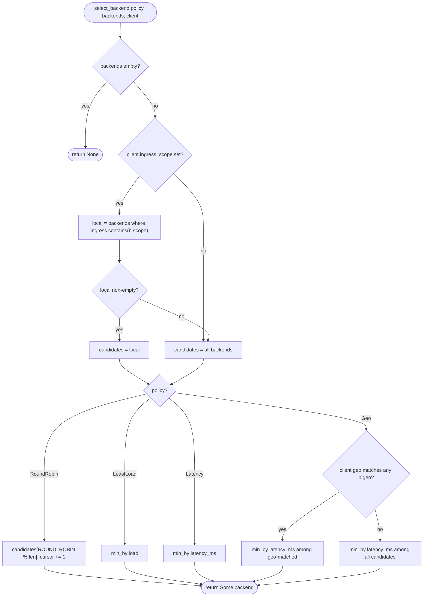

# ocf-loadbalancer

> Traffic front-ends for the fabric: policy- and ingress-aware backend selection, a real layer-4 TCP proxy, ACME (Let's Encrypt) certificate issuance, and Cloudflare dynamic DNS.

| | |
|---|---|
| **Source** | `crates/ocf-loadbalancer/src/` (`lib.rs`, `model.rs`, `routing.rs`, `proxy.rs`, `certs.rs`, `dns.rs`, `controller.rs`) |
| **Depends on** | [`ocf-core`](ocf-core.md) (prelude: `Resource`, `Metadata`, `Id`, `Scope`, `Provider`, `Registry`, `Error`/`Result`, `async_trait`, serde), `tokio` (net + process), `parking_lot`, `chrono` |
| **Used by** | [`ocf-api`](ocf-api.md) (load-balancer CRUD + resolution endpoints), `ocfd` (running the TCP data plane), any caller publishing DNS or issuing TLS for a front-end |

## Overview

`ocf-loadbalancer` is the fabric's edge. It is organized around **three pluggable
concerns and one stateful controller**:

- **The resource model** ([`model`](#domain-types--contracts)) — the
  [`LoadBalancer`](#loadbalancer) resource (its `placement` [`Scope`](ocf-core.md#scope),
  `anycast` flag, `hostnames`, `target_selector`, `listeners`, and `policy`), plus
  the [`Backend`](#backend) and [`ClientContext`](#clientcontext) inputs routing
  consumes.
- **The routing core** ([`routing`](#routing--the-selection-core)) —
  [`select_backend`](#select_backend), a *pure*, side-effect-free function that
  picks a backend under one of four [`RoutingPolicy`](#routingpolicy) values,
  always preferring backends local to the request's ingress scope.
- **The data plane** ([`proxy`](#the-tcp-data-plane)) —
  [`TcpLoadBalancer`](#tcploadbalancer), a **real** tokio layer-4 proxy that binds
  a listener, routes each accepted connection through `select_backend`, dials the
  chosen backend, and splices bytes with `copy_bidirectional`.
- **Certificate issuance** ([`certs`](#tls-certificates-certs)) — the
  [`CertificateProvider`](#certificateprovider) contract and the **real**
  [`LetsEncryptProvider`](#letsencryptprovider), which drives the system `certbot`.
- **Dynamic DNS** ([`dns`](#dynamic-dns-dns)) — the [`DnsProvider`](#dnsprovider)
  contract and the **real** [`CloudflareDns`](#cloudflaredns) backend, which calls
  the Cloudflare v4 API over HTTPS via the system `curl`.
- **The controller** ([`controller`](#the-controller)) —
  [`LoadBalancerController`](#loadbalancercontroller), async CRUD over load
  balancers plus `resolve`, which enforces placement before routing.

The central invariant is **placement**: a `LoadBalancer`'s `placement` scope
restricts where its targets may live — and, because a highly-available workload
may only migrate within its own scope, where they may migrate. The controller
enforces this on every `resolve`: a scoped load balancer never routes to a
backend outside its scope. See [Routing & placement detail](#routing--placement-detail).

The certificate and DNS backends are **real** in the project's sense (see the
docs [conventions](../README.md#conventions-used-in-these-docs)): they shell out
to the installed `certbot` and `curl`. On a host where those binaries are absent
(or the credentials are wrong), the calls fail with a `provider` error rather
than fabricating success.

## Module map

| Module | File | Responsibility |
|--------|------|----------------|
| crate root | `lib.rs` | Re-exports the whole public surface; `register_builtins(certs, dns)` wires the default `LetsEncryptProvider` + `CloudflareDns` into both registries |
| `model` | `model.rs` | `LbKind`, `RoutingPolicy`, `Listener`, `LoadBalancer` (impl `Resource`, `admits`), `Backend`, `ClientContext` |
| `routing` | `routing.rs` | `select_backend` and the per-policy pickers (round-robin, least-load, latency, geo) + ingress-local filtering |
| `proxy` | `proxy.rs` | `TcpLoadBalancer` — the real layer-4 forwarding data plane |
| `certs` | `certs.rs` | `Certificate`, `CertbotMode`, `CertificateProvider`, `LetsEncryptProvider` (drives `certbot`) |
| `dns` | `dns.rs` | `RecordType`, `DnsProvider`, `CloudflareDns` (drives `curl` against Cloudflare v4) |
| `controller` | `controller.rs` | `LoadBalancerController` — async CRUD + `resolve` with placement enforcement |

## Domain types / Contracts

### `LbKind`

The kind of traffic a load balancer front-ends. `#[serde(rename_all = "snake_case")]`.

| Variant | Wire | Meaning |
|---------|------|---------|
| `Tcp` | `"tcp"` | Layer-4 pass-through balancing (raw TCP). This is what [`TcpLoadBalancer`](#tcploadbalancer) serves. |
| `Application` | `"application"` | Layer-7 application (HTTP/HTTPS-aware) load balancing. |

### `RoutingPolicy`

How a load balancer chooses between healthy backends. `#[serde(rename_all = "snake_case")]`.

| Variant | Wire | Selection rule (within the ingress-local candidate set) |
|---------|------|---------|
| `RoundRobin` | `"round_robin"` | Next backend by a rotating process-global cursor. |
| `LeastLoad` | `"least_load"` | The backend with the smallest `load`. |
| `Latency` | `"latency"` | The backend with the smallest `latency_ms`. |
| `Geo` | `"geo"` | A backend whose `geo` matches the client's `geo`, else fall back to lowest latency. |

### `Listener`

A single listening port. `#[derive(Debug, Clone, Copy, …)]`.

| Field | Type | Notes |
|-------|------|-------|
| `port` | `u16` | The port the LB listens on |
| `tls` | `bool` | Whether the listener terminates TLS (`#[serde(default)]`, defaults `false`) |

```rust
pub fn tcp(port: u16) -> Listener  // tls = false
pub fn tls(port: u16) -> Listener  // tls = true
```

### `LoadBalancer`

The virtual front-end resource. `#[derive(Debug, Clone, Serialize, Deserialize)]`
and implements [`Resource`](ocf-core.md#resource) — `kind()` returns
`"loadbalancer"`, `metadata()` returns `&self.metadata`.

| Field | Type | Notes |
|-------|------|-------|
| `metadata` | [`Metadata`](ocf-core.md#metadata) | Shared bookkeeping (id, name, labels, timestamps) |
| `kind` | [`LbKind`](#lbkind) | TCP vs application |
| `listeners` | `Vec<Listener>` | Ports it listens on (`#[serde(default)]`) |
| `target_selector` | `BTreeMap<String, String>` | Label selector matching the backend workloads it fronts (`#[serde(default)]`) |
| `policy` | [`RoutingPolicy`](#routingpolicy) | How it chooses among backends |
| `placement` | `Option<Scope>` | When set, restricts where targets may **live and migrate** (`#[serde(default)]`); `None` = fleet-wide |
| `anycast` | `bool` | Advertise the same address from every ingress so the fabric steers clients to the nearest one (`#[serde(default)]`) |
| `hostnames` | `Vec<String>` | DNS hostnames that resolve to this LB (`#[serde(default)]`) |

```rust
pub fn new(name: impl Into<String>, kind: LbKind, policy: RoutingPolicy) -> LoadBalancer
pub fn with_listener(self, listener: Listener) -> Self
pub fn with_hostname(self, hostname: impl Into<String>) -> Self
pub fn with_placement(self, scope: Scope) -> Self
pub fn admits(&self, backend: &Backend) -> bool
```

**`admits`** is the placement gate (see [detail](#routing--placement-detail)):

```rust
pub fn admits(&self, backend: &Backend) -> bool {
    match &self.placement {
        None => true,                         // fleet-wide LB accepts any backend
        Some(scope) => scope.contains(&backend.scope),  // scoped LB: only in-scope backends
    }
}
```

A fleet-wide LB (no `placement`) admits any backend; a scoped LB admits only
backends whose [`Scope`](ocf-core.md#scope) it `contains`.

### `Backend`

A concrete target a load balancer can route to — the live, per-request input to
routing. `#[derive(Debug, Clone, PartialEq, Serialize, Deserialize)]`.

| Field | Type | Notes |
|-------|------|-------|
| `workload_id` | [`Id`](ocf-core.md#id) | The workload this backend belongs to |
| `address` | `String` | Reachable `host:port` of the target (what the TCP proxy dials) |
| `scope` | [`Scope`](ocf-core.md#scope) | Where the backend lives in the fleet (so a scoped LB can reject out-of-scope targets) |
| `load` | `f64` | Current load, normalized `0.0` (idle) .. `1.0` (saturated) (`#[serde(default)]`) |
| `latency_ms` | `f64` | Most recently observed round-trip latency, ms (`#[serde(default)]`) |
| `geo` | `Option<String>` | Coarse geography tag, e.g. `"us-east"` (`#[serde(default)]`) |

```rust
pub fn new(workload_id: Id, address: impl Into<String>, scope: Scope) -> Backend
pub fn with_load(self, load: f64) -> Self
pub fn with_latency(self, latency_ms: f64) -> Self
pub fn with_geo(self, geo: impl Into<String>) -> Self
```

### `ClientContext`

Request-side context the routing policy consults.
`#[derive(Debug, Clone, Default, Serialize, Deserialize)]`.

| Field | Type | Notes |
|-------|------|-------|
| `src_ip` | `Option<String>` | Source IP of the client, if known (the TCP proxy fills this from the peer address) |
| `ingress_scope` | `Option<Scope>` | Scope through which the request entered the fabric; drives ingress-locality |
| `geo` | `Option<String>` | Coarse client geography, e.g. `"eu-west"`, used by `Geo` |

```rust
pub fn new() -> ClientContext
pub fn with_src_ip(self, src_ip: impl Into<String>) -> Self
pub fn with_ingress_scope(self, scope: Scope) -> Self
pub fn with_geo(self, geo: impl Into<String>) -> Self
```

### `CertificateProvider`

The pluggable contract for issuing/renewing TLS certificates. Extends
[`Provider`](ocf-core.md#provider); `issue`/`renew` are `async` (the ACME flow is
network-bound).

```rust
#[async_trait]
pub trait CertificateProvider: Provider {
    async fn issue(&self, domains: &[String]) -> Result<Certificate>;
    async fn renew(&self, cert: &Certificate) -> Result<Certificate>;
    fn needs_renewal(&self, cert: &Certificate) -> bool {       // default
        cert.time_until_expiry(Utc::now()) <= self.renewal_window()
    }
    fn renewal_window(&self) -> Duration { Duration::days(30) } // default: ACME's 30-day convention
}
```

A [`Certificate`](#letsencryptprovider) carries `domains: Vec<String>`,
`not_after: DateTime<Utc>`, `pem_chain: String`, `pem_key: String`, and exposes
`time_until_expiry(now) -> Duration`.

### `DnsProvider`

The pluggable contract for managing authoritative DNS records. Extends
[`Provider`](ocf-core.md#provider); methods are `async` (a real DNS API is
network-bound).

```rust
#[async_trait]
pub trait DnsProvider: Provider {
    async fn upsert_record(&self, zone: &str, name: &str, record_type: RecordType, value: &str) -> Result<()>;
    async fn delete_record(&self, zone: &str, name: &str, record_type: RecordType) -> Result<()>;
}
```

`RecordType` is `A | Aaaa | Cname | Txt` (`#[serde(rename_all = "UPPERCASE")]`);
`as_label()` yields `"A" | "AAAA" | "CNAME" | "TXT"`.

## Routing & placement detail

There are **two** independent filters that protect a scoped load balancer, applied
in sequence by [`resolve`](#loadbalancercontroller):

1. **Placement admission (hard)** — the controller drops every backend the LB
   does not [`admits`](#loadbalancer). For a scoped LB this means a backend
   outside `placement` is *never even a candidate*. This is the
   "targets may only live/migrate within the placement scope" guarantee.
2. **Ingress locality (soft)** — within the admissible set, `select_backend`
   prefers backends whose scope is contained by the client's `ingress_scope`,
   *falling back* to the full admissible set when no backend is ingress-local.
   This keeps anycast/scoped traffic near the point of ingress while still
   serving a request when nothing local is up.

### The four policies

`select_backend` first computes the ingress-local candidate set, then applies the
policy within it:

```rust
pub fn select_backend(
    policy: RoutingPolicy,
    backends: &[Backend],
    client: &ClientContext,
) -> Option<Backend>
```

| Policy | Picker | Tie-break / fallback |
|--------|--------|----------------------|
| `RoundRobin` | `index = ROUND_ROBIN % candidates.len()`, then cursor `wrapping_add(1)` | Process-global `static ROUND_ROBIN: Mutex<usize>`; advances fairly, not bound to a particular LB |
| `LeastLoad` | `min_by(load)` | Ties keep the earliest candidate; `NaN` treated as worst (`partial_cmp … unwrap_or(Greater)`) so it never wins |
| `Latency` | `min_by(latency_ms)` | Same NaN/tie handling |
| `Geo` | backends with `geo == client.geo`, then `min_by(latency_ms)` among them | If `client.geo` is unset or unmatched, falls back to lowest-latency across all candidates |

`select_backend` returns `None` **only** when `backends` is empty. The
ingress-local set is computed by `ingress_local_candidates`: if
`client.ingress_scope` is set, keep backends where `ingress.contains(&b.scope)`;
if that subset is non-empty use it, otherwise use all backends.

### The TCP data plane

[`TcpLoadBalancer`](#tcploadbalancer) is the live forwarding path for
`LbKind::Tcp` — real bytes in, real bytes out, no stub. The set of backends is
supplied up front as a `Vec<Backend>` (a richer deployment would refresh it from
health checks). For each accepted connection it:

1. Builds a `ClientContext` from the peer address: `ClientContext::new().with_src_ip(peer.ip().to_string())`.
2. Calls `select_backend(policy, backends, &ctx)` — `None` ⇒ `provider("tcp_lb", "no backend available")`.
3. Dials the chosen backend with `TcpStream::connect(&backend.address)`.
4. Splices the two sockets with `tokio::io::copy_bidirectional(&mut client, &mut upstream)` until either side closes.

Each connection runs on its own `tokio::spawn` task; a connection that fails
(no backend, refused dial, or splice error) is logged at `warn` and dropped while
the listener keeps accepting. `run()` only returns `Err` if `accept()` itself
fails fatally.

### TLS certificates (`certs`)

[`LetsEncryptProvider`](#letsencryptprovider) drives the system `certbot`
(default binary `"certbot"`, resolved on `PATH`; configurable). The exact commands:

- **Issue** (`issue(domains)`), with `mode.flag()` being `--standalone` (default)
  or `--webroot`:

  ```
  certbot certonly --non-interactive --agree-tos -m <account_email> <--standalone|--webroot> -d <domain> [-d <domain> …]
  ```

- **Renew** (`renew(cert)`), keyed on the primary (first) domain:

  ```
  certbot renew --cert-name <primary-domain> --non-interactive
  ```

After a successful run it reads the issued PEMs from certbot's live directory and
assembles a `Certificate`:

```
/etc/letsencrypt/live/<primary-domain>/fullchain.pem   -> Certificate.pem_chain
/etc/letsencrypt/live/<primary-domain>/privkey.pem     -> Certificate.pem_key
```

`not_after` is derived from the chain when possible; the crate ships **no X.509
parser** (`not_after_from_chain` currently returns `None`), so it falls back to
`Utc::now() + fallback_validity` (default 90 days — Let's Encrypt's cert
lifetime). A missing `certbot` binary or non-zero exit maps onto
`Error::provider("acme", …)`; an empty `domains` slice is rejected with
`Error::invalid`.

### Dynamic DNS (`dns`)

[`CloudflareDns`](#cloudflaredns) calls the Cloudflare v4 API
(`https://api.cloudflare.com/client/v4`) over HTTPS by shelling out to `curl`
(so the crate takes **no Rust HTTP dependency**), authenticating with
`Authorization: Bearer <api_token>` (the token is **never logged or included in
any error text**). Every invocation is `curl --silent --show-error …`.

`upsert_record(zone, name, type, value)` is a three-step flow:

1. **Resolve the zone id** — `GET /zones?name=<zone>`; error `cloudflare`,
   "zone `<zone>` not found", if absent.
2. **Look up an existing record** — `GET /zones/<zone_id>/dns_records?type=<TYPE>&name=<name>`.
3. **Create or update**:
   - new: `POST /zones/<zone_id>/dns_records` with body `record_json(...)`
   - existing: `PUT  /zones/<zone_id>/dns_records/<record_id>` with the same body

   ```bash
   curl --silent --show-error -X POST "https://api.cloudflare.com/client/v4/zones/<zone_id>/dns_records" \
     -H "Authorization: Bearer <token>" -H "Content-Type: application/json" \
     -d '{"type":"A","name":"www","content":"203.0.113.7","ttl":1,"proxied":false}'
   ```

`delete_record` resolves the zone id, looks up the record, and if present issues
`DELETE /zones/<zone_id>/dns_records/<record_id>`.

The JSON body is built **by hand** (`record_json`) — `{"type":…,"name":…,"content":…,"ttl":1,"proxied":false}`
— with `name`/`value` run through `json_escape`. Responses are validated by
scanning for a `"success": true` member (`contains_success_true`, whitespace-tolerant)
rather than parsing JSON; `first_id` extracts the first `"id":"…"`. A successful
upsert/delete updates a local `records` cache (a convenience for introspection
and tests, *not* the source of truth — Cloudflare is).

## Diagrams

### `select_backend` — choosing per policy and ingress



### A client connection through `TcpLoadBalancer` to a chosen backend

```mermaid
sequenceDiagram
    participant C as Client
    participant LB as TcpLoadBalancer
    participant SEL as select_backend
    participant B as Backend (upstream)

    C->>LB: TCP connect
    LB->>LB: accept() -> (client, peer)
    Note over LB: spawn task; ctx = ClientContext.with_src_ip(peer.ip())
    LB->>SEL: select_backend(policy, backends, ctx)
    alt no candidate
        SEL-->>LB: None
        LB-->>C: drop (provider "tcp_lb": no backend available, logged)
    else chosen
        SEL-->>LB: Some(backend)
        LB->>B: TcpStream::connect(backend.address)
        B-->>LB: upstream stream
        LB->>B: copy_bidirectional(client, upstream)
        B-->>C: bytes relayed both ways until close
    end
```

## Public API surface

| Item | Signature | What it gives you |
|------|-----------|-------------------|
| `select_backend` | `fn(RoutingPolicy, &[Backend], &ClientContext) -> Option<Backend>` | The pure routing core (ingress-aware, per-policy) |
| `LoadBalancer::new` | `fn(name, LbKind, RoutingPolicy) -> LoadBalancer` | A front-end with no listeners yet |
| `LoadBalancer::with_placement` | `fn(self, Scope) -> Self` | Pin the LB (and its targets) to a scope |
| `LoadBalancer::admits` | `fn(&self, &Backend) -> bool` | Whether a backend is allowed under `placement` |
| `Backend::new` | `fn(Id, address, Scope) -> Backend` + `with_load/with_latency/with_geo` | A routable target |
| `ClientContext::new` | `fn() -> ClientContext` + `with_src_ip/with_ingress_scope/with_geo` | Request-side facts |
| `LoadBalancerController::new` | `fn() -> LoadBalancerController` | An empty in-memory controller |
| `LoadBalancerController::{create,get,list,update,delete}` | `async fn … -> Result<…>` | CRUD over load balancers |
| `LoadBalancerController::resolve` | `async fn(&Id, &ClientContext, &[Backend]) -> Result<Option<Backend>>` | Placement-enforced backend resolution |
| `TcpLoadBalancer::bind` | `async fn(addr, RoutingPolicy, Vec<Backend>) -> Result<TcpLoadBalancer>` | Bind the layer-4 data plane |
| `TcpLoadBalancer::local_addr` | `fn(&self) -> SocketAddr` | The actually-bound address (resolves `:0`) |
| `TcpLoadBalancer::run` | `async fn(self) -> Result<()>` | Serve forever, one task per connection |
| `CertificateProvider` (trait) | `issue` / `renew` / `needs_renewal` / `renewal_window` | The TLS-issuance contract |
| `LetsEncryptProvider::new` | `fn(account_email) -> Self` + `with_certbot_path/with_mode/with_renewal_window/with_fallback_validity` | The real ACME backend |
| `DnsProvider` (trait) | `upsert_record` / `delete_record` | The DNS contract |
| `CloudflareDns::new` | `fn(api_token) -> Self`; `records() -> Vec<(zone,name,RecordType,value)>` | The real Cloudflare backend + cache snapshot |
| `register_builtins` | `fn(&mut Registry<dyn CertificateProvider>, &mut Registry<dyn DnsProvider>) -> Result<()>` | Wire `"letsencrypt"` + `"cloudflare"` into both registries |

> `register_builtins` reads `ACME_ACCOUNT_EMAIL` (default `admin@example.com`) and
> `CLOUDFLARE_API_TOKEN` (default empty) from the environment.

## Error behavior

Every fallible operation returns [`ocf_core::Result`](ocf-core.md#error). The
notable mappings:

- **Placement rejection (routing, not an error type)** — `resolve` does not
  *error* when a backend is out of scope; it silently filters it out via
  `lb.admits`. If filtering leaves no admissible backend, `select_backend`
  returns `Ok(None)`. The hard guarantee is that a scoped LB **can never** return
  an out-of-scope backend.
- **Unknown load balancer** — `resolve`/`get`/`update`/`delete` on a missing id
  return `Error::not_found("load balancer {id}")` (`404`, code `not_found`).
- **Duplicate create** — `create` of an existing id returns
  `Error::already_exists("load balancer {id}")` (`409`, code `already_exists`).
- **TCP proxy** — bind/accept/connect/relay failures and "no backend available"
  surface as `Error::provider("tcp_lb", …)`. Per-connection failures are logged
  and dropped, not propagated out of `run`.
- **ACME** — missing `certbot`, non-zero exit, or unreadable PEMs surface as
  `Error::provider("acme", …)`; empty `domains` is `Error::invalid`.
- **Cloudflare** — missing/empty zone or name is `Error::invalid`; a missing
  `curl`, non-zero exit, unknown zone, or any response without `"success": true`
  surfaces as `Error::provider("cloudflare", …)`. The bearer token never appears
  in error text.

## Testing

Tests are self-contained and require no network or host services:

- **`proxy.rs` — `proxy_round_trips_bytes_through_backend`**: spins up a real
  in-process echo server on an ephemeral port, binds a real `TcpLoadBalancer`
  (`RoundRobin`) in front of it, connects a real client *through* the proxy, and
  asserts the payload echoes back byte-for-byte — exercising the full
  accept → `select_backend` → `connect` → `copy_bidirectional` path.
- **`routing.rs`**: exhaustive `select_backend` cases — empty ⇒ `None`,
  least-load picks lowest, latency picks fastest, geo prefers matching region,
  geo falls back to latency when unmatched, ingress scope keeps traffic local
  (even when a faster out-of-scope backend exists), ingress falls back when
  nothing is local, and round-robin rotates.
- **`certs.rs`**: empty domains rejected; a nonexistent `certbot` path surfaces
  an `acme` provider error (never a panic); the renewal window drives
  `needs_renewal`.
- **`dns.rs`**: empty zone rejected; `contains_success_true` matches real
  Cloudflare response shapes (and rejects `success:false`); `first_id` extracts
  the zone/record id (and returns `None` for an empty result list);
  `record_json` is well-formed and escapes embedded quotes.
- **`controller.rs`**: a CRUD round-trip (incl. duplicate-create rejection and
  `updated_at` stamping), `resolve_respects_placement` (a less-loaded but
  out-of-scope `us` backend is rejected in favor of the in-scope `eu` one), and
  `resolve_unknown_lb_errors`.
- **`lib.rs`**: `register_builtins` populates both registries (`"letsencrypt"`,
  `"cloudflare"`).

## Cross-references

- [Architecture → Scopes & Placement](../architecture/scopes-and-placement.md) — the `fleet → region → datacenter → rack → machine` hierarchy that `placement` and ingress-locality build on
- [ocf-core](ocf-core.md) — `Resource`, `Metadata`, `Id`, `Scope` (and `Scope::contains`), `Provider`/`Registry`, `Error`/`Result`
- [ocf-topology](ocf-topology.md) — where `Backend.scope` comes from in the fleet tree
- [ocf-runtime](ocf-runtime.md) — the workloads a `target_selector` matches and that migrate within the LB's `placement`
- [ocf-api](ocf-api.md) — exposes `LoadBalancerController` CRUD + resolution
- [Reference → REST API](../reference/rest-api.md) — the load-balancer endpoints
- [Reference → Error Codes](../reference/error-codes.md) — `provider_error`, `not_found`, `already_exists`, `invalid_argument`
