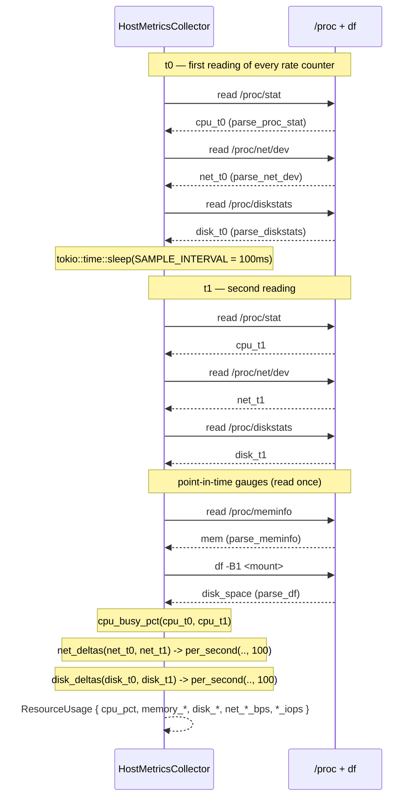
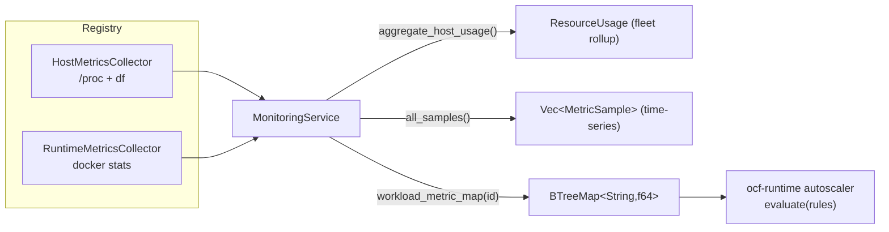

# ocf-monitoring

> Host and per-runtime resource metrics: real `/proc`/`df`/`docker stats` readings rolled into the `ResourceUsage` snapshots and the `BTreeMap<String, f64>` the autoscaler consumes.

| | |
|---|---|
| **Source** | `crates/ocf-monitoring/src/` (`lib.rs`, `sample.rs`, `collector.rs`, `service.rs`, `procfs.rs`) |
| **Depends on** | [`ocf-core`](ocf-core.md) (prelude: `Provider`, `Registry`, `Id`, `Error`/`Result`, `Serialize`/`Deserialize`), `async-trait`, `tokio` (`process`, `time`), `parking_lot`, `chrono` |
| **Used by** | [`ocf-runtime`](ocf-runtime.md) (the autoscaler evaluates the metric map), [`ocf-api`](ocf-api.md) (host/workload usage + time-series export), and any controller that wires a `Registry<dyn MetricsCollector>` |

## Overview

`ocf-monitoring` reads *real* counters and projects them into the two shapes the
rest of the fabric consumes: a typed [`ResourceUsage`](#resourceusage) snapshot
and a plain `BTreeMap<String, f64>` metric map.

The crate is three layers:

1. **Value types** ([`sample`](#domain-types)) — the point [`MetricSample`](#metricsample)
   for time-series export and the rolled-up [`ResourceUsage`](#resourceusage)
   snapshot reported per host or per workload.
2. **A pluggable collection contract** ([`MetricsCollector`](#metricscollector))
   with two built-in backends that read live counters:
   [`HostMetricsCollector`](#hostmetricscollector) parses the Linux `/proc`
   filesystem (and shells out to `df`), and
   [`RuntimeMetricsCollector`](#runtimemetricscollector) shells out to
   `docker stats`. The pure parsing — text in, numbers out, no I/O — lives in
   [`procfs`](#parsers-procfs) and is unit-tested there with sample fixtures.
3. **An aggregation service** ([`MonitoringService`](#monitoringservice)) over a
   `Registry<dyn MetricsCollector>`: fleet rollups, per-workload lookup, a
   flattened sample export, and the metric-map projection.

The crate honors the project-wide **"real, or honest error"** rule (see
[Architecture → Overview](../architecture/overview.md#real-backends)). On a host
without `/proc` (Windows, a stripped sandbox) the host collector returns
[`Error::NotSupported`](#error-behavior) rather than any fabricated numbers; if
`docker` is absent or the container does not exist, the runtime collector returns
[`Error::NotFound`](#error-behavior). The crate still compiles everywhere — the
failure is at runtime, where the file or tool is genuinely absent.

A deliberate design choice keeps the autoscaler decoupled: the metric map is a
plain `BTreeMap<String, f64>`, not a typed struct, so [`ocf-runtime`](ocf-runtime.md)
depends only on `BTreeMap<String, f64>` and **does not** have to depend on
`ocf-monitoring`.

## Module map

| Module | File | Responsibility |
|--------|------|----------------|
| crate root | `lib.rs` | Re-exports: `MetricSample`, `ResourceUsage`, `MetricsCollector`, `HostMetricsCollector`, `RuntimeMetricsCollector`, `register_builtins`, `MonitoringService`, `usage_to_metric_map` |
| `sample` | `sample.rs` | The value types: `MetricSample` (point) and `ResourceUsage` (rolled-up snapshot) plus its `memory_pct`/`disk_pct`/`samples`/`to_metric_map` projections |
| `collector` | `collector.rs` | The `MetricsCollector` trait + the two real backends (`HostMetricsCollector`, `RuntimeMetricsCollector`) and the live reads / two-sample interval diffs |
| `procfs` | `procfs.rs` | Pure parsers for `/proc/stat`, `/proc/meminfo`, `/proc/net/dev`, `/proc/diskstats`, `df`, and `docker stats`, plus the delta/rate helpers |
| `service` | `service.rs` | `MonitoringService` — aggregation over a `Registry<dyn MetricsCollector>`; the free `usage_to_metric_map` |

## Domain types

### `MetricSample`

A single point measurement, ready to ship to a time-series store (Prometheus,
etc.). `#[derive(Debug, Clone, Serialize, Deserialize)]`.

| Field | Type | Notes |
|-------|------|-------|
| `name` | `String` | Metric name, e.g. `"cpu_pct"`, `"net_rx_bps"` |
| `value` | `f64` | The measured value |
| `unit` | `String` | Unit of `value`: `"percent"`, `"bytes"`, `"bps"`, `"iops"` |
| `timestamp` | `DateTime<Utc>` | When sampled |
| `labels` | `BTreeMap<String, String>` | Index dimensions, e.g. `{"host": "node-1"}`, `{"collector": "host"}`, `{"subject": "host"}` (`#[serde(default)]`) |

```rust
pub fn new(
    name: impl Into<String>,
    value: f64,
    unit: impl Into<String>,
    labels: BTreeMap<String, String>,
) -> MetricSample   // timestamp = Utc::now()
```

### `ResourceUsage`

A rolled-up usage snapshot for one subject (a host *or* a workload). CPU is a
`0..=100` percentage; memory/disk are byte counts; network rates are
bits-per-second; IOPS are operations-per-second.
`#[derive(Debug, Clone, Copy, Default, PartialEq, Serialize, Deserialize)]`.

| Field | Type | Notes |
|-------|------|-------|
| `cpu_pct` | `f64` | CPU utilization percentage (`0..=100`) |
| `memory_used` | `u64` | Used memory, bytes |
| `memory_total` | `u64` | Total memory, bytes |
| `disk_used` | `u64` | Used filesystem space, bytes |
| `disk_total` | `u64` | Total filesystem space, bytes |
| `net_rx_bps` | `u64` | Network receive rate, bits/sec (host) or cumulative bytes (runtime, see note) |
| `net_tx_bps` | `u64` | Network transmit rate, bits/sec (host) or cumulative bytes (runtime) |
| `read_iops` | `u64` | Read operations/sec (host only; `0` for the runtime backend) |
| `write_iops` | `u64` | Write operations/sec (host only; `0` for the runtime backend) |

Methods:

```rust
pub fn memory_pct(&self) -> f64;   // used/total * 100, 0.0 when total == 0
pub fn disk_pct(&self) -> f64;     // used/total * 100, 0.0 when total == 0
pub fn samples(&self, labels: &BTreeMap<String, String>) -> Vec<MetricSample>;
pub fn to_metric_map(&self) -> BTreeMap<String, f64>;
```

`memory_pct`/`disk_pct` guard divide-by-zero (return `0.0` when the total is `0`).

#### `samples()` — the time-series projection

Flattens the snapshot into one `MetricSample` per dimension, attaching the given
`labels` to every emitted sample. The emitted samples (name, unit) are:

| Sample name | Value | Unit |
|-------------|-------|------|
| `cpu_pct` | `cpu_pct` | `percent` |
| `memory_used` | `memory_used` | `bytes` |
| `memory_total` | `memory_total` | `bytes` |
| `memory_pct` | `memory_pct()` | `percent` |
| `disk_used` | `disk_used` | `bytes` |
| `disk_total` | `disk_total` | `bytes` |
| `disk_pct` | `disk_pct()` | `percent` |
| `net_rx_bps` | `net_rx_bps` | `bps` |
| `net_tx_bps` | `net_tx_bps` | `bps` |
| `read_iops` | `read_iops` | `iops` |
| `write_iops` | `write_iops` | `iops` |

#### `to_metric_map()` — the autoscaler keys

Projects the snapshot onto the `BTreeMap<String, f64>` that the
[`ocf-runtime`](ocf-runtime.md) autoscaler evaluates against its scaling rules.
The keys are stable and match the names a scaling rule references:

| Key | Value | Why |
|-----|-------|-----|
| `cpu` | `cpu_pct` | CPU utilization (a rule may spell it `"cpu"`...) |
| `cpu_pct` | `cpu_pct` | ...or `"cpu_pct"` — both are emitted |
| `memory_pct` | `memory_pct()` | Memory utilization percentage |
| `memory_used` | `memory_used` | Used memory, bytes |
| `memory_total` | `memory_total` | Total memory, bytes |
| `disk_pct` | `disk_pct()` | Disk utilization percentage |
| `net_rx_bps` | `net_rx_bps` | Network receive throughput |
| `net_tx_bps` | `net_tx_bps` | Network transmit throughput |
| `read_iops` | `read_iops` | Disk read IOPS |
| `write_iops` | `write_iops` | Disk write IOPS |

> Note the difference from `samples()`: `to_metric_map()` emits both `cpu` and
> `cpu_pct` and includes `memory_used`/`memory_total`, but does **not** emit
> `disk_used`/`disk_total` (only `disk_pct`).

## Contracts

### `MetricsCollector`

The pluggable contract for reading usage off a host or workload. Extends
[`Provider`](ocf-core.md#provider) so backends are swappable via a
`Registry<dyn MetricsCollector>`.

```rust
#[async_trait]
pub trait MetricsCollector: Provider {
    async fn collect_host(&self) -> Result<ResourceUsage>;
    async fn collect_workload(&self, id: &Id) -> Result<ResourceUsage>;

    // Default: flattens collect_host() tagged with {collector: name(), subject: "host"}.
    async fn samples(&self) -> Result<Vec<MetricSample>>;
}
```

| Method | Purpose |
|--------|---------|
| `collect_host()` | Whole-host usage (CPU, memory, disk, net, IOPS) |
| `collect_workload(id)` | Usage for one workload by id; backends that cannot see it return `Error::NotFound` |
| `samples()` | All current measurements flattened to `MetricSample`s for export. The default flattens `collect_host()` and tags it with the collector's `name()`; a backend with per-workload visibility may override to append workload samples |

### `HostMetricsCollector`

The built-in whole-host backend. Reads real Linux counters and derives rates from
two readings taken `SAMPLE_INTERVAL` (**100 ms**) apart.
`#[derive(Debug, Clone)]`. `Provider::name() == "host"`.

| Field | Type | Notes |
|-------|------|-------|
| `host` | `String` | Logical hostname this collector reports for (label on emitted samples). `default()` uses `"localhost"` |
| `mount` | `String` | Filesystem path `df` reports on. Defaults to `"/"`; override with `with_mount(..)` |

```rust
pub fn new(host: impl Into<String>) -> HostMetricsCollector;
pub fn with_mount(self, mount: impl Into<String>) -> HostMetricsCollector;  // builder
// Default::default() == new("localhost")
```

The exact source for each metric (see [Implementation detail](#implementation-detail)):

| Metric | Source |
|--------|--------|
| `cpu_pct` | `/proc/stat` busy delta over `SAMPLE_INTERVAL` |
| `memory_used` / `memory_total` | `/proc/meminfo` (`MemTotal`, `MemAvailable`) |
| `disk_used` / `disk_total` | `df -B1 <mount>` |
| `net_rx_bps` / `net_tx_bps` | `/proc/net/dev` byte delta over the interval |
| `read_iops` / `write_iops` | `/proc/diskstats` op delta over the interval |

`collect_workload()` on the host collector always returns
`Error::NotSupported` — per-workload visibility is the runtime collector's job.
`samples()` is overridden to add a `{host: <self.host>}` label alongside
`{collector: "host", subject: "host"}`.

### `RuntimeMetricsCollector`

The built-in per-container backend. Shells out to `docker stats --no-stream` for
one container. `#[derive(Debug, Clone, Default)]`. `Provider::name() == "runtime"`.

- `collect_host()` returns `ResourceUsage::default()` (an empty snapshot) — a
  runtime collector reports per-workload usage, not whole-host rollups, so it is
  a no-op contributor to fleet aggregation.
- `collect_workload(id)` runs `docker stats` for the container named `id` (the
  workload id *is* the container name, matching [`ocf-runtime`](ocf-runtime.md)'s
  naming convention). Docker exposes CPU% and memory used/limit directly; net and
  block figures are **cumulative lifetime byte totals** (docker has no
  instantaneous rate), surfaced as-is into `net_rx_bps`/`net_tx_bps`. Docker
  reports no IOPS, so `read_iops`/`write_iops` stay `0`, and there is no
  per-container filesystem usage, so `disk_used`/`disk_total` stay `0`.

> Because docker's NetIO/BlockIO are cumulative totals, not rates, the
> `net_rx_bps`/`net_tx_bps` fields carry byte totals for this backend rather than
> a true bits-per-second rate. This is documented as "the most honest signal
> available from `docker stats`".

### `MonitoringService`

Aggregates every registered `MetricsCollector` behind one façade over an
`Arc<RwLock<Registry<dyn MetricsCollector>>>`.

```rust
pub fn new(registry: Registry<dyn MetricsCollector>) -> MonitoringService;
pub fn with_builtins() -> Result<MonitoringService>;          // host + runtime registered
pub fn registry(&self) -> Arc<RwLock<Registry<dyn MetricsCollector>>>;
pub fn collector_names(&self) -> Vec<String>;

pub async fn host_usage(&self, collector: &str) -> Result<ResourceUsage>;
pub async fn aggregate_host_usage(&self) -> Result<ResourceUsage>;
pub async fn workload_usage(&self, id: &Id) -> Result<ResourceUsage>;
pub async fn workload_metric_map(&self, id: &Id) -> Result<BTreeMap<String, f64>>;
pub async fn all_samples(&self) -> Result<Vec<MetricSample>>;
```

| Method | Behavior |
|--------|----------|
| `host_usage(name)` | Host usage from one named collector (propagates that collector's error) |
| `aggregate_host_usage()` | Fleet rollup: CPU **averaged** across collectors, everything else **summed** (saturating). A failing collector is logged (`warn`) and skipped, so this always returns `Ok` — empty when there are no collectors |
| `workload_usage(id)` | Tries each collector in turn; returns the **first** snapshot found, else `Error::NotFound` |
| `workload_metric_map(id)` | `workload_usage(id).await?.to_metric_map()` — ready for the autoscaler's `evaluate` |
| `all_samples()` | Every collector's `samples()` concatenated; a failing collector is logged and skipped rather than aborting the export |

### `usage_to_metric_map` (free function)

```rust
pub fn usage_to_metric_map(usage: &ResourceUsage) -> BTreeMap<String, f64>
```

Free-function form of [`ResourceUsage::to_metric_map`](#to_metric_map--the-autoscaler-keys),
provided so wiring code can project a snapshot without importing the inherent
method.

### `register_builtins`

```rust
pub fn register_builtins(reg: &mut Registry<dyn MetricsCollector>) -> Result<()>
```

Registers the built-ins so a freshly-constructed controller has working
collectors: `"host"` → `HostMetricsCollector::default()`, `"runtime"` →
`RuntimeMetricsCollector::new()`. Mirrors every subsystem crate's
`register_builtins`.

## Implementation detail

### Exact sources, files, and commands

The host collector takes **two readings** of every rate counter, sleeps
`SAMPLE_INTERVAL = 100 ms` (`tokio::time::sleep`), reads again, then diffs. The
point-in-time gauges (memory, disk space) are read once.

| Metric | File / command | Parser | Math |
|--------|----------------|--------|------|
| `cpu_pct` | `/proc/stat` (aggregate `cpu ` line) | `parse_proc_stat` → `CpuTimes { total, idle }` | `cpu_busy_pct(t0, t1)`: `(total_delta − idle_delta) / total_delta × 100`; `idle = idle + iowait` |
| `memory_used`/`_total` | `/proc/meminfo` (`MemTotal`, `MemAvailable`) | `parse_meminfo` → `MemInfo` | `used = total − available`; kB → bytes (`× 1024`) |
| `disk_used`/`_total` | `df -B1 <mount>` (default `/`) | `parse_df` → `DiskSpace` | columns 1 (`1B-blocks`) and 2 (`Used`) of the data line, already bytes |
| `net_rx_bps`/`net_tx_bps` | `/proc/net/dev` | `parse_net_dev` → `NetCounters` (sum of non-`lo` interfaces) | `net_deltas(t0, t1)` then `per_second(delta, 100)` |
| `read_iops`/`write_iops` | `/proc/diskstats` | `parse_diskstats` → `DiskStats` (whole physical disks only) | `disk_deltas(t0, t1)` then `per_second(delta, 100)` |

Per-runtime:

| Metric | Command | Parser |
|--------|---------|--------|
| CPU%, mem used/total, net, block | `docker stats --no-stream --format '{{.CPUPerc}}|{{.MemUsage}}|{{.NetIO}}|{{.BlockIO}}' <id>` | `parse_docker_stats` → `DockerStats` |

The pipe-delimited `--format` template avoids needing a JSON-parser dependency.
The first non-empty stdout line is parsed.

### Parser details (`procfs`)

The parsers are pure (`&str` in → struct out, no I/O), which is what makes the
host collector testable on any platform.

- **`parse_proc_stat`** — reads the aggregate `cpu ` line only (skips `cpu0`,
  `cpu1`, ... per-core lines). Fields are user, nice, system, idle, iowait, irq,
  softirq, steal, guest, guest_nice. `total` = sum of all columns; `idle` =
  `idle + iowait` (columns 3 + 4, 0-based). Returns `None` with no `cpu ` line or
  fewer than 5 fields.
- **`cpu_busy_pct(prev, curr)`** — saturating deltas; returns `0.0` on a zero
  total delta (clock not advancing / counter reset), keeping the result in
  `0..=100`.
- **`parse_meminfo`** — reads `MemTotal` and `MemAvailable`, converts kibibytes
  (`× 1024`) to bytes; returns `None` if either key is missing.
- **`parse_net_dev`** — sums `rx_bytes` (first receive column) and `tx_bytes`
  (9th value, index 8) across every interface except loopback (`lo`).
- **`parse_diskstats`** — sums reads-completed (field 3) and writes-completed
  (field 7) across **whole physical disks only**: `is_physical_device` skips
  `loop*`/`ram*`/`dm-*`/`md*`/`zram*`/`fd*`, skips `sd`/`vd`/`hd` names ending in
  a digit (partitions like `sda1`), and treats `nvme...` names containing `p` as
  partitions.
- **`parse_df`** — skips the header, reads the first data line's columns 1 and 2
  (total / used) as raw byte counts (`-B1` forces byte units).
- **`parse_docker_stats`** — splits the line on `|` into four fields
  (`CPUPerc|MemUsage|NetIO|BlockIO`), each `<a> / <b>` pair converted via
  `parse_size_bytes`. `parse_size_bytes` recognizes both binary (`KiB`/`MiB`/
  `GiB`/`TiB` = 1024-based) and decimal (`kB`/`MB`/`GB`/`TB` = 1000-based)
  suffixes; an unrecognized or absent number yields `0`. Returns `None` for fewer
  than four fields.
- **`per_second(delta, interval_ms)`** — `delta × 1000 / interval_ms`
  (`u128` math), `0` when `interval_ms == 0`.

## Diagrams

### `collect_host()`: two `/proc` readings and the deltas

`collect_host` reads each rate counter twice, 100 ms apart, and diffs them; the
gauges (`/proc/meminfo`, `df`) are read once.



### The metric pipeline (collectors → service → autoscaler)



## Public API surface

| Item | Signature | What it gives you |
|------|-----------|-------------------|
| `MetricSample::new` | `fn new(name, value, unit, labels) -> MetricSample` | A point sample stamped `Utc::now()` |
| `ResourceUsage` | `struct` (fields above) | A rolled-up usage snapshot |
| `ResourceUsage::memory_pct` / `disk_pct` | `fn(&self) -> f64` | Utilization %, divide-by-zero-safe |
| `ResourceUsage::samples` | `fn(&self, &BTreeMap<String,String>) -> Vec<MetricSample>` | Time-series projection |
| `ResourceUsage::to_metric_map` | `fn(&self) -> BTreeMap<String, f64>` | The autoscaler key/value map |
| `MetricsCollector` | trait (above) | The collection contract to implement for a new backend |
| `HostMetricsCollector::new` | `fn new(host) -> Self` | Host collector for a named host |
| `HostMetricsCollector::with_mount` | `fn with_mount(self, mount) -> Self` | Override the `df` mount |
| `RuntimeMetricsCollector::new` | `fn new() -> Self` | The docker-backed per-container collector |
| `register_builtins` | `fn(&mut Registry<dyn MetricsCollector>) -> Result<()>` | Register `"host"` + `"runtime"` |
| `MonitoringService::new` | `fn new(Registry<dyn MetricsCollector>) -> Self` | Wrap a registry |
| `MonitoringService::with_builtins` | `fn() -> Result<Self>` | Service with built-ins registered |
| `MonitoringService::aggregate_host_usage` | `async fn(&self) -> Result<ResourceUsage>` | Fleet rollup (CPU averaged, rest summed) |
| `MonitoringService::workload_usage` | `async fn(&self, &Id) -> Result<ResourceUsage>` | First collector that sees the workload |
| `MonitoringService::workload_metric_map` | `async fn(&self, &Id) -> Result<BTreeMap<String,f64>>` | Autoscaler-ready map for a workload |
| `MonitoringService::all_samples` | `async fn(&self) -> Result<Vec<MetricSample>>` | All collectors' samples, failing ones skipped |
| `usage_to_metric_map` | `fn(&ResourceUsage) -> BTreeMap<String, f64>` | Free-function form of `to_metric_map` |

## Error behavior

Every fallible operation returns [`ocf_core::Result`](ocf-core.md#error). The
crate's central promise is **never fabricate** — when a counter cannot be read,
it errors:

- **`HostMetricsCollector::collect_host`** maps a missing `/proc` file
  (`ErrorKind::NotFound`, the case on Windows/sandboxes) to
  `Error::NotSupported`; any other I/O failure to `Error::Io`. A missing `df`
  binary is `Error::NotSupported`; a non-zero `df` exit is `Error::Io`. A present
  but malformed file (no `cpu ` line, missing `MemTotal`/`MemAvailable`,
  unparsable `df`) is `Error::Io`.
- **`HostMetricsCollector::collect_workload`** always returns
  `Error::NotSupported` (no per-workload view).
- **`RuntimeMetricsCollector::collect_workload`** maps a missing `docker` binary
  *or* a non-zero exit (e.g. no such container) *or* an empty result to
  `Error::NotFound`; an unparsable stats line to `Error::Io`.
  `collect_host` is infallible (returns the default snapshot).
- **`MonitoringService`** — `aggregate_host_usage` and `all_samples`
  **log-and-skip** a failing collector, so they always return `Ok` (possibly an
  empty snapshot / empty vec). `host_usage` propagates the named collector's
  error. `workload_usage`/`workload_metric_map` return `Error::NotFound` when no
  collector can see the workload.

| Variant | Code | When |
|---------|------|------|
| `NotSupported` | `not_supported` | `/proc`/`df` absent (non-Linux/sandbox); host collector's workload view |
| `NotFound` | `not_found` | docker missing / no such container / no collector sees the workload |
| `Io` | `io_error` | other I/O failure, non-zero `df` exit, or a present-but-unparsable reading |

## Testing

The strategy splits cleanly between **pure parser tests** (deterministic, run
everywhere) and **live-read tests** (real numbers on Linux, honest error
elsewhere — but never a fabricated success).

- **`procfs` parser tests** feed real sample fixtures and assert extracted
  values: `proc_stat_parses_aggregate_line` / `cpu_busy_pct_computes_delta`
  (50% from a known 200-jiffy delta) / `cpu_busy_pct_guards_zero_and_reset`;
  `meminfo_parses_total_and_available` and `meminfo_missing_keys_is_none`;
  `net_dev_sums_non_loopback` (excludes `lo`) and `net_dev_deltas_and_rate`
  (1000 B / 100 ms → 10 000 B/s); `diskstats_counts_only_physical_disks` and
  `is_physical_device_classifies`; `df_parses_total_and_used_bytes`;
  `size_bytes_handles_binary_and_decimal_units` and the
  `docker_stats_*` parsing/whitespace/short-line cases.
- **`sample` tests** — `percentages_guard_zero_total`, `percentages_are_computed`
  (50%/25%), `metric_map_exposes_autoscaler_keys` (`cpu`/`cpu_pct`/`memory_pct`),
  `samples_carry_labels`.
- **`collector` live tests** — `host_collector_real_read_or_honest_error`
  asserts either internally-consistent real values (`0 ≤ cpu_pct ≤ 100`,
  `memory_used ≤ memory_total`, `disk_used ≤ disk_total`) **or** a
  `NotSupported`/`Io` error; `host_collector_has_no_workload_view`;
  `runtime_host_usage_is_empty`; `runtime_collector_errors_without_docker_or_container`;
  `builtins_register`.
- **`service` tests** — `aggregates_and_exports`, `empty_registry_aggregates_to_default`,
  and `workload_usage_consults_collectors_then_errors` (real keys when the
  container exists, else `NotFound`).

## Cross-references

- [ocf-runtime](ocf-runtime.md) — the autoscaler that consumes
  `workload_metric_map()`'s `BTreeMap<String, f64>` (the keys this crate emits)
- [ocf-core](ocf-core.md) — `Provider`/`Registry` (the pluggable backend
  machinery), `Id`, `Error`/`Result`
- [ocf-api](ocf-api.md) — exposes host/workload usage and the sample export over REST
- [Architecture → Overview](../architecture/overview.md#real-backends) — the
  "real, or honest error" rule this crate embodies
- [Reference → REST API](../reference/rest-api.md) — the metrics endpoints
- [Reference → Error Codes](../reference/error-codes.md) — the `Error` → HTTP mapping
