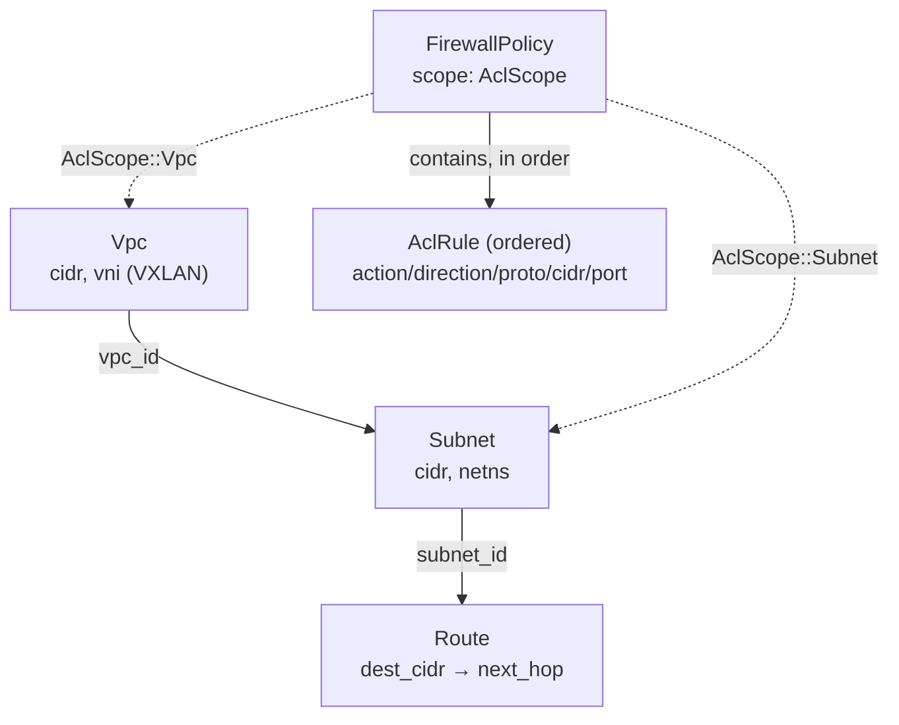
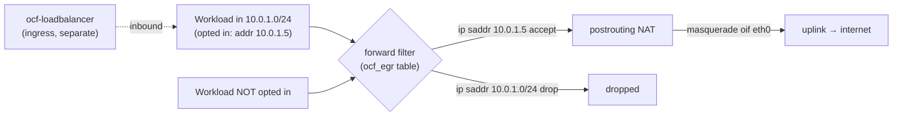
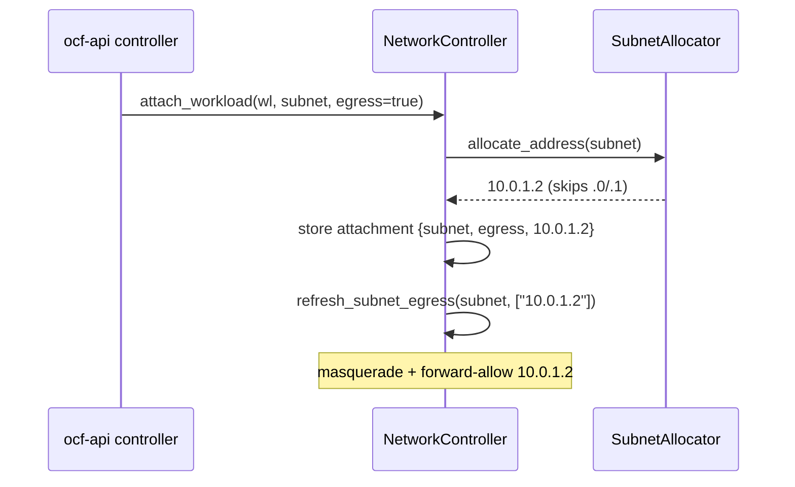
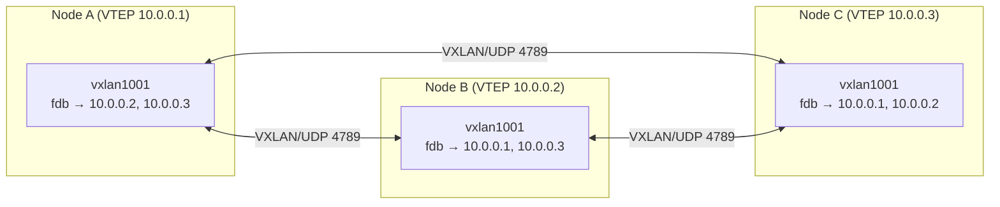
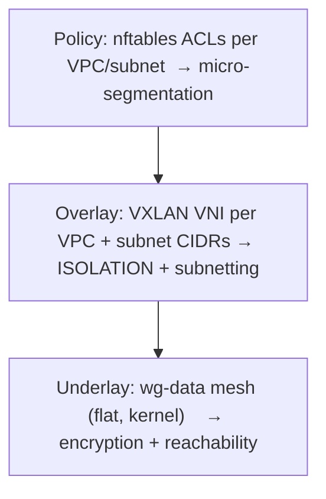

# ocf-network

> The fabric's internal software-defined network (SDN) overlay: VXLAN-isolated
> VPCs carved into subnets, wired with routes and protected by firewall
> policies, programmed onto every machine in the fleet.

**Crate:** `crates/ocf-network` · **Depends on:** `ocf-core` · **Source:**
`lib.rs`, `model.rs`, `backend.rs`, `controller.rs`

## Overview

Tenants get isolated [`Vpc`]s (VXLAN-separated address domains), carved into
[`Subnet`]s realized on hosts inside network namespaces, wired together with
[`Route`]s and protected by [`FirewallPolicy`]s of ordered [`AclRule`]s.

Pluggability follows the fabric convention: the dataplane is programmed through
the [`NetworkBackend`](#networkbackend-contract) contract, with in-tree
`LinuxNetnsBackend` (iproute2 + nftables) and `OvsBackend` (Open vSwitch)
implementations. The high-level [`NetworkController`](#networkcontroller) owns
the authoritative in-memory state and, because the overlay is fleet-wide, **fans
every mutation out across every registered backend** so a change "affects all
machines".

Each backend shells out to the host's SDN tooling (`ip netns`, VXLAN links,
`nft`, `ovs-vsctl` / `ovs-ofctl`), so it requires a Linux host with those
binaries and, in practice, root. Every command is issued idempotently so
re-applying a resource converges instead of failing — the project-wide "real
backend, honest error" rule (see [docs/README.md](../README.md)).

## Module map

| Module | File | Responsibility |
|--------|------|----------------|
| `model` | `model.rs` | Resource types: `Vpc`, `Subnet`, `Route`, `AclRule`, `FirewallPolicy` + `AclScope`/`AclAction`/`AclDirection` |
| `backend` | `backend.rs` | `NetworkBackend` contract, `LinuxNetnsBackend`, `OvsBackend`, `register_builtins`, pure render helpers, test-only `NullBackend`/`register_null` |
| `controller` | `controller.rs` | `NetworkController` — authoritative store + referential integrity + fleet-wide fan-out |
| `lib` | `lib.rs` | re-exports + crate docs + controller integration tests |

## Domain model

All resources except `Route`/`AclRule`/`FirewallPolicy` carry an
`ocf_core::Metadata`; `Vpc` and `Subnet` `impl Resource`.

### `Vpc` — an isolated tenant network domain

| Field | Type | Meaning |
|-------|------|---------|
| `metadata` | `Metadata` | id + name (`Resource::kind() == "vpc"`) |
| `cidr` | `String` | address space, e.g. `"10.0.0.0/16"` |
| `vni` | `u32` | VXLAN Network Identifier isolating this VPC's overlay traffic |

Constructor: `Vpc::new(name, cidr, vni)`.

### `Subnet` — a range carved from a VPC, realized in a netns

| Field | Type | Meaning |
|-------|------|---------|
| `metadata` | `Metadata` | id + name (`kind() == "subnet"`) |
| `vpc_id` | `Id` | owning VPC |
| `cidr` | `String` | range, e.g. `"10.0.1.0/24"` |
| `netns` | `String` | Linux network namespace hosting the subnet's dataplane |
| `egress` | `EgressMode` | outbound internet capability (`Isolated` default, or `Nat`) — see [Egress](#egress-outbound-internet--nat) |

Constructor: `Subnet::new(vpc_id, name, cidr, netns)` (egress defaults to `Isolated`); builder `.with_egress(EgressMode::Nat)`.

### `Route` — a static route for a subnet (no `Metadata`)

| Field | Type | Meaning |
|-------|------|---------|
| `id` | `Id` | route id |
| `subnet_id` | `Id` | subnet whose routing table this belongs to |
| `dest_cidr` | `String` | destination prefix, e.g. `"0.0.0.0/0"` (default route) |
| `next_hop` | `String` | next-hop gateway address |

Constructor: `Route::new(subnet_id, dest_cidr, next_hop)`.

### `AclRule` — one access-control rule (no `Metadata`)

| Field | Type | Meaning |
|-------|------|---------|
| `id` | `Id` | rule id |
| `action` | `AclAction` | `Allow` \| `Deny` |
| `direction` | `AclDirection` | `Ingress` \| `Egress` |
| `proto` | `String` | `"tcp"`, `"udp"`, `"icmp"`, or `"any"` (wildcard) |
| `cidr` | `String` | remote range; `"0.0.0.0/0"` is the all-addresses wildcard |
| `port` | `Option<u16>` | `None` = any port |

Constructor: `AclRule::new(action, direction, proto, cidr, port)`.

### `FirewallPolicy` — an ordered bundle of rules at a scope (no `Metadata`)

| Field | Type | Meaning |
|-------|------|---------|
| `id` | `Id` | policy id |
| `scope` | `AclScope` | `Vpc(Id)` (applies to every subnet within) or `Subnet(Id)` |
| `rules` | `Vec<AclRule>` | applied in order |

Constructor: `FirewallPolicy::new(scope)`; fluent `with_rule(rule)`.

### Enums (all serde `snake_case`)

- `AclAction` — `Allow` \| `Deny`
- `AclDirection` — `Ingress` \| `Egress`
- `AclScope` — `Vpc(Id)` \| `Subnet(Id)`

## Diagram — VPC → Subnet → Route / Policy model



## `NetworkBackend` contract

```rust
#[async_trait]
pub trait NetworkBackend: Provider {
    async fn apply_vpc(&self, vpc: &Vpc) -> Result<()>;
    async fn apply_subnet(&self, subnet: &Subnet) -> Result<()>;
    async fn apply_route(&self, route: &Route) -> Result<()>;
    async fn apply_policy(&self, policy: &FirewallPolicy) -> Result<()>;

    /// Program (or tear down) a subnet's egress NAT data path. Default no-op.
    async fn apply_egress(&self, subnet: &Subnet, allowed_addresses: &[String]) -> Result<()> {
        Ok(())
    }

    /// Program a VPC's remote VXLAN VTEP peers (the other nodes' underlay
    /// addresses) so the overlay is multi-host. Default no-op.
    async fn apply_vpc_peers(&self, vpc: &Vpc, peer_vteps: &[String]) -> Result<()> {
        Ok(())
    }
}
```

Each method is **idempotent by contract**: applying the same resource twice
converges to the same dataplane state. Backends extend `ocf_core::Provider` so
they register by name. `apply_egress` has a default no-op body so backends that
don't provide host NAT compose unchanged — both `LinuxNetnsBackend` and
`OvsBackend` override it (see [Egress](#egress-outbound-internet--nat)).

### Shared command helpers (`backend.rs`)

- `run(cmd, args)` — runs `tokio::process::Command` with stdin nulled. Exit 0 →
  `Ok`. A failure whose stderr matches an **idempotency marker** is also `Ok`;
  otherwise `Error::provider(cmd, <trimmed stderr>)`. Spawn failure (binary
  absent / non-Linux) → provider error tagged with `cmd`.
- `run_stdin(cmd, args, stdin)` — like `run` but pipes `stdin` to the child;
  used for `nft -f -` (reads a ruleset from stdin and swaps it in atomically).
- `is_idempotent_stderr(stderr)` — true when the lowercased stderr contains
  `IDEMPOTENT_MARKERS = ["file exists", "already exists"]`. Deliberately
  specific (each marker ends in "exists") so an unrelated "does not exist" is
  **not** swallowed.
- `short_id(id)` — first 8 chars of an id, for Linux interface names (`IFNAMSIZ`
  caps at 15 bytes, so `br-<8>` = 11 bytes fits).
- `gateway_from_cidr(cidr)` — derives the `.1` first host of an IPv4 `a.b.c.d/p`
  CIDR (std-only: split on `/`, validate four `u8` octets and a `≤32` prefix,
  replace the last octet with `1`). Returns `None` on anything unparseable, in
  which case the caller skips address assignment rather than guessing.

## Concrete backends — exact commands

### `LinuxNetnsBackend` (`name() == "linux-netns"`)

Drives the Linux stack directly via iproute2 + nftables. Default single-host
backend.

| Method | Exact host commands (in order) |
|--------|--------------------------------|
| `apply_vpc(vpc)` | `ip link add vxlan{vni} type vxlan id {vni} dstport 4789 nolearning` · `ip link set vxlan{vni} up` |
| `apply_subnet(subnet)` | `ip netns add {netns}` · `ip link add br-{shortid} type bridge` · `ip link set br-{shortid} up` · then, if `gateway_from_cidr(cidr)` succeeds, `ip addr add {gw} dev br-{shortid}` |
| `apply_route(route)` | `ip route replace {dest_cidr} via {next_hop}` |
| `apply_policy(policy)` | `render_nftables(policy)` piped to `nft -f -` via `run_stdin` |

Idempotency: bridge/netns/VXLAN re-creates fail with `File exists`, swallowed by
`run`; `ip route replace` is inherently idempotent (create-or-update). The
`Route` model has no netns handle, so the route lands in the host's **main**
table (a netns-scoped variant would be `ip netns exec {netns} ip route replace …`).
The bridge name uses the *subnet's* short id (`br-{short_id(subnet.metadata.id)}`).

**nftables policy render** (`render_nftables`) — pure, uses the atomic-replace
idiom so a re-apply converges:

```
add table inet ocf_<scope>_<sanitized-shortid>
delete table inet ocf_<scope>_<sanitized-shortid>
table inet ocf_<scope>_<sanitized-shortid> {
  chain input  { type filter hook input  priority 0; policy accept;  <ingress rule lines> }
  chain output { type filter hook output priority 0; policy accept;  <egress  rule lines> }
}
```

- Table name (`nft_table_name`): `ocf_vpc_<id>` or `ocf_subnet_<id>`; the short
  id is sanitized — any non-alphanumeric char (e.g. a UUID hyphen) becomes `_`,
  since nftables identifiers allow only alphanumerics + underscore.
- A chain is emitted **only for directions the policy actually uses**
  (`nft_hook`: ingress→`input`, egress→`output`).
- Rule line (`nft_rule_line`): `ip {saddr|daddr} {cidr}` (skipped for the
  `0.0.0.0/0` wildcard; `nft_addr_keyword` picks `saddr` for ingress, `daddr`
  for egress), then proto/port (`{proto} dport {port}` for tcp/udp with a port,
  `ip protocol {proto}` otherwise / for icmp, `tcp dport {port}` when a port is
  given with no concrete L4 proto), then the verdict (`Allow`→`accept`,
  `Deny`→`drop`). Example: `ip saddr 10.0.0.0/8 tcp dport 22 drop`.

### `OvsBackend` (`name() == "ovs"`)

Targets Open vSwitch — preferred at scale (programmable flows, OpenFlow).
Bridges/VXLAN ports via `ovs-vsctl`; routes/ACLs as OpenFlow flows via
`ovs-ofctl` on the integration bridge `br-int`.

| Method | Exact host commands |
|--------|---------------------|
| `apply_vpc(vpc)` | `ovs-vsctl --may-exist add-br ovs-{vni}` · `ovs-vsctl --may-exist add-port ovs-{vni} vxlan{vni} -- set interface vxlan{vni} type=vxlan options:key={vni} options:remote_ip=flow` |
| `apply_subnet(subnet)` | `ovs-vsctl --may-exist add-br br-int` · `ovs-vsctl --may-exist add-port br-int ovs-{shortid} -- set interface ovs-{shortid} type=internal` |
| `apply_route(route)` | `ovs-ofctl add-flow br-int "cookie={fnv1a(next_hop)},priority=100,ip,nw_dst={dest_cidr},actions=mod_nw_src:{next_hop},normal"` |
| `apply_policy(policy)` | one `ovs-ofctl add-flow br-int "<flow>"` per rule, in declaration order, priority `1000` descending (`saturating_sub(i)`) so earlier rules win |

Idempotency: `ovs-vsctl --may-exist` and `ovs-ofctl add-flow` (which replaces a
flow with the same match) are natively convergent. The route flow's **cookie**
(`next_hop_cookie`) is the FNV-1a 64-bit hash of the next-hop string rendered as
`0x…` (std-only, no hashing crate): the same next hop maps to the same cookie so
re-applies replace the same flow, while a changed hop is distinguishable.

> Two model gaps the OVS backend works around (best-effort):
> `Subnet` carries no VNI, so its OVS bridge can't be derived — it adds an
> internal port to the conventional `br-int` instead. `Route` has no netns/VNI
> context either, so flows are programmed on `br-int`.

Flow line (`ovs_flow_line`): `priority={p},ip`, then `nw_src=`/`nw_dst=` keyed by
direction (skipped for the `0.0.0.0/0` wildcard), then proto + `tp_dst={port}`
for tcp/udp (or `tcp,tp_dst=` when a port has no concrete proto), then
`actions=normal` (Allow) or `actions=drop` (Deny). Example:
`priority=1000,ip,nw_src=10.0.0.0/8,tcp,tp_dst=22,actions=drop`.

## `NetworkController`

```rust
pub struct NetworkController {
    vpcs:     RwLock<HashMap<Id, Vpc>>,
    subnets:  RwLock<HashMap<Id, Subnet>>,
    routes:   RwLock<HashMap<Id, Route>>,
    policies: RwLock<HashMap<Id, FirewallPolicy>>,
    backends: Arc<Registry<dyn NetworkBackend>>,
}
```

The fleet-wide control plane: authoritative in-memory store + referential
integrity, then a fan-out to every backend. Construct with
`NetworkController::new(backends)`.

### CRUD + referential integrity

| Operation | Integrity check before fan-out |
|-----------|--------------------------------|
| `create_vpc(vpc)` | id must not already exist → else `AlreadyExists`; then `apply_vpc` fans out |
| `delete_vpc(id)` | refuses with `Conflict` while any subnet references it; `NotFound` if absent (no fan-out — local only) |
| `create_subnet(subnet)` | owning VPC must exist (`NotFound`) and id must be new (`AlreadyExists`); then `apply_subnet` fans out |
| `add_route(route)` | subnet must exist (`NotFound`); then `apply_route` fans out |
| `apply_policy(policy)` | scope target (VPC or subnet) must exist (`NotFound`); create-or-replace in the store; then `apply_policy` fans out |
| `get_vpc/get_subnet`, `list_vpcs/list_subnets(vpc_id)/list_routes(subnet_id)/list_policies` | read-only, no fan-out |
| `delete_policy(id)` | `NotFound` if absent (local only, no fan-out) |

> `delete_vpc` / `delete_policy` only mutate local state — they do **not** fan a
> teardown out to backends. Creates/updates do.

### Fan-out — the "affects all machines" path

`fan_out(op, target, op_fn)` reads `self.backends.all()`, logs the fleet-wide
fan-out (`operation`, `target`, `machines = backends.len()`), then awaits
`op_fn(backend)` for **every** registered backend **sequentially**. The **first
backend failure aborts** the loop and is surfaced to the caller — so a partial
fan-out can leave earlier machines programmed while the controller's in-memory
state already records the desired resource.

```mermaid
sequenceDiagram
    participant C as Caller (API)
    participant NC as NetworkController
    participant S as in-memory store
    participant R as Registry&lt;dyn NetworkBackend&gt;
    participant B1 as Backend (machine 1)
    participant B2 as Backend (machine 2)

    C->>NC: create_vpc(vpc)
    NC->>NC: integrity check (id not taken)
    NC->>S: insert vpc (desired state)
    NC->>R: all()  (every registered backend)
    Note over NC: fan_out("apply_vpc", name, …)
    NC->>B1: apply_vpc(vpc)
    B1-->>NC: Ok  (programs local dataplane)
    NC->>B2: apply_vpc(vpc)
    B2-->>NC: Ok
    NC-->>C: Ok(vpc)
    Note over NC,B2: first backend error aborts<br/>and is returned to caller
```

> **Resilience note.** `create_vpc` and `create_subnet` **record desired state
> centrally first**, then program the dataplane best-effort: a host (or the
> control node itself, on a non-Linux box) that lacks `iproute2`/`nft`/OVS logs a
> warning instead of failing the API call, and converges when its backend can
> program. This mirrors the runtime/disk graceful-degradation pattern.

## Egress (outbound internet / NAT)

Outbound internet access is expressed in two layers and realized as distributed
source-NAT. Inbound connections are **not** handled here — those are the
[load balancer's](ocf-loadbalancer.md) responsibility.

### The two-layer model

| Layer | Where | Meaning |
|-------|-------|---------|
| **Capability** | `Subnet.egress: EgressMode` | `Isolated` (internal-only, default) or `Nat` (public subnet with internet egress). |
| **Opt-in** | `Workload.network.egress: bool` ([`ocf-runtime`](ocf-runtime.md)) | A workload reaches the internet only when its subnet is `Nat` **and** it opted in. |

`EgressMode` is a serde `snake_case` enum (`isolated` / `nat`) with
`provides_egress() -> bool`.

### The data path (`LinuxNetnsBackend` / `OvsBackend`)

`apply_egress(subnet, allowed_addresses)` programs a host's egress via a shared
`program_host_egress` helper (NAT is a host-netfilter concern, identical whether
the L2 dataplane is a Linux bridge or OVS). When `subnet.egress == Nat`:

1. **Enable forwarding** — writes `1` to `/proc/sys/net/ipv4/ip_forward` (no-op
   if already on).
2. **Resolve the uplink** — `ip route show default` → the `dev <iface>` of the
   default route (`parse_default_uplink`).
3. **Install an `inet ocf_egr_<id>` table** atomically via `nft -f -` with two
   chains:
   - a **forward filter** that accepts established/related return traffic and
     each opted-in `allowed` source address, then **drops** the rest of the
     subnet CIDR (this is the opt-in enforcement: default-deny);
   - a **postrouting NAT** chain that masquerades the subnet CIDR out the uplink.

When `subnet.egress == Isolated`, the table is removed.



The generated nft (two opted-in workloads, uplink `eth0`):

```
table inet ocf_egr_<id> {
  chain forward {
    type filter hook forward priority filter; policy accept;
    ct state established,related accept
    ip saddr 10.0.1.5 accept
    ip saddr 10.0.1.6 accept
    ip saddr 10.0.1.0/24 drop
  }
  chain postrouting {
    type nat hook postrouting priority srcnat; policy accept;
    ip saddr 10.0.1.0/24 oifname "eth0" masquerade
  }
}
```

### Controller surface

| Method | Behavior |
|--------|----------|
| `create_subnet` | Programs egress automatically when the subnet is `Nat` (empty allow-list initially). |
| `set_subnet_egress(id, mode, allowed)` | Change a subnet's capability and re-program; capability recorded even if programming fails. |
| `refresh_subnet_egress(id, allowed)` | Re-program with the current opted-in workload addresses (called when attachments change). |

At the API level, [`ocf-api`](ocf-api.md)'s `FabricController::set_subnet_egress`
gathers the opted-in addresses (`subnet_egress_allowed`) from attached workloads,
re-programs, and persists. Driven by `POST /api/v1/networks/subnets/:id/egress`
(see [REST API](../reference/rest-api.md#post-apiv1networkssubnetsidegress)).

> **Distributed masquerade** (the chosen NAT topology): each host masquerades its
> local workloads out its own uplink. Simple and works today; the trade-off is
> that a workload's egress source IP is whatever host it currently runs on.

## IPAM — per-subnet address allocation

Each subnet owns a `SubnetAllocator` (`ipam.rs`) that hands out host
addresses from the subnet CIDR, **skipping** the network address (`.0`), the
gateway (`.1`, which lives on the subnet bridge), and the broadcast address.
Allocation is **lowest-free-first and deterministic**, so a restored allocator
with the same reservations yields the same next address.

| Method (on `NetworkController`) | Behavior |
|---------------------------------|----------|
| `allocate_address(subnet_id)` | Next free host (e.g. `10.0.1.2`); `Conflict` when exhausted |
| `reserve_address(subnet_id, addr)` | Mark in use — used on restore to rebuild the pool |
| `release_address(subnet_id, addr)` | Return to the pool (the gateway is never released) |

The allocator is built automatically when a subnet is created (from its CIDR).
It is std-only (IPv4 as `u32`, no IP-parsing crate); the pure helpers
`parse_ipv4` / `format_ipv4` / `parse_cidr` are unit-tested, as are allocation,
exhaustion (`/30`), and the no-usable-hosts case (`/31`).

The [`ocf-api`](ocf-api.md) controller drives IPAM on **attachment**: when a
workload attaches to a subnet (`POST /api/v1/workloads/:id/network`), it
allocates an address, records the binding, and adds the address to the subnet's
egress allow-list (if the workload opted in) — closing the loop so egress is
gated on *real, assigned* addresses rather than caller-supplied ones.



## Cross-host VXLAN — stitching the overlay

A VXLAN device created by `apply_vpc` has **no peers** until the remote VTEPs are
programmed — encapsulated frames would otherwise go nowhere.
`apply_vpc_peers(vpc, peer_vteps)` wires them, where `peer_vteps` are the
**underlay addresses of the other fleet nodes**:

| Backend | What it programs per peer |
|---------|---------------------------|
| `LinuxNetnsBackend` | `bridge fdb append 00:00:00:00:00:00 dev vxlan{vni} dst <peer>` — an all-zeros (BUM) flood entry per remote VTEP (head-end replication). Delete-then-append makes re-apply converge. |
| `OvsBackend` | `ovs-vsctl --may-exist add-port ovs-{vni} vx{vni}-<peer> -- set interface … type=vxlan options:key={vni} options:remote_ip=<peer>` — one concrete-remote tunnel port per peer. |

The [`ocf-api`](ocf-api.md) controller computes the peer set from the topology
(`peer_vteps()` = every machine's `fabric_address` except this node's, matched by
`config.node_id`) and calls `refresh_vpc_peers` for each VPC at boot
(`program_vxlan_peers`). Fan-out is best-effort: a host that can't program FDB or
OVS logs and is skipped.



> The chosen distributed-masquerade egress means a workload's egress source IP
> follows the host it runs on (not stable across migration). A centralized
> per-VPC NAT gateway — which would give a stable egress IP — remains the
> alternative topology if that property is later required.

## WireGuard underlays — three isolated encrypted planes

Cross-host traffic rides **three separate WireGuard underlays**, so the
management, workload, and load-balancer data planes never share an interface or
address space — segmentation by plane, each plane encrypted at kernel line rate:

| Plane | Interface | Subnet | Port | Carries |
|-------|-----------|--------|------|---------|
| Management | `wg-mgmt` | `10.255.0.0/16` | 51820 | Control plane — Raft, membership, latency probes, streaming |
| Workload | `wg-data` | `10.254.0.0/16` | 51821 | The VXLAN overlay (VTEPs point at `wg-data` addresses) |
| Load balancer | `wg-lb` | `10.253.0.0/16` | 51822 | LB-to-backend (ingress) traffic |

Each machine gets the same host index across planes (`10.255.0.N`, `10.254.0.N`,
`10.253.0.N`), assigned by the [`ocf-api`](ocf-api.md) controller, which brings up
all three and programs peers on each. `GET /api/v1/fabric/wireguard` shows all
three planes.

`WireguardUnderlay` (`crates/ocf-network/src/wireguard.rs`) programs one plane via
`ip` + `wg`:

| Method | Commands |
|--------|----------|
| `ensure_interface(priv_key, addr)` | `ip link add <iface> type wireguard`; `wg set <iface> private-key <file> listen-port <port>`; `ip addr add <addr> dev <iface>`; `ip link set <iface> up` |
| `set_peer(pub_key, endpoint, allowed_ips, keepalive)` | `wg set <iface> peer <key> endpoint <ep> allowed-ips <ip/32> persistent-keepalive 25` |
| `attach_workload_veth(netns, bridge, id, addr)` | a veth pair: one end into the workload netns (addressed), the other onto the subnet bridge — splices a workload onto the overlay |
| `attach_container_to_subnet(pid, alias, bridge, id, addr)` | exposes a **running container's** netns (via its host PID → `ip netns attach`) then `attach_workload_veth` — the last mile for live containers |

### Kernel datapath, userspace fallback

`ensure_interface` is **kernel-first with a userspace fallback**, returning the
`WireguardMode` it realized:

1. Best-effort `modprobe wireguard`, then `ip link add <iface> type wireguard` —
   the in-kernel datapath (mainline Linux ≥ 5.6), fastest and always preferred →
   `WireguardMode::Kernel`.
2. If the kernel module is unavailable (older kernel, locked-down or non-Linux
   host), bring up a **userspace** interface with the first available backend on
   `PATH` — `boringtun` (Cloudflare's **pure-Rust** implementation; preferred),
   `boringtun-cli`, or `wireguard-go`. Each, run as `<bin> <iface>`, creates an
   interface named `<iface>` that the *same* `wg`/`ip` commands then drive →
   `WireguardMode::Userspace("boringtun")`.
3. If neither a kernel module nor a userspace backend exists, an **honest error**
   names exactly what to install — the rest of the fabric keeps running.

So the underlay comes up across the widest range of hosts at kernel speed where
possible, and the realized mode is logged per plane. (A fully self-contained
in-process datapath — the `boringtun` crate over a TUN device, no `wg`/`ip`/kernel
module at all — is the documented next step, reusing the same X25519 identity.)

A node's **WireGuard identity is its fabric identity**: the `ocf-fabric` X25519
keypair *is* a Curve25519 WireGuard key (`PublicKey::to_wireguard_key()` /
`SecretKey::to_wireguard_key()` base64-encode it), used on every plane. The peer
set is the fabric membership; a peer's `allowed-ips` is its overlay address *on
that plane only*.

### Reachability-aware peering — reverse-connect for NAT'd nodes

Peer programming is shaped by each node's [`Reachability`](ocf-fabric.md)
(`public` / `private` / `relay`), so a node **without a public IPv4** joins the
fabric by *reverse-connecting* — `plan_wg_peers` decides each peer's endpoint and
keepalive:

| This node | Peer | Endpoint | Keepalive | Why |
|-----------|------|----------|-----------|-----|
| any | `public` / `relay` | **pinned** (`addr:port`) | 25 iff *we* are `private` | dialable; if we're NAT'd our keepalive holds the mapping open |
| `public` / `relay` | `private` | **unset (roam-learned)** | 0 | the private peer reverse-connects; WireGuard learns its endpoint from the first authenticated packet |
| `private` | `private` | — (routed via relay) | — | neither is directly reachable, so the peer's overlay `/32` is bounced through a relay (see below) |

So a `private` node pins + keepalives toward every `public`/`relay` peer (it dials
out, NAT mappings stay open), while those peers leave the `private` node's endpoint
unset and roam-learn it. The result is **bidirectional connectivity with no public
address on the NAT'd side** — verifiable at `GET /api/v1/fabric/wireguard`, which
shows each peer's `reachability`, `endpoint` (`null` = roam-learned), and
`keepalive`.

### Relay bounce — so *all* nodes can reach each other

Two `private` nodes can't reach each other directly, so traffic is **bounced
through a relay**, completing the any-to-any mesh:

- The persistent **held tunnel** is the keepalive: each private node keeps an
  outbound WireGuard tunnel to the relay open, so the relay can always reach it.
- A private node routes another private peer's overlay `/32` through the relay
  (the `/32` goes into the relay peer's `allowed-ips`); the relay has both private
  nodes as roam-learned peers, so it re-encrypts and forwards.
- A **relay node enables IP forwarding** on boot (`enable_ip_forwarding`) — without
  it the kernel would drop the bounced packet. (The health system also surfaces
  `ip_forward` state.)
- The relay is chosen by `pick_relay`: the **lowest-RTT alive** relay (using the
  measured [latency map](ocf-fabric.md#topology-intelligence-latency-reachability--routing)).
  WireGuard is re-programmed on any membership change, so a private node **fails
  over** to another live relay if its relay dies, and picks up a newly-joined one.

The invariant: **given at least one reachable relay, every pair of nodes can
talk** — public↔public direct, private↔public/relay by reverse-connect, and
private↔private bounced through the relay. (A node that is `private` with *no*
relay available logs a warning; designating ≥ 1 `public`/`relay` node is the
requirement. Multi-hop relay chains for partitioned relays are a future refinement.)

When a workload attaches to a subnet (`POST /api/v1/workloads/:id/network`), the
controller resolves the container's host PID
(`RuntimeProvider::host_pid` → `docker inspect -f '{{.State.Pid}}'`), computes the
subnet bridge name, and best-effort `attach_container_to_subnet`s it with its IPAM
address — putting the live container on the `wg-data` VXLAN overlay.

### Layering: where isolation lives

Within a plane WireGuard is a **flat L3 underlay** — encryption and reachability,
**not** tenant isolation. Tenant isolation and subnetting stay in the workload
overlay (`wg-data`):



So a VPC is still an isolated VNI, subnets still carve CIDRs, ACLs still segment
— now over the dedicated `wg-data` plane, separate from the `wg-mgmt` control
plane and the `wg-lb` ingress plane. Per-peer `allowed-ips` are deliberately *not*
used for tenant isolation (too coarse — per host, not per tenant).

## Public API surface

| Item | Kind | Notes |
|------|------|-------|
| `Vpc`, `Subnet`, `Route`, `AclRule`, `FirewallPolicy` | structs | re-exported from `model`; `Vpc`/`Subnet` impl `Resource` |
| `AclAction`, `AclDirection`, `AclScope`, `EgressMode` | enums | serde `snake_case`; `EgressMode` = `isolated`/`nat` |
| `SubnetAllocator` | struct | per-subnet IPAM (`new`, `allocate`, `reserve`, `release`) |
| `NetworkBackend` | trait | extends `Provider`; 4 `apply_*` + `apply_egress` + `apply_vpc_peers` |
| `LinuxNetnsBackend` | struct | `name() == "linux-netns"`; `new`, `Default`, `Provider` |
| `OvsBackend` | struct | `name() == "ovs"`; `new`, `Default`, `Provider` |
| `register_builtins(&mut Registry<dyn NetworkBackend>)` | fn | registers `linux-netns` + `ovs` |
| `NetworkController` | struct | CRUD + fan-out; `new`, `backends`, the operations above |
| `NullBackend` / `register_null` | struct / fn | `#[cfg(test)]` only — no-op test backend (`name() == "null"`) |

## Error behavior

All errors are `ocf_core::Error`:

- **`Error::NotFound`** — missing VPC/subnet/route-subnet/policy-scope target;
  `delete_vpc`/`delete_policy` of an absent id.
- **`Error::AlreadyExists`** — re-creating a VPC or subnet with a known id.
- **`Error::Conflict`** — `delete_vpc` while subnets still reference it.
- **`Error::Provider { provider, message }`** — any backend command that exits
  non-zero (and isn't an idempotency marker) or can't be spawned; `provider` is
  the binary (`ip`, `nft`, `ovs-vsctl`, `ovs-ofctl`). Surfaced through the
  controller's fan-out as the first backend failure.
- **Idempotency swallowing** — `run`/`run_stdin` treat `file exists` /
  `already exists` stderr as success; `--may-exist`, `ip route replace`,
  `ovs-ofctl add-flow`, and the nft atomic-replace idiom are convergent by
  construction.

## Testing

The CRUD/integrity tests exercise the controller's in-memory state machine and
fan-out plumbing **without** root, a Linux host, or iproute2/OVS binaries — they
register the test-only `NullBackend` via `register_null`. Render helpers are
pure and tested directly.

Pure / no-root tests (`backend.rs`):

| Test | Subject |
|------|---------|
| `short_id_truncates_to_eight_chars`, `short_id_handles_short_input` | `short_id` (and the `br-<short>` ≤ 15-byte invariant) |
| `gateway_from_cidr_derives_first_host`, `gateway_from_cidr_rejects_garbage` | `gateway_from_cidr` |
| `idempotent_stderr_recognizes_exists` | `is_idempotent_stderr` |
| `nft_rule_line_deny_ingress_tcp_port`, `nft_rule_line_allow_egress_any_proto_any_addr`, `nft_rule_line_icmp_uses_protocol_match` | `nft_rule_line` |
| `render_nftables_scopes_table_and_chains`, `render_nftables_omits_unused_direction` | `render_nftables` (table sanitization, per-direction chains) |
| `ovs_flow_line_deny_ingress_tcp`, `ovs_flow_line_allow_egress_wildcard` | `ovs_flow_line` |
| `next_hop_cookie_is_stable_and_hex` | `next_hop_cookie` (FNV-1a stability) |

Controller tests (`lib.rs`, using `NullBackend`):
`builtins_register_both_backends`, `vpc_subnet_route_lifecycle` (orphan-subnet
rejection, route listing, delete-with-subnets conflict),
`policy_scope_must_exist`.

There are no `#[ignore]`d host tests in this crate — the real backends are
exercised only through the helper-level unit tests; integration against live
iproute2/OVS is left to manual/host validation.

## Cross-references

- [`ocf-core`](ocf-core.md) — `Resource`, `Metadata`, `Id`, `Provider`,
  `Registry`, `Error`.
- [`ocf-kernel`](ocf-kernel.md) — the *host* dataplane prerequisite (IPv4
  forwarding + software bridges) the overlay attaches to, and which renders host
  firewall rules with the same `nft -f -` atomic-replace idiom used here.
- [Architecture → Distributed Control Plane](../architecture/distributed-control-plane.md)
  — why a network mutation "affects all machines".
