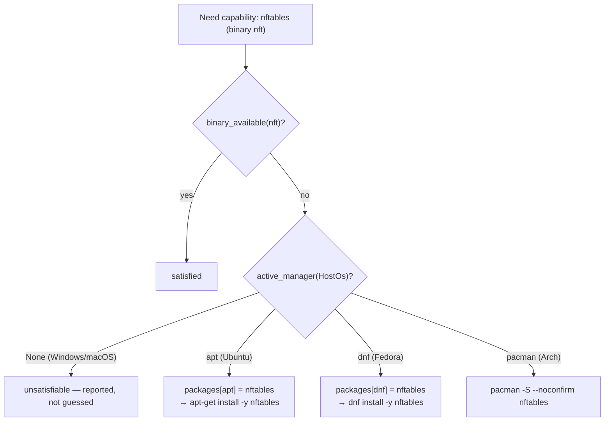
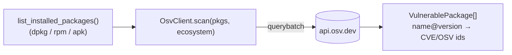
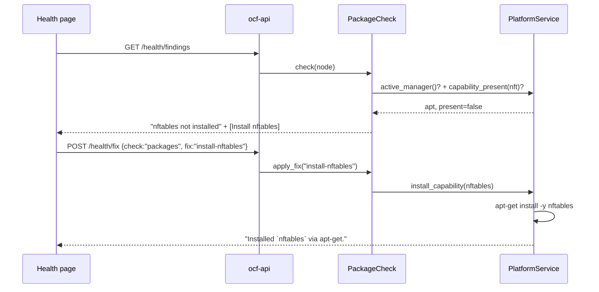

# ocf-platform

> Host OS detection and pluggable package managers — resolve and install missing
> capabilities across operating systems.

- **Crate**: `ocf-platform` · **Source**: `crates/ocf-platform/src/` · **Depends on**: `ocf-core`
- **Used by**: [`ocf-health`](ocf-health.md) (the `PackageCheck`), [`ocf-api`](ocf-api.md)

## Overview

The data plane shells out to host tools (`nft`, `ip`, `smartctl`, `ipmitool`,
`ovs-vsctl`). Whether those tools are present — and how to install them — differs
by OS and distro. This crate is the missing abstraction that lets the fabric
answer *"is capability X available, and if not, how do I install it on **this**
host?"*

It does that with three decoupled ideas, each a plain plugin:

1. **Detect the OS** ([`HostOs`](#hostos)) — `/etc/os-release` on Linux, `consts::OS` elsewhere.
2. **Name the capability per manager** ([`Capability`](#capability)) — a binary, an optional kernel module, and the **package name keyed by package manager** (which differs across distros).
3. **Pick & drive the package manager** ([`PackageManager`](#the-packagemanager-contract)) — apt/dnf/pacman/apk, selected by the detected OS.

A host with **no supported package manager** (Windows, macOS) simply has no
active manager; capabilities are reported unsatisfiable rather than guessed at.

## Module map

| Module | Defines |
|--------|---------|
| `os` | [`HostOs`](#hostos), `parse_os_release`, `binary_available` (PATH probe) |
| `capability` | [`Capability`](#capability), `builtin_capabilities()` |
| `package` | the [`PackageManager`](#the-packagemanager-contract) contract + `register_builtins` |
| `managers` | `Apt`/`Dnf`/`Pacman`/`Apk` `PackageManager`s |
| `service` | [`PlatformService`](#platformservice), `PlatformStatus`, `CapabilityStatus` |

## `HostOs`

| Field | Source | Example |
|-------|--------|---------|
| `os` | `std::env::consts::OS` | `"linux"`, `"windows"`, `"macos"` |
| `distro` | os-release `ID=` | `"ubuntu"` |
| `id_like` | os-release `ID_LIKE=` | `["debian"]` |
| `pretty` | os-release `PRETTY_NAME=` | `"Ubuntu 24.04 LTS"` |

`HostOs::detect()` reads os-release on Linux. `matches(id)` is true when the
distro *is* `id` or is *like* it (so Ubuntu matches `debian` via `ID_LIKE`),
which is how derivative distros inherit a package manager.

`binary_available(name)` probes `PATH` (without running the program; on Windows
it also tries `.exe`/`.bat`/`.cmd`) — the presence signal a capability uses.

## `Capability`

Decouples *what the fabric needs* from *what it's called where*.

| Field | Type | Meaning |
|-------|------|---------|
| `name` | `String` | Capability name, e.g. `"nftables"` |
| `binary` | `String` | Executable that proves presence, e.g. `nft` |
| `module` | `Option<String>` | Optional kernel module, e.g. `nf_tables` |
| `packages` | `BTreeMap<pm, package>` | Package name **per package manager** |

The per-manager map is the whole point — the same capability has different
package names across distros:

| Capability | apt | dnf | pacman | apk |
|-----------|-----|-----|--------|-----|
| `iproute2` | `iproute2` | **`iproute`** | `iproute2` | `iproute2` |
| `openvswitch` | **`openvswitch-switch`** | `openvswitch` | `openvswitch` | `openvswitch` |
| `nftables` | `nftables` | `nftables` | `nftables` | `nftables` |

`builtin_capabilities()` ships the data-plane set (nftables, iproute2,
smartmontools, ipmitool, openvswitch).

## The `PackageManager` contract

```rust
#[async_trait]
pub trait PackageManager: Provider {
    fn applies_to(&self, os: &HostOs) -> bool;
    async fn is_installed(&self, package: &str) -> Result<bool>;
    async fn install(&self, package: &str) -> Result<String>;
}
```

`applies_to` matches by distro/`ID_LIKE` **or** the driver binary's presence (so
a minimal image without os-release is still recognised). Built-ins:

| Manager (`name()`) | Applies to | Install | Query |
|--------------------|-----------|---------|-------|
| `apt` | debian, ubuntu | `apt-get install -y <pkg>` | `dpkg -s <pkg>` |
| `dnf` | fedora, rhel, centos | `dnf install -y <pkg>` | `rpm -q <pkg>` |
| `pacman` | arch, manjaro | `pacman -S --noconfirm <pkg>` | `pacman -Q <pkg>` |
| `apk` | alpine | `apk add <pkg>` | `apk info -e <pkg>` |

Adding support for another OS is registering another `PackageManager`.

## `PlatformService`

The façade: owns the detected `HostOs` and the manager registry.

| Method | Behavior |
|--------|----------|
| `detect()` | Detect OS + register built-in managers |
| `active_manager()` | First registered manager whose `applies_to` matches (`None` on unsupported hosts) |
| `capability_present(cap)` | Is the cap's binary on `PATH`? |
| `install_capability(cap)` | Resolve manager → per-distro package → `install`; `NotSupported` if no manager, `NotFound` if no mapping |
| `status(caps)` | Snapshot: OS, active manager, per-capability `present` + `package` |

## How it resolves an install



## Package updates & vulnerability scanning

Beyond installing a missing tool, the `PackageManager` contract handles **updates**
and feeds **vulnerability scanning**:

| Method | What it does |
|--------|-------------|
| `list_updates()` | Refreshes the cache (best-effort) and lists pending updates as `PackageUpdate { name, current_version, available_version, security }`. apt and dnf flag **security** updates (apt by the `…-security` suite; dnf via `updateinfo list security`); pacman/apk roll everything together. |
| `apply_updates(security_only)` | Applies updates — `apt-get upgrade` / `dnf upgrade`, or security-only (`apt-get install --only-upgrade <sec-pkgs>` / `dnf upgrade --security`) where supported. Needs root. |
| `list_installed_packages()` | Every installed `name@version` — the input to OSV. |
| `osv_ecosystem(os)` | Maps the host to its OSV ecosystem (`"Ubuntu"`, `"Debian"`, `"Red Hat"`, `"Alpine"`; `None` for Arch, which OSV doesn't track). |

The parsing of each tool's output lives in `update.rs` as **pure, unit-tested**
functions, so a host without that package manager is irrelevant to testing.

`PlatformService` exposes `available_updates()` (with a security count),
`apply_updates(security_only)`, and **`scan_vulnerabilities()`**.

### OSV vulnerability scanning

`OsvClient` (`osv.rs`) queries the public **[OSV](https://osv.dev) batch API**
(`POST https://api.osv.dev/v1/querybatch`) with the host's installed packages in
their distro ecosystem, chunked to OSV's 1000-per-request limit. Results map
positionally to the queries; a package with a non-empty `vulns` array becomes a
`VulnerablePackage { name, version, vuln_ids }`. The request build and response
parse are pure/tested; the HTTP call is a blocking `ureq` (rustls) request run on
a blocking thread, so no network simply yields an error and the fabric keeps
running.



## Integration with health

This crate is what makes [`ocf-health`](ocf-health.md)'s **`PackageCheck`**
OS-aware. The check probes each capability's binary; for a missing one it emits a
finding with an *"Install &lt;cap&gt;"* fix, and `apply_fix` calls
`install_capability` — running `apt-get`/`dnf`/`pacman`/`apk` as appropriate. On a
host with no package manager the check stays silent (nothing it can install).



## REST surface

| Method | Path | Returns |
|--------|------|---------|
| `GET` | `/api/v1/platform` | `PlatformStatus`: OS, active manager, per-capability readiness |
| `GET` | `/api/v1/platform/updates` | `UpdateSummary`: pending updates + a security count |
| `POST` | `/api/v1/platform/updates/apply` | Apply updates (`{ "security_only": bool }`) |
| `GET` | `/api/v1/platform/vulnerabilities` | `VulnerablePackage[]` from the OSV scan |

Security posture is also surfaced as **health findings** — a `SecurityUpdateCheck`
(Warning when security updates are pending, with *Apply security updates* / *Apply
all updates* fixes) and a `VulnerabilityCheck` (Critical, listing OSV-flagged
packages) — see [ocf-health](ocf-health.md).

Package managers also appear in `GET /api/v1/providers` (and `ocfd providers`)
under the `PackageManager` contract. The install fixes themselves are driven
through the [health endpoints](../reference/rest-api.md#health-fleet-checks).

## Error behavior

| Situation | Result |
|-----------|--------|
| No package manager for the host | `install_capability` → `NotSupported` (501) |
| Capability has no mapping for the active manager | `NotFound` (404) |
| Install command fails (no root, repo error) | `provider_error` (500) with the real message |
| Query tool missing | provider error from `is_installed` |

## Testing

Pure logic is unit-tested with fixtures: `parse_os_release` (Ubuntu, multi
`ID_LIKE`), `matches` (distro + ID_LIKE, case-insensitive), `candidate_filenames`
(platform extensions), the per-manager package-name differences, each manager's
`applies_to` for its distros, and that `install_capability` without a manager is
`NotSupported`. The actual installs run on a real host with the tools.

## Cross-references

- [`ocf-health`](ocf-health.md) — the `PackageCheck` that surfaces install fixes.
- [Contracts & Plugins](../architecture/contracts-and-plugins.md) — the `Provider`/`Registry` pattern.
- [Architecture → Overview → Real backends](../architecture/overview.md#real-backends) — why tools are shelled out and degrade gracefully.
