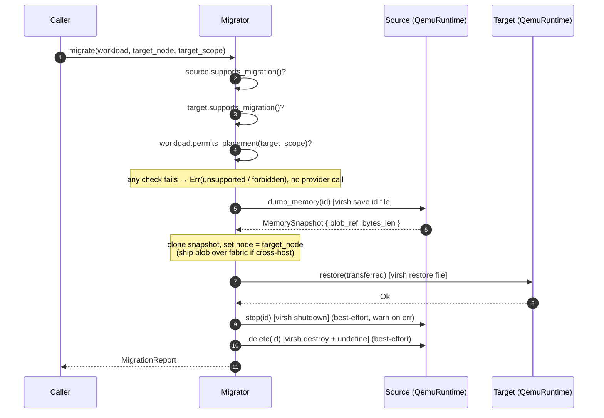
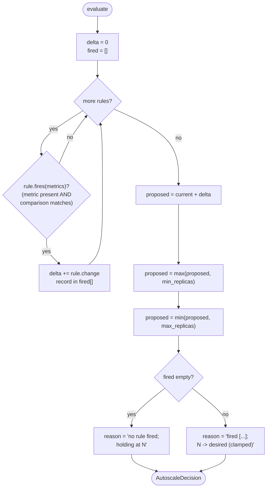

# ocf-runtime

> The fabric's compute plane: run containers and virtual machines for real, migrate them live between nodes, and autoscale them.

**Crate:** `crates/ocf-runtime` · **Depends on:** `ocf-core` (only) · **Drives:** `docker`, `podman`, the `lxc-*` family, and libvirt's `virsh`

---

## Overview

`ocf-runtime` is where the control plane stops being abstract and starts a real container or VM. A [`Workload`](#the-workload-resource) is the backend-agnostic description of a unit of compute; a concrete [`RuntimeProvider`](#the-runtimeprovider-contract) turns that description into a live container or libvirt domain by **shelling out to the real host binary** and reading state back from it. Nothing in this crate keeps an in-memory mirror of runtime state — the engine (Docker, Podman, LXC, libvirt) owns the truth and is queried (`docker inspect`, `lxc-info`, `virsh domstate`) on every `status` call.

Four built-in providers ship in the crate. `DockerRuntime` and `PodmanRuntime` run containers via the Docker-compatible CLI; `LxcRuntime` runs system containers via the `lxc-*` tools; `QemuRuntime` runs full VMs via `virsh`. Only QEMU is migration-capable. They are registered into a `Registry<dyn RuntimeProvider>` by [`register_builtins`](#registration), and the controller talks only to the trait — so adding or swapping a backend never touches the control plane.

Two cross-cutting services sit on top of the providers. The [`Migrator`](#live-migration) orchestrates a `dump → transfer → restore` live migration between two migration-capable providers (in practice two `QemuRuntime`s), honoring the workload's placement [`Scope`] so a confined workload can never land outside it. The [`Autoscaler`](#autoscaling) decides a container deployment's desired replica count from an externally-supplied metric map; `evaluate` is a pure function of the current replica count and a `BTreeMap<String, f64>`, which is deliberately how this crate stays **independent of `ocf-monitoring`** — the caller decides where the numbers come from.

Because every integration shells out, the crate compiles and its pure logic (argument construction, status parsing, scope enforcement, autoscale math) is fully unit-tested on **any** host, including Windows. A missing tool is a *runtime* error, never a compile error and never a fabricated success: a spawn failure or non-zero exit becomes a single uniform `Error::provider`. The daemon-dependent tests are `#[ignore]`d and only run when a developer opts in on a host that has the tooling.

---

## Module map

| Module | File | Responsibility |
|--------|------|----------------|
| `lib` | `src/lib.rs` | Crate root, re-exports, [`register_builtins`](#registration) |
| `workload` | `src/workload.rs` | [`RuntimeKind`](#runtimekind), [`Workload`](#the-workload-resource) resource, [`MemorySnapshot`](#memorysnapshot) |
| `provider` | `src/provider.rs` | The [`RuntimeProvider`](#the-runtimeprovider-contract) trait (the pluggable contract) |
| `providers` | `src/providers/mod.rs` | Module that re-exports the four concrete backends |
| `providers::command` | `src/providers/command.rs` | Shared host-command [`run`](#error-behavior) + all argument builders and output parsers |
| `providers::docker` | `src/providers/docker.rs` | [`DockerRuntime`](#docker--podman) → `docker` |
| `providers::podman` | `src/providers/podman.rs` | [`PodmanRuntime`](#docker--podman) → `podman` |
| `providers::lxc` | `src/providers/lxc.rs` | [`LxcRuntime`](#lxc) → `lxc-*` |
| `providers::qemu` | `src/providers/qemu.rs` | [`QemuRuntime`](#qemu) → `virsh` (migration-capable) |
| `migration` | `src/migration.rs` | [`Migrator`](#live-migration), [`MigrationReport`](#migrationreport) |
| `autoscaler` | `src/autoscaler.rs` | [`Autoscaler`](#autoscaling), [`ScalingRule`], [`Comparison`], [`AutoscaleDecision`], [`evaluate`] |

### Registration

```rust
pub fn register_builtins(reg: &mut Registry<dyn RuntimeProvider>) -> Result<()>
```

Registers all four backends under their kind name: `docker`, `podman`, `lxc`, `qemu`. A deployment may register additional backends, or `register_or_replace` these, without changing any caller.

```rust
reg.register("docker", Arc::new(DockerRuntime::new()))?;
reg.register("podman", Arc::new(PodmanRuntime::new()))?;
reg.register("lxc",    Arc::new(LxcRuntime::new()))?;
reg.register("qemu",   Arc::new(QemuRuntime::new()))?;
```

---

## The RuntimeProvider contract

`RuntimeProvider` (`src/provider.rs`) is the swappable backend that actually runs workloads. It extends `ocf_core::Provider` (which supplies `name()` / `description()`), is `#[async_trait]`, and is stored as `Arc<dyn RuntimeProvider>` in a `Registry`. Migration support is **opt-in**: the `dump_memory`/`restore` pair defaults to refusal, and a backend that can checkpoint overrides them and reports `supports_migration() == true`.

| Method | Signature | Contract |
|--------|-----------|----------|
| `kind` | `fn kind(&self) -> RuntimeKind` | Whether this backend runs containers or VMs |
| `supports_migration` | `fn supports_migration(&self) -> bool` | Defaults to `false`; migration-capable backends override |
| `create` | `async fn create(&self, workload: &Workload) -> Result<()>` | Provision (does **not** start). Idempotent per id |
| `start` | `async fn start(&self, id: &Id) -> Result<()>` | Start a previously-created workload |
| `stop` | `async fn stop(&self, id: &Id) -> Result<()>` | Stop a running workload, leaving it provisioned |
| `delete` | `async fn delete(&self, id: &Id) -> Result<()>` | Delete a workload, releasing its resources |
| `status` | `async fn status(&self, id: &Id) -> Result<LifecycleState>` | Report current lifecycle state (queried from the engine) |
| `list` | `async fn list(&self) -> Result<Vec<Workload>>` | List every workload this backend manages |
| `dump_memory` | `async fn dump_memory(&self, id: &Id) -> Result<MemorySnapshot>` | Capture a live memory checkpoint. **Default: refuse** |
| `restore` | `async fn restore(&self, snapshot: &MemorySnapshot) -> Result<()>` | Restore from a checkpoint. **Default: refuse** |

The two defaults refuse rather than pretend to succeed:

```rust
async fn dump_memory(&self, id: &Id) -> Result<MemorySnapshot> {
    let _ = id;
    Err(Error::unsupported(format!(
        "backend `{}` does not support memory checkpointing",
        self.name()
    )))
}
```

`restore` mirrors this with `"does not support memory restore"`. Docker, Podman, and LXC inherit both; QEMU overrides them.

---

## The Workload resource

A `Workload` (`src/workload.rs`) is the runtime's primary [`Resource`] — backend-agnostic, so the same struct describes a Docker container or a QEMU VM.

### RuntimeKind

```rust
#[serde(rename_all = "snake_case")]
pub enum RuntimeKind { Container, VirtualMachine }
```

`as_str()` yields the stable discriminator `"container"` / `"virtual_machine"`. The distinction matters: only `VirtualMachine` backends model live memory migration here, and only `Container` workloads are eligible for horizontal autoscaling.

### Workload fields

| Field | Type | Meaning |
|-------|------|---------|
| `metadata` | `Metadata` | Id, name, labels — `metadata.id` doubles as the container/domain name |
| `kind` | `RuntimeKind` | Container vs. VM |
| `image` | `String` | Backing image/template ref, e.g. `"nginx:1.27"`, `"debian-12.qcow2"` |
| `resources` | `ResourceSpec` | Requested `cpu_millis` / `memory_bytes` / `disk_bytes` |
| `state` | `LifecycleState` | Current lifecycle position (starts `Pending`) |
| `node` | `Option<Id>` | The node it is currently placed on, if scheduled |
| `highly_available` | `bool` | Keep running across node loss (migration-eligible within `placement`) |
| `placement` | `Option<Scope>` | Placement restriction; `None` = whole fleet is fair game |
| `env` | `BTreeMap<String, String>` | Environment variables injected into the workload (sorted, deterministic) |
| `network` | `Option<NetworkAttachment>` | SDN subnet attachment + outbound-internet opt-in; `None` = backend default networking |

**`NetworkAttachment`** binds a workload to an `ocf-network` subnet (the `subnet_id` is a bare [`Id`] so this crate stays decoupled from `ocf-network`):

| Field | Type | Meaning |
|-------|------|---------|
| `subnet_id` | `Id` | The subnet the workload is placed in |
| `egress` | `bool` | **Opt-in** for outbound internet; default `false`. Effective only when the subnet's capability is `Nat` (see [ocf-network → Egress](ocf-network.md#egress-outbound-internet--nat)) |
| `address` | `Option<String>` | The workload's subnet address — **auto-assigned by [IPAM](ocf-network.md#ipam--per-subnet-address-allocation)** on attach; egress gating is keyed on it |

In practice the binding is created via `POST /api/v1/workloads/:id/network` (see
[REST API](../reference/rest-api.md#post-apiv1workloadsidnetwork)), which the
[`ocf-api`](ocf-api.md) controller persists (the runtime providers are stateless,
so the attachment lives in the controller's store, overlaid onto listed
workloads).

Constructor `NetworkAttachment::new(subnet_id)` (egress off); builders `.with_egress(bool)`, `.with_address(addr)`. `Workload::wants_egress()` reports the opt-in.

**Constructors & builders:** `Workload::container(name, image)` and `Workload::virtual_machine(name, image)` create `Pending`, unscoped, non-HA workloads with default resources and empty env. Chainable builders: `.with_resources(spec)`, `.on_node(id)`, `.within(scope)`, `.highly_available(bool)`, `.with_network(attachment)`.

**Placement scope.** `permits_placement(target: &Scope) -> bool` is the gate that both initial placement and migration consult:

```rust
pub fn permits_placement(&self, target: &Scope) -> bool {
    match &self.placement {
        None => true,                      // unscoped: anywhere
        Some(scope) => scope.contains(target),
    }
}
```

An unscoped workload may run anywhere; a scoped one may only run where its scope `contains` the target node's scope.

### MemorySnapshot

A *handle* to a captured workload memory image — deliberately not the bytes themselves.

| Field | Type | Meaning |
|-------|------|---------|
| `workload_id` | `Id` | The workload this snapshot belongs to |
| `node` | `Option<Id>` | The node the snapshot was captured on / re-homed to |
| `bytes_len` | `u64` | Size of the checkpoint blob in bytes |
| `blob_ref` | `String` | Opaque reference to where the checkpoint blob lives |

`MemorySnapshot::new(...)` mints a `blob_ref` of the form `ocf-snapshot://<uuid>`. `QemuRuntime::dump_memory` instead sets `blob_ref` to the real on-disk save-image path so `virsh restore` can consume it directly, and `bytes_len` to the real file size from `std::fs::metadata`.

---

## Concrete providers

All four backends route every host call through `command::run(bin, args)` (one error choke point) and stamp/read state back from the engine. The table below is the authoritative list of the exact binaries and command strings.

| Provider | `name()` | `kind()` | Binary(ies) | `supports_migration()` |
|----------|----------|----------|-------------|------------------------|
| `DockerRuntime` | `docker` | Container | `docker` | `false` (inherited) |
| `PodmanRuntime` | `podman` | Container | `podman` | `false` (inherited) |
| `LxcRuntime` | `lxc` | Container | `lxc-create`, `lxc-start`, `lxc-stop`, `lxc-destroy`, `lxc-info`, `lxc-ls` | `false` (inherited) |
| `QemuRuntime` | `qemu` | VirtualMachine | `virsh` | **`true`** (overridden) |

Every container `create` and VM `create` first calls `command::require_kind(workload, expected, backend)`, which returns `Error::invalid("<backend> backend only runs <kind>s, got <kind>")` when a workload of the wrong kind is handed to a backend.

### Docker & Podman

Podman is byte-for-byte identical to Docker except the binary is `podman`; both use the Docker-compatible subcommands and `--format` placeholders. The argument vector for `create` is built by `command::container_create_args(workload)`.

| Operation | Exact command |
|-----------|---------------|
| `create` | `docker create --name <id> --label ocf=1 --label ocf.workload=<id> [-e K=V ...] [--memory <bytes>] [--cpus <cores>] <image>` |
| `start` | `docker start <id>` |
| `stop` | `docker stop <id>` |
| `delete` | `docker rm -f <id>` |
| `status` | `docker inspect -f '{{.State.Status}}' <id>` |
| `list` | `docker ps -a --filter label=ocf=1 --format '{{.ID}}|{{.Image}}|{{.Names}}|{{.State}}'` |

Details that the code pins down exactly:

- The **workload id is the container `--name`**, so ids round-trip through `docker ps`.
- Two labels are always stamped: `ocf=1` (constant `OCF_LABEL`) and `ocf.workload=<id>` (key `OCF_WORKLOAD_KEY = "ocf.workload"`). `list` filters on `label=ocf=1` to recover exactly the workloads this fabric owns.
- Env vars are emitted as `-e K=V` in **sorted** order (they live in a `BTreeMap`) for deterministic, testable output.
- `--memory <bytes>` is added only when `resources.memory_bytes > 0`; `--cpus <cores>` only when `resources.cpu_millis > 0`. Millicores are rendered by `format_cpus` (whole cores, trailing zeros trimmed): `2000 → "2"`, `1500 → "1.5"`, `250 → "0.25"`.
- The `<image>` is always the final argument.

#### Docker/Podman status-string → LifecycleState mapping

`status` and `list` both run the engine's `.State.Status` (or `ps` `{{.State}}`, same vocabulary) through `parse_container_status`:

| Engine status | `LifecycleState` |
|---------------|------------------|
| `running` | `Running` |
| `restarting` | `Provisioning` |
| `created` | `Stopped` |
| `exited` | `Stopped` |
| `paused` | `Paused` |
| `removing` | `Stopping` |
| `dead` | `Failed` |
| *(anything else)* | `Pending` |

(Leading/trailing whitespace is trimmed; a freshly `docker create`d container reports `created` → `Stopped`, and after `docker rm -f`, `docker inspect` fails so `status` returns an error.)

### LXC

`LxcRuntime` drives the `lxc-*` family directly (each subcommand is a separate binary), so there is no shared "create args" builder — each method assembles its own vector. LXC has no image/label concept; the workload `image` names the template/rootfs.

| Operation | Exact command |
|-----------|---------------|
| `create` | `lxc-create -n <id> -t <image>` |
| `start` | `lxc-start -n <id> -d` (daemonized) |
| `stop` | `lxc-stop -n <id>` |
| `delete` | `lxc-destroy -n <id> -f` (force: stop first if still running) |
| `status` | `lxc-info -n <id> -s` (parses the `State:` line via `lxc_info_state`) |
| `list` | `lxc-ls -1 -f -F NAME,STATE` (parsed by `workloads_from_lxc_ls`, header row skipped) |

#### LXC state → LifecycleState mapping

`parse_lxc_state` uppercases the token first, so it is case-insensitive:

| LXC state | `LifecycleState` |
|-----------|------------------|
| `RUNNING` | `Running` |
| `STOPPED` | `Stopped` |
| `STARTING` | `Provisioning` |
| `STOPPING` | `Stopping` |
| `FROZEN` | `Paused` |
| `ABORTING` | `Failed` |
| *(anything else)* | `Pending` |

`lxc_info_state` scans `lxc-info` output for a line starting with `State:` and maps it; if none is present, state is unknown → `Pending`. `list` reconstructs workloads with a placeholder image of `<lxc-rootfs>`.

### QEMU

`QemuRuntime` drives libvirt's `virsh` and is the only migration-capable backend. `create` does not pass arguments inline; it **generates libvirt domain XML**, writes it to a temp file, and defines from that file.

| Operation | Exact command |
|-----------|---------------|
| `create` | write XML, then `virsh define <xml_path>` (scratch XML removed afterward, win or lose) |
| `start` | `virsh start <id>` |
| `stop` | `virsh shutdown <id>` (graceful ACPI powerdown) |
| `delete` | `virsh destroy <id>` (best-effort, ignored) then `virsh undefine <id>` |
| `status` | `virsh domstate <id>` (parsed by `parse_virsh_state`) |
| `list` | `virsh list --all --name` (one domain name per line, parsed by `workloads_from_virsh_list`) |
| `dump_memory` | `virsh save <id> <file>` then `stat` the image for its real size |
| `restore` | `virsh restore <file>` |

The generated domain is a minimal, valid `<domain type='kvm'>` with the requested memory and vCPUs and the workload image as a qcow2 disk on `vda`/`virtio`. Memory is rounded down to whole KiB with a **64 MiB floor** (`(memory_bytes / 1024).max(64 * 1024)`) so a resource-less workload still defines; vCPUs are millicores rounded **up** to whole cores with a floor of 1 (`((cpu_millis + 999) / 1000).max(1)`). The `image` and `id` are run through a minimal `xml_escape` (`& < > " '`). Paths are passed through `path_arg`, which rejects non-UTF-8 paths with an `Error::provider`.

**Why `save`/`restore` and not `dump`.** `virsh dump` produces a non-restorable core dump; `virsh save` writes a *restorable* memory image **and suspends the source domain** — exactly the "checkpoint + quiesce source" semantics live migration needs. The save file path is `<temp_dir>/ocf-vm-<id>.save`, agreed by source and target so the migrator can ship the blob to the same location on the target host. `dump_memory` returns a `MemorySnapshot` whose `blob_ref` is that path and whose `bytes_len` is the real saved-image size.

#### virsh domstate → LifecycleState mapping

| `virsh domstate` | `LifecycleState` |
|------------------|------------------|
| `running` | `Running` |
| `idle` | `Running` |
| `paused` | `Paused` |
| `pmsuspended` | `Paused` |
| `in shutdown` | `Stopping` |
| `shut off` | `Stopped` |
| `crashed` | `Failed` |
| *(anything else)* | `Pending` |

`list` reconstructs each domain as a `VirtualMachine` workload with placeholder image `<libvirt-domain>` and the domain name as the id.

---

## Live migration

The `Migrator` (`src/migration.rs`) orchestrates a `dump → transfer → restore` live migration between a `source` and a `target` `Arc<dyn RuntimeProvider>`. It is backend-agnostic — it works for any pair whose `supports_migration()` is `true` (in practice two `QemuRuntime`s) — and it honors the workload's placement scope.

```rust
pub async fn migrate(
    &self,
    workload: &Workload,
    target_node: Id,
    target_scope: &Scope,
) -> Result<MigrationReport>
```

Sequence of `migrate`:

1. **Capability + placement checks** (all before any provider call):
   - `source.supports_migration()` false → `Error::unsupported("source backend `<name>` cannot migrate workload <id>")`.
   - `target.supports_migration()` false → `Error::unsupported("target backend `<name>` cannot migrate workload <id>")`.
   - `workload.permits_placement(target_scope)` false → `Error::forbidden("workload <id> placement scope forbids migrating to <node>")` (error `code()` = `forbidden`).
2. **Dump** — `source.dump_memory(&wid)` (`virsh save`), producing a `MemorySnapshot`.
3. **Transfer** — the snapshot is cloned and re-homed: `transferred.node = Some(target_node)`. When source and target share a host (the common single-node case) the on-disk image `virsh save` produced is already where `virsh restore` will look; a cross-host deployment streams `snapshot.blob_ref` over the fabric mesh to the same path on the target first.
4. **Restore** — `target.restore(&transferred)` (`virsh restore`).
5. **Retire the source copy** — best-effort `source.stop(&wid)` then `source.delete(&wid)`. A failure here is logged at `warn` and *does not* fail the migration (if the source copy is already gone, that is success). Each step emits a `tracing::info!` span.

On success it returns a `MigrationReport`.

### MigrationReport

| Field | Type | Meaning |
|-------|------|---------|
| `workload_id` | `Id` | The migrated workload |
| `source_node` | `Option<Id>` | The node it left, if it was placed |
| `target_node` | `Id` | The node it arrived on |
| `snapshot` | `MemorySnapshot` | The transferred (re-homed) snapshot handle |



---

## Autoscaling

`autoscaler.rs` provides horizontal autoscaling for **container** workloads (VMs scale vertically out of band). An `Autoscaler` selects replicas by label and adjusts their count against an ordered list of `ScalingRule`s. The key design point: `evaluate` takes a plain `BTreeMap<String, f64>` of metrics supplied by the caller, so **the crate has no dependency on `ocf-monitoring`** — evaluation is a pure function of the current replica count and that map.

### Comparison

```rust
#[serde(rename_all = "snake_case")]
pub enum Comparison { Gt, Lt }
```

`matches(value, threshold)` → `value > threshold` (`Gt`) or `value < threshold` (`Lt`), both strict.

### ScalingRule

| Field | Type | Meaning |
|-------|------|---------|
| `metric` | `String` | Metric key looked up in the supplied map (e.g. `"cpu_pct"`) |
| `comparison` | `Comparison` | Fire above (`Gt`) or below (`Lt`) the threshold |
| `threshold` | `f64` | Value the metric is compared against |
| `change` | `i32` | Replica delta when the rule fires (e.g. `+1`, `-1`) |

`ScalingRule::new(metric, comparison, threshold, change)` constructs one. `fires(metrics)` looks up `metric` in the map and applies the comparison; a missing metric → does not fire (`false`).

### Autoscaler

Implements [`Resource`] (`kind() == "autoscaler"`) so it is stored, audited, and served like any other fabric object.

| Field | Type | Meaning |
|-------|------|---------|
| `metadata` | `Metadata` | Id/name/labels |
| `selector` | `BTreeMap<String, String>` | Label selector identifying the governed replicas |
| `min_replicas` | `u32` | Lower clamp |
| `max_replicas` | `u32` | Upper clamp |
| `rules` | `Vec<ScalingRule>` | Rules evaluated against the metrics, in order |

Builders: `Autoscaler::new(name, min, max)`, `.with_selector(k, v)`, `.with_rule(rule)`.

### AutoscaleDecision & evaluate

```rust
pub fn evaluate(
    autoscaler: &Autoscaler,
    current_replicas: u32,
    metrics: &BTreeMap<String, f64>,
) -> AutoscaleDecision
```

`evaluate` sums the `change` deltas of **every** firing rule (rules are additive, not first-match), applies the total to `current_replicas` without underflow, then clamps into `[min_replicas, max_replicas]`. The returned `AutoscaleDecision` carries:

| Field | Type | Meaning |
|-------|------|---------|
| `desired_replicas` | `u32` | The wanted count, already clamped |
| `reason` | `String` | Human-readable explanation (lists fired rules or "no rule fired; holding at N replica(s)") |

The clamp is applied with `i64` arithmetic — `(current as i64 + delta).max(min as i64).min(max as i64)` — so a large negative delta can never underflow past `min_replicas` and a large positive delta is capped at `max_replicas`.



---

## Diagrams

### Workload lifecycle state machine

`LifecycleState` (defined in `ocf-core`) is the shared vocabulary; the diagram below shows the transitions a `Workload` makes under the provider methods and migration. Providers do not *store* this — `status` re-derives it from the engine on every call.

```mermaid
stateDiagram-v2
    [*] --> Pending: Workload::container / virtual_machine
    Pending --> Provisioning: create() in flight
    Provisioning --> Stopped: created (docker) / defined (virsh)
    Stopped --> Running: start()
    Running --> Stopping: stop() in flight
    Stopping --> Stopped: stopped / shut off
    Running --> Paused: paused / FROZEN / pmsuspended
    Paused --> Running: resume
    Running --> Migrating: Migrator.migrate (source)
    Migrating --> Running: restored on target
    Running --> Failed: dead / crashed / ABORTING
    Stopped --> Terminated: delete()
    Failed --> Terminated: delete()
    Terminated --> [*]
```

> `LifecycleState::is_active()` is true for `Running` and `Migrating`; `is_terminal()` is true for `Terminated` and `Failed`. The engine's concrete status tokens map onto these via the per-backend tables [above](#dockerpodman-status-string--lifecyclestate-mapping).

### Migration sequence

See [Live migration](#live-migration) for the `dump → transfer → restore` sequence diagram.

### Autoscale decision flow

See [Autoscaling](#autoscaledecision--evaluate) for the `evaluate` flowchart.

---

## Error behavior

Every provider touches the host through exactly one function, `command::run(bin, &args)`:

```rust
pub async fn run(bin: &str, args: &[String]) -> Result<String>
```

- **Success** → trimmed stdout (`String::from_utf8_lossy(...).trim()`).
- **Missing binary / spawn failure** → `Error::provider(bin, "failed to spawn `<bin>`: <io err>")`. This is the "honest error" contract: on a host without the tool the call fails clearly and the rest of the control plane keeps running; it never fabricates a result.
- **Non-zero exit** → `Error::provider(bin, <stderr, else stdout>)` (stderr preferred; falls back to stdout when stderr is empty).

`Error::provider` maps to `code() == "provider_error"`. Two other error shapes originate in this crate before any host call:

- `require_kind` mismatch → `Error::invalid(...)` (`code() == "invalid_argument"`).
- Migration scope violation → `Error::forbidden(...)` (`code() == "forbidden"`).
- `dump_memory`/`restore` on a non-migratable backend → `Error::unsupported(...)` (`code() == "not_supported"`).

QEMU adds I/O-flavored provider errors of its own: failing to write the domain XML, to `stat` the save image, or a non-UTF-8 path all surface as `Error::provider("virsh", ...)`.

---

## Testing

The crate's test strategy splits cleanly along the "real backend" line.

**Pure unit tests (run everywhere, no daemon).** These cover all the host-independent logic:

- `command.rs` — `parse_container_status` over every Docker state, `container_create_args` (label/name prefix, env/memory/cpus emission), `format_cpus` trimming, `workloads_from_ps`, `parse_lxc_state` / `lxc_info_state` / `workloads_from_lxc_ls`, `parse_virsh_state` / `workloads_from_virsh_list`.
- `autoscaler.rs` — `evaluate` scale-up, scale-down, clamp-to-max, clamp-to-min-without-underflow, and hold-when-nothing-fires.
- `lib.rs` — `register_builtins` registers exactly the four expected backends; `containers_refuse_migration` asserts `DockerRuntime::supports_migration() == false` and that `dump_memory` errors (a trait property, no daemon); `migration_refuses_out_of_placement_scope` asserts the scope check fires *before* any provider call and yields `code() == "forbidden"`.

**`#[ignore]`d daemon tests (opt-in via `cargo test -- --ignored`).** These drive the real tools and only run on a host that has them:

- `container_lifecycle_round_trips` — `requires a running Docker daemon`; walks create → status → start → stop → delete and asserts the engine-reported states.
- `qemu_migration_moves_workload_to_target` — `requires libvirt/virsh and a defined, running domain`; runs a full `Migrator::migrate` and asserts the workload now lives on the target and is gone from the source, with a non-zero `snapshot.bytes_len`.

---

## Cross-references

- [`ocf-core`](ocf-core.md) — `Provider` / `Registry`, `Resource` / `Metadata` / `Id`, `Scope` (placement), `LifecycleState`, `ResourceSpec`, and the `Error` enum this crate maps onto.
- [`ocf-monitoring`](ocf-monitoring.md) — the typical source of the metric map fed to `evaluate` (kept at arm's length so this crate never depends on it).
- [`ocf-topology`](ocf-topology.md) — the fleet structure that defines what a placement `Scope` resolves to.
- [`ocf-fabric`](ocf-fabric.md) — the encrypted host-to-host mesh a cross-host migration would ship the checkpoint blob over.
- [Architecture → Contracts & Plugins](../architecture/contracts-and-plugins.md) and [Scopes & Placement](../architecture/scopes-and-placement.md).
