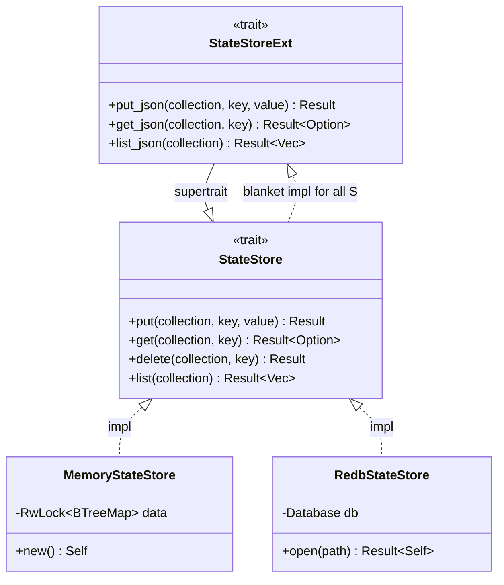
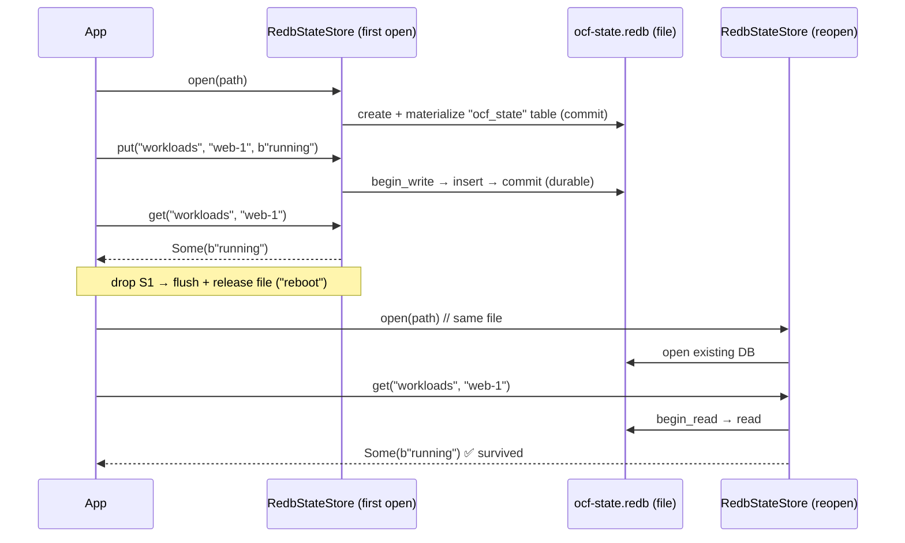

# ocf-store

> Node-local durable state: a small, namespaced key/value contract with a crash-safe single-file backend and an in-memory fallback.

| | |
|---|---|
| **Source** | `crates/ocf-store/src/` (`lib.rs`, `memory.rs`, `redb_store.rs`) |
| **Depends on** | [`ocf-core`](ocf-core.md) (`Error`/`Result`), `serde`, `serde_json`, `parking_lot`, `tracing`, [`redb`](https://docs.rs/redb) |
| **Used by** | Every subsystem that must survive a reboot (workloads, VPCs, load balancers, …), [`ocfd`](ocfd.md) (node-local state via `RedbStateStore`), and [`ocf-consensus`](ocf-consensus.md) (a Raft state machine applies committed entries *into* a `StateStore`) |

## Overview

`ocf-store` is the persistence seam of the control plane. Anything that must
outlive a process restart writes through [`StateStore`](#statestore) — a small,
synchronous, namespaced key/value contract. A `collection` argument namespaces
keys (think "table": `"workloads"`, `"vpcs"`, …) so a single store holds the
entire control plane while keeping per-collection `list` scans isolated. Values
are opaque `&[u8]`; the store neither knows nor cares what they encode.

Two backends ship. [`RedbStateStore`](#redbstatestore) is the real one: a
single-file embedded database ([redb](https://docs.rs/redb)) that persists to
disk and is crash-safe — every `put`/`delete` is a committed write transaction,
so a `put` that returns `Ok` is readable after the process (or the machine)
restarts. This is what [`ocfd`](ocfd.md) uses for node-local state.
[`MemoryStateStore`](#memorystatestore) is a `RwLock<BTreeMap>` for tests and
ephemeral runs — identical semantics, no durability.

On top of the raw byte contract, the [`StateStoreExt`](#statestoreext) extension
trait (blanket-implemented for every `StateStore`) adds typed `*_json` helpers so
callers persist any `serde` type without hand-rolling encoding. Note the scope:
this crate provides *node-local* durability only. Replicating that state across
nodes so it survives losing the node itself is the other half of fleet
persistence, and lives in [`ocf-consensus`](ocf-consensus.md) (Raft) — a
`StateStore` is exactly the seam a Raft state machine applies committed entries
into.

## Module map

| Module | File | Responsibility |
|--------|------|----------------|
| crate root | `lib.rs` | The `StateStore` contract and the `StateStoreExt` typed-JSON extension (with its blanket impl); re-exports both backends |
| `memory` | `memory.rs` | `MemoryStateStore` — a `RwLock<BTreeMap>` non-durable backend |
| `redb_store` | `redb_store.rs` | `RedbStateStore` — the crash-safe single-file redb backend, plus the durability tests |

## Contracts

### `StateStore`

The durable, namespaced key/value contract. Methods are **synchronous** because
both backends are local (embedded DB / memory); callers in async contexts should
treat them as fast, non-blocking IO. Implementations must be crash-consistent:
a `put` that returns `Ok` is readable after a process restart.

```rust
pub trait StateStore: Send + Sync {
    fn put(&self, collection: &str, key: &str, value: &[u8]) -> Result<()>;
    fn get(&self, collection: &str, key: &str) -> Result<Option<Vec<u8>>>;
    fn delete(&self, collection: &str, key: &str) -> Result<()>;
    fn list(&self, collection: &str) -> Result<Vec<(String, Vec<u8>)>>;
}
```

| Method | Behavior |
|--------|----------|
| `put(collection, key, value)` | Store `value` under `key` in `collection`, overwriting any previous value |
| `get(collection, key)` | Fetch the value, or `None` if absent |
| `delete(collection, key)` | Remove the key; deleting an absent key is **not** an error |
| `list(collection)` | Every `(key, value)` pair in `collection`, in key order; the returned key has the collection prefix stripped |

### `StateStoreExt`

Typed convenience helpers layered over any `StateStore`, blanket-implemented for
all of them (`impl<S: StateStore + ?Sized> StateStoreExt for S {}`), so any
`&dyn StateStore` gets the `*_json` methods for free.

```rust
pub trait StateStoreExt: StateStore {
    fn put_json<T: Serialize>(&self, collection: &str, key: &str, value: &T) -> Result<()>;
    fn get_json<T: DeserializeOwned>(&self, collection: &str, key: &str) -> Result<Option<T>>;
    fn list_json<T: DeserializeOwned>(&self, collection: &str) -> Result<Vec<T>>;
}
```

| Method | Behavior |
|--------|----------|
| `put_json` | `serde_json`-encode `value`, then `put` the bytes |
| `get_json` | `get`, then decode; `None` stays `None` |
| `list_json` | `list`, decoding each value; **entries that fail to decode are skipped with a `tracing::warn!`** rather than failing the whole load |

> `list_json`'s skip-on-error behavior is deliberate: a single corrupt/old-schema
> record never blocks loading the rest of a collection at boot.

### Key layout

Both backends use the same trick: one logical table holds every collection, and
keys are the composite `"{collection}\u{1f}{key}"` (`\u{1f}` is ASCII Unit
Separator). This is how a single store stays one file/one map while `list` still
isolates a collection:

- **Memory:** `list` filters the `BTreeMap` by the `"{collection}\u{1f}"`
  prefix and strips it.
- **Redb:** `list` does a range scan over
  `"{collection}\u{1f}".."{collection}\u{20}"` — i.e. from the separator up to
  the next byte (`\u{20}`, space) — so exactly one collection's keys fall in the
  interval, then strips the prefix. `BTreeMap`/redb ordering means `list` is
  returned in key order.

## Implementations

### `MemoryStateStore`

```rust
#[derive(Default)]
pub struct MemoryStateStore { /* data: RwLock<BTreeMap<String, Vec<u8>>> */ }

impl MemoryStateStore { pub fn new() -> Self; }
```

A non-durable store backed by a `parking_lot::RwLock<BTreeMap<String, Vec<u8>>>`.
The `BTreeMap` keeps keys sorted so `list` returns them in order. Useful in tests
and as a drop-in when persistence is intentionally disabled. `new()` and
`default()` are equivalent.

### `RedbStateStore`

```rust
pub struct RedbStateStore { /* db: redb::Database */ }

impl RedbStateStore {
    pub fn open(path: impl AsRef<Path>) -> Result<Self>;
}

const TABLE: TableDefinition<&str, &[u8]> = TableDefinition::new("ocf_state");
```

A crash-safe, single-file key/value store. `open(path)` *creates* the database if
it does not yet exist and then materializes the `"ocf_state"` table in an initial
write transaction — so a node's first boot and every subsequent boot take the
exact same code path, and reads on a fresh database never fail on a missing table.

Each mutating op (`put`, `delete`) runs inside its own `begin_write()` →
`open_table` → mutate → `commit()` transaction; reads (`get`, `list`) use
`begin_read()`. The `commit()` is what makes the write durable: once it returns,
the data has been flushed by redb and survives a restart.

## Diagrams

### The store contract and its backends



### put → get → reopen: how durability holds

The `survives_reopen` test is the proof. Writing inside a scope and then
dropping the store flushes redb and releases the file lock; reopening the same
path recovers the committed state — the on-disk equivalent of a reboot.



## Public API surface

| Item | Signature | Notes |
|------|-----------|-------|
| `StateStore::put` | `fn put(&self, &str, &str, &[u8]) -> Result<()>` | Upsert opaque bytes |
| `StateStore::get` | `fn get(&self, &str, &str) -> Result<Option<Vec<u8>>>` | `None` if absent |
| `StateStore::delete` | `fn delete(&self, &str, &str) -> Result<()>` | Deleting an absent key is `Ok` |
| `StateStore::list` | `fn list(&self, &str) -> Result<Vec<(String, Vec<u8>)>>` | Collection-scoped, key order, prefix stripped |
| `StateStoreExt::put_json` | `fn put_json<T: Serialize>(&self, &str, &str, &T) -> Result<()>` | Encode + put |
| `StateStoreExt::get_json` | `fn get_json<T: DeserializeOwned>(&self, &str, &str) -> Result<Option<T>>` | Get + decode |
| `StateStoreExt::list_json` | `fn list_json<T: DeserializeOwned>(&self, &str) -> Result<Vec<T>>` | Decodes all; skips undecodable with a warning |
| `MemoryStateStore::new` | `fn new() -> MemoryStateStore` | Ephemeral backend |
| `RedbStateStore::open` | `fn open(impl AsRef<Path>) -> Result<RedbStateStore>` | Open-or-create the single file |

## Error behavior

All operations return [`ocf_core::Result`](ocf-core.md#error).

- **`MemoryStateStore`** is infallible — every method returns `Ok` (it only
  touches an in-memory map).
- **`RedbStateStore`** maps every redb failure (open, `begin_write`/`begin_read`,
  `open_table`, `insert`/`remove`/`get`/`range`, `commit`) to
  `Error::internal("redb {context}: {e}")` (code `internal`). The `{context}`
  string names the failing step (e.g. `redb commit: ...`) for diagnosis.
- **`StateStoreExt`** adds `serde_json` failures: `put_json`/`get_json` return
  `Error::Serde(...)` on an encode/decode error (via the `From<serde_json::Error>`
  conversion in `ocf-core`). `list_json` is the exception — it **does not** fail
  on a bad record; it logs a `tracing::warn!` and skips it.
- Semantics shared by both backends: `delete` on a missing key is `Ok`, `get` on
  a missing key is `Ok(None)`, and `list` of an empty/unknown collection is
  `Ok(vec![])`.

## Testing

`redb_store.rs` carries the durability proof in `#[cfg(test)] mod tests`:

- **`survives_reopen`** is the reboot test. It opens a store at a
  process-unique temp path, `put`s a raw value (`"workloads"/"web-1" = b"running"`)
  and a JSON value (`put_json("vpcs", "tenant-a", &vec![10,0,0,0])`), then **drops
  the store** to flush and release the file. It reopens the *same path* and
  asserts both values are still readable (`get` and `get_json`) — demonstrating
  that committed writes survive losing the process, i.e. a reboot.
- **`list_is_scoped_to_collection`** writes keys into collections `"a"` and `"b"`,
  asserts `list("a")` returns only `a`'s keys (prefix-stripped, sorted), confirms
  `list("b")` is independent, then `delete`s one key and re-checks the count —
  proving the composite-key namespacing and the range scan keep collections
  isolated.

Run them with `cargo test -p ocf-store`. `MemoryStateStore` carries no dedicated
tests of its own; it shares the contract and is exercised as a fixture by callers
that need an ephemeral store.

## Cross-references

- [Architecture → Distributed Control Plane](../architecture/distributed-control-plane.md) — where node-local persistence meets Raft replication
- [ocf-consensus](ocf-consensus.md) — the Raft layer that replicates a `StateStore` across nodes (the other half of fleet persistence)
- [ocf-core](ocf-core.md) — the `Error`/`Result` types every method returns
- [ocfd](ocfd.md) — opens a `RedbStateStore` under the data directory for node-local state
- [Operations → Deployment](../operations/deployment.md) — the data directory and multi-node persistence
- [Reference → Error Codes](../reference/error-codes.md) — the `internal`/`serde_error` codes this crate emits
