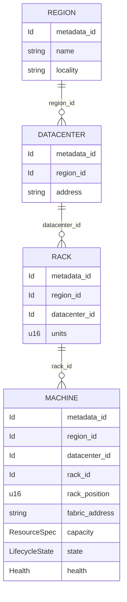
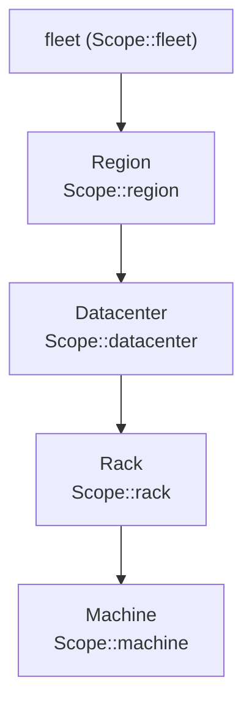
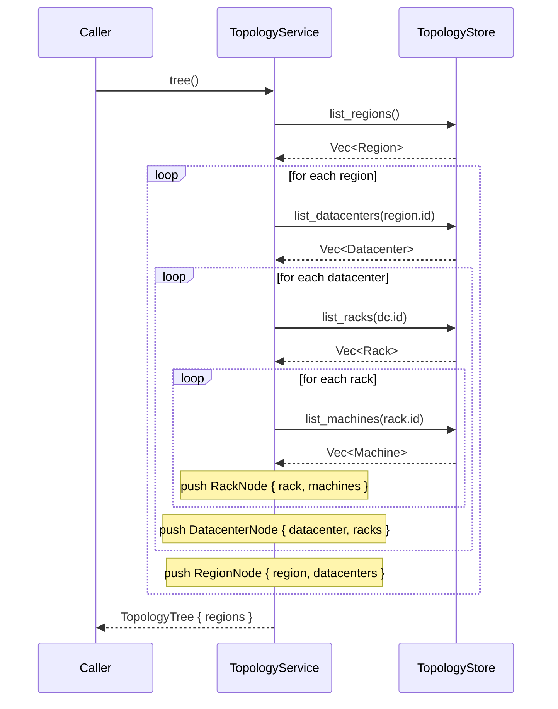

# ocf-topology

> The fleet's structural model (`region → datacenter → rack → machine`) plus a service that assembles it into a drill-down tree.

| | |
|---|---|
| **Source** | `crates/ocf-topology/src/` (`lib.rs`, `model.rs`, `store.rs`) |
| **Depends on** | [`ocf-core`](ocf-core.md) (prelude: `Metadata`, `Id`, `ResourceSpec`, `LifecycleState`, `Health`, `Scope`, `Resource`, `Error`/`Result`), `serde`, `async-trait`, `parking_lot`, `chrono` |
| **Used by** | [`ocf-api`](ocf-api.md) (drill-down view), placement/authorization callers that need a machine's [`Scope`](ocf-core.md#scope), and any subsystem that resolves where a machine lives in the fleet |

## Overview

OCF models the physical fleet as a strict four-level tree:
`region → datacenter → rack → machine`. `ocf-topology` owns the four resource
types for those levels ([`model`](#domain-types)), a pluggable persistence
contract for storing them ([`TopologyStore`](#topologystore)), and a thin
service ([`TopologyService`](#topologyservice)) that turns the flat,
parent-keyed records into the nested structure the frontend drills down through.

Each resource carries the shared [`Metadata`](ocf-core.md#metadata) from
`ocf-core` and implements the [`Resource`](ocf-core.md#resource) trait, so a
`Region`/`Datacenter`/`Rack`/`Machine` is a first-class managed object like any
other in the fabric. The children of a node reference their ancestors *by id*
(`Datacenter.region_id`, `Rack.datacenter_id`, `Machine.rack_id`, etc.) rather
than by embedding, which keeps storage flat and lets each `put_*`/`list_*`
operation work on one level at a time. Every resource can project itself onto a
[`Scope`](ocf-core.md#scope) via its `scope()` method — the same coordinate the
authorization and placement layers consume.

The `Machine` is where the structure meets reality: beyond its position in the
tree it carries the node's advertised [`capacity`](#machine) (a
[`ResourceSpec`](ocf-core.md#resourcespec)), its [`state`](ocf-core.md#lifecyclestate),
its [`health`](ocf-core.md#health), and an optional `fabric_address` — the
host-to-host mesh endpoint other nodes reach it on (see [`ocf-fabric`](ocf-fabric.md)).
Persistence is deliberately swappable: the shipped [`InMemoryTopology`](#inmemorytopology)
backs a single-node controller and the test suite, while a production deployment
can substitute an etcd/Postgres-backed `TopologyStore` without touching any
caller.

## Module map

| Module | File | Responsibility |
|--------|------|----------------|
| crate root | `lib.rs` | Re-exports; the `TopologyTree`/`*Node` view types; `TopologyService` (`tree()`, `machine_scope()`) |
| `model` | `model.rs` | The four resource types — `Region`, `Datacenter`, `Rack`, `Machine` — their constructors, `scope()`, and `Resource` impls |
| `store` | `store.rs` | The `TopologyStore` persistence trait and the in-memory `InMemoryTopology` backend |

## Domain types

The four resources form the fleet tree. Each is a flat struct that references its
parent by [`Id`](ocf-core.md#id) and owns a [`Metadata`](ocf-core.md#metadata).

### Region

The coarsest grouping — a geographic region with no parent.

| Field | Type | Notes |
|-------|------|-------|
| `metadata` | `Metadata` | Shared bookkeeping (id, name, labels, timestamps) |
| `locality` | `String` | Free-form geographic hint, e.g. `"us-east"` (empty by default) |

```rust
pub fn new(name: impl Into<String>) -> Self
pub fn scope(&self) -> Scope   // Scope::region(id)
```

### Datacenter

A datacenter inside a region.

| Field | Type | Notes |
|-------|------|-------|
| `metadata` | `Metadata` | Shared bookkeeping |
| `region_id` | `Id` | Parent region |
| `address` | `String` | Physical/site address (empty by default) |

```rust
pub fn new(region_id: Id, name: impl Into<String>) -> Self
pub fn scope(&self) -> Scope   // Scope::datacenter(region_id, id)
```

### Rack

A rack inside a datacenter. Carries both ancestor ids so a `scope()` can be built
without a lookup.

| Field | Type | Notes |
|-------|------|-------|
| `metadata` | `Metadata` | Shared bookkeeping |
| `region_id` | `Id` | Ancestor region |
| `datacenter_id` | `Id` | Parent datacenter |
| `units` | `u16` | Number of rack units; defaults to `42` |

```rust
pub fn new(region_id: Id, datacenter_id: Id, name: impl Into<String>) -> Self
pub fn scope(&self) -> Scope   // Scope::rack(region_id, datacenter_id, id)
```

### Machine

A physical (or virtual) node that actually runs workloads — the leaf of the tree
and the only resource that carries runtime/capacity state.

| Field | Type | Notes |
|-------|------|-------|
| `metadata` | `Metadata` | Shared bookkeeping |
| `region_id` | `Id` | Ancestor region |
| `datacenter_id` | `Id` | Ancestor datacenter |
| `rack_id` | `Id` | Parent rack |
| `rack_position` | `Option<u16>` | 1-based rack unit where the machine is mounted (`None` if unknown) |
| `fabric_address` | `Option<String>` | Host-to-host mesh endpoint other nodes reach it on (see [`ocf-fabric`](ocf-fabric.md)) |
| `capacity` | [`ResourceSpec`](ocf-core.md#resourcespec) | Total advertised CPU (millicores) / memory / disk (bytes) |
| `state` | [`LifecycleState`](ocf-core.md#lifecyclestate) | Lifecycle; starts at `Pending` |
| `health` | [`Health`](ocf-core.md#health) | Coarse health; starts at `Unknown` |

```rust
pub fn new(region_id: Id, datacenter_id: Id, rack_id: Id, name: impl Into<String>) -> Self
pub fn scope(&self) -> Scope   // Scope::machine(region_id, datacenter_id, rack_id, id)
```

> All four types `#[derive(Debug, Clone, Serialize, Deserialize)]` and implement
> [`Resource`](ocf-core.md#resource), whose `kind()` returns the lowercase level
> name (`"region"`, `"datacenter"`, `"rack"`, `"machine"`) and whose `metadata()`
> returns `&self.metadata`.

## Contracts

### `TopologyStore`

The pluggable persistence contract. It is intentionally one method per
`(level, operation)` rather than a generic CRUD trait, so each call works on a
single level and `list_*` can filter by the parent id. The default backend is
in-memory; a production deployment swaps in an etcd/Postgres-backed
implementation without touching callers.

```rust
#[async_trait]
pub trait TopologyStore: Send + Sync {
    async fn put_region(&self, region: Region) -> Result<()>;
    async fn get_region(&self, id: &Id) -> Result<Region>;
    async fn list_regions(&self) -> Result<Vec<Region>>;

    async fn put_datacenter(&self, dc: Datacenter) -> Result<()>;
    async fn list_datacenters(&self, region_id: &Id) -> Result<Vec<Datacenter>>;

    async fn put_rack(&self, rack: Rack) -> Result<()>;
    async fn list_racks(&self, datacenter_id: &Id) -> Result<Vec<Rack>>;

    async fn put_machine(&self, machine: Machine) -> Result<()>;
    async fn get_machine(&self, id: &Id) -> Result<Machine>;
    async fn list_machines(&self, rack_id: &Id) -> Result<Vec<Machine>>;
    async fn all_machines(&self) -> Result<Vec<Machine>>;
}
```

| Method | Purpose |
|--------|---------|
| `put_region` / `get_region` / `list_regions` | Upsert by id; fetch one; list all regions |
| `put_datacenter` / `list_datacenters(region_id)` | Upsert; list the datacenters of one region |
| `put_rack` / `list_racks(datacenter_id)` | Upsert; list the racks of one datacenter |
| `put_machine` / `get_machine(id)` / `list_machines(rack_id)` | Upsert; fetch one; list the machines of one rack |
| `all_machines` | Every machine across the whole fleet (used for fleet-wide scans, e.g. placement) |

> `put_*` is an upsert: it overwrites any existing record with the same id.
> Only `get_region`/`get_machine` and the `list_*` accessors are defined; there
> is no `get_datacenter`/`get_rack` because callers reach those via `list_*` on
> the parent during a drill-down.

### `InMemoryTopology`

The shipped backend: four `parking_lot::RwLock<HashMap<Id, _>>` maps, one per
level. `#[derive(Default)]`, so `InMemoryTopology::new()` and
`InMemoryTopology::default()` are equivalent. `list_*` filters the relevant map
by the parent-id field (`d.region_id`, `r.datacenter_id`, `m.rack_id`); the
returned order is `HashMap` iteration order (unspecified). Suitable for a
single-node controller and for tests.

### `TopologyService`

A thin facade over an `Arc<dyn TopologyStore>` that provides the two
higher-level reads the rest of the system needs.

```rust
pub struct TopologyService { /* store: Arc<dyn TopologyStore> */ }

impl TopologyService {
    pub fn new(store: Arc<dyn TopologyStore>) -> Self;
    pub fn store(&self) -> &Arc<dyn TopologyStore>;
    pub async fn tree(&self) -> Result<TopologyTree>;
    pub async fn machine_scope(&self, machine_id: &Id) -> Result<Scope>;
}
```

- **`tree()`** assembles the full nested drill-down (see [diagram](#how-tree-assembles-the-drill-down)).
- **`machine_scope(machine_id)`** fetches the machine and returns its
  `scope()` — the fully-qualified `Scope::machine(...)` used by
  placement/authorization checks.

### View types (`TopologyTree` and nodes)

The nested shape `tree()` returns. Each node embeds the resource for its level
plus a `Vec` of its children, so the frontend can render the whole hierarchy from
one response. All four `#[derive(Debug, Clone, Serialize, Deserialize)]`.

| Type | Fields |
|------|--------|
| `TopologyTree` | `regions: Vec<RegionNode>` |
| `RegionNode` | `region: Region`, `datacenters: Vec<DatacenterNode>` |
| `DatacenterNode` | `datacenter: Datacenter`, `racks: Vec<RackNode>` |
| `RackNode` | `rack: Rack`, `machines: Vec<Machine>` |

## Diagrams

### The fleet tree (entities and parent references)



The same hierarchy as a containment tree, mirroring the
[`Scope`](ocf-core.md#scope) levels:



### How `tree()` assembles the drill-down

`tree()` walks the store level by level, nesting each parent's children before
moving up. Conceptually it is four nested loops over `list_*`:



The `?` operator propagates the first store error, so a failing `list_*`
short-circuits the whole assembly with that [`Error`](#error-behavior).

## Public API surface

| Item | Signature | What it gives you |
|------|-----------|-------------------|
| `Region::new` | `fn new(name) -> Region` | A region with empty `locality` |
| `Datacenter::new` | `fn new(region_id, name) -> Datacenter` | A datacenter under a region |
| `Rack::new` | `fn new(region_id, datacenter_id, name) -> Rack` | A 42U rack under a datacenter |
| `Machine::new` | `fn new(region_id, datacenter_id, rack_id, name) -> Machine` | A `Pending`/`Unknown` machine with default capacity |
| `<resource>::scope` | `fn scope(&self) -> Scope` | The `Scope` locating that resource |
| `TopologyStore` | trait (above) | The persistence contract to implement for a new backend |
| `InMemoryTopology::new` | `fn new() -> InMemoryTopology` | The default in-memory backend |
| `TopologyService::new` | `fn new(Arc<dyn TopologyStore>) -> TopologyService` | Wrap a store |
| `TopologyService::store` | `fn store(&self) -> &Arc<dyn TopologyStore>` | Borrow the underlying store for direct `put_*` writes |
| `TopologyService::tree` | `async fn tree(&self) -> Result<TopologyTree>` | The nested drill-down view |
| `TopologyService::machine_scope` | `async fn machine_scope(&self, &Id) -> Result<Scope>` | A machine's fully-qualified scope |

## Error behavior

Every fallible operation returns [`ocf_core::Result`](ocf-core.md#error). The
topology layer produces exactly one error variant of its own:

- `get_region(id)` and `get_machine(id)` return `Error::not_found("region {id}")`
  / `Error::not_found("machine {id}")` (HTTP `404`, code `not_found`) when the id
  is absent.

All other operations on `InMemoryTopology` are infallible and return `Ok`:

- `put_*` always succeeds (upsert into a map).
- `list_*` always returns `Ok(Vec<_>)`, possibly empty — an unknown parent id
  yields an empty list, not an error.
- `TopologyService::tree()` and `machine_scope()` are pure compositions, so the
  only error they can surface is one propagated from the underlying store
  (e.g. `machine_scope` propagates `get_machine`'s `not_found`). A custom backend
  may, of course, surface `Io`/`Internal`/etc. from its storage layer.

## Testing

`ocf-topology` ships no unit tests of its own; its behavior is exercised through
the in-memory backend in higher layers (e.g. the API/controller tests in
[`ocf-api`](ocf-api.md)). The `InMemoryTopology` store is itself the test fixture
for any subsystem that needs a populated fleet without persistence. The
parent-id filtering in `list_*` and the nesting in `TopologyService::tree()` are
covered indirectly wherever a drill-down response is asserted.

## Cross-references

- [Architecture → Scopes & Placement](../architecture/scopes-and-placement.md) — how the `fleet → region → datacenter → rack → machine` hierarchy drives placement and authorization
- [Architecture → Domain Model](../architecture/domain-model.md) — `Resource`, `Metadata`, `Id`, `Health`, `ResourceSpec`
- [ocf-core](ocf-core.md) — the prelude these types build on (`Scope`, `Metadata`, `ResourceSpec`, `LifecycleState`, `Health`)
- [ocf-store](ocf-store.md) — node-local durability; a `TopologyStore` could be implemented on top of a `StateStore`
- [ocf-fabric](ocf-fabric.md) — what `Machine.fabric_address` points at (the host-to-host mesh endpoint)
- [ocf-api](ocf-api.md) — exposes `TopologyService::tree()` as the drill-down endpoint
- [Reference → REST API](../reference/rest-api.md) — the topology/drill-down endpoints
