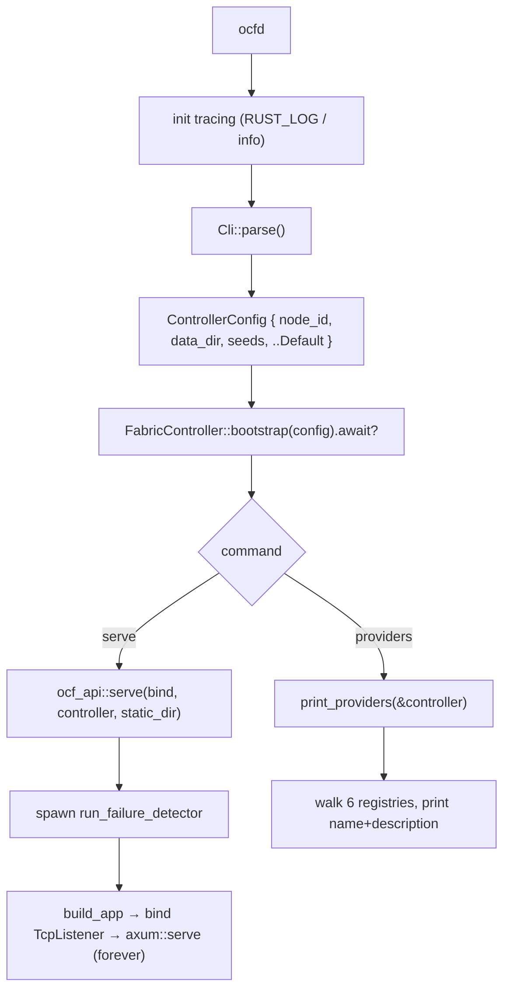
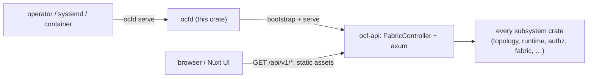

# ocfd

> The monolithic daemon binary: a `clap` CLI that builds one [`FabricController`](ocf-api.md#the-fabriccontroller) and either serves the REST API + frontend or prints every registered provider.

| | |
|---|---|
| **Source** | `crates/ocfd/src/main.rs` (single file) |
| **Depends on** | [`ocf-api`](ocf-api.md) (`ControllerConfig`, `FabricController`, `serve`), [`ocf-core`](ocf-core.md) (`registry::Provider`), `clap` (derive), `tokio`, `anyhow`, `tracing`/`tracing-subscriber` |
| **Used by** | The operator — this is the program you run. There is exactly one binary; the entire control plane lives behind it. |

## Overview

`ocfd` is the whole product as one executable. It does almost nothing itself: it
parses a CLI, turns it into a [`ControllerConfig`](ocf-api.md#controllerconfig-configrs),
calls [`FabricController::bootstrap`](ocf-api.md#bootstrap-restore-or-seed) — which
builds **every** subsystem with its built-in providers, then restores persisted
state or seeds a demo fleet — and dispatches on the subcommand:

- `serve` hands the controller to [`ocf_api::serve`](ocf-api.md#librs-build_app--serve),
  which spawns the failure detector and runs the axum server (API plus, if a
  static dir is given, the built frontend).
- `providers` walks every subsystem [`Registry`](ocf-core.md#registry) and prints
  the registered plugins — the most direct demonstration that the whole control
  plane is plugin-driven.

Global flags (`--node-id`, `--data-dir`, `--seed`) apply to both subcommands;
each also has an environment-variable fallback so the daemon is twelve-factor
friendly for containers and systemd.

## Module map

| Item | Responsibility |
|------|----------------|
| `Cli` (derive `Parser`) | The global flags (`--node-id`, `--data-dir`, `--seed`) + the `command` subcommand |
| `Command` (derive `Subcommand`) | `Serve { bind, static_dir }` and `Providers` |
| `main()` | Init tracing, parse `Cli`, build `ControllerConfig`, `bootstrap`, dispatch on the subcommand |
| `print_providers(&FabricController)` | Walk each subsystem registry and print `name` + `description` per provider |

## CLI

```text
ocfd [GLOBAL FLAGS] <COMMAND>

Commands:
  serve      Start the controller and serve the API (and the frontend, if built)
  providers  Print every pluggable provider registered across all subsystems
```

### Global flags

These are `global = true`, so they may appear before or after the subcommand and
apply to both. Each maps directly onto a `ControllerConfig` field.

| Flag | Env | Default | → `ControllerConfig` | Meaning |
|------|-----|---------|----------------------|---------|
| `--node-id <ID>` | `OCF_NODE_ID` | `node-local` | `node_id` | This node's stable identity in the fleet (hashed into its Raft node id) |
| `--data-dir <DIR>` | `OCF_DATA_DIR` | *(unset → in-memory)* | `data_dir` | Directory for durable state. When set, state is persisted to `<dir>/state.redb` and reloaded on boot; when unset, the node runs fully in-memory |
| `--seed <PEER>` | `OCF_SEEDS` | *(empty)* | `seeds` | Seed peer(s) to contact when joining the mesh. Comma-separated (`value_delimiter = ','`), e.g. `--seed a:8080,b:8080` |

> `main` only fills `node_id`, `data_dir`, and `seeds` from the CLI; the
> membership timeouts (`suspect_timeout_secs`, `dead_timeout_secs`) come from
> `ControllerConfig::default()` (5s each) via `..Default::default()`.

### `serve` flags

| Flag | Env | Default | Meaning |
|------|-----|---------|---------|
| `--bind <ADDR>` | `OCF_BIND` | `0.0.0.0:8080` | Socket address to bind the HTTP API on (parsed as a `SocketAddr`) |
| `--static-dir <DIR>` | `OCF_STATIC_DIR` | *(unset)* | Directory of built frontend assets to serve, e.g. `web/.output/public`. When present, the daemon serves the SPA with an `index.html` fallback alongside the API; when absent or missing, it serves the API only |

### `providers`

Takes no flags of its own (the global flags still apply because `bootstrap`
needs a config). It bootstraps the controller and then prints, for each of the
six provider contracts, every registered provider as `name` + `description`:

```text
RuntimeProvider:
  - docker           ...
  - qemu             ...
Authenticator:
  - local            ...
  ...
InventoryCollector:
  ...
IpmiController:
  ...
CertificateProvider:
  ...
DnsProvider:
  ...
```

Contracts with no registered providers print `(none)`. See
[Reference → CLI](../reference/cli.md) for the exhaustive command reference.

## What `main` does

```rust
#[tokio::main]
async fn main() -> anyhow::Result<()> {
    // 1. tracing: EnvFilter from RUST_LOG, default "info"
    // 2. let cli = Cli::parse();
    // 3. let config = ControllerConfig { node_id, data_dir, seeds, ..Default::default() };
    // 4. let controller = Arc::new(FabricController::bootstrap(config).await?);
    // 5. match cli.command { Serve { bind, static_dir } => ocf_api::serve(...).await?, Providers => print_providers(&controller) }
}
```

1. **Tracing** — installs a `tracing_subscriber::fmt` subscriber whose
   `EnvFilter` is read from the environment (`RUST_LOG`), defaulting to `info`.
2. **Parse** the CLI into `Cli`.
3. **Build** a `ControllerConfig` from the three global flags, defaulting the
   rest.
4. **Bootstrap** one `FabricController` (wrapped in `Arc`). This is where every
   subsystem is constructed, built-ins are registered, consensus comes up, and
   state is restored-or-seeded — see
   [ocf-api → bootstrap](ocf-api.md#bootstrap-restore-or-seed).
5. **Dispatch** on the subcommand: `serve` runs the server forever; `providers`
   prints and exits.

## Diagrams

### `ocfd` boot and dispatch



### Where the binary sits in the stack



## Configuration recipes

| Goal | Command |
|------|---------|
| Quick local run, in-memory, API only | `ocfd serve` |
| Persist state across restarts | `ocfd --data-dir ./data serve` |
| Serve the built frontend too | `ocfd serve --static-dir web/.output/public` |
| Bind a specific address/port | `ocfd serve --bind 127.0.0.1:9000` |
| Named node joining a fleet | `ocfd --node-id node-a --seed b:8080,c:8080 serve` |
| All-env (container) | `OCF_NODE_ID=node-a OCF_DATA_DIR=/var/lib/ocf OCF_BIND=0.0.0.0:8080 OCF_STATIC_DIR=/srv/ui ocfd serve` |
| Inspect the plugin surface | `ocfd providers` |

## Cross-references

- [ocf-api](ocf-api.md) — the `FabricController`, `bootstrap`, `serve`, and the REST surface this binary fronts
- [Reference → CLI](../reference/cli.md) — the exhaustive `ocfd` command reference
- [Reference → Configuration](../reference/configuration.md) — every flag and environment variable
- [Getting Started → Quickstart](../getting-started/quickstart.md) — build the workspace and run `ocfd serve`
- [Getting Started → Configuration](../getting-started/configuration.md) — flags, env vars, the data directory
- [Architecture → Distributed Control Plane](../architecture/distributed-control-plane.md) — what `--node-id`/`--seed`/`--data-dir` mean across a multi-node fleet
- [Operations → Deployment](../operations/deployment.md) — running multi-node clusters with seeds and a data directory
